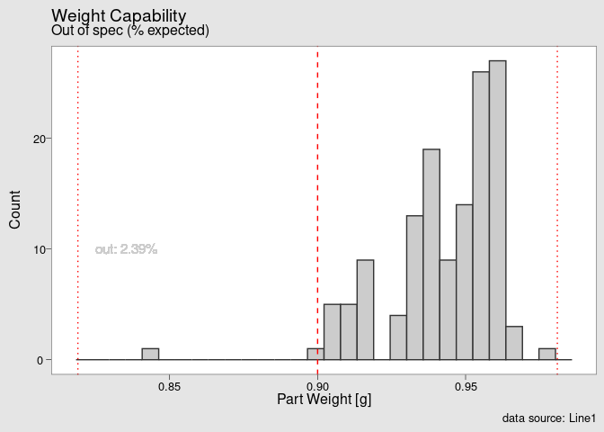

<!-- README.md is generated from README.Rmd. Please edit that file -->

# industRial

<!-- badges: start -->
<!-- badges: end -->

This is the github repository of `{industRial}` the companion package to
the book [industRial Data
Science](https://j-ramalho.github.io/industRial/index.html). The goal of
this package is to provide data sets and functions to complete the case
studies. It also contains all book original files and exercises.

## Installation

<!-- You can install the released version of industRial from [CRAN](https://CRAN.R-project.org) with:

``` r
install.packages("industRial")
```
-->

You can install the development version from
[GitHub](https://github.com/) with:

``` r
# install.packages("devtools")
devtools::install_github("J-Ramalho/industRial")
```

## Example

This is an example from the first case study of the book on a pareto
chart that use the data set dial\_control and the theme\_industrial.

``` r
library(industRial)
library(qicharts2)
d_type <- dial_control %>% pull(Defect) %>% as.character()
paretochart(
  d_type,
  title = "Watch Dial polishing",
  subtitle = "Pareto chart",
  ylab = "Percentage of deffects",
  xlab = "Deffect type",
  caption = "Source: Dial Production Team"
) +
  theme_industRial()
```


Here is another example from the last case study with a custom made
process capability chart that use the tablet\_weight dataset and the
theme\_qcc.

``` r
tablet_weight <- tablet_weight %>%
    janitor::clean_names()
weight_statistics_data <- process_stats(tablet_weight, 9)
chart_Cpk(weight_statistics_data) +
  theme_qcc()
```



<!-- You'll still need to render `README.Rmd` regularly, to keep `README.md` up-to-date. `devtools::build_readme()` is handy for this. You could also use GitHub Actions to re-render `README.Rmd` every time you push. An example   can be found here: <https://github.com/r-lib/actions/tree/master/examples>.
In that case, don't forget to commit and push the resulting figure files, so they display on GitHub and CRAN.
-->

## Issues

To report any issue or make suggestions please open an issue on the book
repository:
[industRialds/issues](https://github.com/J-Ramalho/industRial/issues)
