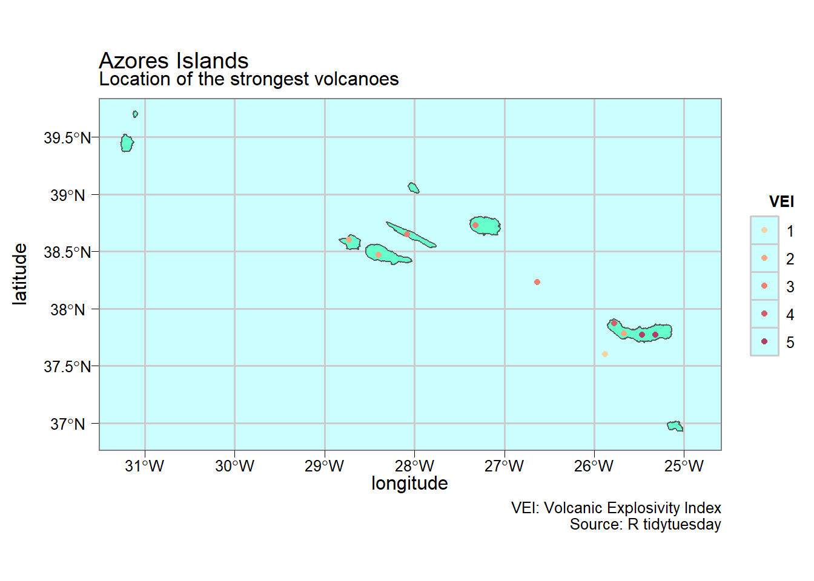

--- 
title: "EPFL Extension School Capstone Project Brief"
subtitle: "A book on indust<b style='color:#4775d1'>R</b>ial data science"
author: "João Ramalho"
date: "`r Sys.Date()`"
output:
  html_document:
    toc: true
    toc_depth: 2
    toc_float: true
# description: ''
---

```{r setup, echo= FALSE, warning=FALSE, message=FALSE}
knitr::opts_chunk$set(
	echo = TRUE,
	message = FALSE,
	warning = FALSE,
	out.width = "80%"
)
```

# Objectives

This document describes the Capstone Project brief of Applied Data Science Communication and Visualisation (ADSCV) program followed at the EPFL Extension School.

# Learnings so far

The Extension School ADSCV is a very comprehensive program that will take approximately one year and has allowed me to successfully transition in a full time data scientist. It has given me the tools handle complex data cases and express insights, recommendations and solutions in an extremely powerfull and varied way.

The course balances programming, data wrangling, human visual perception, reporting and creation of dynamic dashboards. Throughtout the cours I have succeeded to continuously apply these different learnings directly in my current work and also with fun to my personal life. Below a recap of key cases:

### Networks

Re-utilisation of networks code from the Harry Potter and Karate cases in the selection of the important coffee recipe parameters in a Design of Experiments

```{r echo=FALSE, fig.align='center', fig.cap="Example of networks application", out.width="60%"}
knitr::include_graphics("img/coffee_networks.png")
```

### Timeseries

Re-utilisation of the timeseries code from the Gruyère Cheese factory in the implementation of a small non modular shiny app to follow-up the coffee capsule weight in a laboratory test

```{r echo=FALSE, fig.align='center', fig.cap="Example of timeseries application", out.width="60%"}
knitr::include_graphics("img/coffee_timeseries.png")
```

### Cartography

I've made a full assessment of the vast cartography package landscape and ended selecting the tidyverse landscape to print maps in my Azores Islands Volcanoes project: 

```{r echo=FALSE, fig.align='center', fig.cap="Example of cartography application", out.width="60%"}

```

### Natural Language Processing

In my Risk Management App that has currently about 5 recurring users, besides applying many varied concepts from Courses 1 and 2 I have introduced of some of the NLP techniques from the Alice in Wonderland example, bringing new ways to think of risk management.

### Golem

In my project 4 App I've used golem to develop a production grade shiny app that brings the ideas initiated in the timeseries project to an industrial level with the app gathering data an R Azure server linked to a coffee capsule industrial manufacturing equipment producing thousands of csv files.

# Proposed Scope

Taking into account that using the course I've delivered to my employer three shiny Apps, two of them now used daily, I now turn to the training my Nestlé colleagues in Data Science and propose my self to create a training manual.

This will allow me to strengthen my daily work as Data Scientist which is mostly made out of collecting data that comes in excel and csv files from laboratory tests and return insights in the form of Rmarkdown reports.

This book that I would like to call <i>Indust<b style='color:#4775d1'>R</b>ial Data Science</i> has the ambition to be a reference book in the field. My extensive bibliography research on this domain shows that there are many R books and many books on industrial statistics but there is no recent reference book combining field experience with recent R approaches namely with tidyverse.

# Project deliverables

The key proposed project outputs are the following:

* A new online book 
      + accessible with a dedicated web adress from github pages
      + strongly referenced including R functions index, toc and bibliography
      + capitalising on the ADSCV techniques described in the learnings section
* A new R package 
      + downloadable by readers from github as book companion package
      + comprising data and key functions from the book examples
      + capitalising on the learnings from package development and golem chapters


