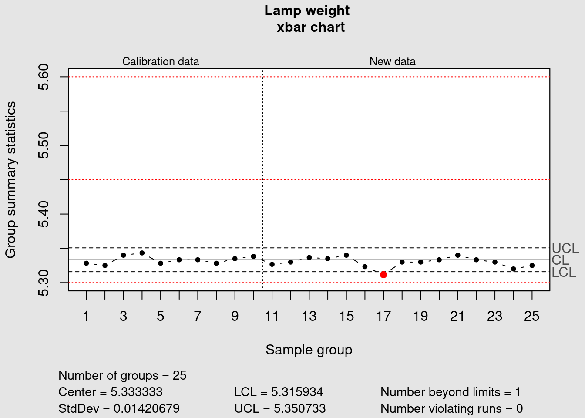
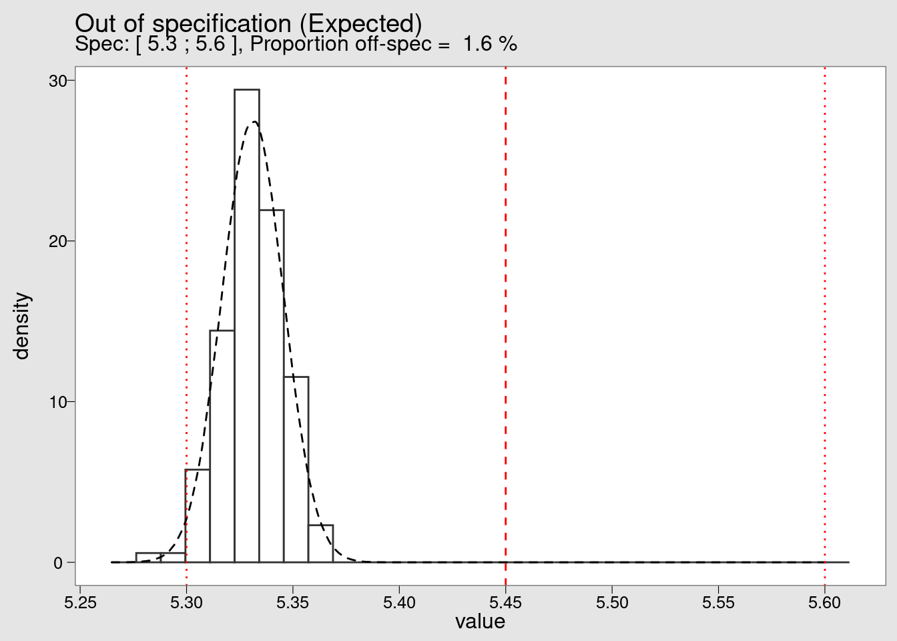

# Statistical Process Control {#SPC}

Keeping the variability of an industrial process under control is one of the most important objectives in manufacturing. Based on expert knowledge or on detailed functional analysis the product and process parameters that are critical to quality are identified and selected for close follow-up. The most common and effective way for such follow-up is the Statistical Process Control which is done by using control charts.

**The syringe injection molding process**

<div class="marginnote">

<div class="figure" style="text-align: center">

<p class="caption">(\#fig:unnamed-chunk-2)A clean room for syringe injection molding with fully automatised handling</p>
</div>

</div>

## Control charts

There are many types of control charts and in this case study we're demonstrating the xbar and R charts. These two charts are often used together and are suited to the control the mean and the variability of a continuous variable.

Bamako Lightening is a company that manufactures lamps. The weight of each lamp is critical to the quality of the product. The Production Operator monitors the production process using xbar and R-charts. Samples are taken of six lamps every hour and their means and ranges plotted on control charts. Data is available representing samples taken a period of 25 hours of production.

Loading packages for data loading and cleaning:


```r
library(tidyverse)
library(knitr)
library(industRial)
library(stats)
filter <- dplyr::filter
select <- dplyr::select
```

Looking at the first five lines to confirm and assess the quality of our data for further processing. 


```r
head(syringe_diameter) %>%
    kable()
```


|Hour  |  Sample1|  Sample2|  Sample3|  Sample4|  Sample5|  Sample6|
|:-----|--------:|--------:|--------:|--------:|--------:|--------:|
|Hour1 | 5.331433| 5.339867| 5.324400| 5.336267| 5.322833| 5.318133|
|Hour2 | 5.324033| 5.321433| 5.314200| 5.323733| 5.341967| 5.339233|
|Hour3 | 5.326267| 5.340433| 5.313567| 5.356533| 5.338700| 5.356967|
|Hour4 | 5.355267| 5.360000| 5.317133| 5.331933| 5.344600| 5.347400|
|Hour5 | 5.337867| 5.326367| 5.314967| 5.313433| 5.337467| 5.340700|
|Hour6 | 5.343167| 5.335233| 5.323833| 5.346267| 5.333967| 5.320533|

We see that in this table each line corresponds to a sampling hour and each column corresponds to a sample number. 

We're now going to pass this data to the control chart plotting function qcc(). As this function takes a dataset of observations so we're removing the Hour column with the select function from tidyverse:


```r
syringe_clean <- syringe_diameter %>% 
  select(-Hour) %>%
  mutate(across(starts_with("S"), round, 2))
```

Now we load the qcc package that has the required quality control tools:

<b>Calibration run</b>

In order to establish a control chart it is recommended to run a "calibration run". The calibration run is used to calculate the control limits before entering "regular production". Using the first 10 samples we call the qcc() function to make the required calculations.

### xbar chart

[]{#xbarchart}


```r
library(qcc)
```


```r
syringe_xbar <- qcc(
  syringe_clean[1:10, ], 
  type = "xbar", 
  title = "Lamp weight \n xbar chart", 
  xlab = "Sample group",
  plot = FALSE
  )
```

Before we step ahead and simply plot the SPC chart and interpret the results lets look a bit in detail in the calculations done to established the Control Chart. To do this we're going to go in the details of what we've obtained in the previous chunk. 

A first step is to read the begining of the qcc() help file typing ?qcc in the console. It says "Create an object of class 'qcc' to perform statistical process control' (in R technical terms function is a helper that generates an S3 R object). 

The key point here is that this means we can inspect the calculations separately from the plot itself. We can start by confirming the class and the type of the qcc object:


```r
class(syringe_xbar)
```

```
[1] "qcc"
```

```r
typeof(syringe_xbar)
```

```
[1] "list"
```

It is confirmed it is an object of class qcc with the R type list. Looking into the structure of the list:


```r
str(syringe_xbar)
```

```
List of 11
 $ call      : language qcc(data = syringe_clean[1:10, ], type = "xbar", plot = FALSE, title = "Lamp weight \n xbar chart",      xlab = "Sample group")
 $ type      : chr "xbar"
 $ data.name : chr "syringe_clean[1:10, ]"
 $ data      : num [1:10, 1:6] 5.33 5.32 5.33 5.36 5.34 5.34 5.3 5.32 5.34 5.36 ...
  ..- attr(*, "dimnames")=List of 2
  .. ..$ Group  : chr [1:10] "1" "2" "3" "4" ...
  .. ..$ Samples: chr [1:6] "Sample1" "Sample2" "Sample3" "Sample4" ...
 $ statistics: Named num [1:10] 5.33 5.33 5.34 5.34 5.33 ...
  ..- attr(*, "names")= chr [1:10] "1" "2" "3" "4" ...
 $ sizes     : int [1:10] 6 6 6 6 6 6 6 6 6 6
 $ center    : num 5.33
 $ std.dev   : num 0.0142
 $ nsigmas   : num 3
 $ limits    : num [1, 1:2] 5.32 5.35
  ..- attr(*, "dimnames")=List of 2
  .. ..$ : chr ""
  .. ..$ : chr [1:2] "LCL" "UCL"
 $ violations:List of 2
  ..$ beyond.limits : int(0) 
  ..$ violating.runs: num(0) 
 - attr(*, "class")= chr "qcc"
```

The output is not easy to read but we present it here just to show that inside the list there are several tables with the statistical analysis required for our plot. If we want like to see for instance the standard deviation we can extract it separately:


```r
syringe_xbar$std.dev
```

```
[1] 0.01420679
```

And if we want like to see a summary of all the data stored in the object we could apply the summary method:


```r
summary(syringe_xbar)
```

```

Call:
qcc(data = syringe_clean[1:10, ], type = "xbar", plot = FALSE,     title = "Lamp weight \n xbar chart", xlab = "Sample group")

xbar chart for syringe_clean[1:10, ] 

Summary of group statistics:
    Min.  1st Qu.   Median     Mean  3rd Qu.     Max. 
5.325000 5.328333 5.333333 5.333333 5.337500 5.343333 

Group sample size:  6
Number of groups:  10
Center of group statistics:  5.333333
Standard deviation:  0.01420679 

Control limits:
      LCL      UCL
 5.315934 5.350733
```

We are now ready to finally we can see this all together in a plot:


```r
plot(syringe_xbar)
```


### R chart 

Using the same 10 first samples we also obtain the corresponding R chart:

[]{#Rchart}


```r
syringe_R <- qcc(
  syringe_clean[1:10, ], 
  type = "R", 
  title = "Lamp weight \n R chart",
  xlab = "Sample group"
  )
```


<b>Regular production</b>

Now that the calibration data has been plotted we can consider that the control limits are defined. They can become fixed and reused in new plots for the future production runs. Samples from those future runs can then be assessed against this limits and the control chart rules can be verified (in this example the shewhart rules are used). We now add the remaining data points to our chart by specifying which lines we're refering too in our dataframe in the 'newdata' argument:


```r
syringe_xbar <- qcc(
  data = syringe_clean[1:10, ],
  newdata = syringe_clean[11:25,],
  type = "xbar", 
  title = "Lamp weight \n xbar chart", 
  xlab = "Sample group"
  )
```


We can see that the data point corresponding to the average of the measurements of the samplegroup 17 is plotted in red because it is outside of the control limits.

Now we plot the R chart to assess the variability:


```r
syringe_R <- qcc(
  data = syringe_clean[1:10, ],
  newdata = syringe_clean[11:25,], 
  type = "R", 
  title = "Lamp weight \n R chart",
  xlab = "Sample group"
  )
```


In this case all the points are within the previously defined control limits.

<b>Warnings and specification limits</b>

More tight controls can be put in place by clearly identifying warning limits in a narrower range than the control limits. These measures need to be accompaigned by clear decision criteria and proper training to avoid the typical problem of overeacting and destabilizing the process by introducing unintented special causes of variation.

### Limits on xbar chart 

We add warning limits in the plot with as follows:

[]{#limitsxbar}


```r
warn.limits <- limits.xbar(
  syringe_xbar$center, 
  syringe_xbar$std.dev, 
  syringe_xbar$sizes, 
  2
  )
plot(
  syringe_xbar, 
  restore.par = FALSE,
  title = "Lamp weight \n xbar chart",
  xlab = "Sample group")
abline(h = warn.limits, lty = 3, col = "chocolate")
```


A manufacturing process under control has a variation that is lower than the product specifications and ideally it is centered. Therefore it is usually good practice to follow the control chart rules refering to the process control limits. 

In some cases nevertheless there may be desired or interesting to add the specification limits. This can be done as follows, first we establish the specifications:


```r
spec_max <- 5.6
spec_min <- 5.3
spec_tgt <- (spec_max - spec_min) / 2 + spec_min
specs <- c(spec_min, spec_tgt, spec_max)
```

and replot the control chart with visible specification limits and targets:


```r
plot(
  syringe_xbar,
  restore.par = FALSE,
  title = "Lamp weight \n xbar chart",
  xlab = "Sample group",
  ylim = c(specs[1], specs[3])
  )
abline(h = specs, lty = 3, col = "red")
```



In the previous example we see a situation that happens in practice and that requires action: the data plotted is still within the min max specification limits for this relativelly small number of data points. Furthermore the variation is overall well contained within the process limits. Nevertheless we see it is extremelly off centered when compared with the product specification. A process capability study should help determining the causes for this offcentering and help correcting it.

Adapted from @Bass2007

In this chapter we're going to go more in depth in the study of the manufacturing process variability. We're going to make a comparison between the product specifications and the process variability. We're looking for opportunities to tigthen the product specifications. 
Tightening a product specification without increasing the cost of a manufacturing cost can be a source of competitive advantage.

## Process Capability

### Out of specification


```r
syringe_long <- syringe_diameter %>%
  pivot_longer(cols = starts_with("Sample"),
               names_to = "sample",
               values_to = "value")
```

**variables**


```r
syringe_mean = syringe_long %>% pull(value) %>% mean()
syringe_sd = syringe_long %>% pull(value) %>% sd()
syringe_n <- length(syringe_long)
theor_n = 1000000
```

**calculation: probability of being between the limits**


```r
within_limits <- function(UCL, LCL, mean, sd) {
  (pnorm(UCL, mean, sd) - pnorm(LCL, mean, sd))*100
}
```


```r
syringe_within <- within_limits(spec_max, spec_min, syringe_mean, syringe_sd)
syringe_off_spec <- 100 - syringe_within
```


```r
syringe_theor <- rnorm(n = theor_n, mean = syringe_mean, sd = syringe_sd) %>% 
  as_tibble()
```


```r
plot_subtitle <- paste(
  "Spec: [", spec_min, ";", spec_max, 
  "], Proportion off-spec = ",
  signif(syringe_off_spec, digits = 2), "%"
  )
```

Note that we deliberately twick the plot colors to make it look like the plots from minitab and from the qcc package. We provide this theme in the book companion package `industRial` with the name theme_qcc. 


```r
syringe_long %>%
  ggplot(aes(x = value, y = ..density..)) +
  geom_histogram(
    bins = 30,
    fill = "white",
    color = "grey20") +
  geom_density(data = syringe_theor, linetype = 2) +
  geom_vline(xintercept = {spec_min}, color = "red", linetype = 3) +
  geom_vline(xintercept = {spec_max}, color = "red", linetype = 3) +
  geom_vline(xintercept = {spec_tgt}, color = "red", linetype = 2) +
  scale_x_continuous(n.breaks = 10) +
  theme_qcc() +
  labs(
    title = "Out of specification (Expected)", 
    subtitle = {plot_subtitle})
```



By looking at the histogram of the Bamako lightning dataset we confirm the extreme offcentering of the production. We also see that although there are no measurements beyond the lower specification limit (LSL) it is very likely this will happen soon.

We can also calculate the Cpk


```r
capability <- function(UCL, LCL, mean, sd) {
  pmin(
    (abs(mean - abs(LCL)) / (3 * sd)),
    (abs((abs(UCL) - mean)) / (3 * sd))
   )
}
```


```r
capability(spec_max, spec_min, syringe_mean, syringe_sd)
```

```
[1] 0.7158694
```

And convert the percentage out of spec in parts per million. We're not considering the 1.5 shift that sometimes is presented in the literature but rather making a simple direct conversion of the proportion out of spec found before:


```r
per_mio_off_spec <- function(percent_within) {
  formatC(
  ((100 - percent_within) * 10000),
  format = "d",
  big.mark = "'"
  )
}
```


```r
per_mio_off_spec(syringe_within)
```

```
[1] "15'872"
```

The expected population below the LSL is 1,3% which is very high for industry standards. In fact this corresponds to 12'649 parts per million (ppm) whereas a common target would be 1 ppm. Naturally these figures are indicative and they depend of the context criteria such as severity of the problem, cost, difficulty to eliminate the problem and so on. 

We can now establish a simple table using the functions created before, to present the expected percentage that falls within certain limits. To make it usefull we're putting this limits at +/- 1 to 6 standard deviations


```r
mean <- 0
sd <- 1
sigma_conversion_table <- 
  tibble(UCL = c(1,2,3, 4,5,6),
         LCL = -UCL,
         mean = mean,
         sd = sd)
```


```r
sigma_conversion_table <- sigma_conversion_table %>%
  mutate(perc_in_spec = within_limits(UCL, LCL, mean, sd),
         Cpk = capability(UCL, LCL, mean, sd),
         ppm_defects = per_mio_off_spec(perc_in_spec))
sigma_conversion_table %>%
  kable(align = "c")
```


| UCL | LCL | mean | sd | perc_in_spec |    Cpk    | ppm_defects |
|:---:|:---:|:----:|:--:|:------------:|:---------:|:-----------:|
|  1  | -1  |  0   | 1  |   68.26895   | 0.3333333 |   317'310   |
|  2  | -2  |  0   | 1  |   95.44997   | 0.6666667 |   45'500    |
|  3  | -3  |  0   | 1  |   99.73002   | 1.0000000 |    2'699    |
|  4  | -4  |  0   | 1  |   99.99367   | 1.3333333 |     63      |
|  5  | -5  |  0   | 1  |   99.99994   | 1.6666667 |      0      |
|  6  | -6  |  0   | 1  |  100.00000   | 2.0000000 |      0      |

### Cpk index


### Process capability chart

[]{#processcapability}


```r
syringe_cpk <- process.capability(
  syringe_xbar,
  breaks = 10,
  spec.limits = c(spec_min, spec_max),
  target = spec_tgt,
  digits = 2,
  print = FALSE,
  std.dev = syringe_sd
)
```


A fine tuning of the forecast of the number of expected parts out of specification can be done with the parameter std.dev. The input value will be used in the probability distribution function. Different approaches can be considered: calculating the sandard deviation within each subgroup or the standard deviation of the entire population and also correcting the standard deviation dividing by n or by n - 1. In this example we re-use the standard deviation calculated on the entire set of datapoints as the group is small but for a case with more data it would be interesting to used the subgroups that tend to give smaller standard deviations.
