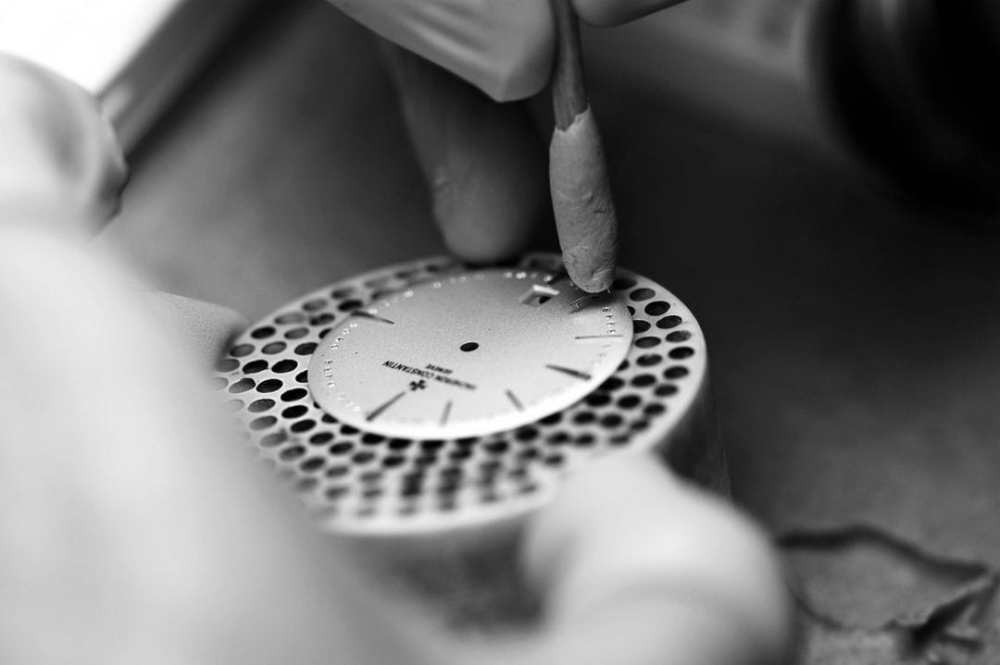
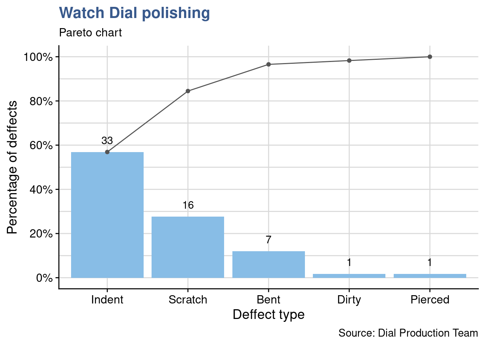
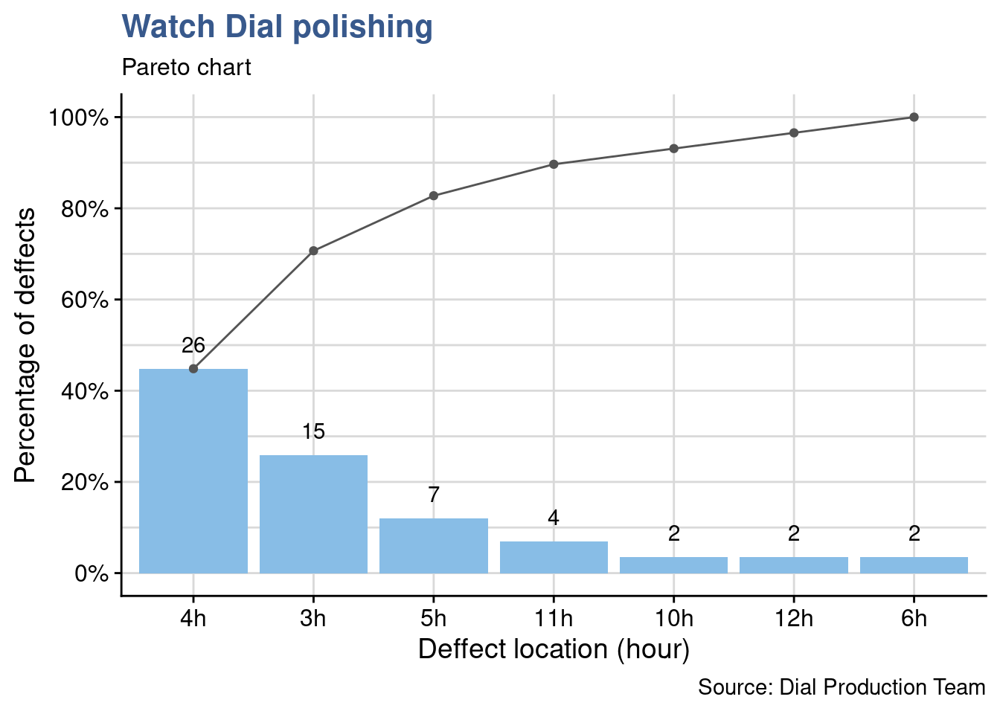
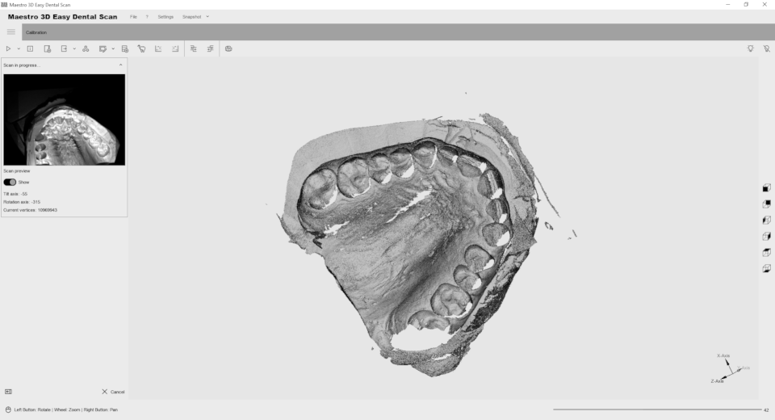
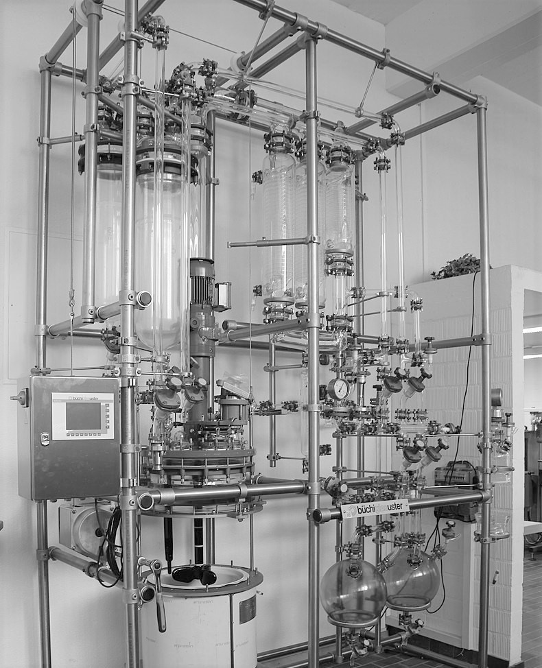
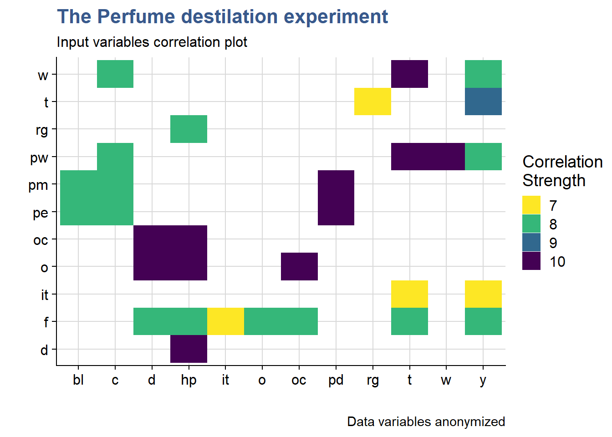
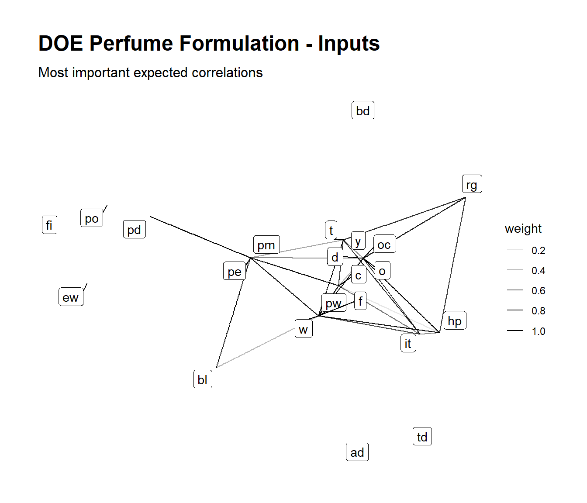
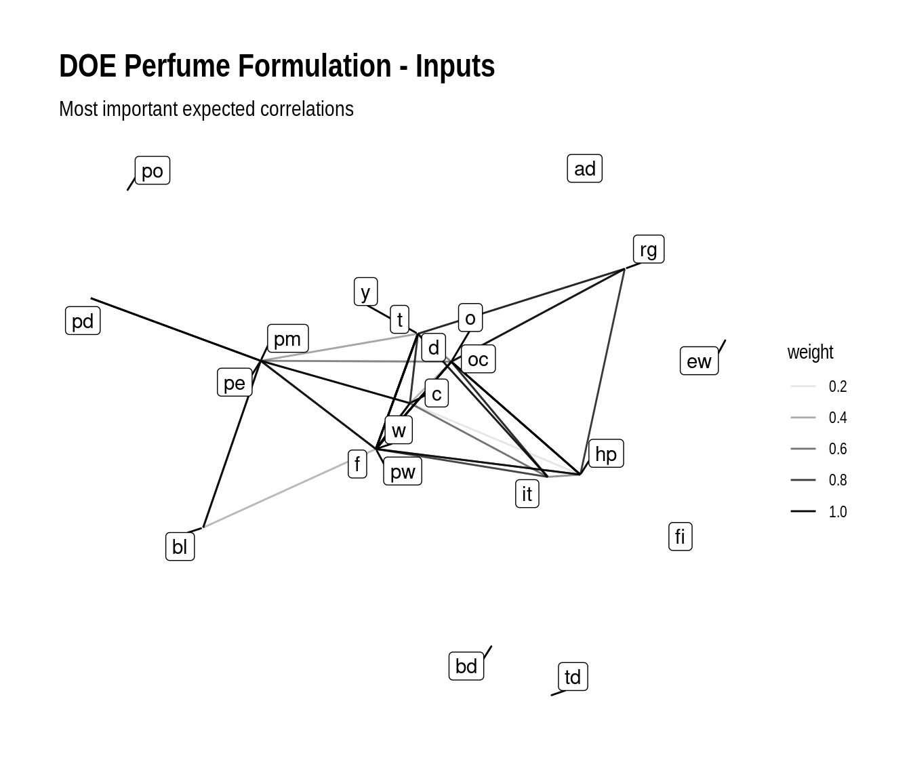

# (PART) CASE STUDIES {-}

# Design for Six Sigma

## Pareto

The pareto chart has always proven an effective way of defining priorities and keeping workload under control. It is known for helping focusing on the few important elements that account for most problems. It builds on the well known insight that a few reasons explain or allow to control most of the outcome. This applies particularly well in the technological and industrial context.

**The dial polishing workshop**

The example here comes from a dial polishing workshop in the watchmaking industry. Dials are received from the stamping process and polished before being sent to the final assembly. As part of the authonomous quality control performed by the polishing operators a count of the defects observed on the dials each day is kept in a file. 

<div class="marginnote">

<div class="figure" style="text-align: center">

<p class="caption">(\#fig:unnamed-chunk-2)watch dial inspection</p>
</div>

</div>

**Loading packages and data:**

getting the dial dataset:


```r
dial_control <-  industRial::dial_control
```

A first look at the dataset now:


```r
head(dial_control) %>% 
  kable(align = "c", 
        caption = "dial control data", 
        booktabs = T)
```


Table: (\#tab:unnamed-chunk-4)dial control data

| Operator |    Date    | Defect  | Location |
|:--------:|:----------:|:-------:|:--------:|
|   Jane   | 2018.01.31 | Indent  |    3h    |
|   Jane   | 2018.02.02 | Indent  |    3h    |
|   Jane   | 2018.02.02 | Indent  |    4h    |
|  Peter   | 2018.02.02 | Indent  |   10h    |
|   Jane   | 2018.02.03 | Scratch |    3h    |
|   Jane   | 2018.02.03 | Indent  |    3h    |

We can see that the count includes both the deffect type and the location (the hour in the dial) and that it is traced to the day and operator.

The team leader promotes a culture of fact based assessment of the quality measurements. Every week the team looks back and observes the weekly counts. This is important because it helps moving away from perception into a more solid assessment. The volume of data is higher like this enabling trends to start becoming apparent. The team can discuss potential actions and prepare reporting to the supplier of the parts (the stamping workshop). It also helps calibrating between operators and agreeing on acceptance criteria and what is and what is not a defect.

A first example of the pareto of the types of defects:

[]{#paretochart}


```r
library(qicharts2)
```


```r
d_type <- dial_control %>% pull(Defect) %>% as.character()
d_type_p <- paretochart(d_type, 
                           title = "Watch Dial polishing",
                           subtitle = "Pareto chart", 
                           ylab = "Percentage of deffects",
                           xlab = "Deffect type",
                           caption = "Source: Dial Production Team")
d_type_p + 
  theme_industRial()
```



As often happens we can see that the first two deffects account for more than 80% of the problems. Identation and scratching are the things to tackle here.

From the available data presented before in table we can go deeper and establish a pareto of the defect location:


```r
d_location <- dial_control %>% pull(Location) %>% as.character()
d_location_p <- paretochart(d_location, 
                           title = "Watch Dial polishing",
                           subtitle = "Pareto chart", 
                           ylab = "Percentage of deffects",
                           xlab = "Deffect location (hour)",
                           caption = "Source: Dial Production Team")
d_location_p +
  theme_industRial()
```



Here a third bucket could be included in the priorities: to reach 80% of the count we consider the defects that appear at 4 o'clock, 3 o'clock and 5 o'clock.

During the reviews the team can also identify other types of data for follow up such as the dial model or the material type. With a simple excel file and an upload in R this can be finetuned from week to week according to the progress of the improvement measures.

## Ishikawa

Usually called Fishbone or Ishikawa diagrams this simple tool has proven to be extremely practical and helpful in structuring team discussions. 

With it we can easily identify and list the expected influencing factors for example to design an experiment. Such selection and grouping of parameters can be useful for among others in defining the right mix of ingredients in a new product or material, in selecting the machine parameters in a manufacturing line or in the definition of a draft operating procedure for a measurement. In each of these situations it helps seeing the big picture and not fall into the trap of relying only in the data and findings obtained by statistical analysis.

Below we're showing an example building on the qcc package. The package author describes in his book @Cano2012 the advantages of using R for the design of these diagrams. In our view it strongly complements the data analysis making the full case easilly reproducible and easily updatable.

**The dental prosthesis laboratory**

An optical measurement device has just been installed in a large Dental Prosthesis Manufacturing Laboratory. This is a very expensive device based on laser technology installed in a dedicated stabilized workbench. Despite all the precautions it has been reported and now demonstrated with some specific trials that the measurements have a higher variation which makes it unsuitable to be used for what is was used for: the precise measurement of dental impressions that serve as models for the production of the crowns and bridges.

<div class="marginnote">

<div class="figure" style="text-align: center">

<p class="caption">(\#fig:unnamed-chunk-8)dental impression measurement</p>
</div>

</div>

So far the Lab Team has full confidence in the equipement supplier and the Lab Manager has seen a similar equipment from the same supplier operating in another laboratory he has visited.

The supplier checked the equipment and having seen no reason for the variability proposes to work with the lab team on identifying the potential causes for the high uncertainty in their measurements. They decided to consider a larger scope that the equipment and take the full measurement method as described in the laboratory operating procedure. They list different reasons related with they're work and group them:


```r
operators <- c("Supplier", "Lab Technician", "Lab Manager")
materials <- c("Silicon", "Alginate", "Polyethers")
machines <- c("Brightness", "Fixture", "Dimensional algorithm")
methods <- c("Fixture", "Holding time", "Resolution")
measurements <- c("Recording method", "Rounding", "Resolution")
groups <- c("Operator", "Material", "Machine", "Method", "Measurement")
effect <- "Too high uncertainty"
```

And then load the qcc package and quickly obtain a simple diagram that allows for a quick visualisation of these influencing factors.

[]{#fishbone}


```r
library(qcc)
```


```r
cause.and.effect(
  title = "Potential causes for uncertainty increase during a measurement",
  cause = list(
    Operator = operators,
    Material = materials,
    Machine = machines,
    Method = methods,
    Measurement = measurements
  ),
  effect = effect
)
```

<div class="figure" style="text-align: center">

<p class="caption">(\#fig:fig-ishikawa)ishikawa diagram aplication</p>
</div>

The listed factors can then be adressed one by one or in combined experiments to evaluate their impact on the measurement method.

## Correlation matrix

A matrix diagram is a way to discover relationships between groups of items as described by  described in the Six Sigma book by @Munro2015. 

These matrix can be used to select which measurement to do in a design of experiments. In exploratory phases when the experiments are repeated several time with slightly different configurations, secondary outputs that are strongly correlated to main outputs can be eliminated 

In an industrial setup the cost of experimenting is often very high. With this approach engineers can keep the quantities test quantities in control by avoiding measurements until final stages of implementation. 

We provide here two different techniques, one with a tile plot and another with a network plot.

**The Perfume destilation experiment**

<div class="marginnote">

<div class="figure" style="text-align: center">

<p class="caption">(\#fig:unnamed-chunk-11)Perfume destillation line</p>
</div>

</div>

DOEs consist in a series of trials where several inputs are combined in specific levels and important outputs are measured (further details can be seen in the DOE chapter). The case below refers to a DOE on Perfume Formulation Development. The Product Development team would like to understand the impact of the perfum manufacturing line parameters variation (e.g. temperature, pressure and others) in typical perfume sensorial characteristics such as the floral notes.

The typical DOE analysis results linking inputs to outputs are presented with effects plots and interaction plots. Here though it is another analysis that interests us: the correlation between the outputs, where there is not always necessary a cause effect but where it is interesting to see if groups of outputs move together. This type of analysis is most commonly presented in a tile plot.

In our present case note that the first DOE has not yet been executed, only a preparatory session has taken place with the project manager to review the potential outputs and anticipate what will be the DOE results. This allowed to go deeper in the technology understanding and to confirm that the plan was constructed in a meaning full way. The experts input has been captured in a 1/2 of a two entry table named "Perfume".

As the industRial package was already loaded in the Pareto section, we can then access directly to the Perfume dataset of which we're showing a subset:


```r
perfume_experiment[1:8, 1:8] %>%
  kable(
    caption = "perfume DoE output variables",
    booktabs = T
  ) 
```


Table: (\#tab:unnamed-chunk-12)perfume DoE output variables

|yy | pw|  w| pm| pe|  f| it| ew|
|:--|--:|--:|--:|--:|--:|--:|--:|
|pw |  0| 10|  3|  3|  2|  2|  0|
|w  |  0|  0|  3|  3|  2|  2|  0|
|pm |  0|  0|  0|  6|  6|  0|  0|
|pe |  0|  0|  0|  0|  6|  0|  0|
|f  |  0|  0|  0|  0|  0|  7|  0|
|it |  0|  0|  0|  0|  0|  0|  0|
|ew |  0|  0|  0|  0|  0|  0|  0|
|c  |  0|  0|  0|  0|  0|  0|  0|

Variables are named with coded names made of two letter. They represent the production Line Parameters and the Perfume Attributes (e.g. t = temperature, o = opening, pw = power). We can see in the table what the team has noted as expected correlation strenght, with 10 being the highest.

Now we filter correlations higher or equal to 7 which have been considered as the potential targets for the simplification in future designs:


```r
perfume_long <- perfume_experiment %>%
  pivot_longer(
    cols = -yy,
    values_to = "correlation",
    names_to = "xx"
  ) %>%
  filter(correlation >= 7) %>%
  mutate(correlation = as_factor(correlation))
```

[]{#tileplot}


```r
perfume_long %>%
  ggplot(aes(x = xx, y = yy, fill = correlation)) +
  scale_fill_viridis_d(direction = -1, name = "Correlation\nStrength") +
  geom_tile() + 
  labs(
    title = "The Perfume destilation experiment",
    subtitle = "Input variables correlation plot ",
    x = "",
    y = "",
    caption = "Data variables anonymized"
  ) +
  theme_industRial()
```



The plot shows that many parameters are expected to move together, for example with maximum correlation we have hp moving with d, oc moving with o and so on.
 
After this first DoE the real correlations will be established and the team expects to be able to avoid a significant part of the measurements that have a correlation higher than 50% from the second DoE onwards.

## Clustering

In this variant we explore a more advanced but more powerfull approach using network plots. It provides an automatic clustering of the factors and a specific way to read such clusters.

We're going to build a weighed non directional network(tbl_graph) object. Several steps of conversion are required for this approach first with igraph and then to tidygraph.

We start by loading the required packages: 


```r
library(igraph)
library(tidygraph)
library(ggraph)
library(ggforce)
library(ggtext)
```

The first step consists in converting the "Perfume" tibble to a matrix format:


```r
perfume_matrix <- perfume_experiment %>%
  column_to_rownames("yy") %>%
  as.matrix()
```

Then using the {igraph} package we convert the matrix into a graph object:


```r
perfume_graph <- graph_from_adjacency_matrix(
  perfume_matrix, mode = "undirected", weighted = TRUE
  )
```

to finaly convert it into a tibble graph with tidygraph package:


```r
perfum_tbl_graph <- as_tbl_graph(perfume_graph, add.rownames = "nodes_names")
```

The users have provided the correlation strength in a simple scale from 1 to 10 which was easier for the discussion. We're here converting it back to the 0 to 1 which is more common in the statistics community. For simplicity, negative correlations were not considered just the strength, enabling the network to be unidirectional.


```r
perfum_tbl_graph <- perfum_tbl_graph %>%
  activate(edges) %>%
  mutate(weight = weight/10)
perfum_tbl_graph
```

```
# A tbl_graph: 22 nodes and 85 edges
#
# An undirected simple graph with 7 components
#
# Edge Data: 85 x 3 (active)
   from    to weight
  <int> <int>  <dbl>
1     1     2    1  
2     1     3    0.3
3     1     4    0.3
4     1     5    0.2
5     1     6    0.2
6     1     8    0.8
# … with 79 more rows
#
# Node Data: 22 x 1
  name 
  <chr>
1 pw   
2 w    
3 pm   
# … with 19 more rows
```

In the previous chunk output we see a preview of the tibble graph object with the first few nodes and edges.

Now we create a vector with various igraph layouts to allow for easier selection when making the plots:


```r
igraph_layouts <- c('star', 'circle', 'gem', 'dh', 'graphopt', 'grid', 'mds', 
                    'randomly', 'fr', 'kk', 'drl', 'lgl')
```

and do a first network plot to check data upload:


```r
perfum_tbl_graph %>% 
  ggraph(layout = "igraph", algorithm = igraph_layouts[7]) +
  geom_edge_link(aes(edge_alpha = weight)) +
  geom_node_label(aes(label = name), repel = TRUE) +
  theme_graph() +
  labs(title = "DOE Perfume Formulation - Inputs",
       subtitle = "Most important expected correlations")
```



Data loading is confirmed to have been done correctly, we can now move into the clustering and analysis.

We use different clusters algorithms like in part 3 to generate the groups:


```r
perfum_tbl_graph <- perfum_tbl_graph %>%
  activate(nodes) %>%
  mutate(group_components = group_components(),
          group_edge_betweenness = group_edge_betweenness(),
          group_fast_greedy = group_fast_greedy(),
          group_infomap = group_infomap(),
          group_label_prop = group_label_prop(),
          group_leading_eigen = group_leading_eigen(),
          group_louvain = group_louvain(),
          group_walktrap = group_walktrap()
         )
```

and produce a final plot, selecting group optimal that with some testing has proven to be the algorithm that gives the best clustering results. The correlations strengths are here represented by the edges width for optimal visualization.


```r
perfum_tg_2 <- perfum_tbl_graph %>% 
  activate(edges) %>% 
  mutate(weight2 = if_else(weight >= 0.8, 1, if_else(weight >= 0.5, 0.5, 0.1)))

my_palette <- c(viridis(12)[3], viridis(12)[9], 
                "gray40", "gray40", "gray40", "gray40", 
                "gray40", "gray40", "gray40", "gray40")

set.seed(48)

perfum_tg_2 %>% 
  activate(nodes) %>% 
  mutate(group = group_louvain) %>% 
  filter(group %in% c(1,2)) %>% 
  ggraph(layout = "igraph", algorithm = igraph_layouts[7]) +
   geom_mark_hull(mapping = aes(x, y, 
                               group = as_factor(group), 
                               fill = as_factor(group)),
               concavity = 0.5,
               expand = unit(4, 'mm'),
               alpha = 0.25,
               colour = 'white',
               show.legend = FALSE) + 
  geom_edge_link(aes(edge_alpha = weight2, edge_width = weight2)) + 
  geom_node_point(size = 3) +
  geom_node_label(aes(label = name), repel = TRUE) +
  scale_edge_width(range = c(0.2, 1), name = "Correlation strength") +
  scale_edge_alpha(range = c(0.05, 0.2), name = "Correlation strength") + 
  scale_fill_manual(values = my_palette) + 
  theme_graph() +
  labs(
    title = str_c("<span style='color:#433E85FF'>Line Parameters</span>", 
    " and ", "<span style='color:#51C56AFF'>Perfume Attributes</span>"),
    subtitle = "Clustering the outputs of Perfume Formulation DOE01",
    caption = "Clustering by multi-level modularity optimisation (louvain)") +
  theme(plot.title = element_markdown(family = "Helvetica",
                                      size = 14, 
                                      face = "bold")) 
```



<br>

We can see that the algorithm is grouping elements that have a strong correlation. Most stronger correlations are present within elements of each cluster with some exceptions such as oc with pw and y with pe. 

The code presented can now easily be reused once the DOE is executed to compare with the real correlations measured.


