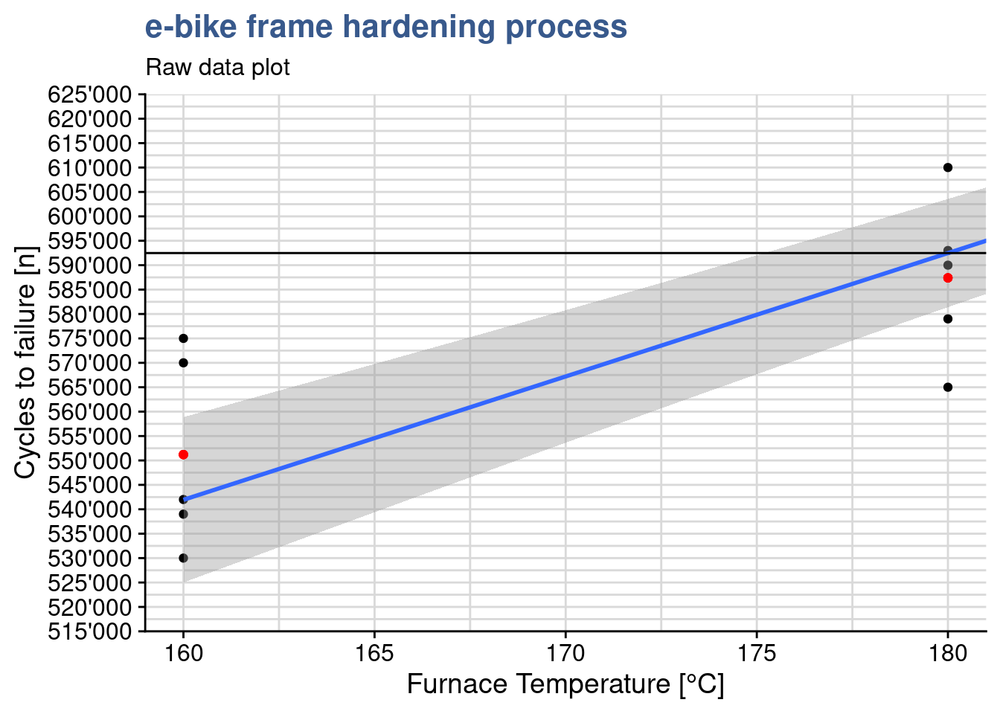
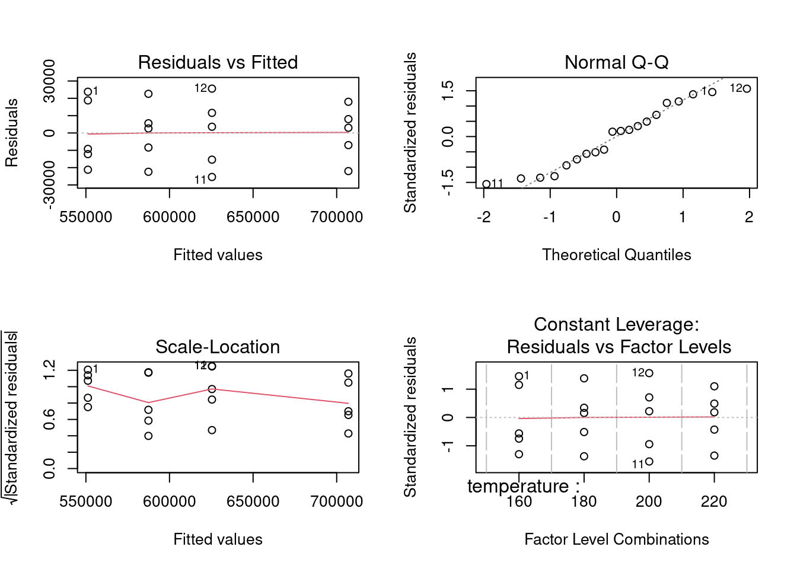
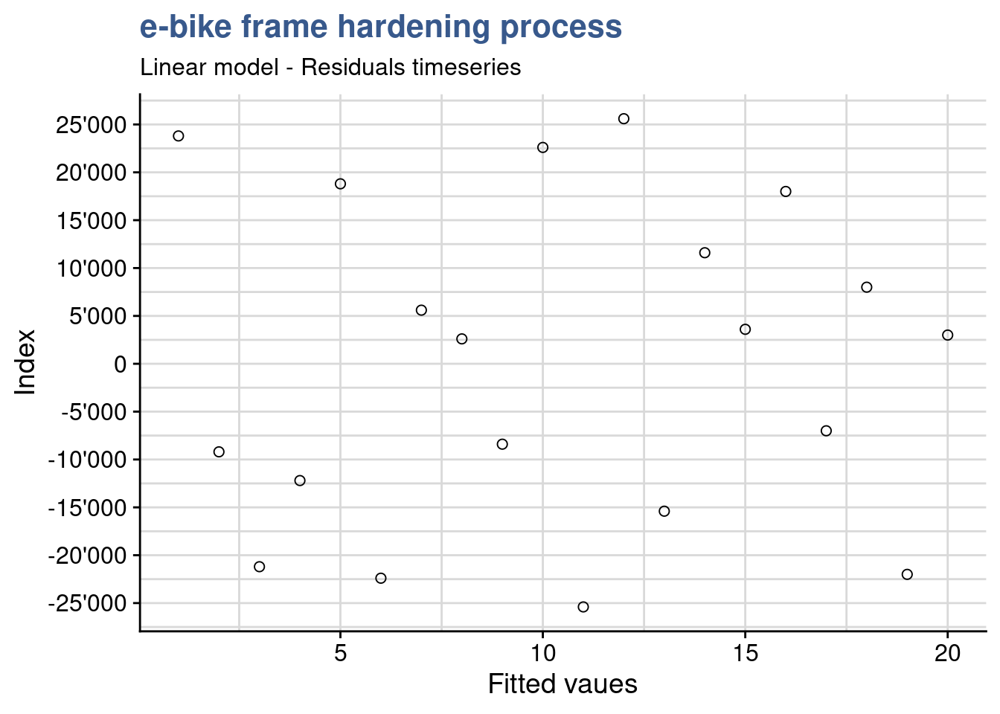
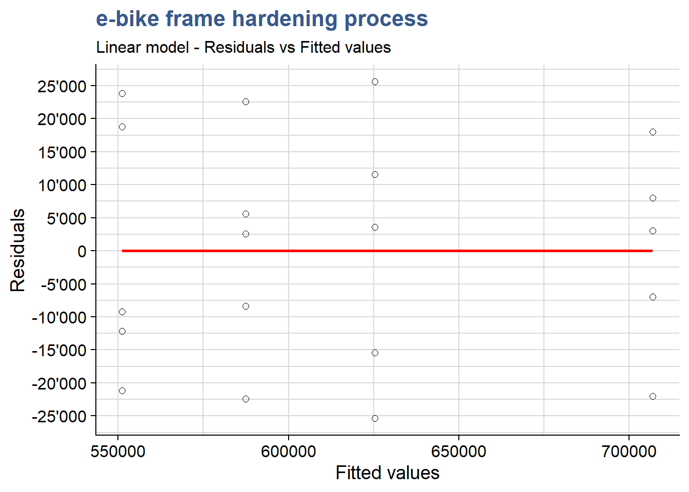
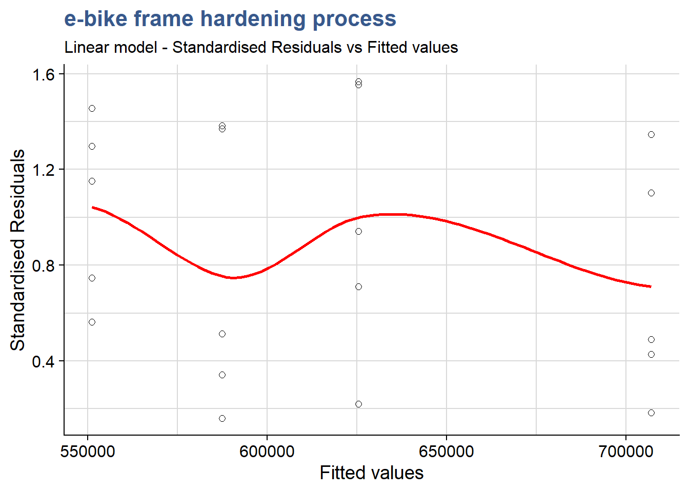
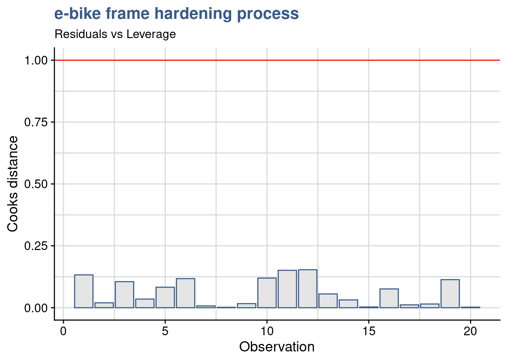

## Statistical modeling

<div class="marginnote">

<b class="highlight">Case study: e-bike frame hardening</b>

Demand for electrical bicycles grows steadily and a global manufacturer is looking into improving the quality of his bicycle frames. A test program around different treatment temperatures is established to find the conditions that optimize the fatigue resistance.


</div>

A way to go beyond the statistical description of samples and direct comparison between different tests it is to establish a model. Models help us simplify the reality and draw general conclusions. The case studies in this unit introduce linear models and their applications. They also serve as the backbone for statistical inference and forecasting. These are two important techniques because they provide mathematical evidence of such general conclusions in a context where the test quantities are strongly limited as for example in lifecycle testing of expensive mechanical parts.

Bicycle frames are submitted to many different efforts, namely bending, compression and vibration. Obviously no one expects a bike frame to break in regular usage and it is hard to commercialy claim resistance to failure as a big thing. Nevertheless on the long term a manufacturer reputation is made on performance features such as the number of cycles of effort that the frame resists. An e-bike manufacturing company is looking to increase the duration of its frames by improving the  <b class="highlight">e-bike frame hardening</b> process.

A test has been run with 5 groups of 30 bike frames submitted to 4 different treatment temperature levels and the data collected in the R tibble `ebike_hardening` presented below:


```r
head(ebike_hardening) %>%
  kable(align = "c")
```


| temperature |   g1   |   g2   |   g3   |   g4   |   g5   |
|:-----------:|:------:|:------:|:------:|:------:|:------:|
|     160     | 575000 | 542000 | 530000 | 539000 | 570000 |
|     180     | 565000 | 593000 | 590000 | 579000 | 610000 |
|     200     | 600000 | 651000 | 610000 | 637000 | 629000 |
|     220     | 725000 | 700000 | 715000 | 685000 | 710000 |

This type of two way entry is friendly for data collection but for manipulation with the `{tidyverse}` package functions it is often better to transform it in a long format.


```r
ebike_narrow <- ebike_hardening %>%
  pivot_longer(
    cols = starts_with("g"),
    names_to = "observation",
    values_to = "cycles"
  ) %>%
  group_by(temperature) %>%
  mutate(cycles_mean = mean(cycles)) %>%
  ungroup()

slice_head(.data = ebike_narrow, n = 5) %>% 
  kable(align = "c", 
        caption = "e-bike hardening experiment data")
```


Table: (\#tab:fig-ebikenarrow)e-bike hardening experiment data

| temperature | observation | cycles | cycles_mean |
|:-----------:|:-----------:|:------:|:-----------:|
|     160     |     g1      | 575000 |   551200    |
|     160     |     g2      | 542000 |   551200    |
|     160     |     g3      | 530000 |   551200    |
|     160     |     g4      | 539000 |   551200    |
|     160     |     g5      | 570000 |   551200    |

The engineering team is looking forward to see the first results which have been prepared by the laboratory supervisor. He has prepared a series of plots and data models and sent out an draft report. The first plot is a simple dot plot having the raw data and in red the group means.  


```r
ggplot(data = ebike_narrow) +
  geom_point(aes(x = temperature, y = cycles)) +
  geom_point(aes(x = temperature, y = cycles_mean), color = "red") +
  scale_y_continuous(n.breaks = 10, labels = label_number(big.mark = "'")) +
  theme(legend.position = "none") +
  labs(title = "e-bike frame hardening process",
       subtitle = "Raw data plot",
       x = "Furnace Temperature [°C]",
       y = "Cycles to failure [n]")
```


Clearly the highest the furnace temperature the higher the number of cycles to failure. This is absolutely expected as higher temperatures, up to a certain level, allow to release mechanical tensions and make the material less prone to fracture. The team knows that other factors are at play such as the treatment duration, the pre-heating temperature and many others related with the welding of the frame parts, but has deliberately decided to look only into the temperature due to time constraints related with a new bike launch.

It is good to complement the raw data plot with a regression line corresponding to this linear model as done in the next chunk with the function `geom_smooth()`:


```r
ggplot(ebike_narrow) +
  geom_point(aes(x = temperature, y = cycles)) +
  geom_smooth(aes(x = temperature, y = cycles), method = "lm") +
  geom_point(aes(x = temperature, y = cycles_mean), color = "red") +
  scale_y_continuous(n.breaks = 10, labels = label_number(big.mark = "'")) +
  theme(legend.position = "none") +
  labs(title = "e-bike frame hardening process",
       subtitle = "Raw data plot",
       x = "Furnace Temperature [°C]",
       y = "Cycles to failure [n]")
```


This visualization shows how a linear regression line adjusts to the data and we can see it is not passing exactly at the means of each treatment level. In the next steps we go into the functions underneath that are used to calculate the regression line.

### Linear models {#lm}


```r
ebike_lm <- lm(cycles ~ temperature, data = ebike_narrow)
summary(ebike_lm)
```

```

Call:
lm(formula = cycles ~ temperature, data = ebike_narrow)

Residuals:
   Min     1Q Median     3Q    Max 
-43020 -12325  -1210  16710  33060 

Coefficients:
            Estimate Std. Error t value Pr(>|t|)    
(Intercept)   137620      41211    3.34   0.0036 ** 
temperature     2527        215   11.73  7.3e-10 ***
---
Signif. codes:  0 '***' 0.001 '**' 0.01 '*' 0.05 '.' 0.1 ' ' 1

Residual standard error: 21500 on 18 degrees of freedom
Multiple R-squared:  0.884,	Adjusted R-squared:  0.878 
F-statistic:  138 on 1 and 18 DF,  p-value: 7.26e-10
```

This previoous code chunk from the lab supervisor draft report is a linear model built with the variable `temperature` as a numeric vector. The R `summary()` function produces a specific output for linear models and a dedicated help explaining each output value can be accessed with `?summary.lm`. Knowing that R uses specific "methods" to provide the summaries for many functions is useful to find their help pages and a way to list them is `apropos("summary)`. In this case we see a high R-squared suggesting a very good fit and that the temperature is significant by looking at the 3 *significance stars* next to its p-value. 

### Contrasts {#contr.treatment}


```r
ebike_factor <- ebike_narrow %>%
  mutate(temperature = as_factor(temperature))

contrasts(ebike_factor$temperature) <- contr.treatment

attributes(ebike_factor$temperature)
```

```
$levels
[1] "160" "180" "200" "220"

$class
[1] "factor"

$contrasts
    2 3 4
160 0 0 0
180 1 0 0
200 0 1 0
220 0 0 1
```

The engineering team has selected to specify and control the temperature variable at specific levels in what is called a fixed effects model, limiting the conclusions to the levels tested. The lab supervisor updates his dataset by converting the temperature variable to a factor and explicitly establishes the factor `contrasts` with the `contrasts()` function. He selects `cont.treatment`. Looking into the attributes of the factor we see the matrix of contrasts. In many cases it is possible to skip this step as contr.treament is default setting for the contrasts. This can be confirmed with `getOption("contrasts")`. He can now establish a new linear model using the modified dataset.


```r
ebike_lm_factor <- lm(
  cycles ~ temperature, 
  data = ebike_factor
  )
summary(ebike_lm_factor)
```

```

Call:
lm(formula = cycles ~ temperature, data = ebike_factor)

Residuals:
   Min     1Q Median     3Q    Max 
-25400 -13000   2800  13200  25600 

Coefficients:
             Estimate Std. Error t value Pr(>|t|)    
(Intercept)    551200       8170   67.47  < 2e-16 ***
temperature2    36200      11553    3.13   0.0064 ** 
temperature3    74200      11553    6.42  8.4e-06 ***
temperature4   155800      11553   13.49  3.7e-10 ***
---
Signif. codes:  0 '***' 0.001 '**' 0.01 '*' 0.05 '.' 0.1 ' ' 1

Residual standard error: 18300 on 16 degrees of freedom
Multiple R-squared:  0.926,	Adjusted R-squared:  0.912 
F-statistic: 66.8 on 3 and 16 DF,  p-value: 2.88e-09
```

We see that from the first model to the second the R-squared has improved and that the model coefficients are slightly different. In R the model coefficients depend on the variable variable data type and on the contrasts setting. To obtain equivalent results with the different type coding it is necessary to carefully set the model *contrasts*. These differences are due to the calculation of different linear regression equations with different coefficients. It is important to be attemptive before using whatever output the system is giving us. We can see the coefficients and use them to calculate the output with a matrix multiplication  as follows:


```r
ebike_lm$coefficients 
```

```
(Intercept) temperature 
     137620        2527 
```

```r
ebike_lm$coefficients %*% c(1, 180)
```

```
       [,1]
[1,] 592480
```

this shows that to calculate the output for an input of 180 we have 137'620 + 180 x 2'527 = 592'480. Making a zoom on the linear regression plot we see this passes slightly above the mean for the 180°C treatment level:


```r
ggplot(ebike_narrow) +
  geom_point(aes(x = temperature, y = cycles)) +
  geom_smooth(aes(x = temperature, y = cycles), method = "lm") +
  geom_point(aes(x = temperature, y = cycles_mean), color = "red") +
  scale_y_continuous(n.breaks = 20, labels = label_number(big.mark = "'")) +
  coord_cartesian(xlim = c(160, 180), ylim = c(520000, 620000)) +
  geom_hline(yintercept = 592480) +
  theme(legend.position = "none") +
  labs(title = "e-bike frame hardening process",
       subtitle = "Raw data plot",
       x = "Furnace Temperature [°C]",
       y = "Cycles to failure [n]")
```



On the other hand, when the temperature is coded as a factor we have the following coefficients and output calculation:


```r
ebike_lm_factor$coefficients
```

```
 (Intercept) temperature2 temperature3 temperature4 
      551200        36200        74200       155800 
```

```r
ebike_lm_factor$coefficients %*% c(1, 1, 0, 0)
```

```
       [,1]
[1,] 587400
```

The output is slightly different: 551'200 + 1 x 36'200 = 587'400, corresponding exactly to the treatment mean for 180°C. More on this in the next section.

### Predict {#predict}

A model is useful for predictions. In a random effects model where conclusions can be applied to the all the population we can predict values at any value of the input variables. In that case reusing the model with temperature as a numeric vector we could have a prediction for various temperature values such as:


```r
ebike_new <- tibble(temperature = c(180, 200, 210))
predict(ebike_lm, newdata = ebike_new)
```

```
     1      2      3 
592480 643020 668290 
```

As mentionned in our case the team has selected a fixed effects model and in principle they sould only draw conclusions at the levels at which the input was tested. We can check with `predict()` too that the predictions correspond exactly to the averages we've calculated for each level:


```r
ebike_new <- data.frame(temperature = as_factor(c("180", "200")))
predict(ebike_lm_factor, newdata = ebike_new)
```

```
     1      2 
587400 625400 
```

We find again exactly the same values calculated using the matrix multiplication of the linear regression coefficients with the input vector we used before. The `predict()` function has other advantages such as providing confidence intervals and taking into account the correct contrast coding, which will be explored in later case studies.

The lab supervisor is now ready to assess the validity of the model. This is required before entering the main objective which is comparing the treatment means using an anova. To do this assessment the model he is going to do a residuals analysis. R provides direct plotting functions with the base and stats packages but he opted to break down the analysis and use custom the plots. He also uses some additional statistical tests to confirm our observations from the plots. He starts by loading the package broom which will help him retrieving the data from the lm object into a data frame.

### Model augment {#augment}


```r
library(broom)
```


```r
ebike_aug <- augment(ebike_lm_factor) %>%
  mutate(index = row_number())
ebike_aug %>%
  head() %>%
  kable(align = "c")
```


| cycles | temperature | .fitted | .resid | .hat | .sigma | .cooksd | .std.resid | index |
|:------:|:-----------:|:-------:|:------:|:----:|:------:|:-------:|:----------:|:-----:|
| 575000 |     160     | 551200  | 23800  | 0.2  | 17571  | 0.13261 |  1.45665   |   1   |
| 542000 |     160     | 551200  | -9200  | 0.2  | 18679  | 0.01982 |  -0.56307  |   2   |
| 530000 |     160     | 551200  | -21200 | 0.2  | 17846  | 0.10522 |  -1.29752  |   3   |
| 539000 |     160     | 551200  | -12200 | 0.2  | 18535  | 0.03485 |  -0.74668  |   4   |
| 570000 |     160     | 551200  | 18800  | 0.2  | 18069  | 0.08275 |  1.15063   |   5   |
| 565000 |     180     | 587400  | -22400 | 0.2  | 17724  | 0.11747 |  -1.37096  |   6   |

<div class="marginnote">

Residuals analysis plots obtained with base R plot() function. In this unit each plot is generated individually with custom functions and a direct approach with based R is used in the next units.


```r
par(mfrow = c(2,2))
plot(ebike_lm_factor)
```



</div>

A deep structural change has happened in R since the `{tidyverse}`. The original S and R creators had developed a language where matrices, vectors, lists and dataframes had equivalent importance. The output of a function was often a list with a specific *S3* class comprising other vectors and data.frames inside. This allowed to use in a transparent way generic functions such as `summary()` to produce tailor made outputs because a method was working underneath. We've just seen an example of this with the `lm()` summary in the beginning of this case. For the `plot()` function there are more than a hundred different automatic plots as seens with `apropos("plot")`. This is a very important difference as in the `{tidyverse}` we add layers to obtain the required plot. On the data side since `{tidyverse}` has been introduced we've seen an increasing importance of the dataframe, now replaced by the `tibble`. The `agument()` does exactly this, extracts the coefficients, residuals and other data from the model and stores it in a `tibble` format. This has the advantage of making it easier to integrate these functions with the other `{tidyverse}` functions and pipelines while still allowing to keep the methods approach. An interesting reading on this co-existance is available under [tideness-modeling](https://www.tmwr.org/base-r.html#tidiness-modeling)

### Timeseries plot {#residuals_timeseries}


```r
ebike_aug %>%
  ggplot(aes(x = index, y = .resid)) +
  geom_point(shape = 21, size = 2) +
  scale_y_continuous(n.breaks = 10, labels = label_number(big.mark = "'")) +
  labs(
    title = "e-bike frame hardening process",
    subtitle = "Linear model - Residuals timeseries",
    y = "Index",
    x = "Fitted vaues"
  )
```



Before drawing conclusions on the significance of the input variables it is important to assess the validity of the model. The anova assumptions are similar to the t.test assumptions discussed before. In fact the anova can be considered extension of the t.test to factors with more than 2 levels. These assumptions are the common ones commining from statistical inference principles and the central limit theorem: independent and random samples, normality of the distributions, equality of variances. These assumptions could be checked in each variable group but this would be very time consuming and not fully robust. A better way is to analyse the model residuals which are the deviations of each datapoint from the linear regression line. 

A first verification consists in confirming that the residuals have no patterns. This confirms that the sampling has been done randomly and there are none of the typical bias consisting in groups of values clustered from one operator the other or from one day to the other. This can be achieved with a residuals timeseries. If patterns emerge then there may be correlation in the residuals.

For this plot we need to ensure that the order of plotting in the x axis corresponds exactly to the original data collection order. In this case the lab supervisor confirms that no specific pattern emerges from the current plot and the design presents itself well randomised.

### Autocorrelation test {#autocorrelation}


```r
library(car)
durbinWatsonTest(ebike_lm_factor)
```

```
 lag Autocorrelation D-W Statistic p-value
   1        -0.53433        2.9609   0.112
 Alternative hypothesis: rho != 0
```

As already stated visual observations can most of the times be complemented with a statistical test. In this case we can apply the durbinWatson test from the `{car}` package (Car stands for Companion to Applied Regression) 

Although the output shows Autocorrelation of -0.53 we have to consider that the p value is slightly higher than 0.05 thus there is not enough significance to say that there is autocorrelation. The result is not a complete clear cut the lab supervisor remains alert for coming verifications.

### Normality plot


```r
ebike_aug %>%
  ggplot(aes(sample = .resid)) +
  geom_qq(shape = 21, size = 2) +
  geom_qq_line() +
  scale_y_continuous(n.breaks = 10, labels = label_number(big.mark = "'")) +
  labs(
    title = "e-bike frame hardening process",
    subtitle = "Linear model - qq plot",
    y = "Residuals",
    x = "Fitted values"
  )
```


A good next check is to verify that the residuals are normaly distributed. As the sample size is relatively small it is better to use a qq plot instead of an histogram to assess the normality of the residuals. As we see on the plot values adhere to the straight line indicating an aproximately normal distribution. In the fixed effects model we give more importance to the center of the values and here we consider acceptable that the extremes of the data tend to bend away from the straight line. This verification can be completed by a normality test. 

### Normality test {#shapiroTest}


```r
shapiro.test(ebike_aug$.resid)
```

```

	Shapiro-Wilk normality test

data:  ebike_aug$.resid
W = 0.938, p-value = 0.22
```

For populations < 50 use the shapiro-wilk normality test, Here p > 0.05 indicates that the residuals do not differ significantly from a normally distributed population.

### Residuals-Fit plot {#residuals_fit}


```r
ebike_aug %>%
  ggplot(aes(x = .fitted, y = .resid)) +
  geom_point(shape = 21, size = 2) +
  geom_smooth(method = stats::loess, se = FALSE, color = "red") +
  scale_y_continuous(n.breaks = 10, labels = label_number(big.mark = "'")) +
  labs(
    title = "e-bike frame hardening process",
    subtitle = "Linear model - Residuals vs Fitted values",
    y = "Residuals",
    x = "Fitted values"
  )
```



If the model is correct and the assumptions hold, the residuals should be structureless. In particular they should be unrelated to any other variable including the predicted response. A plot of the residuals against the fitted values should reveal such structures. In this plot we see no variance anomalies such as a higher variance for a certain factor level or other types of skweness.

### Standard Residuals-Fit plot {#std_residuals_fit}


```r
ebike_aug %>% 
  ggplot(aes(x = .fitted, y = abs(.std.resid))) +
  geom_point(shape = 21, size = 2) +
  geom_smooth(method = stats::loess, se = FALSE, color = "red") +
  labs(title = "e-bike frame hardening process",
       subtitle = "Linear model - Standardised Residuals vs Fitted values",
       y = "Standardised Residuals",
       x = "Fitted values")
```



This Standardized residuals plot helps detecting outliers in the residuals (any residual > 3 standard deviations is a potential outlier). The plot shows no outliers to consider in this DOE.

### Standard Residuals-Factor plot {#std_residuals_factors}


```r
ebike_aug %>% 
  ggplot(aes(x = as.numeric(temperature), y = .std.resid)) +
  geom_point(shape = 21, size = 2) +
  geom_smooth(method = stats::loess, se = FALSE, color = "red") +
  labs(title = "e-bike frame hardening process",
       subtitle = "Linear model - Standardised Residuals vs Factor levels",
       y = "Standardised Residuals",
       x = "Factor levels")
```


Besides being another support to detect outliers, this additional plot also helps seeing if the variance of the residuals is identical in this case between the factor levels.

### Homocedasticity {#homocedasticity}


```r
bartlett.test(cycles ~ temperature, data = ebike_factor)
```

```

	Bartlett test of homogeneity of variances

data:  cycles by temperature
Bartlett's K-squared = 0.433, df = 3, p-value = 0.93
```

A complement to the residuals-fit/residuals-factors plots is the equality of variances test. Tests for variance comparison have been introduced in the Direct Comparisons case studies but the `var.test()` cannot be used here. Here we have more than two levels for which the Bartlett test is most suited. The normal distribution of the residuals has already been confirmed. This test is sensitive to the normality assumption, consequently, when the validity of this assumption is doubtful, it should not be used and be replaced by the modified Levene test for example. Applying the test we obtain a p-value is P = 0.93 meaning we cannot reject the null hypothesis. In statistical terms, there is no evidence to counter the claim that all five variances are the same. This is the same conclusion reached by analyzing the plot of residuals versus fitted values.

### Outliers test {#outliers}


```r
outlierTest(ebike_lm_factor)
```

```
No Studentized residuals with Bonferroni p < 0.05
Largest |rstudent|:
   rstudent unadjusted p-value Bonferroni p
12   1.6488            0.11997           NA
```

In a case where we were doubtfull we could go further and make a statistical test to assess if a certain value was an outlier. Another usefull test is available in the  `{car}` package in this case to test outliers. We get a *Bonferroni* adjusted p value as NA confirming that there is no outlier in the data.   

### Cooks distance {#cooks}


```r
ebike_aug %>% 
  ggplot(aes(x = index, y = .cooksd)) +
  geom_col(color = viridis(12)[4], fill = "grey90") +
  geom_hline(yintercept = 1, color = "red") +
  labs(title = "e-bike frame hardening process",
       subtitle = "Residuals vs Leverage",
  x = "Observation",
  y = "Cooks distance")
```



Cooks distance is a complementary analysis to the residuals that can help identify specific data points that could have a strong influence in the model. Various cutoff points are suggested in the literature and we opted here for 1 following the short wikipedia article on the topic [cooks distance](https://en.wikipedia.org/wiki/Cook's_distance) 

### R-squared {#R-squared}


```r
summary(ebike_lm_factor)$r.squared
```

```
[1] 0.92606
```

A final input in the draft report of the ebike hardening linear model is the R-squared. When looking into the results the engineering team is suspicious. In this case 93% of the output is explained by input and a model with such a good fit should raise questions. Our lab supervisor is also not confortable the residuals analysis has not shown any evidence of something wrong with the model so he decides to quickly calculate it "by hand". He knows that the R-squared, or coefficient of determination is obtained from the ratio between the residuals variance and the output variable variance showing exactly the proportion between the two and he gets its straight away from R using the data already available:


```r
ebike_aug %>%
  summarise(cycles_var = var(cycles), residuals_var = var(.resid)) %>%
  mutate(Rsquared = 1 - residuals_var/cycles_var) %>% pull(Rsquared)
```

```
[1] 0.92606
```

Remembering the original linear regression plot from the beginning of the report he accepts this must not be so far away. It was clear that the temperature had a strong impact on the number of cycles and the variability for each level was small in the end. He accepts to leave as it is for now waiting for upcoming analysis of variance to see additional details.
