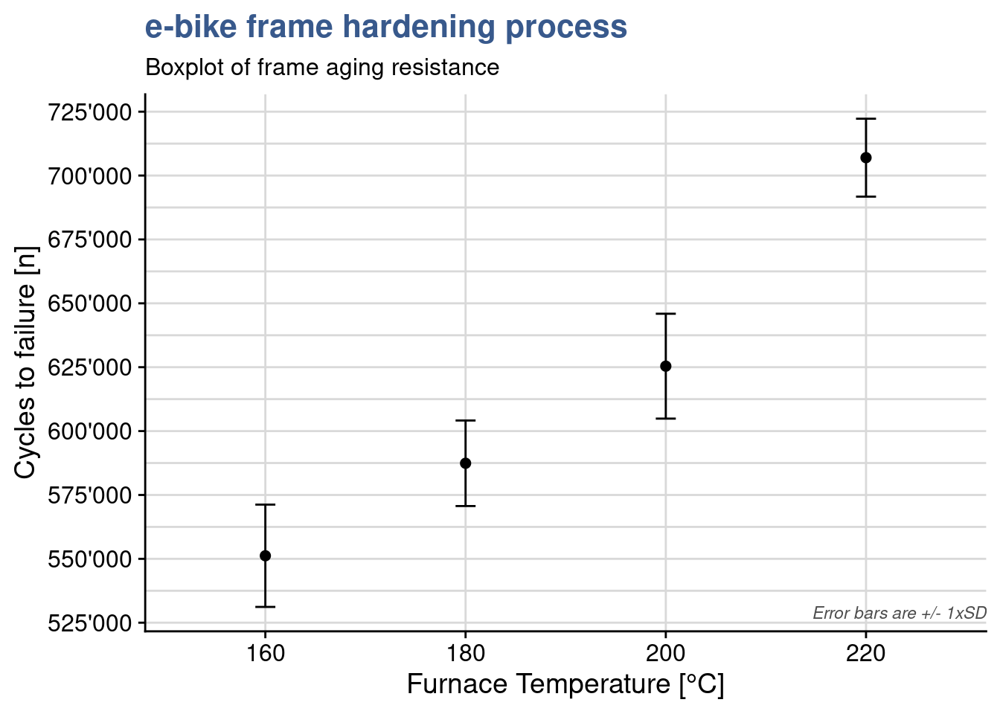
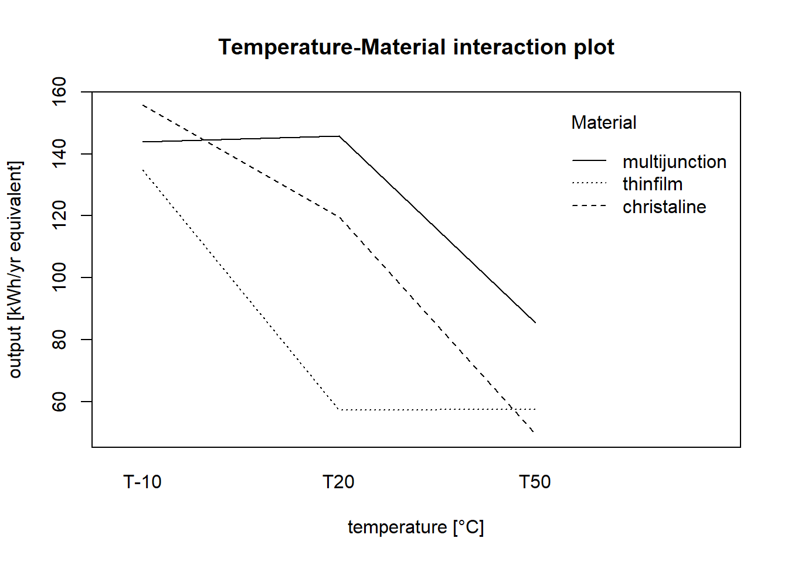
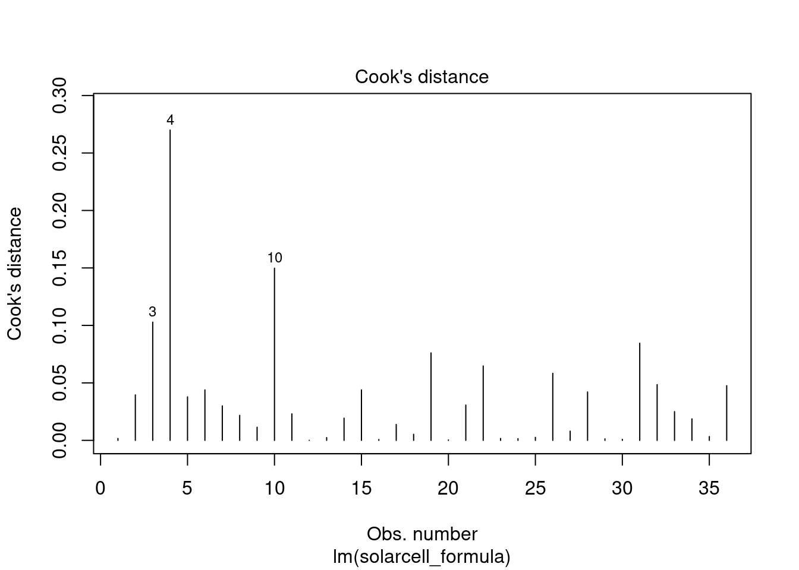

## Anova & Ancova

The commercial introduction of the new e-bike model is approaching soon and production is expected to start in a couple of months. The engineering team is getting impacient because the parameters for the frame thermal treatment are not yet defined. The engineering head call for a second meeting to review once more the DoE outputs. The lab supervisor reopens his Rmd report tries to go beyond the linear model discussed before. He created raw data plots with dots on individual data points but now he thinks it is important to have a view on the data distribution and some summary statistics. For that he prepares a box plot:


```r
ggplot(
  ebike_factor, 
  aes(x = temperature, y = cycles, fill = temperature)) +
  geom_boxplot() +
  scale_fill_viridis_d(option = "D", begin = 0.5) +
  scale_y_continuous(n.breaks = 10, labels = label_number(big.mark = "'")) +
  theme(legend.position = "none") +
  labs(title = "e-bike frame hardening process",
       subtitle = "Raw data plot",
       x = "Furnace Temperature [°C]",
       y = "Cycles to failure [n]")
```


They have been doing so many experiments that sometimes it gets hard to remember which variables have been tested in which experiment. This plot reminds him that this test consisted simply on 1 input variable with severals levels - the temperature and one continuous dependent variable - the number of cycles to failure. The plots shows clearly that the distributes are quite appart from each other in spite of the slight overlap between the first three groups. The underlying question is: are the different levels of temperature explaining the different results in resistance to fatigue? to confirm that means of those groups are statistically different from each other he knows he can use the analysis of variance. The name is a bit misleading since he want to compare means...but this name is historical and comes from the way the approach has evolved. The anova as it is called is similar to the t-test but is extended. Using all pair wise t-tests would mean more effort and increase the type I error.

The anova main principle is that the the total variability in the data, as measured by the total corrected sum of squares, can be partitioned into a sum of squares of the differences between the treatment averages and the grand average plus a sum of squares of the differences of observations within treatments from the treatment average. The first time he read this explanation it seemed complex but he understood better on seeing a simple hand made example on the [kahn academy - anova](https://www.youtube.com/watch?v=EFdlFoHI_0I).

### Aov {#aov}


```r
ebike_aov_factor <- aov(ebike_lm_factor)
summary(ebike_aov_factor)
```

```
            Df   Sum Sq  Mean Sq F value  Pr(>F)    
temperature  3 6.69e+10 2.23e+10    66.8 2.9e-09 ***
Residuals   16 5.34e+09 3.34e+08                    
---
Signif. codes:  0 '***' 0.001 '**' 0.01 '*' 0.05 '.' 0.1 ' ' 1
```

In R the anova is built by passing the linear model object to the `anova()` or `aov()` functions. The output of the first is just the anova table, the output of the second function is a complete list with the full lm model inside.

The R anova output gives the sum of squares for the factor and for the residuals. In this case the between-treatment mean square is much larger than the within-treatment or residuals mean square. This suggests that it is unlikely that the treatment means are equal. The p is extremely small confirming this and  we have basis to reject the null hypothesis and conclude that the means are significantly different. 

In the mean while the lab supervisor has gathered data on a similar experiment done with frams in another material for that seems to be less sensitive the the treatment temperation. He uploads this data and assigns it to a dataset called `ebike_hardning2` and plots another box plot.


```r
ebike_narrow2 <- ebike_hardening2 %>%
  pivot_longer(
    cols = starts_with("g"),
    names_to = "observation",
    values_to = "cycles"
  ) %>%
  group_by(temperature) %>%
  mutate(cycles_mean = mean(cycles)) %>%
  ungroup()
ebike_factor2 <- ebike_narrow2
ebike_factor2$temperature <- as.factor(ebike_factor2$temperature)
```


```r
ggplot(ebike_factor2, 
       aes(x = temperature, y = cycles, fill = temperature)) +
  geom_boxplot() +
  scale_y_continuous(n.breaks = 10) +
  scale_fill_viridis_d(option = "A", begin = 0.5) +
  theme(legend.position = "none") +
  scale_y_continuous(n.breaks = 10, labels = label_number(big.mark = "'")) +
  labs(title = "e-bike frame hardening process",
       subtitle = "Boxplot of frame aging resistance",
       x = "Furnace Temperature [°C]",
       y = "Cycles to failure [n]")
```


Effectively the outputs are much more spread out and the overlaps much bigger. A new anova gives a p value of 0.34 supporting the assumption of no significant difference between the means of the treatment levels.


```r
ebike_lm_factor2 <- lm(cycles ~ temperature, data = ebike_factor2)
anova(ebike_lm_factor2)
```

```
Analysis of Variance Table

Response: cycles
            Df   Sum Sq  Mean Sq F value Pr(>F)
temperature  3 1.48e+09 4.92e+08     1.2   0.34
Residuals   16 6.55e+09 4.10e+08               
```

### Pairwise comparison {#tukey}

The Anova may indicate that the treament means differ but it won't indicate which ones. In this case we may want to compare pairs of means.


```r
ebike_tukey <- TukeyHSD(ebike_aov_factor, ordered = TRUE)
```


```r
head(ebike_tukey$temperature) %>% 
  kable(align = "c", 
        caption = "tukey test on e-bike frame hardening process", 
        booktabs = T)
```


Table: (\#tab:unnamed-chunk-9)tukey test on e-bike frame hardening process

|        |  diff  |   lwr    |  upr   |  p adj  |
|:-------|:------:|:--------:|:------:|:-------:|
|180-160 | 36200  |  3145.6  | 69254  | 0.02943 |
|200-160 | 74200  | 41145.6  | 107254 | 0.00005 |
|220-160 | 155800 | 122745.6 | 188854 | 0.00000 |
|200-180 | 38000  |  4945.6  | 71054  | 0.02160 |
|220-180 | 119600 | 86545.6  | 152654 | 0.00000 |
|220-200 | 81600  | 48545.6  | 114654 | 0.00001 |

The test provides us a simple direct calculation of the differences between the treatment means and a confidence interval for those. Most importantly it provides us with the p value to help us confirm the significance of the difference and conclude factor level by factor level which differences are significant.

Additionally we can obtain the related plot with the confidence intervals 


```r
plot(ebike_tukey)
```


### Least significant difference {#fisherLSD}

Fisher's Least Significant difference is an alternative to Tuckey's test.


```r
library(agricolae)
```


```r
ebike_anova <- anova(ebike_lm_factor) 

ebike_LSD <- LSD.test(y = ebike_factor$cycles,
         trt = ebike_factor$temperature,
         DFerror = ebike_anova$Df[2],  
         MSerror = ebike_anova$`Mean Sq`[2],
         alpha = 0.05)
```

The Fisher procedure provides us with additional information. A first outcome is the difference between means (of life cycles) that can be considered significant, indicated in the table below by LSD = 24.49.


```r
head(ebike_LSD$statistics) %>% 
  kable(align = "c", 
        caption = "Fisher LSD procedure on e-bike frame hardening: stats",
        booktabs = T)
```


Table: (\#tab:unnamed-chunk-13)Fisher LSD procedure on e-bike frame hardening: stats

|   |  MSerror  | Df |  Mean  |   CV   | t.value |  LSD  |
|:--|:---------:|:--:|:------:|:------:|:-------:|:-----:|
|   | 333700000 | 16 | 617750 | 2.9571 | 2.1199  | 24492 |

Furthermore it gives us a confidence interval for each treatment level mean:


```r
head(ebike_LSD$means) %>% 
  # as_tibble() %>%
  rename(cycles = `ebike_factor$cycles`) %>%
  select(-Min, -Max, -Q25, -Q50, -Q75) %>%
  kable(align = "c", 
        caption = "Fisher LSD procedure on e-bike frame hardening: means", 
        booktabs = T)
```


Table: (\#tab:unnamed-chunk-14)Fisher LSD procedure on e-bike frame hardening: means

|    | cycles |  std  | r |  LCL   |  UCL   |
|:---|:------:|:-----:|:-:|:------:|:------:|
|160 | 551200 | 20017 | 5 | 533882 | 568518 |
|180 | 587400 | 16742 | 5 | 570082 | 604718 |
|200 | 625400 | 20526 | 5 | 608082 | 642718 |
|220 | 707000 | 15248 | 5 | 689682 | 724318 |

We can see for example that for temperature 220 °C the etch rate if on average 707.0 with a probability of 95% of being between 689.7 and 724.3 A/min.

Another interesting outcome is the grouping of levels for each factor:


```r
head(ebike_LSD$groups) %>% 
  kable(align = "c", 
        caption = "Fisher LSD procedure on e-bike frame hardening: groups", 
        booktabs = T)
```


Table: (\#tab:unnamed-chunk-15)Fisher LSD procedure on e-bike frame hardening: groups

|    | ebike_factor$cycles | groups |
|:---|:-------------------:|:------:|
|220 |       707000        |   a    |
|200 |       625400        |   b    |
|180 |       587400        |   c    |
|160 |       551200        |   d    |

In this case as all level means are statistically different they all show up in separate groups, each indicated by a specific letter.

Finally we can get from this package a plot with the Least significant difference error bars:


```r
plot(ebike_LSD)
```



And below we're exploring a manual execution of this type of plot (in this case with the standard deviations instead).


```r
ebike_factor %>%
  group_by(temperature) %>%
  summarise(cycles_mean = mean(cycles), 
            cycles_sd = sd(cycles)) %>%
  ggplot(aes(x = temperature, y = cycles_mean)) +
  geom_point(size = 2) +
  geom_line() +
  geom_errorbar(aes(ymin = cycles_mean - cycles_sd, 
                    ymax = cycles_mean + cycles_sd),
                width = .1) +
  scale_y_continuous(n.breaks = 10, labels = label_number(big.mark = "'")) +
  # scale_color_viridis_d(option = "C", begin = 0.1, end = 0.9) +
  annotate(geom = "text", x = Inf, y = -Inf, label = "Error bars are +/- 1xSD", 
    hjust = 1, vjust = -1, colour = "grey30", size = 3, 
    fontface = "italic") +
  labs(title = "e-bike frame hardening process",
       subtitle = "Boxplot of frame aging resistance",
       x = "Furnace Temperature [°C]",
       y = "Cycles to failure [n]")
```


As often with statistical tools, there is debate on the best approach to use. We recommend to combine the Tukey test with the Fisher's LSD completementary R functions. The Tukey test giving a first indication of the levels that have an effect and calculating the means differences and the Fisher function to provide much more additional information on each level. To be considered in each situation the slight difference  between the significance level for difference between means and to decide if required to take the most conservative one.

To go further in the Anova F-test we recommend this interesting article from @minitab_anovaftest.

Two factors multiple levels

**The solarcell output test**

<div class="marginnote">


</div>

Load and prepare data for analysis:


```r
solarcell_factor <- solarcell_output %>% 
  pivot_longer(
    cols = c("T-10", "T20", "T50"),
    names_to = "temperature",
    values_to = "output"
  ) %>% mutate(across(c(material, temperature), as_factor))
```

### Model formulae {#formula}


```r
solarcell_formula <- output ~ temperature + material + temperature:material
class(solarcell_formula)
```

```
[1] "formula"
```


```r
solarcell_factor_lm <- lm(
  formula = solarcell_formula, 
  data = solarcell_factor
  )
summary(solarcell_factor_lm)
```

```

Call:
lm(formula = solarcell_formula, data = solarcell_factor)

Residuals:
   Min     1Q Median     3Q    Max 
-60.75 -14.63   1.38  17.94  45.25 

Coefficients:
                                     Estimate Std. Error t value Pr(>|t|)    
(Intercept)                            134.75      12.99   10.37  6.5e-11 ***
temperatureT20                         -77.50      18.37   -4.22  0.00025 ***
temperatureT50                         -77.25      18.37   -4.20  0.00026 ***
materialchristaline                     21.00      18.37    1.14  0.26311    
materialmultijunction                    9.25      18.37    0.50  0.61875    
temperatureT20:materialchristaline      41.50      25.98    1.60  0.12189    
temperatureT50:materialchristaline     -29.00      25.98   -1.12  0.27424    
temperatureT20:materialmultijunction    79.25      25.98    3.05  0.00508 ** 
temperatureT50:materialmultijunction    18.75      25.98    0.72  0.47676    
---
Signif. codes:  0 '***' 0.001 '**' 0.01 '*' 0.05 '.' 0.1 ' ' 1

Residual standard error: 26 on 27 degrees of freedom
Multiple R-squared:  0.765,	Adjusted R-squared:  0.696 
F-statistic:   11 on 8 and 27 DF,  p-value: 9.43e-07
```

Looking at the output we see that R-squared is equal to 0.7652. This means about 77 percent of the variability in the battery life is explained by the plate material in the battery, the temperature, and the material type–temperature interaction. We're going to go more in details now to validate the model and understand the effects and interactions of the different factors.

### Interaction plot {#interaction.plot}

In this experiement instead of just plotting a linear regression we need to go for a more elaborate plot that shows the response as a function of the two factors. Many different approaches are possible in R and here we're starting with a rather simple one - the interaction plot from the stats package:


```r
interaction.plot(x.factor = solarcell_factor$temperature, 
                 trace.factor = solarcell_factor$material,
                 fun = mean,
                 response = solarcell_factor$output,
                 trace.label = "Material",
                 legend = TRUE,
                 main = "Temperature-Material interaction plot",
                 xlab = "temperature [°C]",
                 ylab = "output [kWh/yr equivalent]")
```



Although simple many important learnings can be extracted from this plot. We get the indication of the mean value of battery life for the different data groups at each temperature level for each material. Also we see immediatly that batteries tend to have longer lifes at lower temperature for all material types. We also see that there is certainly an interaction between material and temperature as the lines cross each other.

We do now a quick assessment of the residuals, starting by the timeseries of residuals:

### Simplified timeseries {#simple_timeseries}


```r
plot(solarcell_factor_lm$residuals)
```


No specific pattern is apparent so now we check all the remaining plots grouped into one single output:

### Residuals summary {#plot_model}


```r
par(mfrow = c(2,2))
plot(solarcell_factor_lm)
```



Residuals versus fit presents a rather simetrical distribution around zero indicating equality of variances at all levels and the qq plot presents good adherence to the centel line indicating a normal distributed population of residuals, all ok for these. The scale location plot though, shows a center line that is not horizontal which suggest the presence of outliers.

### Cooks histogram {#cooks_histogram}


```r
plot(solarcell_factor_lm, which = 4)
```


We can extract the absolute maximum residual with:


```r
solarcell_factor_lm$residuals %>% abs() %>% max()
```

```
[1] 60.75
```

Inspecting again the residuals plots we see that this corresponds to the point labeled with 2 for which the standardized value is greater than 2 standard deviations. 

We're therefore apply the outlier test from the car package:


```r
library(car)
```


```r
outlierTest(solarcell_factor_lm)
```

```
No Studentized residuals with Bonferroni p < 0.05
Largest |rstudent|:
  rstudent unadjusted p-value Bonferroni p
4  -3.1004          0.0046065      0.16583
```

which gives a high Bonferroni p value thus excluding this possibility.

As the R-squared was rather high and there were no issues with residuals we considere the model as acceptable and move ahead with the assessment of the significance of the different effects. For that we apply the anova to the linear model:

### Anova check {#anova}


```r
anova(solarcell_factor_lm)
```

```
Analysis of Variance Table

Response: output
                     Df Sum Sq Mean Sq F value  Pr(>F)    
temperature           2  39119   19559   28.97 1.9e-07 ***
material              2  10684    5342    7.91   0.002 ** 
temperature:material  4   9614    2403    3.56   0.019 *  
Residuals            27  18231     675                    
---
Signif. codes:  0 '***' 0.001 '**' 0.01 '*' 0.05 '.' 0.1 ' ' 1
```

We see in the output little stars in front of the p value of the different factors. Three stars for temperature corresponding to an extremely low p value indicating that the means of the lifetime at different levels of temperature are significantly different, confirming that temperature has an effect on lifetime. With a lower significance but still clearly impacting lifetime depends on the material. Finally it is confirmed that there is an interaction between both factors has the temperature:material term has a p value of 0.01861 which us lower than the treshold of 0.05.

The interaction here corresponds to the fact that increasing temperature from 15 to 70 decreases lifetime for material 2 but increases for material 3.

Its interesting to consider what would have been the analysis if the interaction was not put in the model. We can easily assess that by creating a new model in R without the temperature:material term.


```r
solarcell_factor_lm_no_int <- lm(
  output ~ temperature + material, data = solarcell_factor)
summary(solarcell_factor_lm_no_int)
```

```

Call:
lm(formula = output ~ temperature + material, data = solarcell_factor)

Residuals:
   Min     1Q Median     3Q    Max 
-54.39 -21.68   2.69  17.22  57.53 

Coefficients:
                      Estimate Std. Error t value Pr(>|t|)    
(Intercept)              122.5       11.2   10.97  3.4e-12 ***
temperatureT20           -37.2       12.2   -3.04   0.0047 ** 
temperatureT50           -80.7       12.2   -6.59  2.3e-07 ***
materialchristaline       25.2       12.2    2.06   0.0482 *  
materialmultijunction     41.9       12.2    3.43   0.0017 ** 
---
Signif. codes:  0 '***' 0.001 '**' 0.01 '*' 0.05 '.' 0.1 ' ' 1

Residual standard error: 30 on 31 degrees of freedom
Multiple R-squared:  0.641,	Adjusted R-squared:  0.595 
F-statistic: 13.9 on 4 and 31 DF,  p-value: 1.37e-06
```

The model still presents a reasonably high R-square of 0.64. We now apply the anova on this new model:


```r
anova(solarcell_factor_lm_no_int)
```

```
Analysis of Variance Table

Response: output
            Df Sum Sq Mean Sq F value  Pr(>F)    
temperature  2  39119   19559   21.78 1.2e-06 ***
material     2  10684    5342    5.95  0.0065 ** 
Residuals   31  27845     898                    
---
Signif. codes:  0 '***' 0.001 '**' 0.01 '*' 0.05 '.' 0.1 ' ' 1
```

The output naturally confirms the significance of the effects of the factors, however, as soon as a residual analysis is performed for these data, it becomes clear that the non-interaction model is inadequate:


```r
par(mfrow = c(2,2))
plot(solarcell_factor_lm_no_int)
```


We see in the Residuals vs Fitted a clear pattern with residuals moving from positive to negative and then again to positive along the fitted values axis which indicates that there is an interaction at play.

### Covariance

We assess here the potential utilisation of the analysis of covariance (ancova) in situations where a continuous variable may be influencing the measured value. This technique complements the analysis of variance (anova) allowing for a more accurate assessment of the effects of the categorical variables.

Below a description of the approach taken from [@Montgomery2012], pag.655:

*Suppose that in an experiment with a response variable y there is another variable, say x, and that y is linearly related to x. Furthermore, suppose that x cannot be controlled by the experimenter but can be observed along with y. The variable x is called a covariate or concomitant variable. The analysis of covariance involves adjusting the observed response variable for the effect of the concomitant variable.* 

*If such an adjustment is not performed, the concomitant variable could inflate the error mean square and make true differences in the response due to treatments harder to detect. Thus, the analysis of covariance is a method of adjusting for the effects of an uncontrollable nuisance variable. As we will see, the procedure is a combination of analysis of variance and regression analysis.*

*As an example of an experiment in which the analysis of covariance may be employed, consider a study performed to determine if there is a difference in the strength of a monofilament fiber produced by three different machines. The data from this experiment are shown in Table 15.10 (below). Figure 15.3 presents a scatter diagram of strength (y) versus the diameter (or thickness) of the sample. Clearly, the strength of the fiber is also affected by its thickness; consequently, a thicker fiber will generally be stronger than a thinner one. The analysis of covariance could be used to remove the effect of thickness (x) on strength (y) when testing for differences in strength between machines.*


```r
solarcell_fill %>% 
  kable()
```


|material        | output| fillfactor|
|:---------------|------:|----------:|
|multijunction_A |    108|         20|
|multijunction_A |    123|         25|
|multijunction_A |    117|         24|
|multijunction_A |    126|         25|
|multijunction_A |    147|         32|
|multijunction_B |    120|         22|
|multijunction_B |    144|         28|
|multijunction_B |    117|         22|
|multijunction_B |    135|         30|
|multijunction_B |    132|         28|
|multijunction_C |    105|         21|
|multijunction_C |    111|         23|
|multijunction_C |    126|         26|
|multijunction_C |    102|         21|
|multijunction_C |     96|         15|

Below a plot of strenght by thickness:


```r
solarcell_fill %>%
  ggplot(aes(x = fillfactor, y = output)) +
  geom_point() +
  geom_smooth(method = "lm", se = FALSE) +
  theme_industRial() +
  labs(
    title = "The solarcell output test",
    subtitle = "Output vs Fill Factor",
    x = "Fill factor [%]",
    y = "Output"
  )
```


### Correlation test {#cor.test}

And a short test to assess the strenght of the correlation:


```r
library(stats)
```

[]{#corTest}


```r
cor.test(solarcell_fill$output, solarcell_fill$fillfactor)
```

```

	Pearson's product-moment correlation

data:  solarcell_fill$output and solarcell_fill$fillfactor
t = 9.8, df = 13, p-value = 2.3e-07
alternative hypothesis: true correlation is not equal to 0
95 percent confidence interval:
 0.82100 0.97976
sample estimates:
    cor 
0.93854 
```

Going further and using the approach from [@Broc2016] I'm faceting the scatterplots to assess if the coefficient of the linear regression is similar for all the levels of the machine factor:


```r
solarcell_fill %>%
  ggplot(aes(x = fillfactor, y = output)) +
  geom_point() +
  geom_smooth(method = "lm", se = FALSE) +
  facet_wrap(vars(material)) +
  theme_industRial() +
  labs(
    title = "The solarcell output test",
    subtitle = "Output vs Fill Factor, by material type",
    x = "Fill factor [%]",
    y = "Output"
  )
```


Visually this is the case, going from one level to the other is not changing the relationship between thickness and strenght - increasing thickness increases stenght. Visually the slopes are similar but the number of points is small. In a real case this verification could be extended with the correlation test for each level or/and a statistical test between slopes.

We're now reproducing in R the ancova case study from the book, still using the aov function.
The way to feed the R function arguments is obtained from https://www.datanovia.com/en/lessons/ancova-in-r/

*Three different machines produce a monofilament fiber for a textile company. The process engineer is interested in determining if there is a difference in the breaking strength of the fiber produced by the three machines. However, the strength of a fiber is related to its diameter, with thicker fibers being generally stronger than thinner ones. A random sample of five fiber specimens is selected from each machine.*

### Ancova {#ancova}


```r
solarcell_ancova <- aov(
  output ~ fillfactor  + material, solarcell_fill
  )
summary(solarcell_ancova)
```

```
            Df Sum Sq Mean Sq F value Pr(>F)    
fillfactor   1   2746    2746  119.93  3e-07 ***
material     2    120      60    2.61   0.12    
Residuals   11    252      23                   
---
Signif. codes:  0 '***' 0.001 '**' 0.01 '*' 0.05 '.' 0.1 ' ' 1
```

> Note that in the formula the covariate goes first (and there is no interaction)! If you do not do this in order, you will get different results.

* material in this table corresponds to the adjusted material mean square

Conclusions from the book in page 662:

*Comparing the adjusted treatment means with the unadjusted treatment means (the y i. ), we note that the adjusted means are much closer together, another indication that the covariance analysis was necessary.*

*A basic assumption in the analysis of covariance is that the treatments do not influence the covariate x because the technique removes the effect of variations in the x i. . However, if the variability in the x i. is due in part to the treatments, then analysis of covariance removes part of the treatment effect. Thus, we must be reasonably sure that the treatments do not affect the values x ij.*

*In some experiments this may be obvious from the nature of the covariate, whereas in others it may be more doubtful. In our example, there may be a difference in fiber diameter (x ij ) between the three machines. In such cases, Cochran and Cox (1957) suggest that an analysis of variance on the x ij values may be helpful in determining the validity of this assumption. ...there is no reason to believe that machines produce fibers of different diameters.*

(I did not go further here as it goes beyond the scope of the assessment)

Comparison with anova

Below the common approach we've been using in design of experiments.


```r
solarcell_aov <- aov(output ~ material, solarcell_fill)
summary(solarcell_aov)
```

```
            Df Sum Sq Mean Sq F value Pr(>F)  
material     2   1264     632    4.09  0.044 *
Residuals   12   1854     155                 
---
Signif. codes:  0 '***' 0.001 '**' 0.01 '*' 0.05 '.' 0.1 ' ' 1
```

The anova table obtained also corresponds correctly to the book example. 

Montgomery final observations:

*It is interesting to note what would have happened in this experiment if an analysis of covariance had not been performed, that is, if the breaking strength data (y) had been analyzed as a completely randomized single-factor experiment in which the covariate x was ignored. The analysis of variance of the breaking strength data is shown in Table 15.14. We immediately notice that the error estimate is much longer in the CRD analysis (17.17 versus 2.54). This is a reflection of the effectiveness of analysis of covariance in reducing error variability.*

*We would also conclude, based on the CRD analysis, that machines differ significantly in the strength of fiber produced. This is exactly opposite the conclusion reached by the covariance analysis.*

*If we suspected that the machines differed significantly in their effect on fiber strength, then we would try to equalize the strength output of the three machines. However, in this problem the machines do not differ in the strength of fiber produced after the linear effect of fiber diameter is removed. It would be helpful to reduce the within-machine fiber diameter variability because this would probably reduce the strength variability in the fiber.*

Potential applications

In the scope of methods validations this approach could potentially be used in robustness validations when there is suspiction that a continuous variable is disturbing the measurement.

Naturally this should not be applied everywhere but only where there would to be logical a physical or chemical reason behind as in the example with thickness and strenght.


