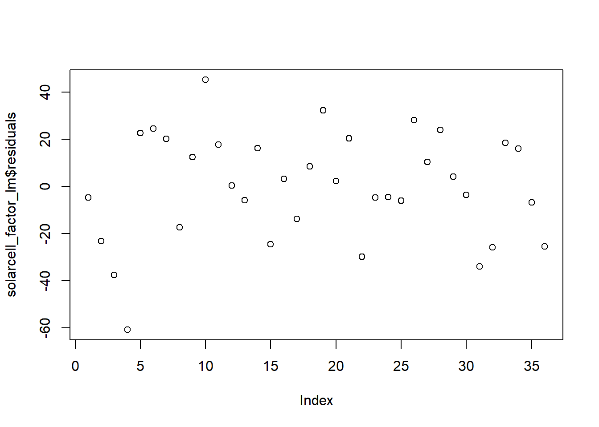
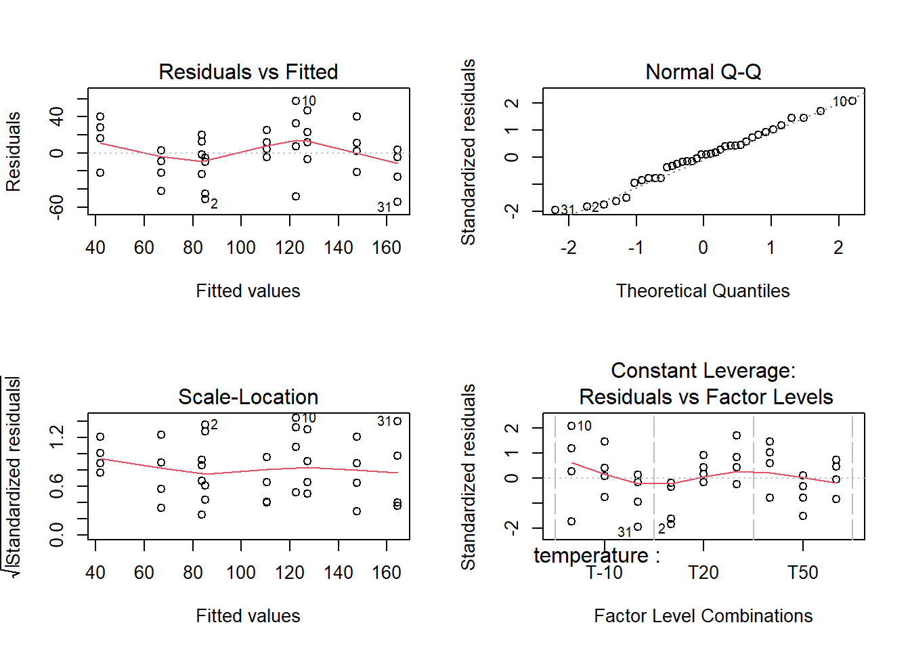

```r
library(tidyverse)
library(readxl)
library(stats)
library(knitr)
library(industRial)
filter <- dplyr::filter
select <- dplyr::select
```

## Interactions

Two factors multiple levels

**The solarcell output test**

<div class="marginnote">

<div class="figure" style="text-align: center">

<p class="caption">(\#fig:unnamed-chunk-3)solar panel test chamber</p>
</div>

</div>

Load and prepare data for analysis:


```r
solarcell_factor <- solarcell_output %>% 
  pivot_longer(
    cols = c("T-10", "T20", "T50"),
    names_to = "temperature",
    values_to = "output"
  ) %>% mutate(across(c(material, temperature), as_factor))
```

### lm with interactions


```r
solarcell_factor_lm <- lm(
  output ~ temperature + material + temperature:material, 
  data = solarcell_factor
  )
summary(solarcell_factor_lm)
```

```

Call:
lm(formula = output ~ temperature + material + temperature:material, 
    data = solarcell_factor)

Residuals:
    Min      1Q  Median      3Q     Max 
-60.750 -14.625   1.375  17.937  45.250 

Coefficients:
                                     Estimate Std. Error t value Pr(>|t|)    
(Intercept)                            134.75      12.99  10.371 6.46e-11 ***
temperatureT20                         -77.50      18.37  -4.218 0.000248 ***
temperatureT50                         -77.25      18.37  -4.204 0.000257 ***
materialchristaline                     21.00      18.37   1.143 0.263107    
materialmultijunction                    9.25      18.37   0.503 0.618747    
temperatureT20:materialchristaline      41.50      25.98   1.597 0.121886    
temperatureT50:materialchristaline     -29.00      25.98  -1.116 0.274242    
temperatureT20:materialmultijunction    79.25      25.98   3.050 0.005083 ** 
temperatureT50:materialmultijunction    18.75      25.98   0.722 0.476759    
---
Signif. codes:  0 '***' 0.001 '**' 0.01 '*' 0.05 '.' 0.1 ' ' 1

Residual standard error: 25.98 on 27 degrees of freedom
Multiple R-squared:  0.7652,	Adjusted R-squared:  0.6956 
F-statistic:    11 on 8 and 27 DF,  p-value: 9.426e-07
```

Looking at the output we see that R-squared is equal to 0.7652. This means about 77 percent of the variability in the battery life is explained by the plate material in the battery, the temperature, and the material type–temperature interaction. We're going to go more in details now to validate the model and understand the effects and interactions of the different factors.

### Outliers and model check 

We start by an assessment of the residuals, starting by the timeseries of residuals:


```r
plot(solarcell_factor_lm$residuals)
```



No specific pattern is apparent so now we check all the remaining plots grouped into one single output:


```r
par(mfrow = c(2,2))
plot(solarcell_factor_lm)
```


Residuals versus fit presents a rather simetrical distribution around zero indicating equality of variances at all levels and the qq plot presents good adherence to the centel line indicating a normal distributed population of residuals, all ok for these. The scale location plot though, shows a center line that is not horizontal which suggest the presence of outliers.

We can extract the absolute maximum residual with:


```r
solarcell_factor_lm$residuals %>% abs() %>% max()
```

```
[1] 60.75
```

Inspecting again the residuals plots we see that this corresponds to the point labeled with 2 for which the standardized value is greater than 2 standard deviations. 

We're therefore apply the outlier test from the car package:

[]{#outlierTest}


```r
library(car)
```


```r
outlierTest(solarcell_factor_lm)
```

```
No Studentized residuals with Bonferroni p < 0.05
Largest |rstudent|:
   rstudent unadjusted p-value Bonferroni p
4 -3.100368          0.0046065      0.16583
```

which gives a high Bonferroni p value thus excluding this possibility.

### Interaction plot 

In this experiement instead of just plotting a linear regression we need to go for a more elaborate plot that shows the response as a function of the two factors. Many different approaches are possible in R and here we're starting with a rather simple one - the interaction plot from the stats package:

[]{#interactionPlot}


```r
interaction.plot(x.factor = solarcell_factor$temperature, 
                 trace.factor = solarcell_factor$material,
                 fun = mean,
                 response = solarcell_factor$output,
                 trace.label = "Material",
                 legend = TRUE,
                 main = "Temperature-Material interaction plot",
                 xlab = "temperature [°C]",
                 ylab = "output [kWh/yr equivalent]")
```


Although simple many important learnings can be extracted from this plot. We get the indication of the mean value of battery life for the different data groups at each temperature level for each material. Also we see immediatly that batteries tend to have longer lifes at lower temperature for all material types. We also see that there is certainly an interaction between material and temperature as the lines cross each other.

### Effects significance

As the R-squared was rather high and there were no issues with residuals we considere the model as acceptable and move ahead with the assessment of the significance of the different effects. For that we apply the anova to the linear model:


```r
solarcell_factor_aov <- aov(solarcell_factor_lm)
summary(solarcell_factor_aov)
```

```
                     Df Sum Sq Mean Sq F value   Pr(>F)    
temperature           2  39119   19559  28.968 1.91e-07 ***
material              2  10684    5342   7.911  0.00198 ** 
temperature:material  4   9614    2403   3.560  0.01861 *  
Residuals            27  18231     675                     
---
Signif. codes:  0 '***' 0.001 '**' 0.01 '*' 0.05 '.' 0.1 ' ' 1
```

We see in the output little stars in front of the p value of the different factors. Three stars for temperature corresponding to an extremely low p value indicating that the means of the lifetime at different levels of temperature are significantly different, confirming that temperature has an effect on lifetime. With a lower significance but still clearly impacting lifetime depends on the material. Finally it is confirmed that there is an interaction between both factors has the temperature:material term has a p value of 0.01861 which us lower than the treshold of 0.05.

The interaction here corresponds to the fact that increasing temperature from 15 to 70 decreases lifetime for material 2 but increases for material 3.

### Removing interaction

Its interesting to consider what would have been the analysis if the interaction was not put in the model. We can easily assess that by creating a new model in R without the temperature:material term.


```r
solarcell_factor_lm_no_int <- lm(
  output ~ temperature + material, data = solarcell_factor)
summary(solarcell_factor_lm_no_int)
```

```

Call:
lm(formula = output ~ temperature + material, data = solarcell_factor)

Residuals:
    Min      1Q  Median      3Q     Max 
-54.389 -21.681   2.694  17.215  57.528 

Coefficients:
                      Estimate Std. Error t value Pr(>|t|)    
(Intercept)             122.47      11.17  10.965 3.39e-12 ***
temperatureT20          -37.25      12.24  -3.044  0.00472 ** 
temperatureT50          -80.67      12.24  -6.593 2.30e-07 ***
materialchristaline      25.17      12.24   2.057  0.04819 *  
materialmultijunction    41.92      12.24   3.426  0.00175 ** 
---
Signif. codes:  0 '***' 0.001 '**' 0.01 '*' 0.05 '.' 0.1 ' ' 1

Residual standard error: 29.97 on 31 degrees of freedom
Multiple R-squared:  0.6414,	Adjusted R-squared:  0.5951 
F-statistic: 13.86 on 4 and 31 DF,  p-value: 1.367e-06
```

The model still presents a reasonably high R-square of 0.64. We now apply the anova on this new model:


```r
battery_aov_no_int <- aov(solarcell_factor_lm_no_int)
summary(battery_aov_no_int)
```

```
            Df Sum Sq Mean Sq F value   Pr(>F)    
temperature  2  39119   19559  21.776 1.24e-06 ***
material     2  10684    5342   5.947  0.00651 ** 
Residuals   31  27845     898                     
---
Signif. codes:  0 '***' 0.001 '**' 0.01 '*' 0.05 '.' 0.1 ' ' 1
```

The output naturally confirms the significance of the effects of the factors, however, as soon as a residual analysis is performed for these data, it becomes clear that the non-interaction model is inadequate:


```r
par(mfrow = c(2,2))
plot(solarcell_factor_lm_no_int)
```


We see in the Residuals vs Fitted a clear pattern with residuals moving from positive to negative and then again to positive along the fitted values axis which indicates that there is an interaction at play.

## Covariance

We assess here the potential utilisation of the analysis of covariance (ancova) in situations where a continuous variable may be influencing the measured value. This technique complements the analysis of variance (anova) allowing for a more accurate assessment of the effects of the categorical variables.

Below a description of the approach taken from [@Montgomery2012], pag.655:

*Suppose that in an experiment with a response variable y there is another variable, say x, and that y is linearly related to x. Furthermore, suppose that x cannot be controlled by the experimenter but can be observed along with y. The variable x is called a covariate or concomitant variable. The analysis of covariance involves adjusting the observed response variable for the effect of the concomitant variable.* 

*If such an adjustment is not performed, the concomitant variable could inflate the error mean square and make true differences in the response due to treatments harder to detect. Thus, the analysis of covariance is a method of adjusting for the effects of an uncontrollable nuisance variable. As we will see, the procedure is a combination of analysis of variance and regression analysis.*

*As an example of an experiment in which the analysis of covariance may be employed, consider a study performed to determine if there is a difference in the strength of a monofilament fiber produced by three different machines. The data from this experiment are shown in Table 15.10 (below). Figure 15.3 presents a scatter diagram of strength (y) versus the diameter (or thickness) of the sample. Clearly, the strength of the fiber is also affected by its thickness; consequently, a thicker fiber will generally be stronger than a thinner one. The analysis of covariance could be used to remove the effect of thickness (x) on strength (y) when testing for differences in strength between machines.*


```r
solarcell_fill %>% 
  kable()
```


|material        | output| fillfactor|
|:---------------|------:|----------:|
|multijunction_A |    108|         20|
|multijunction_A |    123|         25|
|multijunction_A |    117|         24|
|multijunction_A |    126|         25|
|multijunction_A |    147|         32|
|multijunction_B |    120|         22|
|multijunction_B |    144|         28|
|multijunction_B |    117|         22|
|multijunction_B |    135|         30|
|multijunction_B |    132|         28|
|multijunction_C |    105|         21|
|multijunction_C |    111|         23|
|multijunction_C |    126|         26|
|multijunction_C |    102|         21|
|multijunction_C |     96|         15|

Below a plot of strenght by thickness:


```r
solarcell_fill %>%
  ggplot(aes(x = fillfactor, y = output)) +
  geom_point() +
  geom_smooth(method = "lm", se = FALSE) +
  theme_industRial() +
  labs(
    title = "The solarcell output test",
    subtitle = "Output vs Fill Factor",
    x = "Fill factor [%]",
    y = "Output"
  )
```



### Correlation strenght

And a short test to assess the strenght of the correlation:


```r
library(stats)
```

[]{#corTest}


```r
cor.test(solarcell_fill$output, solarcell_fill$fillfactor)
```

```

	Pearson's product-moment correlation

data:  solarcell_fill$output and solarcell_fill$fillfactor
t = 9.8039, df = 13, p-value = 2.263e-07
alternative hypothesis: true correlation is not equal to 0
95 percent confidence interval:
 0.8209993 0.9797570
sample estimates:
     cor 
0.938542 
```

Going further and using the approach from [@Broc2016] I'm faceting the scatterplots to assess if the coefficient of the linear regression is similar for all the levels of the machine factor:


```r
solarcell_fill %>%
  ggplot(aes(x = fillfactor, y = output)) +
  geom_point() +
  geom_smooth(method = "lm", se = FALSE) +
  facet_wrap(vars(material)) +
  theme_industRial() +
  labs(
    title = "The solarcell output test",
    subtitle = "Output vs Fill Factor, by material type",
    x = "Fill factor [%]",
    y = "Output"
  )
```


Visually this is the case, going from one level to the other is not changing the relationship between thickness and strenght - increasing thickness increases stenght. Visually the slopes are similar but the number of points is small. In a real case this verification could be extended with the correlation test for each level or/and a statistical test between slopes.

We're now reproducing in R the ancova case study from the book, still using the aov function.
The way to feed the R function arguments is obtained from https://www.datanovia.com/en/lessons/ancova-in-r/

*Three different machines produce a monofilament fiber for a textile company. The process engineer is interested in determining if there is a difference in the breaking strength of the fiber produced by the three machines. However, the strength of a fiber is related to its diameter, with thicker fibers being generally stronger than thinner ones. A random sample of five fiber specimens is selected from each machine.*

### Ancova

[]{#ancova}


```r
solarcell_ancova <- aov(
  output ~ fillfactor  + material, solarcell_fill
  )
summary(solarcell_ancova)
```

```
            Df Sum Sq Mean Sq F value   Pr(>F)    
fillfactor   1 2746.2  2746.2 119.933 2.96e-07 ***
material     2  119.6    59.8   2.611    0.118    
Residuals   11  251.9    22.9                     
---
Signif. codes:  0 '***' 0.001 '**' 0.01 '*' 0.05 '.' 0.1 ' ' 1
```

> Note that in the formula the covariate goes first (and there is no interaction)! If you do not do this in order, you will get different results.

* material in this table corresponds to the adjusted material mean square

Conclusions from the book in page 662:

*Comparing the adjusted treatment means with the unadjusted treatment means (the y i. ), we note that the adjusted means are much closer together, another indication that the covariance analysis was necessary.*

*A basic assumption in the analysis of covariance is that the treatments do not influence the covariate x because the technique removes the effect of variations in the x i. . However, if the variability in the x i. is due in part to the treatments, then analysis of covariance removes part of the treatment effect. Thus, we must be reasonably sure that the treatments do not affect the values x ij.*

*In some experiments this may be obvious from the nature of the covariate, whereas in others it may be more doubtful. In our example, there may be a difference in fiber diameter (x ij ) between the three machines. In such cases, Cochran and Cox (1957) suggest that an analysis of variance on the x ij values may be helpful in determining the validity of this assumption. ...there is no reason to believe that machines produce fibers of different diameters.*

(I did not go further here as it goes beyond the scope of the assessment)

### Comparison with anova

Below I'm doing the common approach we've been using at NSTC in design of experiments.


```r
solarcell_aov <- aov(output ~ material, solarcell_fill)
summary(solarcell_aov)
```

```
            Df Sum Sq Mean Sq F value Pr(>F)  
material     2   1264   631.8   4.089 0.0442 *
Residuals   12   1854   154.5                 
---
Signif. codes:  0 '***' 0.001 '**' 0.01 '*' 0.05 '.' 0.1 ' ' 1
```

The anova table obtained also corresponds correctly to the book example. 

Montgomery final observations:

*It is interesting to note what would have happened in this experiment if an analysis of covariance had not been performed, that is, if the breaking strength data (y) had been analyzed as a completely randomized single-factor experiment in which the covariate x was ignored. The analysis of variance of the breaking strength data is shown in Table 15.14. We immediately notice that the error estimate is much longer in the CRD analysis (17.17 versus 2.54). This is a reflection of the effectiveness of analysis of covariance in reducing error variability.*

*We would also conclude, based on the CRD analysis, that machines differ significantly in the strength of fiber produced. This is exactly opposite the conclusion reached by the covariance analysis.*

*If we suspected that the machines differed significantly in their effect on fiber strength, then we would try to equalize the strength output of the three machines. However, in this problem the machines do not differ in the strength of fiber produced after the linear effect of fiber diameter is removed. It would be helpful to reduce the within-machine fiber diameter variability because this would probably reduce the strength variability in the fiber.*

Potential applications

In the scope of methods validations this approach could potentially be used in robustness validations when there is suspiction that a continuous variable is disturbing the measurement.

Naturally this should not be applied everywhere but only where there would to be logical a physical or chemical reason behind as in the example with thickness and strenght.
