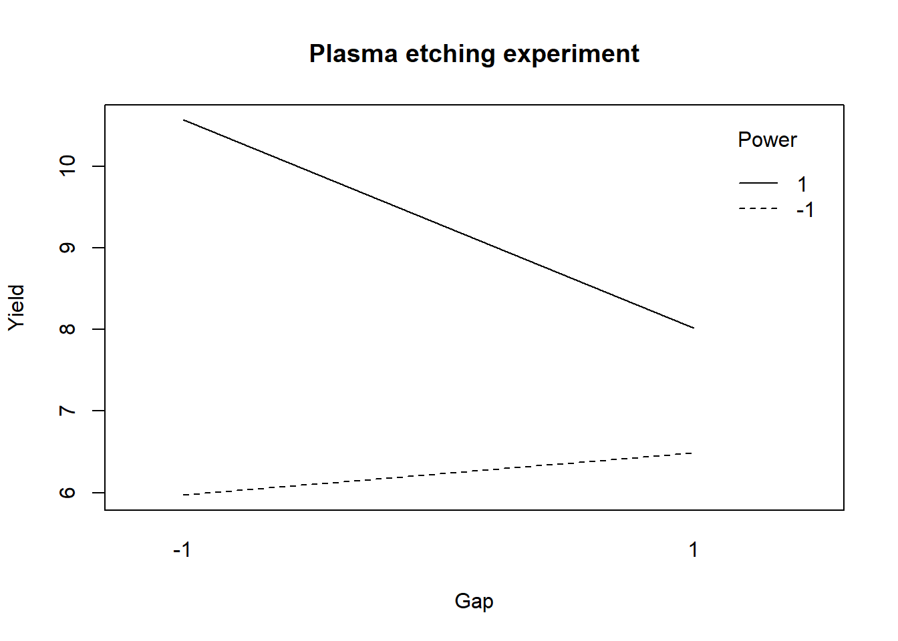

## Two level designs

We may be armed with powerful tools to design and analyze experiments and even have strong knowledge in the topic we're studying but real life in a laboratory or in a factory has many constraints and a DOE is always the reflection of them. The calculation of the number of trials presented in the previous case shows a very quick explosion of the volume of work and material consumption. Another aspect is that as knowledge progresses and findings are accumulated certain variables which present little influence in the outputs start to be discarded. This is a consequence of the sparcity of effects principle. Data and models constructed in several preliminary DOEs can be consolidated under certain conditions. So the design of a new DOE should take into account the design of the previous one and this regarding not only the variables but even the levels themselves. With all these practical considerations in mind it is possible and common to start with very large screening experiments with for instance 10 inputs and 10 outputs and end up with a narrow optimization experiment with 2 factors with 4 levels to select a fine  operating window.

A way to make screening experiments realistic is to limit the number of levels of the factors, the minimum being 2 to have a complete factorial design. Following the notation also presented in the previous case study these designs are called $2^{k}$ designs. Application of linear models and interpretation of anova is subject to the same assumptions as general cases discussed, these being the factors are fixed, the designs are completely randomized, the normality assumptions are satisfied. In particular as there are only 2 levels it is assumed that the response is approximately linear between the factor levels.

In the next case studies we continue follow the same general steps:

* Identify factors
* Estimate factor effects
* Form initial full model
* Check model including residuals
* Assess significance of effects including factor interactions
* Interpret results
* Refine model by removing the non significant effects
* Re-check model
* Draw final conclusions

In this first Case Study dedicated to $2^k$ designs we're going to start by explore the contrasts settings in the linear model functions as the coding of factors becomes a key tool in the linear model construction in R and in the way to use the forecasting tools.

<div class="marginnote">

<b class="highlight">Case study: PET clothing improvement plan</b>

Consumer demand for recycled materials increases requiring clothing manufacturers to develop new products made with innovative and often more expensive raw materials while keeping historical quality levels.


</div>

### Factorial design 2 levels

A materials engineer working in the <b class="highlight">winter sports clothing industry</b> has been working in the development of a recyclable PET. Previous tests have shown promising results on tensile strength, one of the main characteristics required from the raw material. The trade offs between performance, costs and recyclability are not obvious to obtain due to lack of experience and specific know-how. Several one at a time comparisions between supplier deliveries have been done but now she wanted to go further and has established together with the raw material supplier factorial design with two factors presented in the output of the next R chunk. Most of the time process recipes at raw material producer need to are kept confidential for competitive reasons. This makes she only had access to a generic description of the factor levels:

A: bi-axial orientation in production (yes/no)   
B: nucleating agent level (high/low)


```r
library(DoE.base)
```


```r
pet_doe <- fac.design(
  randomize = FALSE,
  factor.names = list(
    A = c("-", "+"), 
    B = c("-", "+"),
    replicate = c("I", "II", "III")
    )
  )
```

After a quick check the plan is confirmed to be ok, she sees all combinations of factors at with 3 replicates. She's not so confortable with such a small number of replicates but as there is no protyping tool in the producers plant they used directly an industrial laminator. Fitting trials in production time is most of the time a big challenge not to mention the cost and the waste in materials. She shares the plan in a meeting and a few weeks later receives the numbers from the producers laboratory in a short e-mail with a list of numbers with no units 64.4, 82.8, 41.4...   

Getting back to her contact at the producer she gets a confirmation these are the PET tensile strength values for each of the trials in the same order as the trial plan was provided. She regrets not having given a number to each trial and asked to have a clear reference of each measured value. She again compromises and colates the values to the original tibble in R:


```r
tensile_strength <- c(
  64.4,82.8,41.4,71.3,57.5,73.6,43.7,69.0,62.1,73.6,52.9,66.7
  )

pet_doe <- bind_cols(
  pet_doe,
  "tensile_strength" = tensile_strength,
)

pet_doe %>%
  head() %>%
  kable()
```


|A  |B  |replicate | tensile_strength|
|:--|:--|:---------|----------------:|
|-  |-  |I         |             64.4|
|+  |-  |I         |             82.8|
|-  |+  |I         |             41.4|
|+  |+  |I         |             71.3|
|-  |-  |II        |             57.5|
|+  |-  |II        |             73.6|

Now she's ready to move ahead by coding properly the factors and input them in the linear model. She's not so used to DOEs with coded factors so she tries three different approaches: a first one with the factors labeled plus/minus, a second one with the factors labeled +1/-1 and a third one with the factors as +1/-1 but numeric. She ends up choosing this last option which seems more natural for forecasting.

### Coding levels {#coding_levels}

#### Factors as +/-


```r
pet_plusminus <- pet_doe
pet_plusminus$A <- relevel(pet_plusminus$A, ref = "+")
pet_plusminus$B <- relevel(pet_plusminus$B, ref = "+")
```

For the first model the materials engineer made a copy of the original dataset and left the input variables as they were generated which is as factors and with the labels "plus" and "minus". After some playing with data she found necessary to put the "plus" as the reference otherwise she gets inverted signs in the lm output. 

Another detail she needed to take care was the setup of the contrasts. As the design is ortogonal and she wanted the contrasts to add up to zero she had to precise by assigning `contr.sum` to the factor. First she checked the original definition of the contrasts:


```r
contrasts(pet_plusminus$A)
```

```
  -
+ 0
- 1
```

The original/default setting is `contr.treatm` as seen in the corresponding unit and she changed this with:


```r
contrasts(pet_plusminus$A) <- "contr.sum"
contrasts(pet_plusminus$B) <- "contr.sum"
contrasts(pet_plusminus$A)
```

```
  [,1]
+    1
-   -1
```

```r
contrasts(pet_plusminus$B)
```

```
  [,1]
+    1
-   -1
```

Having confirmed that the sum of the contrast is zero she establishes the linear model and makes a prediction to check the output:


```r
pet_plusminus_lm <- lm(
  formula = tensile_strength ~ A * B, 
  data = pet_plusminus
  )
summary(pet_plusminus_lm)
```

```

Call:
lm.default(formula = tensile_strength ~ A * B, data = pet_plusminus)

Residuals:
   Min     1Q Median     3Q    Max 
 -4.60  -3.07  -1.15   2.49   6.90 

Coefficients:
            Estimate Std. Error t value Pr(>|t|)    
(Intercept)    63.25       1.31   48.14  3.8e-11 ***
A1              9.58       1.31    7.29  8.4e-05 ***
B1             -5.75       1.31   -4.38   0.0024 ** 
A1:B1           1.92       1.31    1.46   0.1828    
---
Signif. codes:  0 '***' 0.001 '**' 0.01 '*' 0.05 '.' 0.1 ' ' 1

Residual standard error: 4.55 on 8 degrees of freedom
Multiple R-squared:  0.903,	Adjusted R-squared:  0.867 
F-statistic: 24.8 on 3 and 8 DF,  p-value: 0.000209
```

```r
predict(pet_plusminus_lm, newdata = list(A = "+", B = "+"))
```

```
 1 
69 
```

#### Factors as +/- 1


```r
coded <- function(x) { ifelse(x == x[1], -1, 1) }

pet_doe <- pet_doe %>% mutate(cA = coded(A), cB = coded(B))
pet_plusminus1 <- pet_doe %>% mutate(across(c(cA, cB), as_factor))
pet_plusminus1$cA <- relevel(pet_plusminus1$cA, ref = "1")
pet_plusminus1$cB <- relevel(pet_plusminus1$cB, ref = "1")

pet_plusminus1 %>%
  head(3) %>%
  kable(align = "c")
```


| A | B | replicate | tensile_strength | cA | cB |
|:-:|:-:|:---------:|:----------------:|:--:|:--:|
| - | - |     I     |       64.4       | -1 | -1 |
| + | - |     I     |       82.8       | 1  | -1 |
| - | + |     I     |       41.4       | -1 | 1  |

The second approach she tries is to convert the levels to +1/-1 still leaving them coded as factors. This notation is easier for her as it corresponds to a common way she sees in the Yates tables. Again she had to relevel the factors to get the max as reference in order to get the same coefficients on the linear model. Regarding the contrasts she goes for the simpler and more direct approach now by defining them directly in the lm() function.


```r
pet_plusminus1_lm <- lm(
  formula = tensile_strength ~ cA * cB, 
  data = pet_plusminus1,
  contrasts = list(cA = "contr.sum", cB = "contr.sum")
  )
summary(pet_plusminus1_lm)
```

```

Call:
lm.default(formula = tensile_strength ~ cA * cB, data = pet_plusminus1, 
    contrasts = list(cA = "contr.sum", cB = "contr.sum"))

Residuals:
   Min     1Q Median     3Q    Max 
 -4.60  -3.07  -1.15   2.49   6.90 

Coefficients:
            Estimate Std. Error t value Pr(>|t|)    
(Intercept)    63.25       1.31   48.14  3.8e-11 ***
cA1             9.58       1.31    7.29  8.4e-05 ***
cB1            -5.75       1.31   -4.38   0.0024 ** 
cA1:cB1         1.92       1.31    1.46   0.1828    
---
Signif. codes:  0 '***' 0.001 '**' 0.01 '*' 0.05 '.' 0.1 ' ' 1

Residual standard error: 4.55 on 8 degrees of freedom
Multiple R-squared:  0.903,	Adjusted R-squared:  0.867 
F-statistic: 24.8 on 3 and 8 DF,  p-value: 0.000209
```

```r
predict(pet_plusminus1_lm, newdata = list(cA = "1", cB = "1"))
```

```
 1 
69 
```

Note that a coefficient in a regression equation is the change in the response when the corresponding variable changes by +1. Special attention to the + and - needs to be taken with the R output. As A or B changes from its low level to its high level, the coded variable changes by 1 − (−1) = +2, so the change in the response is twice the regression coefficient.

So the effects and interaction(s) from their minumum to their maximum correspond to  twice the values in the “Estimate” column. These regression coefficients are often called effects and interactions, even though they differ from the definitions used in the designs themeselves.

#### Factors as +/- 1 numeric


```r
pet_num <- pet_doe %>% mutate(cA = coded(A), cB = coded(B))
pet_num_lm <- lm(
  formula = tensile_strength ~ cA * cB, 
  data = pet_num
  )
summary(pet_num_lm)
```

```

Call:
lm.default(formula = tensile_strength ~ cA * cB, data = pet_num)

Residuals:
   Min     1Q Median     3Q    Max 
 -4.60  -3.07  -1.15   2.49   6.90 

Coefficients:
            Estimate Std. Error t value Pr(>|t|)    
(Intercept)    63.25       1.31   48.14  3.8e-11 ***
cA              9.58       1.31    7.29  8.4e-05 ***
cB             -5.75       1.31   -4.38   0.0024 ** 
cA:cB           1.92       1.31    1.46   0.1828    
---
Signif. codes:  0 '***' 0.001 '**' 0.01 '*' 0.05 '.' 0.1 ' ' 1

Residual standard error: 4.55 on 8 degrees of freedom
Multiple R-squared:  0.903,	Adjusted R-squared:  0.867 
F-statistic: 24.8 on 3 and 8 DF,  p-value: 0.000209
```

```r
predict(pet_num_lm, newdata = list(cA = 1, cB = 1))
```

```
 1 
69 
```

Finaly the materials engineer coded the levels with +1/-1 but left the variables with type numeric. In this case she did not define any contrasts. Looking into the lm and prediction she confirms having obtained exactly the same outputs.

As the inputs are coded as numeric this behaves just like the predictions with the first linear model studied in our book. Note that we feed the predictions function with numeric values. This is very intuitive as it corresponds to the original units of the experiments (also called natural or engineering units). On the other hand coding the design variables provides another advange: generally, the engineering units are not directly comparable while coded variables are very effective for determining the relative size of factor effects.

Coding the design factors has the benefit of enabling a direct comparison of the effect sizes and we can see that these three ways of coding the variable levels lead to equivalent results both in lm and prediction. Her preference goes to using numeric values as it is more intuitive and allows for easier prediction between the fixed levels. 

In order to better visualize the coding of factors she established a simple regression plot of the data. Note that she had to extract the data from the S3 doe object, which we've done with using unclass() and then as_tibble()


```r
pet_num %>% 
  unclass() %>% 
  as_tibble() %>%
  mutate(cA = coded(A), cB = coded(B)) %>%
  pivot_longer(
    cols = c("cA", "cB"),
    names_to = "variable",
    values_to = "level") %>% 
  ggplot() +
  geom_point(aes(x = level, y = tensile_strength)) +
  geom_smooth(aes(x = level, y = tensile_strength), 
              method = "lm", se = FALSE, fullrange = TRUE) +
  facet_wrap(vars(variable))
```


From the `lm()` summary she remembers that the intercept passes at 27.5 and she replorts now to putting the B factor at its maximum:


```r
pet_num %>% 
  unclass() %>%
  as_tibble() %>%
  mutate(cA = coded(A), cB = coded(B)) %>%
  filter(cB == 1) %>%
  pivot_longer(
    cols = c("cA", "cB"),
    names_to = "variable",
    values_to = "level") %>% 
  ggplot() +
  geom_point(aes(x = level, y = tensile_strength)) +
  geom_smooth(aes(x = level, y = tensile_strength), 
              method = "lm", se = FALSE, fullrange = TRUE) +
  coord_cartesian(xlim = c(-2, 2)) +
  scale_y_continuous(n.breaks = 10) +
  facet_wrap(vars(variable))
```


The plot confirms that the output of the prediction is 69 corresponding to the max level of A when B is also at the max. Mathematically she confirms this result by multiplying all the linear regression coefficients by the levels of the factors as : $63.250 + 9.583 \times (+1) - 5.750 \times (+1) + 1.917 = 69$

### Interaction plots with SE {#plotMeans}


```r
library(RcmdrMisc)
```


```r
par(mfrow = c(1,1), bty = "l")
plotMeans(response = pet_doe$tensile_strength,
          factor1 = pet_doe$A,
          xlab = "A: bi-axial orientation in production (yes/no)",
          factor2 = pet_doe$B,
          legend.lab = "B: nucleating agent (high/low)",
          ylab = "Tensile Strenght [Mpa]",
          error.bars = "se",
          col = viridis::viridis(12)[4],
          legend.pos = "bottomright",
          main = "The PET clothing improvement plan")
```


Now she want to get quickly an interaction plot but including error bars. Unfortunately the base R `interaction.plot()` doesn't provide it and the `ggplot2()` made it to long. With a quick check on Stackoverflow she discovered this simple approach with the function `plotMeans()` from the package {RcmdrMisc} and she gets the plot dine with standard error as argument for the `error.bars` argument.

As expected she confirms that both treatments provide an visible effect on Tensile strenght and that there is no interaction between them.

<div class="marginnote>

<b class="highlight">Case study: lithium-ion battery charging time</b>

</div>

A - temperature 
B - previous cycles (within warranty)
C - voltage
response - charging time [h]


```r
battery_charging %>%
  head() %>%
  kable()
```


|  A|  B|  C|  D| Replicate| charging_time|
|--:|--:|--:|--:|---------:|-------------:|
| -1| -1| -1| -1|         1|          5.50|
|  1| -1| -1| -1|         1|          6.69|
| -1|  1| -1| -1|         1|          6.33|
|  1|  1| -1| -1|         1|          6.42|
| -1| -1|  1| -1|         1|         10.37|
|  1| -1|  1| -1|         1|          7.49|


```r
battery_lm <- lm(
  formula = charging_time ~ A * B * C, 
  data = battery_charging
  )
summary(battery_lm)
```

```

Call:
lm.default(formula = charging_time ~ A * B * C, data = battery_charging)

Residuals:
   Min     1Q Median     3Q    Max 
-2.095 -1.002 -0.529  0.929  2.982 

Coefficients:
            Estimate Std. Error t value Pr(>|t|)    
(Intercept)   7.4116     0.2654   27.92  < 2e-16 ***
A             0.3147     0.2654    1.19  0.24737    
B             0.0684     0.2654    0.26  0.79872    
C             1.0403     0.2654    3.92  0.00065 ***
A:B          -0.0872     0.2654   -0.33  0.74539    
A:C          -0.8091     0.2654   -3.05  0.00553 ** 
B:C           0.0259     0.2654    0.10  0.92296    
A:B:C         0.0328     0.2654    0.12  0.90264    
---
Signif. codes:  0 '***' 0.001 '**' 0.01 '*' 0.05 '.' 0.1 ' ' 1

Residual standard error: 1.5 on 24 degrees of freedom
Multiple R-squared:  0.522,	Adjusted R-squared:  0.383 
F-statistic: 3.75 on 7 and 24 DF,  p-value: 0.00696
```


```r
battery_aov <- aov(battery_lm)
summary(battery_aov)
```

```
            Df Sum Sq Mean Sq F value  Pr(>F)    
A            1    3.2     3.2    1.41 0.24737    
B            1    0.1     0.1    0.07 0.79872    
C            1   34.6    34.6   15.36 0.00065 ***
A:B          1    0.2     0.2    0.11 0.74539    
A:C          1   20.9    20.9    9.29 0.00553 ** 
B:C          1    0.0     0.0    0.01 0.92296    
A:B:C        1    0.0     0.0    0.02 0.90264    
Residuals   24   54.1     2.3                    
---
Signif. codes:  0 '***' 0.001 '**' 0.01 '*' 0.05 '.' 0.1 ' ' 1
```

The main effects of Gap and Power are highly significant (both have very small P-values). The AC interaction is also highly significant; thus, there is a strong interaction between Gap and Power.

### Adjusted R-squared {#adj_Rsquare}

The ordinary R^2 is 0.9661 and it measures the proportion of total variability explained by the model. A potential problem with this statistic is that it always increases as factors are added to the model, even if these factors are not significant. The adjusted R^2 is obtained by dividing the Sums of Squares by the degrees of freedom, and is adjusted for the size of the model, that is the number of factors.


```r
battery_reduced_lm <- lm(
  formula = charging_time ~ A + C + A:C, 
  data = battery_charging
  )
summary(battery_reduced_lm)
```

```

Call:
lm.default(formula = charging_time ~ A + C + A:C, data = battery_charging)

Residuals:
   Min     1Q Median     3Q    Max 
-2.146 -0.995 -0.458  0.865  2.905 

Coefficients:
            Estimate Std. Error t value Pr(>|t|)    
(Intercept)    7.412      0.247   30.04  < 2e-16 ***
A              0.315      0.247    1.28  0.21266    
C              1.040      0.247    4.22  0.00023 ***
A:C           -0.809      0.247   -3.28  0.00279 ** 
---
Signif. codes:  0 '***' 0.001 '**' 0.01 '*' 0.05 '.' 0.1 ' ' 1

Residual standard error: 1.4 on 28 degrees of freedom
Multiple R-squared:  0.519,	Adjusted R-squared:  0.467 
F-statistic: 10.1 on 3 and 28 DF,  p-value: 0.000116
```

Besides the base summary() function, R squared and adjusted R squared can also be easily retrieved with the glance function from the {broom} package. We're extracting them here for the complete and for reduced model:


```r
glance(battery_lm)[1:2] %>%
  bind_rows(glance(battery_reduced_lm)[1:2], 
            .id = "model")
```

```
# A tibble: 2 x 3
  model r.squared adj.r.squared
  <chr>     <dbl>         <dbl>
1 1         0.522         0.383
2 2         0.519         0.467
```

Adjusted R² has improved. Removing the nonsignificant terms from the full model has produced a final model that is likely to function more effectively as a predictor of new data.

### Coding inputs {#coding_inputs}

Now that we have model often we will want to predict the response at a certainly specific level between the coded factor levels of $\pm$ 1.

To do that we need to convert that specific the natural value into a coded value. Lets calculate the coded value for the factor A (gap) of which the natural value is nA = 0.9, between the natural levels of nA = 0.8 and nA = 1.2. We choose to do this for a fixed level of C of 1, corresponding to its maximum of 325W.


```r
natural2coded <- function(xA, lA, hA) {(xA - (lA + hA) / 2) / ((hA -  lA) / 2)}
```


```r
# Converting natural value xA into coded value cA:
lA <- 0.8
hA <- 1.2
xA <- 0.9

cA <- natural2coded(xA, lA, hA)
cA
```

```
[1] -0.5
```

To be noted that the opposite conversion looks like:


```r
coded2natural <- function(cA, lA, hA) {cA * ((hA - lA) / 2) + ((lA + hA)/2)} 
```


```r
# Converting back the coded value cA into its natural value xA
lA <- 0.8
hA <- 1.2
cA <- -0.5

nA <- coded2natural(cA, lA, hA)
nA
```

```
[1] 0.9
```

### Coded prediction {#coded_prediction}

And now we can feed our linear model and make predictions:


```r
battery_new <- tibble(A = cA, C = 1)
pA <- predict(battery_reduced_lm, battery_new)
pA
```

```
     1 
8.6991 
```

We can visualize this outcome as follows:


```r
battery_charging %>%
  filter(C == 1) %>%
  ggplot() +
  geom_point(aes(x = A, y = charging_time, color = as_factor(C))) +
  geom_smooth(aes(x = A, y = charging_time), method = "lm") +
  geom_point(aes(x = cA, y = pA)) +
  scale_y_continuous(n.breaks = 10) + 
  scale_color_discrete(guide = FALSE) +
  theme(plot.title = ggtext::element_markdown()) +
  labs(
    title = "3^k factorial design",
    subtitle = "Prediction with reduced model")
```


We are introducing here response surface plots which is yet another way to visualize the experiment outputs as a function of the inputs. We're doing this with the persp() function from the {rsm} package which provides an extremely fast rendering, easy parametrization and a readable output. To be noted that this function is an extension of the base R persp() consisting from the R point of view in an S3 method for the lm class. This allows to simply provide directly the lm object to the function to obtain the response surface.

### Perspective plot {#persp}


```r
library(rsm)
```


```r
persp(
  battery_reduced_lm, 
  A ~ C, 
  bounds = list(A = c(-1,1), C = c(-1,1)),
  col = viridis(12)[8],
  theta = -40, phi = 20, r = 5,
  zlab = "Charging Time",
  main = "Lithium-ion battery\ncharging time test"
)
```


Due to the interaction between factors A and C the surface is slightly bent. This is exactly what we observe in the interactions plots of which the one below corresponds to slicing the surface at the min and the max of Power:


```r
interaction.plot(x.factor = battery_charging$C, 
                 trace.factor = battery_charging$A,
                 fun = mean,
                 response = battery_charging$charging_time,
                 legend = TRUE,
                 xlab = "C",
                 trace.label = "A",
                 lwd = 2,
                 col = c(viridis(12)[10], col = viridis(12)[6]),
                 ylab = "Charging Time",
                 main = "Lithium-ion battery\ncharging time test")
```


Just like in the surface plot we can see here in the interaction plot that the response of yield on gap is different depending on the level of power. When power is high it decreases and when power is low it increases. As a reminder this is what is called an interaction between these two factors.

## Single replicate designs

**The lithium-ion battery charging time test (cont.)**

m factors 2 levels 

Possible approaches:
- graphical methods–normal and half-normal probability plots; no formal tests;
- assume some high-order interactions are zero, and fit a model that excludes them; degrees of freedom go into error, so testing is possible (not recommended)

<div class="marginnote">


</div>


```r
battery_charging %>%
  filter((Replicate == 1)) %>%
  head()
```

```
# A tibble: 6 x 6
      A     B     C     D Replicate charging_time
  <dbl> <dbl> <dbl> <dbl>     <dbl>         <dbl>
1    -1    -1    -1    -1         1          5.5 
2     1    -1    -1    -1         1          6.69
3    -1     1    -1    -1         1          6.33
4     1     1    -1    -1         1          6.42
5    -1    -1     1    -1         1         10.4 
6     1    -1     1    -1         1          7.49
```


```r
battery_lm3 <- lm(
  formula = charging_time ~ A * B * C * D, 
  data = battery_charging %>% filter(Replicate == 1))
summary(battery_lm3)
```

```

Call:
lm.default(formula = charging_time ~ A * B * C * D, data = battery_charging %>% 
    filter(Replicate == 1))

Residuals:
ALL 16 residuals are 0: no residual degrees of freedom!

Coefficients:
            Estimate Std. Error t value Pr(>|t|)
(Intercept)   7.7606         NA      NA       NA
A            -0.5081         NA      NA       NA
B             0.0369         NA      NA       NA
C             1.5306         NA      NA       NA
D             0.1556         NA      NA       NA
A:B          -0.1244         NA      NA       NA
A:C          -0.7681         NA      NA       NA
B:C          -0.0106         NA      NA       NA
A:D           0.1244         NA      NA       NA
B:D          -0.0556         NA      NA       NA
C:D           0.1606         NA      NA       NA
A:B:C         0.0281         NA      NA       NA
A:B:D         0.0856         NA      NA       NA
A:C:D         0.1844         NA      NA       NA
B:C:D         0.0369         NA      NA       NA
A:B:C:D      -0.0369         NA      NA       NA

Residual standard error: NaN on 0 degrees of freedom
Multiple R-squared:     1,	Adjusted R-squared:   NaN 
F-statistic:  NaN on 15 and 0 DF,  p-value: NA
```

We can see that being a single replicate design no statistics have been calculated for the effects in the model. A recommended approach in this case is to look into the normal probability plot of the model effects. 

Here we are going to prepare this plot with the function qqPlot() from the {car} package:

### Effects normal plot {#qqPlot}


```r
library(car)
```


```r
battery_eff3 <- battery_lm3$coefficients[2:16]
battery_eff_names2 <- names((battery_lm3$coefficients)[2:16])
main_effects_plot <- qqPlot(
  battery_eff3, envelope = 0.70, 
  id = list(
    method = "y", n = 5, cex = 1, col = carPalette()[1], location = "lr"), 
    grid = FALSE,
  col = "black",
  col.lines = "black",
  main = "Chemical vessel - Normal plot of effects 2"
  )
```



In plot we can see that the effects that have the highest influence on the output are the effects A, C and D and their interactions. We can still confirm these observations with a calculation of the percentage contribution of each effect as follows:

### Effects contribution table {#effects_contribution}


```r
battery_lm_tidy3 <- battery_lm3 %>%
  tidy() %>%
  filter(term != "(Intercept)") %>%
  mutate(
    effect_estimate = -2 * estimate,
    effect_estimate_sum = sum(effect_estimate), 
    effect_contribution_perc = abs((effect_estimate/effect_estimate_sum)*100) %>%
      round(2)
  )
battery_lm_tidy3 %>%
  select(term, effect_estimate, effect_contribution_perc) %>%
  arrange(desc(effect_contribution_perc)) %>%
  head(8) %>%
  kable()
```


|term  | effect_estimate| effect_contribution_perc|
|:-----|---------------:|------------------------:|
|C     |        -3.06125|                   182.35|
|A:C   |         1.53625|                    91.51|
|A     |         1.01625|                    60.54|
|A:C:D |        -0.36875|                    21.97|
|C:D   |        -0.32125|                    19.14|
|D     |        -0.31125|                    18.54|
|A:B   |         0.24875|                    14.82|
|A:D   |        -0.24875|                    14.82|

Reduced model

Following the previous analysis we are removing the factor B from the model and keeping only the 2nd order interactions assuming the system also respects the sparcity of effects principle.


```r
battery_red_lm3 <- lm(
  formula = charging_time ~ A + C + A:C, 
  data = battery_charging)
summary(battery_red_lm3)
```

```

Call:
lm.default(formula = charging_time ~ A + C + A:C, data = battery_charging)

Residuals:
   Min     1Q Median     3Q    Max 
-2.146 -0.995 -0.458  0.865  2.905 

Coefficients:
            Estimate Std. Error t value Pr(>|t|)    
(Intercept)    7.412      0.247   30.04  < 2e-16 ***
A              0.315      0.247    1.28  0.21266    
C              1.040      0.247    4.22  0.00023 ***
A:C           -0.809      0.247   -3.28  0.00279 ** 
---
Signif. codes:  0 '***' 0.001 '**' 0.01 '*' 0.05 '.' 0.1 ' ' 1

Residual standard error: 1.4 on 28 degrees of freedom
Multiple R-squared:  0.519,	Adjusted R-squared:  0.467 
F-statistic: 10.1 on 3 and 28 DF,  p-value: 0.000116
```

We can now see that we've regained degrees of freedom and obtained a sort of hidden replication allowing to calculate statistics and error terms on the model.

Residuals analysis

Checking the residuals we see the significant effect of the remaining interactions. The residuals are not completely normal but the in the standardized residuals the deviations are contained within 1.2 sd.


```r
par(mfrow = c(2,2))
plot(battery_red_lm3)
```


We can now establish the main effects and interaction plots and conclude on the optimal settings to maximize the output: A and D should be on the max and C on the min.

