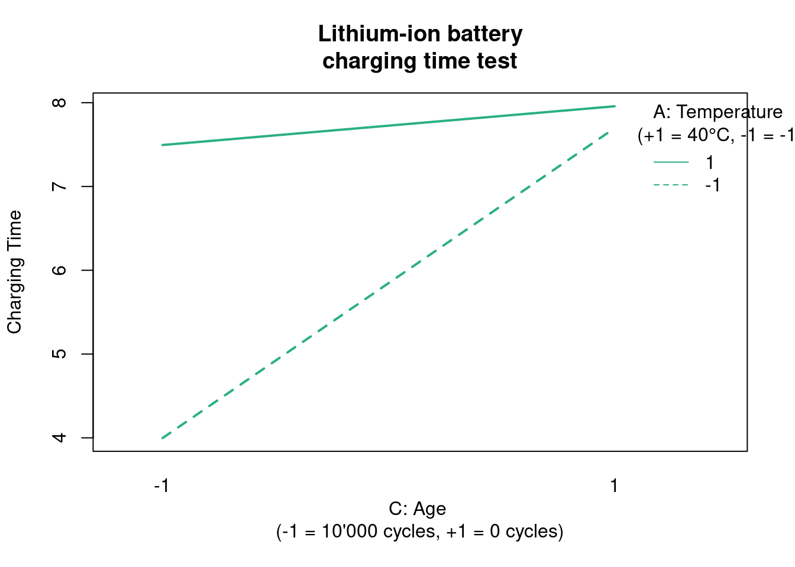

## Two level designs

Coding factors

2 factors 2 levels

The $2^{k}$ designs are particularly useful in the early stages of experimental work when many factors are likely to be investigated. It provides the smallest number of runs with which k factors can be studied in a complete factorial design. Consequently, these designs are widely used in factor screening experiments.

The validity of the analysis depends on the following assumptions:

* the factors are fixed
* the designs are completely randomized
* the usual normality assumptions are satisfied
* the response is approximately linear over the range of the factor levels chosen

Analysis Procedure for a 2 k Design

1. Estimate factor effects
2. Form initial model (full model)
  a. If the design is replicated, fit the full model
  b. If there is no replication, form the model using a normal probability plot of the effects
3. Perform statistical testing (Anova)
4. Refine model (remove non significant effects)
5. Analyze residuals
6. Interpret results

DEF - Sparsity of effects principle: most systems are dominated by some of the main effects and low-order interactions, and most high-order interactions are negligible.

In this first Case Study dedicated to $2^k$ designs we're going to explore the contrasts settings in the linear model functions.

**The PET clothing improvement plan**

In this case study factors have only 2 levels. 

Below we start by preparing our dataset:


```r
library(DoE.base)
```


```r
pet_doe <- fac.design(
  randomize = FALSE,
  factor.names=list(A=c("-","+"), 
                    B=c("-","+"),
                    replicate = c("I", "II", "III"))
  )
```


```r
tensile_strength <- c(64.4,82.8,41.4,71.3,57.5,73.6,43.7,69.0,62.1,73.6,52.9,66.7)

pet_doe <- bind_cols(
  pet_doe,
  "tensile_strength" = tensile_strength,
)
```

### Coding levels {#coding_levels}

Factors as +/-

In this first model we're using a design where the inputs levels have been defined as plus and minus, sometimes also called high and low. The actual naming is not important, what is critical is to ensure that those input parameters are coded as factors. 


```r
pet_fct <- pet_doe %>%
  mutate(across(c(A,B), as_factor))
```

Another detail is to put the higher level as the reference otherwise we will get inverted signs in the lm output:


```r
pet_fct$A <- relevel(pet_fct$A, ref="+")
pet_fct$B <- relevel(pet_fct$B, ref="+")
```


and one final step is need which is the setup of the contrasts. As our design is ortogonal and we want the contrasts to add up to zero we have to indicate that on the factor so that the coefficients of the linear model are correctly calculated. The current definition of the contrasts is:


```r
contrasts(pet_fct$A)
```

```
  -
+ 0
- 1
```

So we change this with:


```r
contrasts(pet_fct$A) <- "contr.sum"
contrasts(pet_fct$B) <- "contr.sum"
contrasts(pet_fct$A)
```

```
  [,1]
+    1
-   -1
```

```r
contrasts(pet_fct$A)
```

```
  [,1]
+    1
-   -1
```

Now we can run our linear model:


```r
pet_ctr_lm <- lm(
  formula = tensile_strength ~ A * B, 
  data = pet_fct
  )
summary(pet_ctr_lm)
```

```

Call:
lm.default(formula = tensile_strength ~ A * B, data = pet_fct)

Residuals:
   Min     1Q Median     3Q    Max 
-4.600 -3.067 -1.150  2.492  6.900 

Coefficients:
            Estimate Std. Error t value Pr(>|t|)    
(Intercept)   63.250      1.314  48.135 3.84e-11 ***
A1             9.583      1.314   7.293 8.44e-05 ***
B1            -5.750      1.314  -4.376  0.00236 ** 
A1:B1          1.917      1.314   1.459  0.18278    
---
Signif. codes:  0 '***' 0.001 '**' 0.01 '*' 0.05 '.' 0.1 ' ' 1

Residual standard error: 4.552 on 8 degrees of freedom
Multiple R-squared:  0.903,	Adjusted R-squared:  0.8666 
F-statistic: 24.82 on 3 and 8 DF,  p-value: 0.0002093
```

We can observe in the output that the p value of the effects is the same in the lm and in the the aov functions. This confirms that the contrasts have been correctly specified with contr.sum

Note that we've had to adjust the contrasts in the lm function with contr.sum which applies to cases where the sum of the contrasts is zero (the R default is contr.treatment which applies to cases where the levels are coded as 0 and 1).

and now going to apply a prediction:


```r
predict(pet_ctr_lm, newdata = list(A = "+", B = "+"))
```

```
 1 
69 
```

Factors as +/- 1

In this example we convert the levels to factors still using the +/-1 notation. This will also be helpfull to apply what are called the Yates tables.


```r
coded <- function(x) { ifelse(x == x[1], -1, 1) }
```

We again convert them to factors and put the upper level as the reference. Regarding the contrasts we show a simpler and more direct approach now by defining them directly in the lm() function.


```r
pet_fct <- pet_fct %>% mutate(cA = coded(A), cB = coded(B))
pet_fct2 <- pet_fct %>% mutate(across(c(cA, cB), as_factor))
pet_fct2$cA <- relevel(pet_fct2$cA, ref = "1")
pet_fct2$cB <- relevel(pet_fct2$cB, ref = "1")

pet_ctr2_lm <- lm(
  formula = tensile_strength ~ cA * cB, 
  data = pet_fct2,
  contrasts = list(cA = "contr.sum", cB = "contr.sum")
  )
summary(pet_ctr2_lm)
```

```

Call:
lm.default(formula = tensile_strength ~ cA * cB, data = pet_fct2, 
    contrasts = list(cA = "contr.sum", cB = "contr.sum"))

Residuals:
   Min     1Q Median     3Q    Max 
-4.600 -3.067 -1.150  2.492  6.900 

Coefficients:
            Estimate Std. Error t value Pr(>|t|)    
(Intercept)   63.250      1.314  48.135 3.84e-11 ***
cA1            9.583      1.314   7.293 8.44e-05 ***
cB1           -5.750      1.314  -4.376  0.00236 ** 
cA1:cB1        1.917      1.314   1.459  0.18278    
---
Signif. codes:  0 '***' 0.001 '**' 0.01 '*' 0.05 '.' 0.1 ' ' 1

Residual standard error: 4.552 on 8 degrees of freedom
Multiple R-squared:  0.903,	Adjusted R-squared:  0.8666 
F-statistic: 24.82 on 3 and 8 DF,  p-value: 0.0002093
```

Note that a coefficient in a regression equation is the change in the response when the corresponding variable changes by +1. Special attention to the + and - needs to be taken with the R output.

As A or B changes from its low level to its high level, the coded variable changes by 1 − (−1) = +2, so the change in the response is twice the regression coefficient.

So the effects and interaction(s) from their minumum to their maximum correspond to  twice the values in the “Estimate” column. These regression coefficients are often called effects and interactions, even though they differ from the definitions used in the designs themeselves.

Checking now with coded factors:


```r
predict(pet_ctr2_lm, newdata = list(cA = "1", cB = "1"))
```

```
 1 
69 
```

Factors as +/- 1 numeric

In this example we're going to code the levels with +1/-1 but we're going use the numeric coding:


```r
pet_num <- pet_fct %>% mutate(cA = coded(A), cB = coded(B))
pet_num_lm <- lm(
  formula = tensile_strength ~ cA * cB, 
  data = pet_num
  )
summary(pet_num_lm)
```

```

Call:
lm.default(formula = tensile_strength ~ cA * cB, data = pet_num)

Residuals:
   Min     1Q Median     3Q    Max 
-4.600 -3.067 -1.150  2.492  6.900 

Coefficients:
            Estimate Std. Error t value Pr(>|t|)    
(Intercept)   63.250      1.314  48.135 3.84e-11 ***
cA             9.583      1.314   7.293 8.44e-05 ***
cB            -5.750      1.314  -4.376  0.00236 ** 
cA:cB          1.917      1.314   1.459  0.18278    
---
Signif. codes:  0 '***' 0.001 '**' 0.01 '*' 0.05 '.' 0.1 ' ' 1

Residual standard error: 4.552 on 8 degrees of freedom
Multiple R-squared:  0.903,	Adjusted R-squared:  0.8666 
F-statistic: 24.82 on 3 and 8 DF,  p-value: 0.0002093
```

In this case we did not define any contrasts. Looking into the lm We can see we've obtained exactly the same outputs.


```r
predict(pet_num_lm, newdata = list(cA = 1, cB = 1))
```

```
 1 
69 
```

As the inputs are coded as numeric this behaves just like the first simple linear model we've seen in the Case Study on One Factor with Multiple levels. In particular when we feed the predictions function with numeric values.

This is very intuitive as it corresponds to the original units of the experiments (also called natural or engineering units). On the other hand coding the design variables provides another advange: generally, the engineering units are not directly comparable while coded variables are very effective for determining the relative size of factor effects.

We can see that these three ways of coding the variable levels lead to equivalent results both in lm and prediction. Our preference goes to use numeric values as it is more intuitive and allows for easier prediction between the fixed levels. 

And now in order to better understand the coding of factors in this unit, we're going to establish a simple regression plot of our data:


```r
pet_num %>% 
  unclass() %>% 
  as_tibble() %>%
  mutate(cA = coded(A), cB = coded(B)) %>%
  pivot_longer(
    cols = c("cA", "cB"),
    names_to = "variable",
    values_to = "level") %>% 
  ggplot() +
  geom_point(aes(x = level, y = tensile_strength)) +
  geom_smooth(aes(x = level, y = tensile_strength), 
              method = "lm", se = FALSE, fullrange = TRUE) +
  facet_wrap(vars(variable))
```


Note that we had to extract the data from the S3 doe object, which we've done with using unclass() and then as_tibble()

The intercept passes at 27.5 as seen on the lm summary. We're going now to put the B factor at its maximum and replot:


```r
pet_num %>% 
  unclass() %>%
  as_tibble() %>%
  mutate(cA = coded(A), cB = coded(B)) %>%
  filter(cB == 1) %>%
  pivot_longer(
    cols = c("cA", "cB"),
    names_to = "variable",
    values_to = "level") %>% 
  ggplot() +
  geom_point(aes(x = level, y = tensile_strength)) +
  geom_smooth(aes(x = level, y = tensile_strength), 
              method = "lm", se = FALSE, fullrange = TRUE) +
  coord_cartesian(xlim = c(-2, 2)) +
  scale_y_continuous(n.breaks = 10) +
  facet_wrap(vars(variable))
```


As seen on the plot the output of our prediction is 69 corresponding the high level of A when B is at 1. To be precise we need to multiply all the coefficients by the levels of the factors as : 63.250 + 9.583x(+1) - 5.750x(+1) + 1.917

### Interaction plots with SE {#plotMeans}

Here we're making a step further in the representation of interaction plots, we're adding error bars to the means. There are many ways to do this and we're providing a simple approach with the function plotMeans from the package RcmdrMisc.


```r
library(RcmdrMisc)
```

We select standard error as argument for the error.bars argument.


```r
par(mfrow = c(1,1), bty = "l")
plotMeans(response = pet_fct$tensile_strength,
          factor2 = pet_fct$A,
          factor1 = pet_fct$B,
          error.bars = "se",
          xlab = "A - Reactant",
          legend.lab = "B - Catalist\n(error bars +/-se)",
          ylab = "Tensile Strenght",
          col = viridis::viridis(12)[4],
          legend.pos = "bottomright",
          main = "The PET clothing improvement plan")
```


3 factors 2 levels

**The lithium-ion battery charging time test**

A - temperature 
B - previous cycles (within warranty)
C - voltage
response - charging time [h]


```r
battery_charging %>%
  head() %>%
  kable()
```


|  A|  B|  C|  D| Replicate| charging_time|
|--:|--:|--:|--:|---------:|-------------:|
| -1| -1| -1| -1|         1|          5.50|
|  1| -1| -1| -1|         1|          6.69|
| -1|  1| -1| -1|         1|          6.33|
|  1|  1| -1| -1|         1|          6.42|
| -1| -1|  1| -1|         1|         10.37|
|  1| -1|  1| -1|         1|          7.49|


```r
battery_lm <- lm(
  formula = charging_time ~ A * B * C, 
  data = battery_charging
  )
summary(battery_lm)
```

```

Call:
lm.default(formula = charging_time ~ A * B * C, data = battery_charging)

Residuals:
    Min      1Q  Median      3Q     Max 
-2.0950 -1.0025 -0.5288  0.9287  2.9825 

Coefficients:
            Estimate Std. Error t value Pr(>|t|)    
(Intercept)  7.41156    0.26542  27.924  < 2e-16 ***
A            0.31469    0.26542   1.186 0.247370    
B            0.06844    0.26542   0.258 0.798720    
C            1.04031    0.26542   3.920 0.000646 ***
A:B         -0.08719    0.26542  -0.328 0.745387    
A:C         -0.80906    0.26542  -3.048 0.005532 ** 
B:C          0.02594    0.26542   0.098 0.922963    
A:B:C        0.03281    0.26542   0.124 0.902640    
---
Signif. codes:  0 '***' 0.001 '**' 0.01 '*' 0.05 '.' 0.1 ' ' 1

Residual standard error: 1.501 on 24 degrees of freedom
Multiple R-squared:  0.5225,	Adjusted R-squared:  0.3832 
F-statistic: 3.751 on 7 and 24 DF,  p-value: 0.006963
```


```r
battery_aov <- aov(battery_lm)
summary(battery_aov)
```

```
            Df Sum Sq Mean Sq F value   Pr(>F)    
A            1   3.17    3.17   1.406 0.247370    
B            1   0.15    0.15   0.066 0.798720    
C            1  34.63   34.63  15.363 0.000646 ***
A:B          1   0.24    0.24   0.108 0.745387    
A:C          1  20.95   20.95   9.292 0.005532 ** 
B:C          1   0.02    0.02   0.010 0.922963    
A:B:C        1   0.03    0.03   0.015 0.902640    
Residuals   24  54.10    2.25                     
---
Signif. codes:  0 '***' 0.001 '**' 0.01 '*' 0.05 '.' 0.1 ' ' 1
```

The main effects of Gap and Power are highly significant (both have very small P-values). The AC interaction is also highly significant; thus, there is a strong interaction between Gap and Power.

### Adjusted R-squared {#adj_Rsquare}

The ordinary R^2 is 0.9661 and it measures the proportion of total variability explained by the model. A potential problem with this statistic is that it always increases as factors are added to the model, even if these factors are not significant. The adjusted R^2 is obtained by dividing the Sums of Squares by the degrees of freedom, and is adjusted for the size of the model, that is the number of factors.


```r
battery_reduced_lm <- lm(
  formula = charging_time ~ A + C + A:C, 
  data = battery_charging
  )
summary(battery_reduced_lm)
```

```

Call:
lm.default(formula = charging_time ~ A + C + A:C, data = battery_charging)

Residuals:
    Min      1Q  Median      3Q     Max 
-2.1463 -0.9950 -0.4575  0.8650  2.9050 

Coefficients:
            Estimate Std. Error t value Pr(>|t|)    
(Intercept)   7.4116     0.2467  30.037  < 2e-16 ***
A             0.3147     0.2467   1.275 0.212663    
C             1.0403     0.2467   4.216 0.000235 ***
A:C          -0.8091     0.2467  -3.279 0.002786 ** 
---
Signif. codes:  0 '***' 0.001 '**' 0.01 '*' 0.05 '.' 0.1 ' ' 1

Residual standard error: 1.396 on 28 degrees of freedom
Multiple R-squared:  0.5185,	Adjusted R-squared:  0.4669 
F-statistic: 10.05 on 3 and 28 DF,  p-value: 0.0001157
```

Besides the base summary() function, R squared and adjusted R squared can also be easily retrieved with the glance function from the {broom} package. We're extracting them here for the complete and for reduced model:


```r
glance(battery_lm)[1:2] %>%
  bind_rows(glance(battery_reduced_lm)[1:2], 
            .id = "model")
```

```
# A tibble: 2 x 3
  model r.squared adj.r.squared
  <chr>     <dbl>         <dbl>
1 1         0.522         0.383
2 2         0.519         0.467
```

Adjusted R² has improved. Removing the nonsignificant terms from the full model has produced a final model that is likely to function more effectively as a predictor of new data.

### Coding inputs {#coding_inputs}

Now that we have model often we will want to predict the response at a certainly specific level between the coded factor levels of $\pm$ 1.

To do that we need to convert that specific the natural value into a coded value. Lets calculate the coded value for the factor A (gap) of which the natural value is nA = 0.9, between the natural levels of nA = 0.8 and nA = 1.2. We choose to do this for a fixed level of C of 1, corresponding to its maximum of 325W.


```r
natural2coded <- function(xA, lA, hA) {(xA - (lA + hA) / 2) / ((hA -  lA) / 2)}
```


```r
# Converting natural value xA into coded value cA:
lA <- 0.8
hA <- 1.2
xA <- 0.9

cA <- natural2coded(xA, lA, hA)
cA
```

```
[1] -0.5
```

To be noted that the opposite conversion looks like:


```r
coded2natural <- function(cA, lA, hA) {cA * ((hA - lA) / 2) + ((lA + hA)/2)} 
```


```r
# Converting back the coded value cA into its natural value xA
lA <- 0.8
hA <- 1.2
cA <- -0.5

nA <- coded2natural(cA, lA, hA)
nA
```

```
[1] 0.9
```

### Coded prediction {#coded_prediction}

And now we can feed our linear model and make predictions:


```r
battery_new <- tibble(A = cA, C = 1)
pA <- predict(battery_reduced_lm, battery_new)
pA
```

```
       1 
8.699062 
```

We can visualize this outcome as follows:


```r
battery_charging %>%
  filter(C == 1) %>%
  ggplot() +
  geom_point(aes(x = A, y = charging_time, color = as_factor(C))) +
  geom_smooth(aes(x = A, y = charging_time), method = "lm") +
  geom_point(aes(x = cA, y = pA)) +
  scale_y_continuous(n.breaks = 10) + 
  scale_color_discrete(guide = FALSE) +
  theme(plot.title = ggtext::element_markdown()) +
  labs(
    title = "3^k factorial design",
    subtitle = "Prediction with reduced model")
```



## Response surface

We are introducing here response surface plots which is yet another way to visualize the experiment outputs as a function of the inputs. We're doing this with the persp() function from the {rsm} package which provides an extremely fast rendering, easy parametrization and a readable output. To be noted that this function is an extension of the base R persp() consisting from the R point of view in an S3 method for the lm class. This allows to simply provide directly the lm object to the function to obtain the response surface.

### Perspective plot {#persp}


```r
library(rsm)
```


```r
persp(
  battery_reduced_lm, 
  A ~ C, 
  bounds = list(A = c(-1,1), C = c(-1,1)),
  col = viridis(12)[8],
  theta = -40, phi = 20, r = 5,
  zlab = "Charging Time",
  main = "Lithium-ion battery\ncharging time test"
)
```


Due to the interaction between factors A and C the surface is slightly bent. This is exactly what we observe in the interactions plots of which the one below corresponds to slicing the surface at the min and the max of Power:


```r
interaction.plot(x.factor = battery_charging$C, 
                 trace.factor = battery_charging$A,
                 fun = mean,
                 response = battery_charging$charging_time,
                 legend = TRUE,
                 xlab = "C",
                 trace.label = "A",
                 lwd = 2,
                 col = c(viridis(12)[10], col = viridis(12)[6]),
                 ylab = "Charging Time",
                 main = "Lithium-ion battery\ncharging time test")
```


Just like in the surface plot we can see here in the interaction plot that the response of yield on gap is different depending on the level of power. When power is high it decreases and when power is low it increases. As a reminder this is what is called an interaction between these two factors.

## Single replicate designs

**The lithium-ion battery charging time test (cont.)**

m factors 2 levels 

Possible approaches:
- graphical methods–normal and half-normal probability plots; no formal tests;
- assume some high-order interactions are zero, and fit a model that excludes them; degrees of freedom go into error, so testing is possible (not recommended)

<div class="marginnote">

<div class="figure" style="text-align: center">

<p class="caption">(\#fig:unnamed-chunk-34)electrical car platform</p>
</div>

</div>


```r
battery_charging %>%
  filter((Replicate == 1)) %>%
  head()
```

```
# A tibble: 6 x 6
      A     B     C     D Replicate charging_time
  <dbl> <dbl> <dbl> <dbl>     <dbl>         <dbl>
1    -1    -1    -1    -1         1          5.5 
2     1    -1    -1    -1         1          6.69
3    -1     1    -1    -1         1          6.33
4     1     1    -1    -1         1          6.42
5    -1    -1     1    -1         1         10.4 
6     1    -1     1    -1         1          7.49
```


```r
battery_lm3 <- lm(
  formula = charging_time ~ A * B * C * D, 
  data = battery_charging %>% filter(Replicate == 1))
summary(battery_lm3)
```

```

Call:
lm.default(formula = charging_time ~ A * B * C * D, data = battery_charging %>% 
    filter(Replicate == 1))

Residuals:
ALL 16 residuals are 0: no residual degrees of freedom!

Coefficients:
            Estimate Std. Error t value Pr(>|t|)
(Intercept)  7.76062         NA      NA       NA
A           -0.50812         NA      NA       NA
B            0.03688         NA      NA       NA
C            1.53063         NA      NA       NA
D            0.15563         NA      NA       NA
A:B         -0.12438         NA      NA       NA
A:C         -0.76813         NA      NA       NA
B:C         -0.01062         NA      NA       NA
A:D          0.12437         NA      NA       NA
B:D         -0.05563         NA      NA       NA
C:D          0.16062         NA      NA       NA
A:B:C        0.02812         NA      NA       NA
A:B:D        0.08562         NA      NA       NA
A:C:D        0.18438         NA      NA       NA
B:C:D        0.03688         NA      NA       NA
A:B:C:D     -0.03688         NA      NA       NA

Residual standard error: NaN on 0 degrees of freedom
Multiple R-squared:      1,	Adjusted R-squared:    NaN 
F-statistic:   NaN on 15 and 0 DF,  p-value: NA
```

We can see that being a single replicate design no statistics have been calculated for the effects in the model. A recommended approach in this case is to look into the normal probability plot of the model effects. 

Here we are going to prepare this plot with the function qqPlot() from the {car} package:

### Effects normal plot {#qqPlot}


```r
library(car)
```


```r
battery_eff3 <- battery_lm3$coefficients[2:16]
battery_eff_names2 <- names((battery_lm3$coefficients)[2:16])
main_effects_plot <- qqPlot(
  battery_eff3, envelope = 0.70, 
  id = list(
    method = "y", n = 5, cex = 1, col = carPalette()[1], location = "lr"), 
    grid = FALSE,
  col = "black",
  col.lines = "black",
  main = "Chemical vessel - Normal plot of effects 2"
  )
```


In plot we can see that the effects that have the highest influence on the output are the effects A, C and D and their interactions. We can still confirm these observations with a calculation of the percentage contribution of each effect as follows:

### Effects contribution table {#effects_contribution}


```r
battery_lm_tidy3 <- battery_lm3 %>%
  tidy() %>%
  filter(term != "(Intercept)") %>%
  mutate(
    effect_estimate = -2 * estimate,
    effect_estimate_sum = sum(effect_estimate), 
    effect_contribution_perc = abs((effect_estimate/effect_estimate_sum)*100) %>%
      round(2)
  )
battery_lm_tidy3 %>%
  select(term, effect_estimate, effect_contribution_perc) %>%
  arrange(desc(effect_contribution_perc)) %>%
  head(8) %>%
  kable()
```


|term  | effect_estimate| effect_contribution_perc|
|:-----|---------------:|------------------------:|
|C     |        -3.06125|                   182.35|
|A:C   |         1.53625|                    91.51|
|A     |         1.01625|                    60.54|
|A:C:D |        -0.36875|                    21.97|
|C:D   |        -0.32125|                    19.14|
|D     |        -0.31125|                    18.54|
|A:B   |         0.24875|                    14.82|
|A:D   |        -0.24875|                    14.82|

Reduced model

Following the previous analysis we are removing the factor B from the model and keeping only the 2nd order interactions assuming the system also respects the sparcity of effects principle.


```r
battery_red_lm3 <- lm(
  formula = charging_time ~ A + C + A:C, 
  data = battery_charging)
summary(battery_red_lm3)
```

```

Call:
lm.default(formula = charging_time ~ A + C + A:C, data = battery_charging)

Residuals:
    Min      1Q  Median      3Q     Max 
-2.1463 -0.9950 -0.4575  0.8650  2.9050 

Coefficients:
            Estimate Std. Error t value Pr(>|t|)    
(Intercept)   7.4116     0.2467  30.037  < 2e-16 ***
A             0.3147     0.2467   1.275 0.212663    
C             1.0403     0.2467   4.216 0.000235 ***
A:C          -0.8091     0.2467  -3.279 0.002786 ** 
---
Signif. codes:  0 '***' 0.001 '**' 0.01 '*' 0.05 '.' 0.1 ' ' 1

Residual standard error: 1.396 on 28 degrees of freedom
Multiple R-squared:  0.5185,	Adjusted R-squared:  0.4669 
F-statistic: 10.05 on 3 and 28 DF,  p-value: 0.0001157
```

We can now see that we've regained degrees of freedom and obtained a sort of hidden replication allowing to calculate statistics and error terms on the model.

Residuals analysis

Checking the residuals we see the significant effect of the remaining interactions. The residuals are not completely normal but the in the standardized residuals the deviations are contained within 1.2 sd.


```r
par(mfrow = c(2,2))
plot(battery_red_lm3)
```


We can now establish the main effects and interaction plots and conclude on the optimal settings to maximize the output: A and D should be on the max and C on the min.

