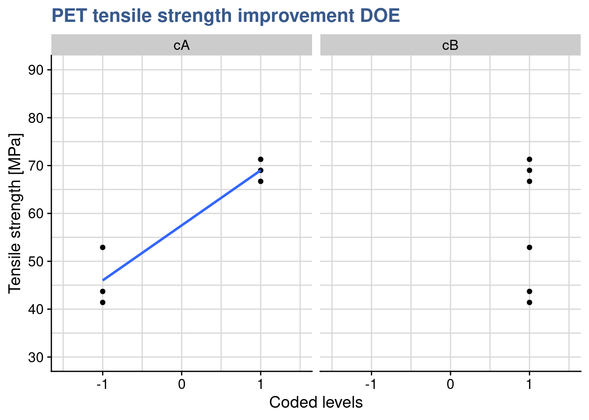
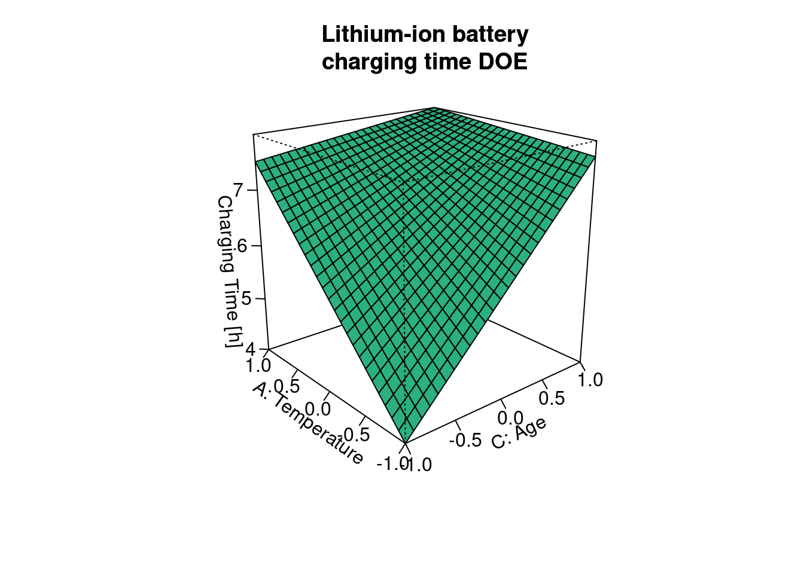

## Two level designs

We may be armed with powerful tools to design and analyze experiments and even have strong knowledge in the topic we're studying but real life in a laboratory or in a factory has many constraints and a DOE is always the reflection of them. The calculation of the number of trials presented in the previous case shows a very quick explosion of the volume of work and material consumption. Another aspect is that as knowledge progresses and findings are accumulated certain variables which present little influence in the outputs start to be discarded. This is a consequence of the sparcity of effects principle. Data and models constructed in several preliminary DOEs can be consolidated under certain conditions. So the design of a new DOE should take into account the design of the previous one and this regarding not only the variables but even the levels themselves. With all these practical considerations in mind it is possible and common to start with very large screening experiments with for instance 10 inputs and 10 outputs and end up with a narrow optimization experiment with 2 factors with 4 levels to select a fine  operating window.

A way to make screening experiments realistic is to limit the number of levels of the factors, the minimum being 2 to have a complete factorial design. Following the notation also presented in the previous case study these designs are called $2^{k}$ designs. Application of linear models and interpretation of anova is subject to the same assumptions as general cases discussed, these being the factors are fixed, the designs are completely randomized, the normality assumptions are satisfied. In particular as there are only 2 levels it is assumed that the response is approximately linear between the factor levels.

In the next case studies we continue follow the same general steps:

* Identify factors
* Estimate factor effects
* Form initial full model
* Check model including residuals
* Assess significance of effects including factor interactions
* Interpret results
* Refine model by removing the non significant effects
* Re-check model
* Draw final conclusions

In this first Case Study dedicated to $2^k$ designs we're going to start by explore the contrasts settings in the linear model functions as the coding of factors becomes a key tool in the linear model construction in R and in the way to use the forecasting tools.

<div class="marginnote">

<b class="highlight">Case study: PET clothing improvement plan</b>

Consumer demand for recycled materials increases requiring clothing manufacturers to develop new products made with innovative and often more expensive raw materials while keeping historical quality levels.


</div>

### Factorial design 2 levels

A materials engineer working in the <b class="highlight">winter sports clothing industry</b> has been working in the development of a recyclable PET. Previous tests have shown promising results on tensile strength, one of the main characteristics required from the raw material. The trade offs between performance, costs and recyclability are not obvious to obtain due to lack of experience and specific know-how. Several one at a time comparisions between supplier deliveries have been done but now she wanted to go further and has established together with the raw material supplier factorial design with two factors presented in the output of the next R chunk. Most of the time process recipes at raw material producer need to are kept confidential for competitive reasons. This makes she only had access to a generic description of the factor levels:

A: bi-axial orientation in production (yes/no)   
B: nucleating agent level (high/low)


```r
library(DoE.base)
```


```r
pet_doe <- fac.design(
  randomize = FALSE,
  factor.names = list(
    A = c("-", "+"), 
    B = c("-", "+"),
    replicate = c("I", "II", "III")
    )
  )
```

After a quick check the plan is confirmed to be ok, she sees all combinations of factors at with 3 replicates. She's not so confortable with such a small number of replicates but as there is no protyping tool in the producers plant they used directly an industrial laminator. Fitting trials in production time is most of the time a big challenge not to mention the cost and the waste in materials. She shares the plan in a meeting and a few weeks later receives the numbers from the producers laboratory in a short e-mail with a list of numbers with no units 64.4, 82.8, 41.4...   

Getting back to her contact at the producer she gets a confirmation these are the PET tensile strength values for each of the trials in the same order as the trial plan was provided. She regrets not having given a number to each trial and asked to have a clear reference of each measured value. She again compromises and colates the values to the original tibble in R:


```r
tensile_strength <- c(
  64.4,82.8,41.4,71.3,57.5,73.6,43.7,69.0,62.1,73.6,52.9,66.7
  )

pet_doe <- bind_cols(
  pet_doe,
  "tensile_strength" = tensile_strength,
)

pet_doe %>%
  head() %>%
  kable()
```


|A  |B  |replicate | tensile_strength|
|:--|:--|:---------|----------------:|
|-  |-  |I         |             64.4|
|+  |-  |I         |             82.8|
|-  |+  |I         |             41.4|
|+  |+  |I         |             71.3|
|-  |-  |II        |             57.5|
|+  |-  |II        |             73.6|

Now she's ready to move ahead by coding properly the factors and input them in the linear model. She's not so used to DOEs with coded factors so she tries three different approaches: a first one with the factors labeled plus/minus, a second one with the factors labeled +1/-1 and a third one with the factors as +1/-1 but numeric. She ends up choosing this last option which seems more natural for forecasting.

### Coding levels {#coding_levels}

#### Factors as +/-


```r
pet_plusminus <- pet_doe
pet_plusminus$A <- relevel(pet_plusminus$A, ref = "+")
pet_plusminus$B <- relevel(pet_plusminus$B, ref = "+")
```

For the first model the materials engineer made a copy of the original dataset and left the input variables as they were generated which is as factors and with the labels "plus" and "minus". After some playing with data she found necessary to put the "plus" as the reference otherwise she gets inverted signs in the lm output. 

Another detail she needed to take care was the setup of the contrasts. As the design is ortogonal and she wanted the contrasts to add up to zero she had to precise by assigning `contr.sum` to the factor. First she checked the original definition of the contrasts:


```r
contrasts(pet_plusminus$A)
```

```
  -
+ 0
- 1
```

The original/default setting is `contr.treatm` as seen in the corresponding unit and she changed this with:


```r
contrasts(pet_plusminus$A) <- "contr.sum"
contrasts(pet_plusminus$B) <- "contr.sum"
contrasts(pet_plusminus$A)
```

```
  [,1]
+    1
-   -1
```

```r
contrasts(pet_plusminus$B)
```

```
  [,1]
+    1
-   -1
```

Having confirmed that the sum of the contrast is zero she establishes the linear model and makes a prediction to check the output:


```r
pet_plusminus_lm <- lm(
  formula = tensile_strength ~ A * B, 
  data = pet_plusminus
  )
summary(pet_plusminus_lm)
```

```

Call:
lm.default(formula = tensile_strength ~ A * B, data = pet_plusminus)

Residuals:
   Min     1Q Median     3Q    Max 
 -4.60  -3.07  -1.15   2.49   6.90 

Coefficients:
            Estimate Std. Error t value Pr(>|t|)    
(Intercept)    63.25       1.31   48.14  3.8e-11 ***
A1              9.58       1.31    7.29  8.4e-05 ***
B1             -5.75       1.31   -4.38   0.0024 ** 
A1:B1           1.92       1.31    1.46   0.1828    
---
Signif. codes:  0 '***' 0.001 '**' 0.01 '*' 0.05 '.' 0.1 ' ' 1

Residual standard error: 4.55 on 8 degrees of freedom
Multiple R-squared:  0.903,	Adjusted R-squared:  0.867 
F-statistic: 24.8 on 3 and 8 DF,  p-value: 0.000209
```

```r
predict(pet_plusminus_lm, newdata = list(A = "+", B = "+"))
```

```
 1 
69 
```

#### Factors as +/- 1


```r
coded <- function(x) { ifelse(x == x[1], -1, 1) }

pet_doe <- pet_doe %>% mutate(cA = coded(A), cB = coded(B))
pet_plusminus1 <- pet_doe %>% mutate(across(c(cA, cB), as_factor))
pet_plusminus1$cA <- relevel(pet_plusminus1$cA, ref = "1")
pet_plusminus1$cB <- relevel(pet_plusminus1$cB, ref = "1")

pet_plusminus1 %>%
  head(3) %>%
  kable(align = "c")
```


| A | B | replicate | tensile_strength | cA | cB |
|:-:|:-:|:---------:|:----------------:|:--:|:--:|
| - | - |     I     |       64.4       | -1 | -1 |
| + | - |     I     |       82.8       | 1  | -1 |
| - | + |     I     |       41.4       | -1 | 1  |

The second approach she tries is to convert the levels to +1/-1 still leaving them coded as factors. This notation is easier for her as it corresponds to a common way she sees in the Yates tables. Again she had to relevel the factors to get the max as reference in order to get the same coefficients on the linear model. Regarding the contrasts she goes for the simpler and more direct approach now by defining them directly in the lm() function.


```r
pet_plusminus1_lm <- lm(
  formula = tensile_strength ~ cA * cB, 
  data = pet_plusminus1,
  contrasts = list(cA = "contr.sum", cB = "contr.sum")
  )
summary(pet_plusminus1_lm)
```

```

Call:
lm.default(formula = tensile_strength ~ cA * cB, data = pet_plusminus1, 
    contrasts = list(cA = "contr.sum", cB = "contr.sum"))

Residuals:
   Min     1Q Median     3Q    Max 
 -4.60  -3.07  -1.15   2.49   6.90 

Coefficients:
            Estimate Std. Error t value Pr(>|t|)    
(Intercept)    63.25       1.31   48.14  3.8e-11 ***
cA1             9.58       1.31    7.29  8.4e-05 ***
cB1            -5.75       1.31   -4.38   0.0024 ** 
cA1:cB1         1.92       1.31    1.46   0.1828    
---
Signif. codes:  0 '***' 0.001 '**' 0.01 '*' 0.05 '.' 0.1 ' ' 1

Residual standard error: 4.55 on 8 degrees of freedom
Multiple R-squared:  0.903,	Adjusted R-squared:  0.867 
F-statistic: 24.8 on 3 and 8 DF,  p-value: 0.000209
```

```r
predict(pet_plusminus1_lm, newdata = list(cA = "1", cB = "1"))
```

```
 1 
69 
```

Note that a coefficient in a regression equation is the change in the response when the corresponding variable changes by +1. Special attention to the + and - needs to be taken with the R output. As A or B changes from its high level to its low level, the coded variable changes by 1 − (−1) = +2, so the change in the response from the min to the max is twice the regression coefficient.

So the effects and interaction(s) from their minumum to their maximum correspond to  twice the values in the “Estimate” column. These regression coefficients are often called effects and interactions, even though they differ from the definitions used in the designs themeselves.

#### Factors as +/- 1 numeric


```r
pet_num <- pet_doe %>% mutate(cA = coded(A), cB = coded(B))
pet_num_lm <- lm(
  formula = tensile_strength ~ cA * cB, 
  data = pet_num
  )
summary(pet_num_lm)
```

```

Call:
lm.default(formula = tensile_strength ~ cA * cB, data = pet_num)

Residuals:
   Min     1Q Median     3Q    Max 
 -4.60  -3.07  -1.15   2.49   6.90 

Coefficients:
            Estimate Std. Error t value Pr(>|t|)    
(Intercept)    63.25       1.31   48.14  3.8e-11 ***
cA              9.58       1.31    7.29  8.4e-05 ***
cB             -5.75       1.31   -4.38   0.0024 ** 
cA:cB           1.92       1.31    1.46   0.1828    
---
Signif. codes:  0 '***' 0.001 '**' 0.01 '*' 0.05 '.' 0.1 ' ' 1

Residual standard error: 4.55 on 8 degrees of freedom
Multiple R-squared:  0.903,	Adjusted R-squared:  0.867 
F-statistic: 24.8 on 3 and 8 DF,  p-value: 0.000209
```

```r
predict(pet_num_lm, newdata = list(cA = 1, cB = 1))
```

```
 1 
69 
```

Finaly the materials engineer coded the levels with +1/-1 but left the variables with type numeric. In this case she did not define any contrasts. Looking into the lm and prediction she confirms having obtained exactly the same outputs.

As the inputs are coded as numeric this behaves just like the predictions with the first linear model studied in our book. Note that we feed the predictions function with numeric values. This is very intuitive as it corresponds to the original units of the experiments (also called natural or engineering units). On the other hand coding the design variables provides another advange: generally, the engineering units are not directly comparable while coded variables are very effective for determining the relative size of factor effects.

Coding the design factors has the benefit of enabling a direct comparison of the effect sizes and we can see that these three ways of coding the variable levels lead to equivalent results both in lm and prediction. Her preference goes to using numeric values as it is more intuitive and allows for easier prediction between the fixed levels. 

In order to better visualize the coding of factors she established a simple regression plot of the data. Note that she had to extract the data from the S3 doe object, which we've done with using unclass() and then as_tibble()


```r
pet_num %>% 
  unclass() %>% 
  as_tibble() %>%
  mutate(cA = coded(A), cB = coded(B)) %>%
  pivot_longer(
    cols = c("cA", "cB"),
    names_to = "variable",
    values_to = "level") %>% 
  ggplot() +
  geom_point(aes(x = level, y = tensile_strength)) +
  geom_smooth(aes(x = level, y = tensile_strength), 
              method = "lm", se = FALSE, fullrange = TRUE) +
  coord_cartesian(xlim = c(-1.5, 1.5), ylim = c(30, 90)) +
  scale_y_continuous(n.breaks = 10) +
  facet_wrap(vars(variable)) +
  labs(
    title = "PET tensile strenght improvement DOE",
    y = "Tensile strenght [MPa]",
    x = "Coded levels"
  )
```


From the `lm()` summary she remembers that the intercept passes at 27.5 and she replorts now to putting the B factor at its maximum:


```r
pet_num %>% 
  unclass() %>%
  as_tibble() %>%
  mutate(cA = coded(A), cB = coded(B)) %>%
  filter(cB == 1) %>%
  pivot_longer(
    cols = c("cA", "cB"),
    names_to = "variable",
    values_to = "level") %>% 
  ggplot() +
  geom_point(aes(x = level, y = tensile_strength)) +
  geom_smooth(aes(x = level, y = tensile_strength), 
              method = "lm", se = FALSE, fullrange = TRUE) +
  coord_cartesian(xlim = c(-1.5, 1.5), ylim = c(30, 90)) +
  scale_y_continuous(n.breaks = 10) +
  facet_wrap(vars(variable)) +
  labs(
    title = "PET tensile strenght improvement DOE",
    y = "Tensile strenght [MPa]",
    x = "Coded levels"
  )
```



The plot confirms that the output of the prediction is 69 corresponding to the max level of A when B is also at the max. Mathematically she confirms this result by multiplying all the linear regression coefficients by the levels of the factors as : $63.250 + 9.583 \times (+1) - 5.750 \times (+1) + 1.917 = 69$

### Interaction plots with SE {#plotMeans}


```r
library(RcmdrMisc)
```


```r
par(mfrow = c(1,1), bty = "l")
plotMeans(response = pet_doe$tensile_strength,
          factor1 = pet_doe$A,
          xlab = "A: bi-axial orientation in production (yes/no)",
          factor2 = pet_doe$B,
          legend.lab = "B: nucleating agent (high/low)",
          ylab = "Tensile Strenght [Mpa]",
          error.bars = "se",
          col = viridis::viridis(12)[4],
          legend.pos = "bottomright",
          main = "The PET clothing improvement plan")
```


```r
dev.off() 
```

```
null device 
          1 
```

Now she want to get quickly an interaction plot but including error bars. Unfortunately the base R `interaction.plot()` doesn't provide it and the `ggplot2()` made it to long. With a quick check on Stackoverflow she discovered this simple approach with the function `plotMeans()` from the package {RcmdrMisc} and she gets the plot dine with standard error as argument for the `error.bars` argument.

As expected she confirms that both treatments provide an visible effect on Tensile strenght and that there is no interaction between them.

### Adjusted R-squared {#adj_Rsquare}

<div class="marginnote">

<b class="highlight">Case study: lithium-ion battery charging time</b>

The global transition to full electrical car is well underway and there's a global trend in legislating towards the end of fossil fuel cars. The challenge of authonomy has been brought to acceptable levels with the extensive deployment of electric charging stations but engineering teams still face complex problems such as the charging time. At a pioneering manufacturer another DOE is underway to get it optimized.


</div>


```r
battery_lm <- lm(
  formula = charging_time ~ A * B * C, 
  data = battery_charging
  )
summary(battery_lm)
```

```

Call:
lm.default(formula = charging_time ~ A * B * C, data = battery_charging)

Residuals:
   Min     1Q Median     3Q    Max 
-2.595 -1.076 -0.450  0.965  4.155 

Coefficients:
            Estimate Std. Error t value Pr(>|t|)    
(Intercept)    6.787      0.325   20.89   <2e-16 ***
A              0.940      0.325    2.89   0.0080 ** 
B             -0.182      0.325   -0.56   0.5813    
C              1.040      0.325    3.20   0.0038 ** 
A:B            0.163      0.325    0.50   0.6208    
A:C           -0.809      0.325   -2.49   0.0201 *  
B:C           -0.349      0.325   -1.07   0.2932    
A:B:C          0.408      0.325    1.26   0.2214    
---
Signif. codes:  0 '***' 0.001 '**' 0.01 '*' 0.05 '.' 0.1 ' ' 1

Residual standard error: 1.84 on 24 degrees of freedom
Multiple R-squared:  0.54,	Adjusted R-squared:  0.405 
F-statistic: 4.02 on 7 and 24 DF,  p-value: 0.00481
```

The R-squared was introduced in the linear models unit as a way to assess the quality of the model fit. A potential problem with this statistic is that it always increases as factors are added to the model, even if these factors are not significant. This can be overcomed by using the adjusted R-squared which is obtained by dividing the Sums of Squares by the degrees of freedom, and is adjusted for the size of the model, that is the number of factors. Both indicators are part of the `summary()` output of the `lm()` function applied on the `charging_time` dataset as we could just see in the previous chunk. Below we're comparing both indicators.

A consulting company specialized in data science is supporting a global manufacturer of electrical car batteries to further optimize a <b class="highlight">lithium-ion battery charging time</b>. The latest DOE consisted of 3 input factors as follows:

A - temperature (-1 = -10°C, +1 = 40°C)
B - voltage (-1 = 120V, +1 = 220V)
C - age (-1 = 10'000 cycles, +1 = 0 cycles)  
Z - charging time [h]

The model can now be passed to the `aov()` function for an assessment of the significance of the different factors:


```r
battery_aov <- aov(battery_lm)
summary(battery_aov)
```

```
            Df Sum Sq Mean Sq F value Pr(>F)   
A            1   28.3    28.3    8.37 0.0080 **
B            1    1.1     1.1    0.31 0.5813   
C            1   34.6    34.6   10.26 0.0038 **
A:B          1    0.8     0.8    0.25 0.6208   
A:C          1   20.9    20.9    6.20 0.0201 * 
B:C          1    3.9     3.9    1.15 0.2932   
A:B:C        1    5.3     5.3    1.58 0.2214   
Residuals   24   81.0     3.4                  
---
Signif. codes:  0 '***' 0.001 '**' 0.01 '*' 0.05 '.' 0.1 ' ' 1
```

The main effects of temperature and age are significant as is their interaction. Voltage has no influence on the output. An updated model is prepared considering these observations and removing the factor B.


```r
battery_reduced_lm <- lm(
  formula = charging_time ~ A * C, 
  data = battery_charging
  )
summary(battery_reduced_lm)
```

```

Call:
lm.default(formula = charging_time ~ A * C, data = battery_charging)

Residuals:
   Min     1Q Median     3Q    Max 
-3.696 -1.062 -0.483  0.952  3.054 

Coefficients:
            Estimate Std. Error t value Pr(>|t|)    
(Intercept)    6.787      0.321   21.16   <2e-16 ***
A              0.940      0.321    2.93   0.0067 ** 
C              1.040      0.321    3.24   0.0030 ** 
A:C           -0.809      0.321   -2.52   0.0176 *  
---
Signif. codes:  0 '***' 0.001 '**' 0.01 '*' 0.05 '.' 0.1 ' ' 1

Residual standard error: 1.81 on 28 degrees of freedom
Multiple R-squared:  0.476,	Adjusted R-squared:  0.42 
F-statistic: 8.49 on 3 and 28 DF,  p-value: 0.000361
```

Besides the base `summary()` function, R squared and adjusted R squared can also be easily retrieved with the glance function from the `{broom}` package. We're extracting them here for the complete and for reduced model:


```r
glance(battery_lm)[1:2] %>%
  bind_rows(glance(battery_reduced_lm)[1:2], 
            .id = "model")
```

```
# A tibble: 2 x 3
  model r.squared adj.r.squared
  <chr>     <dbl>         <dbl>
1 1         0.540         0.405
2 2         0.476         0.420
```

Although R-squared has decreased the adjusted R-squared has slightly improved showing that removing the non significant terms has resulted in a better fit. The changes are small and further work is still required but the principle is clear that the model fit is improving and will better forecast the output for new data.

### Coding inputs {#coding_inputs}


```r
natural2coded <- function(xA, lA, hA) {(xA - (lA + hA) / 2) / ((hA -  lA) / 2)}
```


```r
# Converting natural value xA into coded value cA:
lA <- -10
hA <- 40
nA <- 22

cA <- natural2coded(nA, lA, hA)
cA
```

```
[1] 0.28
```

The consulting company proposed itself to provide a tool to predict the charging time for new batteries. They had been doing lots of the DOEs and based on the last one they've realised they believe to be in a position to calculate the response at a certainly specific level between the coded factor levels of $\pm$ 1. To do that they needed to convert natural values into coded values. They've given as an example a calculation of the charging time for a temperature of which the natural value is nA = 22 [°C] which is between the natural levels of lA = -10 and hA = 40 [°C]. This temperature coded corresponds to a value of 0.28 °C as presented in the previous chunk. To be noted that the opposite conversion would look like:


```r
coded2natural <- function(cA, lA, hA) {cA * ((hA - lA) / 2) + ((lA + hA)/2)} 
```


```r
# Converting back the coded value cA into its natural value xA
lA <- -10
hA <- 40

nA <- coded2natural(cA, lA, hA)
nA
```

```
[1] 22
```

### Coded prediction {#coded_prediction}


```r
battery_new <- tibble(A = cA, C = 1)
pA <- predict(battery_reduced_lm, battery_new)
pA
```

```
     1 
7.8634 
```

They've choosen to do this prediction for a fixed level of C of 1, corresponding to a completely new battery (maximum of the factor C at of 0 cycles) and the `predict()` function with those values and the reduced model. We can visualize the outcome as follows:


```r
battery_charging %>%
  filter(C == 1) %>%
  ggplot() +
  # geom_point(aes(x = A, y = charging_time, color = as_factor(C))) +
  geom_smooth(aes(x = A, y = charging_time), method = "lm", se = FALSE) +
  geom_point(aes(x = cA, y = pA)) +
  scale_y_continuous(n.breaks = 10) + 
  scale_color_discrete(guide = FALSE) +
  theme(plot.title = ggtext::element_markdown()) +
  geom_hline(yintercept = pA, linetype = 2) +
  coord_cartesian(xlim = c(-1, 1)) +
  scale_x_continuous(n.breaks = 5) +
  scale_y_continuous(n.breaks = 20) +
  labs(
    title = "Lithium-ion battery charging DOE",
    y = "Charging time [h]",
    x = "A: temperature (-1 = -10°C, +1 = 40°C)",
    subtitle = "Prediction with reduced model")
```


### Perspective plot {#persp}


```r
library(rsm)
```


```r
persp(
  battery_reduced_lm, 
  A ~ C, 
  bounds = list(A = c(-1,1), C = c(-1,1)),
  col = viridis(12)[8],
  theta = -40, phi = 20, r = 5,
  zlab = "Charging Time [h]",
  xlabs = c(
    "A: Temperature", 
    "C: Age"),
  main = "Lithium-ion battery\ncharging time DOE"
)
```


Here they went further introducing here response surface plots which is yet another way to visualize the experiment outputs as a function of the inputs. The've done this with the `persp()` function from the `{rsm}` package which provides an extremely fast rendering, easy parametrization and a readable output. To be noted that this function is an extension of the base R `persp()` consisting from the R point of view in an S3 method for the lm class. This allows to simply provide directly the lm object to the function to obtain the response surface.

Due to the interaction between factors A and C the surface is bent. This is exactly what we observe in the interactions plots of which the one below corresponds to slicing the surface at the min and the max of Power:


```r
interaction.plot(x.factor = battery_charging$C, 
                 trace.factor = battery_charging$A,
                 fun = mean,
                 response = battery_charging$charging_time,
                 legend = TRUE,
                 xlab = "C: Age \n(-1 = 10'000 cycles, +1 = 0 cycles)",
                 trace.label = "A: Temperature \n(+1 = 40°C, -1 = -10°C)",
                 lwd = 2, lty = c(2,1),
                 col = viridis(12)[8],
                 ylab = "Charging Time",
                 main = "Lithium-ion battery\ncharging time test")
```



Just like in the surface plot we can see here in the interaction plot that the response of charging time on age is very different depending on the level of temperature. When temperature is at its max the charging time is almost independent of age but at the minumum of temperature the charging time depends a lot on the age. All this make a lot of sense to everyone involved but its good to confirm it with results and to get the details of how much these variations are numerically. As a reminder this is what is called an interaction between these two factors.

### Single replicate {#single_replicate}


```r
battery_sr_lm <- lm(
  formula = charging_time ~ A * B * C * D, 
  data = battery_charging %>% filter(Replicate == 2))
summary(battery_sr_lm)
```

```

Call:
lm.default(formula = charging_time ~ A * B * C * D, data = battery_charging %>% 
    filter(Replicate == 2))

Residuals:
ALL 16 residuals are 0: no residual degrees of freedom!

Coefficients:
             Estimate Std. Error t value Pr(>|t|)
(Intercept)  6.44e+00        NaN     NaN      NaN
A            1.76e+00        NaN     NaN      NaN
B           -2.50e-02        NaN     NaN      NaN
C            6.75e-01        NaN     NaN      NaN
D            1.05e+00        NaN     NaN      NaN
A:B          7.50e-02        NaN     NaN      NaN
A:C         -9.75e-01        NaN     NaN      NaN
B:C         -3.12e-01        NaN     NaN      NaN
A:D          4.00e-01        NaN     NaN      NaN
B:D          4.13e-01        NaN     NaN      NaN
C:D          1.25e-02        NaN     NaN      NaN
A:B:C        4.12e-01        NaN     NaN      NaN
A:B:D       -1.13e-01        NaN     NaN      NaN
A:C:D       -2.63e-01        NaN     NaN      NaN
B:C:D        5.00e-02        NaN     NaN      NaN
A:B:C:D      6.94e-18        NaN     NaN      NaN

Residual standard error: NaN on 0 degrees of freedom
Multiple R-squared:     1,	Adjusted R-squared:   NaN 
F-statistic:  NaN on 15 and 0 DF,  p-value: NA
```

In the R&D offices of the manufacturer of electrical car batteries there is some satisfaction with the report delivered by the data science consulting company. Although initially skeptical the head of battery engineering has finally acknowledged that there are several benefits coming from this work. Now, he makes a last moment request: he would like to know by thursday (after tomorrow) what is the effect of the terminals material. In his view this will for sure have a high impact on the final delivered cost of the assembled battery. Unfortunately data on terminals material was only captured in the 2nd replicate. We can check that in the original data for example in first two and last two rows. The variable coded as D is missing in the begining:


```r
battery_charging[c(1,2,31:32),]
```

```
# A tibble: 4 x 6
      A     B     C     D Replicate charging_time
  <dbl> <dbl> <dbl> <dbl>     <dbl>         <dbl>
1    -1    -1    -1    -1        NA          3.5 
2     1    -1    -1    -1        NA          6.69
3    -1     1     1     1         2          7   
4     1     1     1     1         2          9.6 
```

As a reminder below the DOE variables, including D are: 

A - temperature (-1 = -10°C, +1 = 40°C)   
B - voltage (-1 = 120V, +1 = 220V)   
C - age (-1 = 10'000 cycles, +1 = 0 cycles)    
D - terminal (-1 = lead based, +1 = zinc based)     
Z - charging time [h]   

As there is no time to collect new data, a specialist in DOEs from the consulting company suggests exploiting the the single replicate data using a graphical method - the normal probability plot - to identify the main effects that are important in the model. He demonstrates how to achieve this with  the function qqPlot() from the {car} package:

### Effects normal plot {#qqPlot}


```r
library(car)
```


```r
battery_sr_effects <- battery_sr_lm$coefficients[2:16]
battery_sr_effects_names <- names((battery_sr_lm$coefficients)[2:16])

main_effects_plot <- qqPlot(
  ylab = "Model effects",
  battery_sr_effects, 
  envelope = 0.95, 
  id = list(
    method = "y", n = 5, cex = 1, col = carPalette()[1], location = "lr"), 
    grid = FALSE,
  col = "black",
  col.lines = viridis::viridis(12)[5],
  main = "Battery charging DOE\nNormal plot of effects"
  )
```


In plot we can see that the effects that have the highest influence on the output are the effects A - temperature and D - terminal and their interaction. Its seems the head of engineering had a good intuition. The next step is a confirmation of these observations with a calculation of the percentage contribution of each effect as follows:

### Effects contribution table {#effects_contribution}


```r
battery_sr_lm_tidy <- battery_sr_lm %>%
  tidy() %>%
  filter(term != "(Intercept)") %>%
  mutate(
    effect_estimate = 2 * estimate)

battery_sr_aov <- aov(battery_sr_lm)

battery_sr_aov_tidy <- battery_sr_aov %>% 
  tidy() %>%
  mutate(term, sumsq_total = sum(sumsq),
            effect_contribution_perc = sumsq/sumsq_total*100)

main_effects_table <- battery_sr_lm_tidy %>% 
  left_join(battery_sr_aov_tidy, by = "term") %>%
  select(term, estimate, effect_estimate, sumsq, effect_contribution_perc) %>%
  arrange(desc(effect_contribution_perc))

main_effects_table %>%
  head(5) %>%
  kable()
```


|term | estimate| effect_estimate|   sumsq| effect_contribution_perc|
|:----|--------:|---------------:|-------:|------------------------:|
|A    |   1.7625|           3.525| 49.7025|                  49.2799|
|D    |   1.0500|           2.100| 17.6400|                  17.4900|
|A:C  |  -0.9750|          -1.950| 15.2100|                  15.0807|
|C    |   0.6750|           1.350|  7.2900|                   7.2280|
|B:D  |   0.4125|           0.825|  2.7225|                   2.6993|

We could see in the `lm()` output before that no statistics have been calculated for the effects in the model as there is only a single replicate.

### Reduced model


```r
battery_red_lm <- lm(
  formula = charging_time ~ A + D + A:C, 
  data = battery_charging %>% filter(Replicate == 2))
summary(battery_red_lm)
```

```

Call:
lm.default(formula = charging_time ~ A + D + A:C, data = battery_charging %>% 
    filter(Replicate == 2))

Residuals:
   Min     1Q Median     3Q    Max 
-2.450 -0.338  0.163  0.425  2.200 

Coefficients:
            Estimate Std. Error t value Pr(>|t|)    
(Intercept)    6.438      0.309   20.85  8.6e-11 ***
A              1.763      0.309    5.71  9.8e-05 ***
D              1.050      0.309    3.40   0.0053 ** 
A:C           -0.975      0.309   -3.16   0.0083 ** 
---
Signif. codes:  0 '***' 0.001 '**' 0.01 '*' 0.05 '.' 0.1 ' ' 1

Residual standard error: 1.24 on 12 degrees of freedom
Multiple R-squared:  0.819,	Adjusted R-squared:  0.773 
F-statistic:   18 on 3 and 12 DF,  p-value: 9.63e-05
```

Following theses analysis a new model has been built, including only the effects and interactions with highest contribution. We can now see that we've regained degrees of freedom and obtained a sort of hidden replication allowing to calculate statistics and error terms on the model. Checking the residuals the DOE specialist from the consulting company recommends to do another test now with proper replication but choosing only the variables of interest. These residuals show the limitations of this model deviating from normality above $\pm$ 1 standard deviation and showing difference variance at different levels. 


```r
par(mfrow = c(2,3))
plot(battery_red_lm$residuals)
plot(battery_red_lm, which = 2)
plot(battery_red_lm, which = c(1, 3, 5))
plot(battery_red_lm, which = 4)
```


```r
dev.off() 
```

```
null device 
          1 
```

In any case from the linear model coefficients we can already see that the selection of terminal material has a significative effect which is of about 60% of the effect of the temperature (1'050/1'763).
