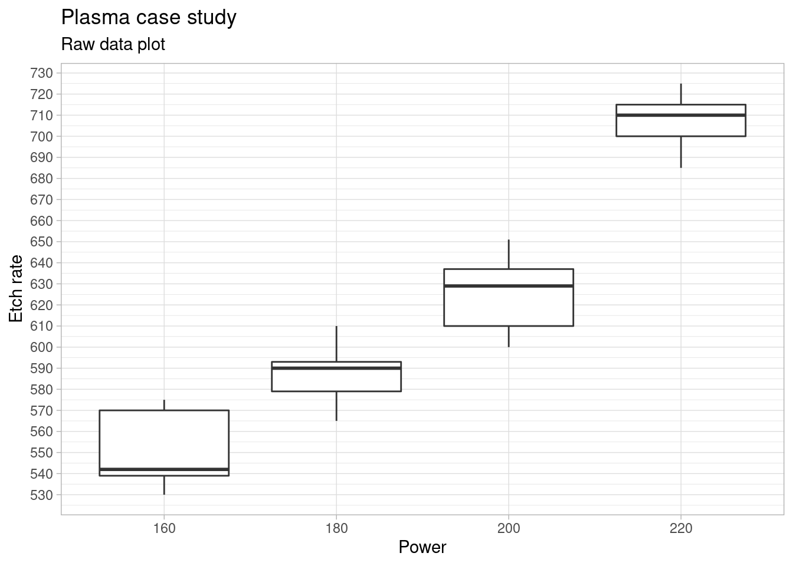

### Multiple means comparison


```r
library(tidyverse)
library(janitor)
library(stats)
library(knitr)
filter <- dplyr::filter
select <- dplyr::select
```


```r
plasma <- read_csv("../industRial/data-raw/3-1_plasma_etching.csv") %>%
  clean_names()

plasma_narrow <- plasma %>%
  pivot_longer(
    cols = starts_with("x"),
    names_to = "observation",
    values_to = "etch_rate"
  )
```


```r
plasma_narrow_factor <- plasma_narrow %>%
  mutate(power = as_factor(power))
```

#### Box plot of raw data

We can also compare medians and get a sense of the effect of the treatment levels by looking into the box plot:


```r
# Box plot
ggplot(plasma_narrow_factor, aes(x = power, y = etch_rate)) +
  geom_boxplot() +
  theme_light() +
  scale_y_continuous(n.breaks = 20) +
  theme(legend.position = "none") +
  labs(title = "Plasma case study",
       subtitle = "Raw data plot",
       x = "Power",
       y = "Etch rate")
```



1 factor with severals levels + 1 continuous dependent variable
Similar to the t-test but extended - this test allows to compare the means between several levels of treatement for a continuous response variable (the t test is only 2 levels at a time, performing all pair wise t-tests would also not be a solution because its a lot of effort and would increase the type I error)

ANOVA principle: the total variability in the data, as measured by the total corrected sum of squares, can be partitioned into a sum of squares of the differences between the treatment averages and the grand average plus a sum of squares of the differences of observations within treatments from the treatment average

#### Anova with effect {#anova}

In R the anova is built by passing the linear model to the anova or aov functions.
The output of the anova function is just the anova table as shown here for this first example. The output of the aov function is a list.


```r
plasma_lm_factor <- lm(etch_rate ~ power, data = plasma_narrow_factor)
plasma_aov <- aov(plasma_lm_factor)
summary(plasma_aov)
```

```
            Df Sum Sq Mean Sq F value   Pr(>F)    
power        3  66871   22290    66.8 2.88e-09 ***
Residuals   16   5339     334                     
---
Signif. codes:  0 '***' 0.001 '**' 0.01 '*' 0.05 '.' 0.1 ' ' 1
```

Note that the RF power or between-treatment mean square (22,290.18) is many times larger than the within-treatment or error mean square (333.70). This indicates that it is unlikely that the treatment means are equal. 
Also p < 0.05 thus we can reject the null hypothesis and conclude that the means are significantly different.

#### Anova with no effect

Anova on plasma etching, modification of the example to achieve a p > 0.05:


```r
plasma2 <- read_csv("../industRial/data-raw/3-1_plasma_etching_2.csv") %>%
  clean_names()

plasma2_narrow <- gather(plasma2, 
                         observation, 
                         etch_rate, x1, x2, x3, x4, x5)
plasma2_narrow_factor <- plasma2_narrow
plasma2_narrow_factor$power <- as.factor(plasma2_narrow_factor$power)

plasma2_lm_factor <- lm(etch_rate ~ power, data = plasma2_narrow_factor)
anova(plasma2_lm_factor)
```

```
Analysis of Variance Table

Response: etch_rate
          Df Sum Sq Mean Sq F value Pr(>F)
power      3   1476   492.0  1.2015  0.341
Residuals 16   6552   409.5               
```


```r
ggplot(plasma2_narrow_factor, aes(x = power, y = etch_rate)) +
  geom_boxplot() +
  theme_light() +
  theme(legend.position = "none") +
  labs(title = "Plasma case study",
       subtitle = "Raw data plot",
       x = "Power",
       y = "Etch rate")
```


P > 0.05 - there is no significant difference between the means

### Pairwise comparisons

#### Tukey's test {#tukeyTest}

The Anova may indicate that the treament means differ but it won't indicate which ones. In this case we may want to compare pairs of means.


```r
plasma_tukey <- TukeyHSD(plasma_aov, ordered = TRUE)
```


```r
head(plasma_tukey$power) %>% 
  kable(align = "c", 
        caption = "tukey test on plasma experiment", 
        booktabs = T)
```


Table: (\#tab:tab-plasmatukey)tukey test on plasma experiment

|        | diff  |    lwr     |    upr    |   p adj   |
|:-------|:-----:|:----------:|:---------:|:---------:|
|180-160 | 36.2  |  3.145624  | 69.25438  | 0.0294279 |
|200-160 | 74.2  | 41.145624  | 107.25438 | 0.0000455 |
|220-160 | 155.8 | 122.745624 | 188.85438 | 0.0000000 |
|200-180 | 38.0  |  4.945624  | 71.05438  | 0.0215995 |
|220-180 | 119.6 | 86.545624  | 152.65438 | 0.0000001 |
|220-200 | 81.6  | 48.545624  | 114.65438 | 0.0000146 |

The test provides us a simple direct calculation of the differences between the treatment means and a confidence interval for those. Most importantly it provides us with the p value to help us confirm the significance of the difference and conclude factor level by factor level which differences are significant.

Additionally we can obtain the related plot with the confidence intervals 


```r
plot(plasma_tukey)
```


#### Fisher's LSD {#fisherLSD}

Fisher's Least Significant difference is an alternative to Tuckey's test.


```r
library(agricolae)
```


```r
plasma_anova <- anova(plasma_lm_factor) 

plasma_LSD <- LSD.test(y = plasma_narrow_factor$etch_rate,
         trt = plasma_narrow_factor$power,
         DFerror = plasma_anova$Df[2],  
         MSerror = plasma_anova$`Mean Sq`[2],
         alpha = 0.05)
```

The Fisher procedure provides us with many new additional information. A first outcome is the difference between means that can be considered significant, indicated in the table below by LSD = 24.49.


```r
head(plasma_LSD$statistics) %>% 
  kable(align = "c", 
        caption = "Fisher LSD procedure on plasma experiment: stats", 
        booktabs = T)
```


Table: (\#tab:tab-plasmafisherstatistics)Fisher LSD procedure on plasma experiment: stats

|   | MSerror | Df |  Mean  |    CV    | t.value  |   LSD    |
|:--|:-------:|:--:|:------:|:--------:|:--------:|:--------:|
|   |  333.7  | 16 | 617.75 | 2.957095 | 2.119905 | 24.49202 |

Furthermore it gives us a confidence interval for each treatment level mean:


```r
head(plasma_LSD$means) %>% 
  # as_tibble() %>%
  rename(etch_rate = `plasma_narrow_factor$etch_rate`) %>%
  select(-Min, -Max, -Q25, -Q50, -Q75) %>%
  kable(align = "c", 
        caption = "Fisher LSD procedure on plasma experiment: means", 
        booktabs = T)
```


Table: (\#tab:tab-plasmafishermeans)Fisher LSD procedure on plasma experiment: means

|    | etch_rate |   std    | r |   LCL    |   UCL    |
|:---|:---------:|:--------:|:-:|:--------:|:--------:|
|160 |   551.2   | 20.01749 | 5 | 533.8815 | 568.5185 |
|180 |   587.4   | 16.74216 | 5 | 570.0815 | 604.7185 |
|200 |   625.4   | 20.52559 | 5 | 608.0815 | 642.7185 |
|220 |   707.0   | 15.24795 | 5 | 689.6815 | 724.3185 |

We can see for example that for power 220 W the etch rate if on average 707.0 with a probability of 95% of being between 689.7 and 724.3 A/min.

Another interesting outcome is the grouping of levels for each factor:


```r
head(plasma_LSD$groups) %>% 
  kable(align = "c", 
        caption = "Fisher LSD procedure on plasma experiment: groups", 
        booktabs = T)
```


Table: (\#tab:tab-plasmafishergroups)Fisher LSD procedure on plasma experiment: groups

|    | plasma_narrow_factor$etch_rate | groups |
|:---|:------------------------------:|:------:|
|220 |             707.0              |   a    |
|200 |             625.4              |   b    |
|180 |             587.4              |   c    |
|160 |             551.2              |   d    |

In this case as all level means are statistically different they all show up in separate groups, each indicated by a specific letter.

Finally we can get from this package a plot with the Least significant difference error bars:


```r
plot(plasma_LSD)
```


And below we're exploring a manual execution of this type of plot (in this case with the standard deviations instead).


```r
library(scales)
```


```r
plasma_narrow_factor %>%
  group_by(power) %>%
  summarise(etch_mean = mean(etch_rate), etch_sd = sd(etch_rate)) %>%
  ggplot(aes(x = power, y = etch_mean)) +
  geom_point(size = 2) +
  geom_line() +
  geom_errorbar(aes(ymin = etch_mean - etch_sd, 
                    ymax = etch_mean + etch_sd),
                width = .1) +
  # scale_y_continuous(breaks = seq(10000, 20000, 10),
  #                    labels = label_number(big.mark = "'")) +
  # scale_color_viridis_d(option = "C", begin = 0.1, end = 0.9) +
  # coord_cartesian(ylim = c(17950, 18150)) +
  annotate(geom = "text", x = Inf, y = -Inf, label = "Error bars are +/- 1xSD", 
    hjust = 1, vjust = -1, colour = "grey30", size = 3, 
    fontface = "italic") +
  theme_light() +
  labs(title = "axis volume method validation",
       subtitle = "Interaction plot - L axis x Operator",
       x = "",
       y = "Volume [mm]",
       caption = "Data source: QA Lab")
```


As there is no general consensus on which approach to use we recommend combine the Tukey test with the Fisher's LSD as completementary R functions. The Tukey test giving a first indication of the levels that have an effect and calculating the means differences and the Fisher function to provide much more additional information on each level. To be considered in each situation the slight difference  between the significance level for difference between means and to decide if required to take the most conservative one.


