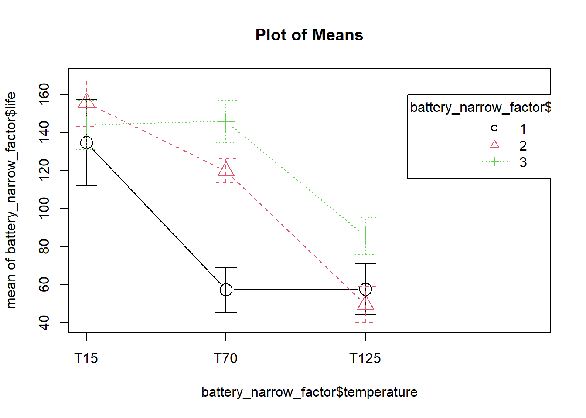
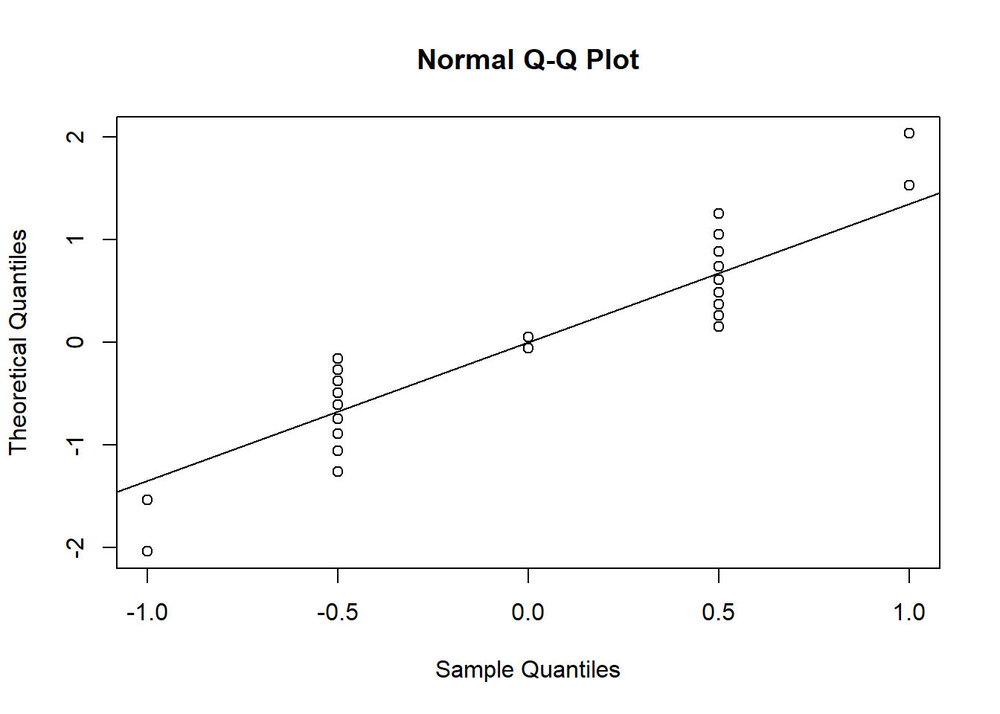
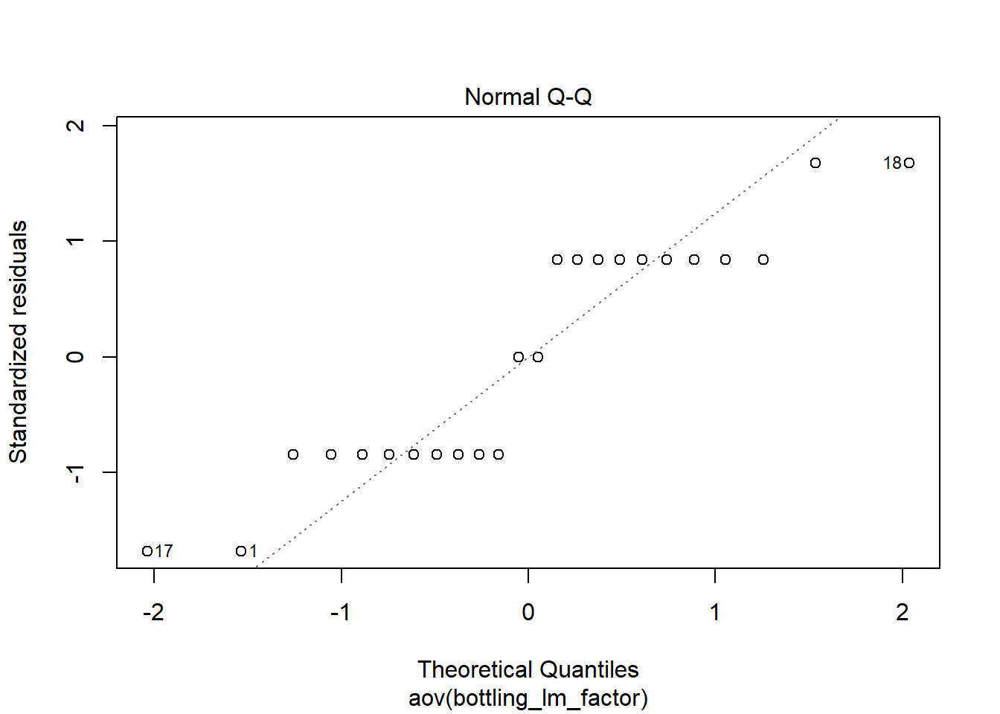
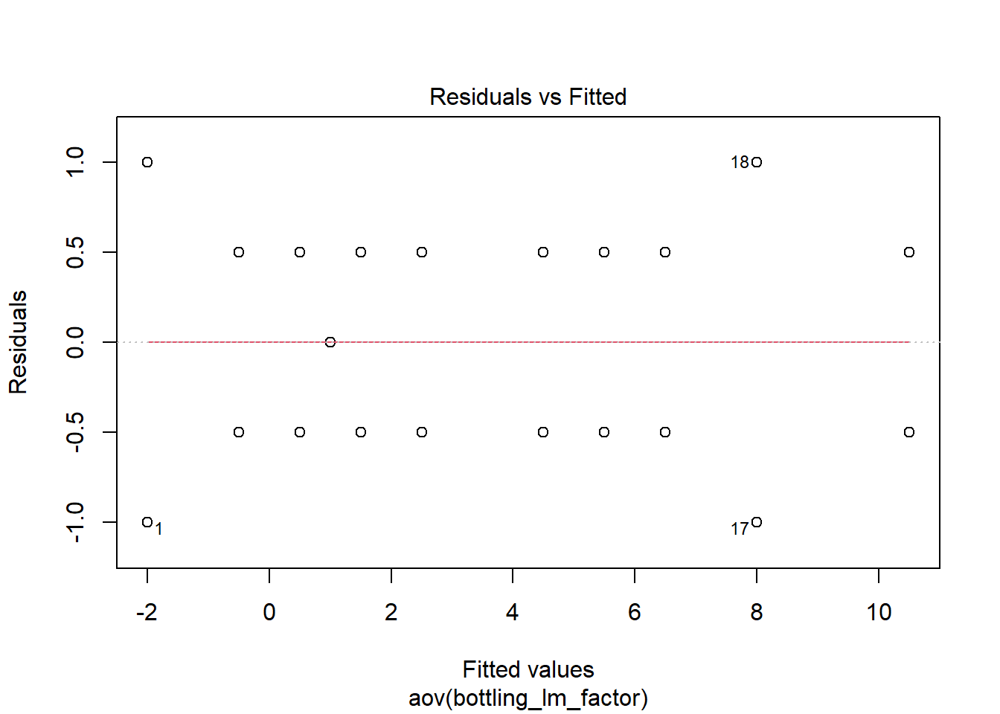

R setup


```r
library(tidyverse)
```

```
## -- Attaching packages -------------------------------------- tidyverse 1.3.0 --
```

```
## v ggplot2 3.3.2     v purrr   0.3.4
## v tibble  3.0.3     v dplyr   1.0.2
## v tidyr   1.1.1     v stringr 1.4.0
## v readr   1.3.1     v forcats 0.5.0
```

```
## 
```

```r
library(readxl)
library(stats)
```

```
## 
## Attachement du package : 'stats'
```

```
## The following objects are masked from 'package:dplyr':
## 
##     filter, lag
```

```r
library(knitr)
library(car)
```

```
## Le chargement a nécessité le package : carData
```

```
## 
## Attachement du package : 'car'
```

```
## The following object is masked from 'package:dplyr':
## 
##     recode
```

```
## The following object is masked from 'package:purrr':
## 
##     some
```

```r
library(pwr)
library(lsr)
library(broom)
library(RcmdrMisc)
```

```
## Le chargement a nécessité le package : sandwich
```

```r
library(agricolae)
filter <- dplyr::filter
select <- dplyr::select

# set data folder:
working_folder <- "data/"
```


Multiple factor designs

CHAPTER 5

## two-factors ANOVA, fixed effects model

5.3

### Battery life example

Load and prepare data for analysis:


```r
battery <- read.csv(sep = ";", header = TRUE,
                   paste0(working_folder, "5 battery.csv"))

# Converting into a narrow table with a factor for utilisation with ggplot2
# syntax: gather(data, 
#               name of the new key column (that replaces the names of the columns to be gathered), 
#               name of the new value column (where the values go), 
#               name of the columns to be gathered)
battery_narrow <- gather(battery,
                         temperature,
                         life,
                         T15, T70, T125)

battery_narrow_factor <- battery_narrow
battery_narrow_factor$material <- as.factor(battery_narrow$material)
battery_narrow_factor$temperature <- ordered(battery_narrow$temperature,
                                            levels = c("T15", "T70", "T125"))
```


### Analysis of variance

```r
battery_lm_factor <- lm(life ~ temperature + material + temperature:material,
                        data = battery_narrow_factor)


battery_aov <- aov(battery_lm_factor)

summary(battery_aov)
```

```
##                      Df Sum Sq Mean Sq F value   Pr(>F)    
## temperature           2  39119   19559  28.968 1.91e-07 ***
## material              2  10684    5342   7.911  0.00198 ** 
## temperature:material  4   9614    2403   3.560  0.01861 *  
## Residuals            27  18231     675                     
## ---
## Signif. codes:  0 '***' 0.001 '**' 0.01 '*' 0.05 '.' 0.1 ' ' 1
```

### DoE and Anova plots


```r
# Basic plot from Stats package (my favorite)
interaction.plot(x.factor = battery_narrow_factor$temperature, 
                 trace.factor = battery_narrow_factor$material,
                 response = battery_narrow_factor$life,
                 trace.label = "Material",
                 xlab = "temperature [°C]",
                 ylab = "life [h]")
```


```r
# Alternative plot from the RcmdrMisc package ("Stats facile avec R")
plotMeans(response = battery_narrow_factor$life,
          factor1 = battery_narrow_factor$temperature,
          factor2 = battery_narrow_factor$material)
```




```r
# Just for my curiosity a boxplot for comparison
ggplot(battery_narrow_factor, aes(x = temperature, y = life, color = material)) +
  geom_boxplot()
```


```r
# And also a scatterplot
ggplot(battery_lm_factor, aes(x = temperature, y = life, color = material)) +
  geom_point() +
  geom_smooth(method = "lm", se = FALSE) # not clear why the lm line is not plotted, to be investigated
```

```
## `geom_smooth()` using formula 'y ~ x'
```


Note: book example correctly reproduced.

### R², coefficient of determination


```r
summary(battery_lm_factor)
```

```
## 
## Call:
## lm(formula = life ~ temperature + material + temperature:material, 
##     data = battery_narrow_factor)
## 
## Residuals:
##     Min      1Q  Median      3Q     Max 
## -60.750 -14.625   1.375  17.937  45.250 
## 
## Coefficients:
##                         Estimate Std. Error t value Pr(>|t|)    
## (Intercept)               83.167      7.501  11.087 1.48e-11 ***
## temperature.L            -54.624     12.992  -4.204 0.000257 ***
## temperature.Q             31.741     12.992   2.443 0.021385 *  
## material2                 25.167     10.608   2.372 0.025059 *  
## material3                 41.917     10.608   3.951 0.000503 ***
## temperature.L:material2  -20.506     18.374  -1.116 0.274242    
## temperature.Q:material2  -45.724     18.374  -2.488 0.019293 *  
## temperature.L:material3   13.258     18.374   0.722 0.476759    
## temperature.Q:material3  -57.053     18.374  -3.105 0.004434 ** 
## ---
## Signif. codes:  0 '***' 0.001 '**' 0.01 '*' 0.05 '.' 0.1 ' ' 1
## 
## Residual standard error: 25.98 on 27 degrees of freedom
## Multiple R-squared:  0.7652,	Adjusted R-squared:  0.6956 
## F-statistic:    11 on 8 and 27 DF,  p-value: 9.426e-07
```
Note: book example correctly reproduced.

R^2 = 0.7652, That is, about 77 percent of the variability in the battery life is explained by the plate material in the battery, the temperature, and the material type–temperature interaction.

### Model adequacy checking

5.3.3 

### Residuals normality check & outliers

Q-Q plot + Shapiro-Wilk test


```r
battery_residuals <- battery_aov[["residuals"]]
qqnorm(battery_residuals, datax = TRUE);qqline(battery_residuals, datax = TRUE)
```


```r
shapiro.test(battery_residuals)
```

```
## 
## 	Shapiro-Wilk normality test
## 
## data:  battery_residuals
## W = 0.97606, p-value = 0.6117
```

```r
battery_tidyfit <- augment(battery_lm_factor)
```

p > 0.05 indicates that the residuals do not differ significantly from a normally distributed population.

According to Montgomery the residual of -60.75 (hours) for the temperature value of 15°C maybe an outlier as it's standardized value is > 2.
This can be observed more easily in the battery_tidyfit table created with the augment function from the broom package.

Standardized residuals graph


```r
plot(battery_aov, which = 2)
```


### Plot of residuals versus fitted values


```r
plot(battery_aov, which = 1)
```


### Sample size calculation

Refer to "Statistiques faciles avec R", page 233.
Cohen's effect size is calculated with the eta squared from the model (intriguing is the same value as the R²...).
In this case with 2 replicates we obtain a power of 90% and an alpha of 1%.
I've not managed here to replicate the values from the Montgomery book.


```r
battery_cohend_aov <- 40 / 25 # Cohen's effect size = difference of means / sd

pwr.anova.test(k = 3,
               n = 4,
               f = battery_cohend_aov,
               sig.level = 0.05)
```

```
## 
##      Balanced one-way analysis of variance power calculation 
## 
##               k = 3
##               n = 4
##               f = 1.6
##       sig.level = 0.05
##           power = 0.9892439
## 
## NOTE: n is number in each group
```

I've managed to almost reproduce the book result (I obtained a power of 98%, in the book 94%) by calculating the effect size by dividing the life difference of 40 hours by the standard deviation of 25h given in the example and feeding all this in the pwr.anova.test with n = 4 repetitions.

The books "Statistiques faciles avec R" proposes to use the eta but this gives very different results.
battery_eta2 <- etaSquared(battery_aov)[1]
battery_cohend_aov <- sqrt(battery_eta2 / (1 - battery_eta2))

### Model with no interaction


```r
# Removing the interaction from the model:
battery_lm_factor_no_int <- lm(life ~ temperature + material,
                        data = battery_narrow_factor)
battery_aov_no_int <- aov(battery_lm_factor_no_int)

# Comparing Anova results with and without:
summary(battery_aov)
```

```
##                      Df Sum Sq Mean Sq F value   Pr(>F)    
## temperature           2  39119   19559  28.968 1.91e-07 ***
## material              2  10684    5342   7.911  0.00198 ** 
## temperature:material  4   9614    2403   3.560  0.01861 *  
## Residuals            27  18231     675                     
## ---
## Signif. codes:  0 '***' 0.001 '**' 0.01 '*' 0.05 '.' 0.1 ' ' 1
```

```r
summary(battery_aov_no_int)
```

```
##             Df Sum Sq Mean Sq F value   Pr(>F)    
## temperature  2  39119   19559  21.776 1.24e-06 ***
## material     2  10684    5342   5.947  0.00651 ** 
## Residuals   31  27845     898                     
## ---
## Signif. codes:  0 '***' 0.001 '**' 0.01 '*' 0.05 '.' 0.1 ' ' 1
```
As noted previously, both main effects are significant (p < 0.05).

However, as soon as a residual analysis is performed for these data, it becomes clear that the no-interaction model is inadequate:

```r
# Normality of residuals is worse
battery_residuals_no_int <- battery_aov_no_int[["residuals"]]
qqnorm(battery_residuals_no_int, datax = TRUE);qqline(battery_residuals_no_int, datax = TRUE)
```


```r
# But it still passes the Shapiro test
shapiro.test(battery_residuals_no_int)
```

```
## 
## 	Shapiro-Wilk normality test
## 
## data:  battery_residuals_no_int
## W = 0.97846, p-value = 0.6932
```

```r
# No standardize residual above 2 either:
battery_tidyfit_no_int <- augment(battery_lm_factor_no_int)
```

```r
plot(battery_aov_no_int, which = 2)
```


```r
# It is finally in the plot residuals vs fit that we can clearly see an issue:
plot(battery_aov, which = 1)
```


```r
plot(battery_aov_no_int, which = 1)
```


Any pattern in these quantities is suggestive of the presence of interaction. Figure 5.15 shows a distinct pattern as the quantities move from positive to negative to positive to negative again.

## General factorial design

5.4 

Like in the two-factors we must have at least two replicates (n>2) to determine the sum of squares due to error if all possible interactions are to be included in the model.

Reminder of fixed effects definition:
Fixed or Random Factor? The statistical model, Equation 3.2, describes two different situations with respect to the treatment effects. First, the a treatments could have been specifically chosen by the experimenter. In this situation, we wish to test hypotheses about the treatment means, and our conclusions will apply only to the factor levels considered in the analysis. The conclusions cannot be extended to similar treatments that were not explicitly considered. We may also wish to estimate the model parameters ($, .i, !2). This is called the fixed effects model. Alternatively, the treatments could be a random sample from a larger population of treatments. In this situation, we should like to be able to extend the conclusions (which are based on the sample of treatments) to all treatments in the population,

Sources of variation for the Anova table for three-factor fixed effects model: 
A, B, C, AB, AC, BC, ABC

### Soft Drink bottling example


```r
bottling <- read.csv(sep = ";", header = TRUE,
                   paste0(working_folder, "5 bottling.csv"))


bottling_factor <- bottling
bottling_factor$speed <- as.factor(bottling$speed)
bottling_factor$pressure <- as.factor(bottling$pressure)
bottling_factor$carbonation <- as.factor(bottling$carbonation)
```

### Analysis of variance


```r
bottling_lm_factor <- lm(fill ~ 
                           carbonation + speed + pressure + 
                           carbonation:speed + 
                           carbonation:pressure + 
                           speed:pressure + 
                           carbonation:speed:pressure,
                           data = bottling_factor
  )

bottling_aov <- aov(bottling_lm_factor)
summary(bottling_aov)
```

```
##                            Df Sum Sq Mean Sq F value   Pr(>F)    
## carbonation                 2 252.75  126.38 178.412 1.19e-09 ***
## speed                       1  22.04   22.04  31.118  0.00012 ***
## pressure                    1  45.38   45.38  64.059 3.74e-06 ***
## carbonation:speed           2   0.58    0.29   0.412  0.67149    
## carbonation:pressure        2   5.25    2.62   3.706  0.05581 .  
## speed:pressure              1   1.04    1.04   1.471  0.24859    
## carbonation:speed:pressure  2   1.08    0.54   0.765  0.48687    
## Residuals                  12   8.50    0.71                     
## ---
## Signif. codes:  0 '***' 0.001 '**' 0.01 '*' 0.05 '.' 0.1 ' ' 1
```

We see that the percentage of carbonation, operating pressure, and line speed significantly affect the fill volume (p < 0.05)
The carbonation-pressure interaction F ratio has a P-value of 0.0558, indicating
some interaction between these factors.

### Residuals analysis


```r
bottling_residuals <- bottling_aov[["residuals"]]
qqnorm(bottling_residuals, datax = TRUE);qqline(bottling_residuals, datax = TRUE)
```



```r
shapiro.test(bottling_residuals)
```

```
## 
## 	Shapiro-Wilk normality test
## 
## data:  bottling_residuals
## W = 0.86322, p-value = 0.003885
```

```r
bottling_tidyfit <- augment(bottling_aov)
```


```r
plot(bottling_aov, which = 2)
```



```r
# It is finally in the plot residuals vs fit that we can clearly see an issue:
plot(bottling_aov, which = 1)
```




### DoE plots


```r
# Main effects plots:

# Percentage of carbonation
ggplot(bottling_factor, aes(x = carbonation, y = fill)) +
  geom_boxplot()
```


```r
# Pressure
ggplot(bottling_factor, aes(x = pressure, y = fill)) +
  geom_boxplot()
```


```r
# Line speed
ggplot(bottling_factor, aes(x = speed, y = fill)) +
  geom_boxplot()
```


```r
# Carbonation - Pressure interaction
# (corresponds to Montgomery page 210, figure 5.16 d)
ggplot(bottling_factor, aes(x = carbonation, y = fill, color = pressure)) +
  geom_boxplot()
```


## The 2^k factorial designs

CHAPTER 6 [@Montgomery2012]

Extremely important class of designs, specially in factor screening experiments. 
In this case factors only have 2 levels. Assumptions:
  (1) the factors are fixed
  (2) the designs are completely randomized
  (3) the usual normality assumptions are satisfied
  the response is approximately linear over the range of the factor levels chose

The 2k design is particularly useful in the early stages of experimental work when many
factors are likely to be investigated. It provides the smallest number of runs with which k factors
can be studied in a complete factorial design. Consequently, these designs are widely
used in factor screening experiments.

## The 2^2 Factorial Design

6.2

Slides with R code on Montgomery book can be found under:
https://www.stat.ncsu.edu/people/bloomfield/courses/st516/

### The Chemical Process example


```r
chm <- read.csv(sep = ";", header = TRUE,
                   paste0(working_folder, "6 chemical.csv"))

# Converting into a narrow table with a factor for utilisation with ggplot2
# syntax: gather(data, 
#               name of the new key column (where the columns names go to), 
#               name of the new value column (where the values go), 
#               name of the columns to be gathered)
chmn <- chm %>% # "chm narrow dataframe"
  gather(replicate, yield, I, II, III)
```

### Anova

## Correlation of the outputs

### Correlation matrix

### Network diagrams


```r
chmn_lm <- lm(yield ~ A + B + A:B, data = chmn)
chmn_aov <- aov(chmn_lm)
summary(chmn_aov)
```

```
##             Df Sum Sq Mean Sq F value   Pr(>F)    
## A            1 208.33  208.33  53.191 8.44e-05 ***
## B            1  75.00   75.00  19.149  0.00236 ** 
## A:B          1   8.33    8.33   2.128  0.18278    
## Residuals    8  31.33    3.92                     
## ---
## Signif. codes:  0 '***' 0.001 '**' 0.01 '*' 0.05 '.' 0.1 ' ' 1
```


```r
# par(mfrow = c(1, 2))
plot(yield ~ A * B, chmn)
plot(chmn_lm)
par(mfrow = c(1, 1))
with(chmn, interaction.plot(A, B, yield))
plot(chmn_aov) # the usual suspects
```

### Regression model / Prediction

Effects
Fit the regression equation, with versions of the factors, coded as numeric!, −1 for low levels, and +1 for high levels.


```r
coded <- function(x) {
  ifelse(x == x[1], -1, 1)
}
chmn2 <- within(chmn, {cA = coded(A); cB = coded(B)})
chmn2 <- select(chmn2, A, B, replicate, yield, cA, cB)
chmn2_lm <- lm(yield ~ cA * cB, data = chmn2)
summary(chmn2_lm)
```

```
## 
## Call:
## lm(formula = yield ~ cA * cB, data = chmn2)
## 
## Residuals:
##    Min     1Q Median     3Q    Max 
## -2.000 -1.333 -0.500  1.083  3.000 
## 
## Coefficients:
##             Estimate Std. Error t value Pr(>|t|)    
## (Intercept)  27.5000     0.5713  48.135 3.84e-11 ***
## cA            4.1667     0.5713   7.293 8.44e-05 ***
## cB           -2.5000     0.5713  -4.376  0.00236 ** 
## cA:cB         0.8333     0.5713   1.459  0.18278    
## ---
## Signif. codes:  0 '***' 0.001 '**' 0.01 '*' 0.05 '.' 0.1 ' ' 1
## 
## Residual standard error: 1.979 on 8 degrees of freedom
## Multiple R-squared:  0.903,	Adjusted R-squared:  0.8666 
## F-statistic: 24.82 on 3 and 8 DF,  p-value: 0.0002093
```

```r
# Predict new values
chmn_new <- data.frame(cA = 1, cB = 1)
predict(chmn2_lm, newdata = chmn_new)
```

```
##  1 
## 30
```

```r
# Compare with predicted table below (the same values are found!)
chmn2_tidy <- augment(chmn2_lm)
```

A coefficient in a regression equation is the change in the response when the corresponding variable changes by +1.

As A or B changes from its low level to its high level, the coded variable changes by 1 − (−1) = +2, so the change in the response is twice the regression coefficient.
So the effects and interaction(s) are twice the values in the “Estimate” column.
--> These regression coefficients are often called effects and interactions, even though they differ from the definitions given earlier.

### Response surface

(still to be implemented)

```r
ngrid <- 20
Agrid <- Bgrid <- seq(from = -1, to = 1, length = ngrid)
yhat <- predict(chmn_lm, expand.grid(cA = Agrid, cB = Bgrid))
yhat <- matrix(yhat, length(Agrid), length(Bgrid))
persp(Agrid, Bgrid, yhat, theta = -40, phi = 30)
# in real values:
persp(20 + 5 * Agrid, 1.5 + 0.5 * Bgrid, yhat, theta = -40, phi = 30,
ticktype = "d", xlab = "Reactant Concentration", ylab = "Catalyst")
```

## The 2^3 Factorial Design

6.3.

### The plasma etching example

A - gap in cm
B - flow
C - power in W
response - etch rate in Angstrom/m


```r
pls <- read.csv(paste0(working_folder, "6-3 plasma.csv"))
pls$A <- as.factor(pls$A)
pls$B <- as.factor(pls$B)
pls$C <- as.factor(pls$C)

# Converting into a narrow table with a factor for utilisation with ggplot2
# syntax: gather(data, 
#               name of the new key column (where the columns names go to), 
#               name of the new value column (where the values go), 
#               name of the columns to be gathered)
plsn <- pls %>% # "chm narrow dataframe"
  gather(replicate, etch, Rep1, Rep2)
```

### Anova


```r
plsn_lm <- lm(etch ~ A * B * C, plsn)
plsn_aov <- aov(plsn_lm)
summary(plsn_aov)
```

```
##             Df Sum Sq Mean Sq F value   Pr(>F)    
## A            1  41311   41311  18.339 0.002679 ** 
## B            1    218     218   0.097 0.763911    
## C            1 374850  374850 166.411 1.23e-06 ***
## A:B          1   2475    2475   1.099 0.325168    
## A:C          1  94403   94403  41.909 0.000193 ***
## B:C          1     18      18   0.008 0.930849    
## A:B:C        1    127     127   0.056 0.818586    
## Residuals    8  18020    2253                     
## ---
## Signif. codes:  0 '***' 0.001 '**' 0.01 '*' 0.05 '.' 0.1 ' ' 1
```

Note here again that the Anova is performed on a model built with the treatments coded as factors, while later the prediction linear model is built with the treatments codes as numeric.
The main effects of Gap and Power are highly significant (both have very small P-values). The AC interaction is also highly significant; thus, there is a strong interaction between Gap and Power.

### Regression model / Prediction


```r
# Below the adaptation of the chapter 6.2 approach in converting the factors into numeric, here with tidyverse functions:
plsn2 <- plsn
plsn2 <- plsn %>% mutate(cA = ifelse(A == "-1", -1, 1),
                         cB = ifelse(B == "-1", -1, 1),
                         cC = ifelse(C == "-1", -1, 1)
                         )


plsn2_lm <- lm(etch ~ cA * cB * cC, plsn2)
summary(plsn2_lm)
```

```
## 
## Call:
## lm(formula = etch ~ cA * cB * cC, data = plsn2)
## 
## Residuals:
##    Min     1Q Median     3Q    Max 
## -65.50 -11.12   0.00  11.12  65.50 
## 
## Coefficients:
##             Estimate Std. Error t value Pr(>|t|)    
## (Intercept)  776.062     11.865  65.406 3.32e-12 ***
## cA           -50.812     11.865  -4.282 0.002679 ** 
## cB             3.688     11.865   0.311 0.763911    
## cC           153.062     11.865  12.900 1.23e-06 ***
## cA:cB        -12.437     11.865  -1.048 0.325168    
## cA:cC        -76.812     11.865  -6.474 0.000193 ***
## cB:cC         -1.062     11.865  -0.090 0.930849    
## cA:cB:cC       2.813     11.865   0.237 0.818586    
## ---
## Signif. codes:  0 '***' 0.001 '**' 0.01 '*' 0.05 '.' 0.1 ' ' 1
## 
## Residual standard error: 47.46 on 8 degrees of freedom
## Multiple R-squared:  0.9661,	Adjusted R-squared:  0.9364 
## F-statistic: 32.56 on 7 and 8 DF,  p-value: 2.896e-05
```

```r
# Predict new values
plsn_new <- data.frame(cA = -1, cB = 1, cC = 1)
predict(plsn2_lm, newdata = plsn_new)
```

```
##    1 
## 1069
```

```r
# Compare with predicted table below (the same values are found!)
plsn2_tidy <- augment(plsn2_lm)
```

The linear model coeficients obtained correspond to the book example.
The predict function correctly corresponds to the predictions obtained with the augment function.

The ordinary R^2 is 0.9661 and it measures the proportion of total variability explained by the model. A potential problem with this statistic is that it always increases as factors are added to the model, even if these factors are not significant. The adjusted R^2 is obtained by dividing the Sums of Squares by the degrees of freedom, and is adjusted for the size of the model, that is the number of factors.

### Reduced model


```r
plsn3_lm <- lm(etch ~ cA + cC + cA:cC, plsn2)
summary(plsn3_lm)
```

```
## 
## Call:
## lm(formula = etch ~ cA + cC + cA:cC, data = plsn2)
## 
## Residuals:
##    Min     1Q Median     3Q    Max 
## -72.50 -15.44   2.50  18.69  66.50 
## 
## Coefficients:
##             Estimate Std. Error t value Pr(>|t|)    
## (Intercept)   776.06      10.42  74.458  < 2e-16 ***
## cA            -50.81      10.42  -4.875 0.000382 ***
## cC            153.06      10.42  14.685 4.95e-09 ***
## cA:cC         -76.81      10.42  -7.370 8.62e-06 ***
## ---
## Signif. codes:  0 '***' 0.001 '**' 0.01 '*' 0.05 '.' 0.1 ' ' 1
## 
## Residual standard error: 41.69 on 12 degrees of freedom
## Multiple R-squared:  0.9608,	Adjusted R-squared:  0.9509 
## F-statistic: 97.91 on 3 and 12 DF,  p-value: 1.054e-08
```

Adjusted R² has improved! Clearly, removing the nonsignificant terms from the full model has produced a final model that is likely to function more effectively as a predictor of new data!

### DoE plots


```r
# Main effect of A
ggplot(plsn, aes(x = A, y = etch)) +
  geom_boxplot()
```


```r
# Interaction gap - power
with(plsn, interaction.plot(A, C, etch, type = "b"))
```


```r
# The same with ggplot
ggplot(plsn, aes(x = A, y = etch, fill = C)) +
  geom_boxplot()
```


```r
# Reversed gap - power
with(plsn, interaction.plot(C, A, etch, type = "b"))
```


```r
# The same with ggplot
ggplot(plsn2, aes(x = C, y = etch, fill = A)) +
  geom_boxplot()
```


The AC interaction is larger than the main effect of A.


## The general 2^k design

6.4 

### Calculating the number combinations


```r
a <- 2   # levels
k <- 4   # degrees of freedom (to which factors can be associated)
trials <- a^k
trials
```

```
## [1] 16
```

```r
n <- 2   # replications (repetitions of each trial)
runs <- a^k*n # actual number of individual tests to be done
runs
```

```
## [1] 32
```

Analysis Procedure for a 2 k Design

1. Estimate factor effects
2. Form initial model (full model)
  a. If the design is replicated, fit the full model
  b. If there is no replication, form the model using a normal probability plot of the effects
3. Perform statistical testing (Anova)
4. Refine model (remove non significant effects)
5. Analyze residuals
6. Interpret results

DEF - Sparsity of effects principle: most systems are dominated by some of the main effects and low-order interactions, and most high-order interactions are negligible.

### Relationship coded vs natural variables


```r
# Converting absolute value Ax into coded value Ai:
Al <- 15
Ah <- 25
Ax <- 16

Ai <- (Ax - (Al + Ah) / 2) / ((Ah -  Al ) / 2)
Ai
```

```
## [1] -0.8
```

```r
# Converting coded value Bi into absolute value Bx
Bl <- 15
Bh <- 25
Bi <- -0.8

Bx <- Bi * ((Bh - Bl) / 2) + ((Bl + Bh)/2)
Bx
```

```
## [1] 16
```

## Single replicate 2^k design

6.5 

Possible approaches
- assume some high-order interactions are zero, and fit a model that excludes them; degrees of freedom go into error, so testing is possible (not recommended)
- graphical methods–normal and half-normal probability plots; no formal tests;

### The Filtration example


```r
flt <- read.csv(
  paste0(working_folder, "6-4 filtration.csv"))
# Below a replacement of the individual conversion of each treatment into a factor, now with the lapply function. This is scalable to any number of factors.
flt2 <- lapply(X = flt[,1:4], FUN = as.factor)
flt2 <- bind_rows(flt2)
flt2 <- mutate(flt2, filtration = flt$filtration)
```

### Anova


```r
flt2_lm <- lm(filtration ~ A * B * C * D, flt2)
flt2_aov <- aov(flt2_lm)
summary(flt2_aov)
```

```
##             Df Sum Sq Mean Sq
## A            1 1870.6  1870.6
## B            1   39.1    39.1
## C            1  390.1   390.1
## D            1  855.6   855.6
## A:B          1    0.1     0.1
## A:C          1 1314.1  1314.1
## B:C          1   22.6    22.6
## A:D          1 1105.6  1105.6
## B:D          1    0.6     0.6
## C:D          1    5.1     5.1
## A:B:C        1   14.1    14.1
## A:B:D        1   68.1    68.1
## A:C:D        1   10.6    10.6
## B:C:D        1   27.6    27.6
## A:B:C:D      1    7.6     7.6
```

My understanding is that since only 1 replicate has been done there is no statistical testing, thus no p values.


### Linear regression - Plot of effects


```r
# The effect estimates have to be extracted from the lm of the data, not in factors, from the coefficients vector...
flt_lm <- lm(filtration ~ A * B * C * D, flt)
flt_eff <- (flt_lm$coefficients)[2:16]
flt_eff_names <- names((flt_lm$coefficients)[2:16])

qqnorm(flt_eff, datax = TRUE); qqline(flt_eff, datax = TRUE)
```


```r
# Replacement of base R plot by a tidyverse plot with ggplot2
# (to be explored further how to add the labels to the graph)
flt_eff_df <- data.frame(flt_eff_names, flt_eff, row.names = NULL)
ggplot(flt_eff_df, aes(sample = flt_eff)) + 
    stat_qq() +
    stat_qq_line() +
    coord_flip()
```


```r
# Anyway a better plot from the car package (already loaded in this Rmd) if the qqPlot.
qqPlot(flt_eff, envelope = 0.70, 
       id = list(method="y", n=5, cex=1, col=carPalette()[1], location="lr"), 
       grid = FALSE)
```


```
## A:C   A A:D   D   C 
##   6   1   8   4   3
```

In this case it may take long to be able to reproduce this example.
The important effects that emerge from this analysis are the main effects of A, C, and D and the AC and AD interactions.
The last plot shows that this method of selecting the significant effects is rather subjective as it is stated by Montgomery. To go deeper on a more objective method see Lenth's method.


### DoE plots

Factors (reminder)
A - Temperature 
B - Pressure
C - Concentration
D - Stirring


```r
ggplot(flt2, aes(x = A, y = filtration)) +
  geom_boxplot()
```


```r
ggplot(flt2, aes(x = C, y = filtration)) +
  geom_boxplot()
```


```r
ggplot(flt2, aes(x = D, y = filtration)) +
  geom_boxplot()
```


```r
ggplot(flt2, aes(x = A, y = filtration, fill = C)) +
  geom_boxplot()
```


```r
ggplot(flt2, aes(x = A, y = filtration, fill = D)) +
  geom_boxplot()
```


The AC and AD interactions are plotted in Figure 6.12b. These interactions are the key to solving the problem. Note from the AC interaction that the temperature effect is very small when the concentration is at the high level and very large when the concentration is at the low level, with the best results obtained with low concentration and high temperature. The AD interaction indicates that stirring rate D has little effect at low temperature but a large positive effect at high temperature. Therefore, the best filtration rates would appear to be obtained when A and D are at the high level and C is at the low level. This would allow the reduction of the formaldehyde concentration to a lower level, another objective of the experimenter.

### Anova reduced model (significant effects only)

Since the B factor has little influence on the output it can be removed from the model.


```r
flt3_lm <- lm(filtration ~ A * C * D, flt2)
flt3_aov <- aov(flt3_lm)
summary(flt3_aov)
```

```
##             Df Sum Sq Mean Sq F value   Pr(>F)    
## A            1 1870.6  1870.6  83.368 1.67e-05 ***
## C            1  390.1   390.1  17.384 0.003124 ** 
## D            1  855.6   855.6  38.131 0.000267 ***
## A:C          1 1314.1  1314.1  58.565 6.00e-05 ***
## A:D          1 1105.6  1105.6  49.273 0.000110 ***
## C:D          1    5.1     5.1   0.226 0.647483    
## A:C:D        1   10.6    10.6   0.471 0.512032    
## Residuals    8  179.5    22.4                     
## ---
## Signif. codes:  0 '***' 0.001 '**' 0.01 '*' 0.05 '.' 0.1 ' ' 1
```

### Linear regression - reduced model


```r
# on the reduced model, on specific effects and interactions, not as factors:
flt4_lm <- lm(filtration ~ (A + C + D + A:C + A:D), flt)
summary(flt4_lm)
```

```
## 
## Call:
## lm(formula = filtration ~ (A + C + D + A:C + A:D), data = flt)
## 
## Residuals:
##     Min      1Q  Median      3Q     Max 
## -6.3750 -1.5000  0.0625  2.9062  5.7500 
## 
## Coefficients:
##             Estimate Std. Error t value Pr(>|t|)    
## (Intercept)   70.062      1.104  63.444 2.30e-14 ***
## A             10.812      1.104   9.791 1.93e-06 ***
## C              4.938      1.104   4.471   0.0012 ** 
## D              7.313      1.104   6.622 5.92e-05 ***
## A:C           -9.063      1.104  -8.206 9.41e-06 ***
## A:D            8.312      1.104   7.527 2.00e-05 ***
## ---
## Signif. codes:  0 '***' 0.001 '**' 0.01 '*' 0.05 '.' 0.1 ' ' 1
## 
## Residual standard error: 4.417 on 10 degrees of freedom
## Multiple R-squared:  0.966,	Adjusted R-squared:  0.9489 
## F-statistic: 56.74 on 5 and 10 DF,  p-value: 5.14e-07
```

```r
flt4_eff <- (flt4_lm$coefficients)[2:16]
flt4_eff
```

```
##       A       C       D     A:C     A:D    <NA>    <NA>    <NA>    <NA>    <NA> 
## 10.8125  4.9375  7.3125 -9.0625  8.3125      NA      NA      NA      NA      NA 
##    <NA>    <NA>    <NA>    <NA>    <NA> 
##      NA      NA      NA      NA      NA
```

```r
flt_new <- data.frame(A = -1, C = -1, D = -1)
predict(flt4_lm, newdata = flt_new)
```

```
##     1 
## 46.25
```

```r
flt4_tidy <- augment(flt4_lm) # as page 261 of the book
```

### Residuals normality check


```r
qqnorm(flt4_lm$residuals, datax = TRUE);qqline(flt4_lm$residuals, datax = TRUE)
```


Stopped at page 320 Chapter 8


## Two level fractional factorial designs

CHAPTER 8 [@Montgomery2012]

The successful use of fractional factorial designs is based on three key ideas:
1. The sparsity of effects principle. When there are several variables, the system or process is likely to be driven primarily by some of the main effects and low-order interactions.
2. The projection property. Fractional factorial designs can be projected into stronger (larger) designs in the subset of significant factors.
3. Sequential experimentation. It is possible to combine the runs of two (or more) fractional factorials to construct sequentially a larger design to estimate the factor effects and interactions of interest.

### The One-Half Fraction of th 2k Design

8.2.

### The filtration example (modified)


```r
flt1h <- read.csv(sep = ";", paste0(working_folder, "8-2 filtration.csv")) # filtration 1 half
flt1h2 <- lapply(X = flt1h[,1:4], FUN = as.factor)
flt1h2 <- bind_rows(flt1h)
flt1h2 <- mutate(flt1h2, filtration = flt1h$filtration)
```

### Anova


```r
flt1h2_lm <- lm(filtration ~ A * C * D, flt1h2) 
```


