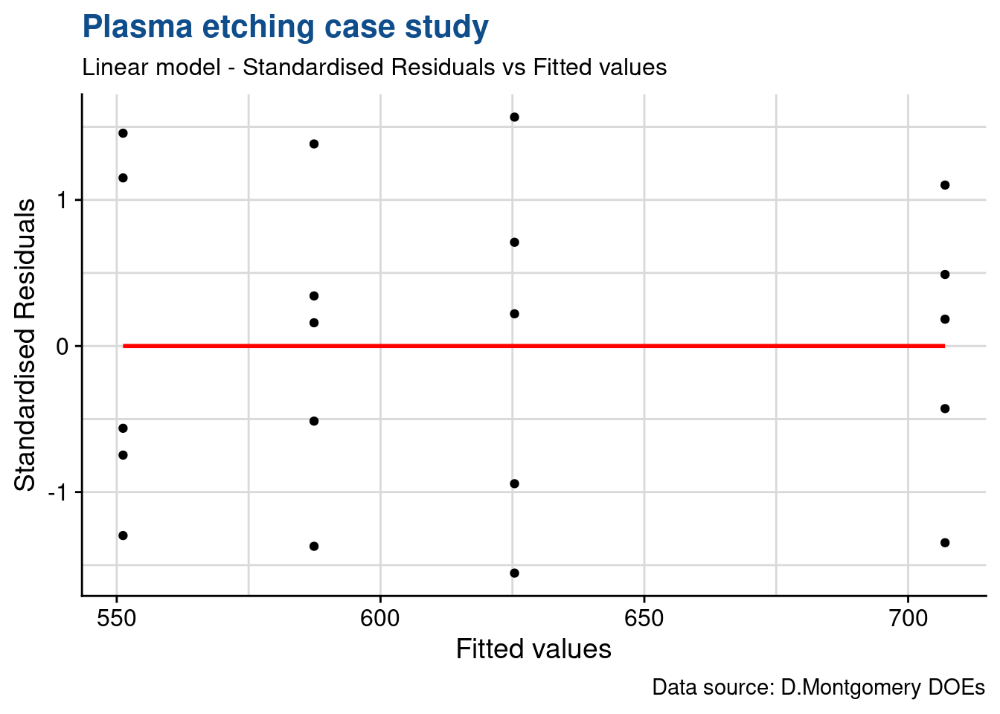

## k^1 designs

One factor multiple levels

### Linear regression

We will present here a first example of the utilisation of linear regression techniques and establish a linear model. These models are going to be used extensively in the upcoming cases.

**Plasma etching example**

**Data loading**


```r
library(tidyverse)
library(readxl)
library(janitor)
library(stats)
library(knitr)
library(industRial)
filter <- dplyr::filter
select <- dplyr::select
```


```r
plasma <- read_csv("../industRial/data-raw/3-1_plasma_etching.csv") %>%
  clean_names()

plasma_narrow <- plasma %>%
  pivot_longer(
    cols = starts_with("x"),
    names_to = "observation",
    values_to = "etch_rate"
  ) %>%
  group_by(power) %>%
  mutate(etch_rate_mean = mean(etch_rate)) %>%
  ungroup()
```


```r
head(plasma_narrow) %>% 
  kable(align = "c", 
        caption = "plasma etching experiment data", 
        booktabs = T)
```


Table: (\#tab:tab-plasma_narrow)plasma etching experiment data

| power | observation | etch_rate | etch_rate_mean |
|:-----:|:-----------:|:---------:|:--------------:|
|  160  |     x1      |    575    |     551.2      |
|  160  |     x2      |    542    |     551.2      |
|  160  |     x3      |    530    |     551.2      |
|  160  |     x4      |    539    |     551.2      |
|  160  |     x5      |    570    |     551.2      |
|  180  |     x1      |    565    |     587.4      |

### Raw data plot
 

```r
ggplot(data = plasma_narrow) +
  geom_point(aes(x = power, y = etch_rate)) +
  geom_point(aes(x = power, y = etch_rate_mean), color = "red") +
  theme_industRial() +
  scale_y_continuous(n.breaks = 10) +
  theme(legend.position = "none") +
  labs(title = "Plasma case study",
       subtitle = "Raw data plot",
       x = "Power",
       y = "Etch rate")
```


#### Linear model random effects {#linearModel}

We start by establishing the model, ensuring for now that we leave the variable `power` as a numeric vector. 


```r
plasma_lm <- lm(etch_rate ~ power, data = plasma_narrow)
summary(plasma_lm)
```

```

Call:
lm(formula = etch_rate ~ power, data = plasma_narrow)

Residuals:
   Min     1Q Median     3Q    Max 
-43.02 -12.32  -1.21  16.71  33.06 

Coefficients:
            Estimate Std. Error t value Pr(>|t|)    
(Intercept) 137.6200    41.2108   3.339  0.00365 ** 
power         2.5270     0.2154  11.731 7.26e-10 ***
---
Signif. codes:  0 '***' 0.001 '**' 0.01 '*' 0.05 '.' 0.1 ' ' 1

Residual standard error: 21.54 on 18 degrees of freedom
Multiple R-squared:  0.8843,	Adjusted R-squared:  0.8779 
F-statistic: 137.6 on 1 and 18 DF,  p-value: 7.263e-10
```

With the summary function we can many different outputs such as the coefficients and the R-squared which we will look into more detail now. As usual, we first inspect the data with a first plot. In this case we're adding a smoothing geometry with the lm method:

#### Linear model plot


```r
ggplot(plasma_narrow) +
  geom_point(aes(x = power, y = etch_rate)) +
  geom_smooth(aes(x = power, y = etch_rate), method = "lm") +
  geom_point(aes(x = power, y = etch_rate_mean), color = "red") +
  theme_industRial() +
  scale_y_continuous(n.breaks = 10) +
  theme_industRial() +
  theme(legend.position = "none") +
  labs(title = "Plasma case study",
       subtitle = "Raw data plot",
       x = "Power",
       y = "Etch rate")
```


#### Linear model fixed effects

In our case the experiementer has selected to control the levels of the power variable in what is called a fixed effects model, accepting that conclusions in the comparisons of the levels cannot be extended to levels that were not tested. For this we're now going to convert the variable to a factor and establish again the model and note that it will give the same R squared but naturally different coefficients. 


```r
plasma_narrow_factor <- plasma_narrow %>%
  mutate(power = as_factor(power))
plasma_lm_factor <- lm(
  etch_rate ~ power, 
  data = plasma_narrow_factor,
  contrasts = list(power = "contr.treatment")
  )
summary(plasma_lm_factor)
```

```

Call:
lm(formula = etch_rate ~ power, data = plasma_narrow_factor, 
    contrasts = list(power = "contr.treatment"))

Residuals:
   Min     1Q Median     3Q    Max 
 -25.4  -13.0    2.8   13.2   25.6 

Coefficients:
            Estimate Std. Error t value Pr(>|t|)    
(Intercept)  551.200      8.169  67.471  < 2e-16 ***
power180      36.200     11.553   3.133  0.00642 ** 
power200      74.200     11.553   6.422 8.44e-06 ***
power220     155.800     11.553  13.485 3.73e-10 ***
---
Signif. codes:  0 '***' 0.001 '**' 0.01 '*' 0.05 '.' 0.1 ' ' 1

Residual standard error: 18.27 on 16 degrees of freedom
Multiple R-squared:  0.9261,	Adjusted R-squared:  0.9122 
F-statistic:  66.8 on 3 and 16 DF,  p-value: 2.883e-09
```

In order to be precise, we're making explicit in the lm function that the contrasts argument is "contr.treatment", although this is the default in R. More on contrasts on the Case Study on $2^k$ designs. The current contrasts settings can be seen as follows:


```r
getOption("contrasts")
```

```
        unordered           ordered 
"contr.treatment"      "contr.poly" 
```

We're now ready to assess the validity of the model in order to be ready for our main task which is the comparison of the means using an anova.

### Residuals & model check

In order to assess the model performance we're going to look into the residuals. R provides direct ploting functions with the base and stats packages but in this first example we're going to break down the analysis and further customise the plots. We are also going to make usage of some additional statistical tests to confirm our observations from the plots. In subsequent chapters we'll have a more selective approach, where plots and tests are made on a needed basis.

We start by loading the package broom which will help us retrieving the data from the lm object into a data frame.


```r
library(broom)
```

Now we build and show below an extract of the "augmented" dataframe 


```r
plasma_aug <- augment(plasma_lm_factor) %>%
  mutate(index = row_number())
plasma_aug %>%
  head() %>%
  kable(align = "c")
```


| etch_rate | power | .fitted | .resid | .hat |  .sigma  |  .cooksd  | .std.resid | index |
|:---------:|:-----:|:-------:|:------:|:----:|:--------:|:---------:|:----------:|:-----:|
|    575    |  160  |  551.2  |  23.8  | 0.2  | 17.57109 | 0.1326135 | 1.4566455  |   1   |
|    542    |  160  |  551.2  |  -9.2  | 0.2  | 18.67869 | 0.0198157 | -0.5630730 |   2   |
|    530    |  160  |  551.2  | -21.2  | 0.2  | 17.84638 | 0.1052218 | -1.2975161 |   3   |
|    539    |  160  |  551.2  | -12.2  | 0.2  | 18.53492 | 0.0348460 | -0.7466838 |   4   |
|    570    |  160  |  551.2  |  18.8  | 0.2  | 18.06913 | 0.0827465 | 1.1506275  |   5   |
|    565    |  180  |  587.4  | -22.4  | 0.2  | 17.72381 | 0.1174708 | -1.3709604 |   6   |

We can see we've obtained detailed model parameters such us fitted values and residuals for each DOE run.

#### Time sequence plot

For this plot we need to ensure that the order of plotting in the x axis corresponds exactly to the original data collection order. This plot allows us to assess for strange patterns such as a  tendency to have runs of positive of negative results which indicates that the independency assumption does not hold. If patterns emerge then there may be correlation in the residuals.


```r
plasma_aug %>%
  ggplot(aes(x = index, y = .resid)) +
  geom_point() +
  theme_industRial() +
  labs(
    title = "Plasma etching case study",
    subtitle = "Linear model - Residuals timeseries",
    y = "Index",
    x = "Fitted values",
    caption = "Data source: D.Montgomery DOEs"
  )
```


Nothing strange emerges from the current plot and the design shows as well randomised.

#### Autocorrelation test {#residualsCorrelation}

It is always good to keep in mind that all visual observations can be complemented with a statistical test. In this case we're going to use the durbinWatson test from the car package (Companion to Applied Regression).


```r
library(car)
```


```r
durbinWatsonTest(plasma_lm_factor)
```

```
 lag Autocorrelation D-W Statistic p-value
   1      -0.5343347      2.960893   0.092
 Alternative hypothesis: rho != 0
```

Although the output shows Autocorrelation of -0.53 we have to consider that the p value is greater than 0.05 thus there is not enough significance to say that there is autocorrelation. 

#### Residuals vs fit plot

If the model is correct and the assumptions hold, the residuals should be structureless. In particular they should be unrelated to any other variable including the predicted response.


```r
plasma_aug %>%
  ggplot(aes(x = .fitted, y = .resid)) +
  geom_point() +
  theme_industRial() +
  geom_smooth(method = "loess", se = FALSE, color = "red") +
  labs(
    title = "Plasma etching case study",
    subtitle = "Linear model - Residuals vs Fitted values",
    y = "Residuals",
    x = "Fitted values",
    caption = "Data source: D.Montgomery DOEs"
  )
```


In this plot we see no variance anomalies such as a higher variance for a certain factor level or other types of skweness.

#### Equality of variance test {#barlettTest}

In the plasma etch experiment, the normality assumption is not in question, so we can apply Bartlett’s test to the etch rate data.


```r
bartlett.test(etch_rate ~ power, data = plasma_narrow_factor)
```

```

	Bartlett test of homogeneity of variances

data:  etch_rate by power
Bartlett's K-squared = 0.43349, df = 3, p-value = 0.9332
```

The P-value is P = 0.934, so we cannot reject the null hypothesis. There is no evidence to counter the claim that all five variances are the same. This is the same conclusion reached by analyzing the plot of residuals versus fitted values.

Notes: 
* the var.test function cannot be used here as it applies to the two levels case only
* this test is sensitive to the normality assumption, consequently, when the validity of this assumption is doubtful, the Bartlett test should not be used and replace by the modified Levene test for example

#### Normality plot

As the sample size is relatively small we're going to use a qq plot instead of an histogram to assess the normality of the residuals.


```r
plasma_aug %>%
  ggplot(aes(sample = .resid)) +
  geom_qq() +
  geom_qq_line() +
  # coord_flip() +
  theme_industRial() +
  labs(
    title = "Plasma etching case study",
    subtitle = "Linear model - qq plot",
    y = "Residuals",
    x = "Fitted values",
    caption = "Data source: D.Montgomery DOEs"
  )
```


The plot suggests normal distribution. We see that the error distribution is aproximately normal. In the fixed effects model we give more importance to the center of the values and here we consider acceptable that the extremes of the data tend to bend away from the straight line.
The verification can be completed by a test. For populations < 50 use the shapiro-wilk normality test.

#### Shapiro test {#shapiroTest}


```r
shapiro.test(plasma_aug$.resid)
```

```

	Shapiro-Wilk normality test

data:  plasma_aug$.resid
W = 0.93752, p-value = 0.2152
```

p > 0.05 indicates that the residuals do not differ significantly from a normally distributed population.

#### Std residuals vs fit plot

This specific Standardized residuals graph also help detecting outliers in the residuals (any residual > 3 standard deviations is a potential outlier).


```r
plasma_aug %>% 
  ggplot(aes(x = .fitted, y = .std.resid)) +
  geom_point() +
  theme_industRial() +
  geom_smooth(method = "loess", se = FALSE, color = "red") +
  labs(title = "Plasma etching case study",
       subtitle = "Linear model - Standardised Residuals vs Fitted values",
       y = "Standardised Residuals",
       x = "Fitted values",
       caption = "Data source: D.Montgomery DOEs")
```



The plot shows no outliers to consider in this DOE.

#### Outlier test {#outlierTest}

In a case where we were doubtfull we could go further and make a statistical test to assess if a certain value was an outlier. A usefull test is available in the car package.


```r
outlierTest(plasma_lm_factor)
```

```
No Studentized residuals with Bonferroni p < 0.05
Largest |rstudent|:
   rstudent unadjusted p-value Bonferroni p
12 1.648813            0.11997           NA
```

In this case, the Bonferroni adjusted p value comes as NA confirming that there is no outlier in the data.   

#### Cooks distance plot


```r
plasma_aug %>% 
  ggplot(aes(x = .cooksd, y = .std.resid)) +
  geom_point() +
  geom_vline(xintercept = 0.5, color = "red") +
  theme_industRial() +
  # geom_smooth(method = "glm", se = FALSE, color = "red") +
  labs(title = "Plasma etching case study",
       subtitle = "Pod L volume linear model - Residuals vs Leverage",
       y = "Standardised Residuals",
       x = "Cooks distance",
       caption = "Data source: D.Montgomery DOEs")
```


#### R squared 

R² the coefficient of determination

The R square can be extracted from the linear model that has been used to build the Anova model.


```r
summary(plasma_lm_factor)$r.squared
```

```
[1] 0.9260598
```

Thus, in the plasma etching experiment, the factor “power” explains about 88% percent of the variability in etch rate.

Anova fixed effects assumes that:
- errors are normally distributed and are independent

As the number of residuals is too small we're not checking the normality via the histogram but rather with a a Q-Q plot.

### Multiple means comparison

#### Box plot of raw data

We can also compare medians and get a sense of the effect of the treatment levels by looking into the box plot:


```r
# Box plot
ggplot(plasma_narrow_factor, 
       aes(x = power, y = etch_rate, fill = power)) +
  geom_boxplot() +
  theme_industRial() +
  scale_y_continuous(n.breaks = 10) +
  scale_fill_viridis_d(option = "D", begin = 0.5) +
  theme(legend.position = "none") +
  labs(title = "Plasma case study",
       subtitle = "Raw data plot",
       x = "Power",
       y = "Etch rate")
```


1 factor with severals levels + 1 continuous dependent variable
Similar to the t-test but extended - this test allows to compare the means between several levels of treatement for a continuous response variable (the t test is only 2 levels at a time, performing all pair wise t-tests would also not be a solution because its a lot of effort and would increase the type I error)

ANOVA principle: the total variability in the data, as measured by the total corrected sum of squares, can be partitioned into a sum of squares of the differences between the treatment averages and the grand average plus a sum of squares of the differences of observations within treatments from the treatment average

#### Anova fixed effects {#anova}

In R the anova is built by passing the linear model to the anova or aov functions. The output of the anova function is just the anova table as shown here for this first example. The output of the aov function is a list.


```r
plasma_aov_factor <- aov(plasma_lm_factor)
summary(plasma_aov_factor)
```

```
            Df Sum Sq Mean Sq F value   Pr(>F)    
power        3  66871   22290    66.8 2.88e-09 ***
Residuals   16   5339     334                     
---
Signif. codes:  0 '***' 0.001 '**' 0.01 '*' 0.05 '.' 0.1 ' ' 1
```

Note that the RF power or between-treatment mean square (22,290.18) is many times larger than the within-treatment or error mean square (333.70). This indicates that it is unlikely that the treatment means are equal. 
Also p < 0.05 thus we can reject the null hypothesis and conclude that the means are significantly different.

#### Anova (no significance)

Anova on plasma etching, modification of the example to achieve a p > 0.05:


```r
plasma2 <- read_csv("../industRial/data-raw/3-1_plasma_etching_2.csv") %>%
  clean_names()

plasma2_narrow <- gather(plasma2, 
                         observation, 
                         etch_rate, x1, x2, x3, x4, x5)
plasma2_narrow_factor <- plasma2_narrow
plasma2_narrow_factor$power <- as.factor(plasma2_narrow_factor$power)

plasma2_lm_factor <- lm(etch_rate ~ power, data = plasma2_narrow_factor)
anova(plasma2_lm_factor)
```

```
Analysis of Variance Table

Response: etch_rate
          Df Sum Sq Mean Sq F value Pr(>F)
power      3   1476   492.0  1.2015  0.341
Residuals 16   6552   409.5               
```


```r
ggplot(plasma2_narrow_factor, 
       aes(x = power, y = etch_rate, fill = power)) +
  geom_boxplot() +
  scale_y_continuous(n.breaks = 10) +
  scale_fill_viridis_d(option = "A", begin = 0.5) +
  theme_industRial() +
  theme(legend.position = "none") +
  labs(title = "Plasma case study",
       subtitle = "Raw data plot",
       x = "Power",
       y = "Etch rate")
```


P > 0.05 - there is no significant difference between the means

### Pairwise comparisons

#### Tukey's test {#tukeyTest}

The Anova may indicate that the treament means differ but it won't indicate which ones. In this case we may want to compare pairs of means.


```r
plasma_tukey <- TukeyHSD(plasma_aov_factor, ordered = TRUE)
```


```r
head(plasma_tukey$power) %>% 
  kable(align = "c", 
        caption = "tukey test on plasma experiment", 
        booktabs = T)
```


Table: (\#tab:tab-plasmatukey)tukey test on plasma experiment

|        | diff  |    lwr     |    upr    |   p adj   |
|:-------|:-----:|:----------:|:---------:|:---------:|
|180-160 | 36.2  |  3.145624  | 69.25438  | 0.0294279 |
|200-160 | 74.2  | 41.145624  | 107.25438 | 0.0000455 |
|220-160 | 155.8 | 122.745624 | 188.85438 | 0.0000000 |
|200-180 | 38.0  |  4.945624  | 71.05438  | 0.0215995 |
|220-180 | 119.6 | 86.545624  | 152.65438 | 0.0000001 |
|220-200 | 81.6  | 48.545624  | 114.65438 | 0.0000146 |

The test provides us a simple direct calculation of the differences between the treatment means and a confidence interval for those. Most importantly it provides us with the p value to help us confirm the significance of the difference and conclude factor level by factor level which differences are significant.

Additionally we can obtain the related plot with the confidence intervals 


```r
plot(plasma_tukey)
```


#### Fisher's LSD {#fisherLSD}

Fisher's Least Significant difference is an alternative to Tuckey's test.


```r
library(agricolae)
```


```r
plasma_anova <- anova(plasma_lm_factor) 

plasma_LSD <- LSD.test(y = plasma_narrow_factor$etch_rate,
         trt = plasma_narrow_factor$power,
         DFerror = plasma_anova$Df[2],  
         MSerror = plasma_anova$`Mean Sq`[2],
         alpha = 0.05)
```

The Fisher procedure provides us with many new additional information. A first outcome is the difference between means that can be considered significant, indicated in the table below by LSD = 24.49.


```r
head(plasma_LSD$statistics) %>% 
  kable(align = "c", 
        caption = "Fisher LSD procedure on plasma experiment: stats", 
        booktabs = T)
```


Table: (\#tab:tab-plasmafisherstatistics)Fisher LSD procedure on plasma experiment: stats

|   | MSerror | Df |  Mean  |    CV    | t.value  |   LSD    |
|:--|:-------:|:--:|:------:|:--------:|:--------:|:--------:|
|   |  333.7  | 16 | 617.75 | 2.957095 | 2.119905 | 24.49202 |

Furthermore it gives us a confidence interval for each treatment level mean:


```r
head(plasma_LSD$means) %>% 
  # as_tibble() %>%
  rename(etch_rate = `plasma_narrow_factor$etch_rate`) %>%
  select(-Min, -Max, -Q25, -Q50, -Q75) %>%
  kable(align = "c", 
        caption = "Fisher LSD procedure on plasma experiment: means", 
        booktabs = T)
```


Table: (\#tab:tab-plasmafishermeans)Fisher LSD procedure on plasma experiment: means

|    | etch_rate |   std    | r |   LCL    |   UCL    |
|:---|:---------:|:--------:|:-:|:--------:|:--------:|
|160 |   551.2   | 20.01749 | 5 | 533.8815 | 568.5185 |
|180 |   587.4   | 16.74216 | 5 | 570.0815 | 604.7185 |
|200 |   625.4   | 20.52559 | 5 | 608.0815 | 642.7185 |
|220 |   707.0   | 15.24795 | 5 | 689.6815 | 724.3185 |

We can see for example that for power 220 W the etch rate if on average 707.0 with a probability of 95% of being between 689.7 and 724.3 A/min.

Another interesting outcome is the grouping of levels for each factor:


```r
head(plasma_LSD$groups) %>% 
  kable(align = "c", 
        caption = "Fisher LSD procedure on plasma experiment: groups", 
        booktabs = T)
```


Table: (\#tab:tab-plasmafishergroups)Fisher LSD procedure on plasma experiment: groups

|    | plasma_narrow_factor$etch_rate | groups |
|:---|:------------------------------:|:------:|
|220 |             707.0              |   a    |
|200 |             625.4              |   b    |
|180 |             587.4              |   c    |
|160 |             551.2              |   d    |

In this case as all level means are statistically different they all show up in separate groups, each indicated by a specific letter.

Finally we can get from this package a plot with the Least significant difference error bars:


```r
plot(plasma_LSD)
```


And below we're exploring a manual execution of this type of plot (in this case with the standard deviations instead).


```r
library(scales)
```


```r
plasma_narrow_factor %>%
  group_by(power) %>%
  summarise(etch_mean = mean(etch_rate), etch_sd = sd(etch_rate)) %>%
  ggplot(aes(x = power, y = etch_mean)) +
  geom_point(size = 2) +
  geom_line() +
  geom_errorbar(aes(ymin = etch_mean - etch_sd, 
                    ymax = etch_mean + etch_sd),
                width = .1) +
  # scale_y_continuous(breaks = seq(10000, 20000, 10),
  #                    labels = label_number(big.mark = "'")) +
  # scale_color_viridis_d(option = "C", begin = 0.1, end = 0.9) +
  # coord_cartesian(ylim = c(17950, 18150)) +
  annotate(geom = "text", x = Inf, y = -Inf, label = "Error bars are +/- 1xSD", 
    hjust = 1, vjust = -1, colour = "grey30", size = 3, 
    fontface = "italic") +
  theme_industRial() +
  labs(title = "axis volume method validation",
       subtitle = "Interaction plot - L axis x Operator",
       x = "",
       y = "Volume [mm]",
       caption = "Data source: QA Lab")
```


As there is no general consensus on which approach to use we recommend combine the Tukey test with the Fisher's LSD as completementary R functions. The Tukey test giving a first indication of the levels that have an effect and calculating the means differences and the Fisher function to provide much more additional information on each level. To be considered in each situation the slight difference  between the significance level for difference between means and to decide if required to take the most conservative one.

To go further in the Anova F-test we recommend this interesting article from @minitab_anovaftest.

### Prediction {#predict}

Following the residuals analysis and the anova our model is validated. 

A model is usefull for predictions. In a random effects model where conclusions can applied to the all the population we can predict values at any value of the input variables. In that case reusing the model with **power* as a numeric vector we could have a prediction for various power values such as:


```r
power_new <- tibble(power = c(170, 160, 200, 210))
predict(plasma_lm, newdata = power_new)
```

```
     1      2      3      4 
567.21 541.94 643.02 668.29 
```

We can see that the prediction at the tested levels is slightly different from the measured averages at those levels. This is because the linear interpolation line is not passing exactly by the averages.

Anyway this is a fixed effects model and we can only take conclusions at the levels at which the input was tested. We can check that the predictions correspond to the averages we've calculated for each level:


```r
power_factor_new <- data.frame(power = as_factor(c("160", "200")))
predict(plasma_lm_factor, newdata = power_factor_new)
```

```
    1     2 
551.2 625.4 
```

### Covariance and means comparison

We assess here the potential utilisation of the analysis of covariance (ancova) in situations where a continuous variable may be influencing the measured value. This technique complements the analysis of variance (anova) allowing for a more accurate assessment of the effects of the categorical variables.

Below a description of the approach taken from [@Montgomery2012], pag.655:

*Suppose that in an experiment with a response variable y there is another variable, say x, and that y is linearly related to x. Furthermore, suppose that x cannot be controlled by the experimenter but can be observed along with y. The variable x is called a covariate or concomitant variable. The analysis of covariance involves adjusting the observed response variable for the effect of the concomitant variable.* 

*If such an adjustment is not performed, the concomitant variable could inflate the error mean square and make true differences in the response due to treatments harder to detect. Thus, the analysis of covariance is a method of adjusting for the effects of an uncontrollable nuisance variable. As we will see, the procedure is a combination of analysis of variance and regression analysis.*

*As an example of an experiment in which the analysis of covariance may be employed, consider a study performed to determine if there is a difference in the strength of a monofilament fiber produced by three different machines. The data from this experiment are shown in Table 15.10 (below). Figure 15.3 presents a scatter diagram of strength (y) versus the diameter (or thickness) of the sample. Clearly, the strength of the fiber is also affected by its thickness; consequently, a thicker fiber will generally be stronger than a thinner one. The analysis of covariance could be used to remove the effect of thickness (x) on strength (y) when testing for differences in strength between machines.*


```r
filament <- read_excel("../industRial/data-raw/filament.xlsx")
filament %>% 
  kable()
```


|machine | strength| thickness|
|:-------|--------:|---------:|
|m1      |       36|        20|
|m1      |       41|        25|
|m1      |       39|        24|
|m1      |       42|        25|
|m1      |       49|        32|
|m2      |       40|        22|
|m2      |       48|        28|
|m2      |       39|        22|
|m2      |       45|        30|
|m2      |       44|        28|
|m3      |       35|        21|
|m3      |       37|        23|
|m3      |       42|        26|
|m3      |       34|        21|
|m3      |       32|        15|

Below a plot of strenght by thickness:


```r
filament %>%
  ggplot(aes(x = thickness, y = strength)) +
  geom_point() +
  geom_smooth(method = "lm", se = FALSE) +
  theme_industRial() +
  labs(
    title = "Strength of monofilament fiber",
    subtitle = "Linear regression"
  )
```


#### Correlation strenght {#corTest}

And a short test to assess the strenght of the correlation:


```r
library(stats)
```


```r
cor.test(filament$strength, filament$thickness)
```

```

	Pearson's product-moment correlation

data:  filament$strength and filament$thickness
t = 9.8039, df = 13, p-value = 2.263e-07
alternative hypothesis: true correlation is not equal to 0
95 percent confidence interval:
 0.8209993 0.9797570
sample estimates:
     cor 
0.938542 
```

Going further and using the approach from [@Broc2016] I'm faceting the scatterplots to assess if the coefficient of the linear regression is similar for all the levels of the machine factor:


```r
filament %>%
  ggplot(aes(x = thickness, y = strength)) +
  geom_point() +
  geom_smooth(method = "lm", se = FALSE) +
  facet_wrap(facets = "machine") +
  theme_industRial() +
  labs(
    title = "Strength of monofilament fiber",
    subtitle = "Behaviour for different machines"
  )
```


Visually this is the case, going from one level to the other is not changing the relationship between thickness and strenght - increasing thickness increases stenght. Visually the slopes are similar but the number of points is small. In a real case this verification could be extended with the correlation test for each level or/and a statistical test between slopes.

We're now reproducing in R the ancova case study from the book, still using the aov function.

The way to feed the R function arguments is obtained from https://www.datanovia.com/en/lessons/ancova-in-r/

Note that in the formula the covariate goes first (and there is no interaction)! If you do not do this in order, you will get different results.

#### Ancova {#ancova}

*Three different machines produce a monofilament fiber for a textile company. The process engineer is interested in determining if there is a difference in the breaking strength of the fiber produced by the three machines. However, the strength of a fiber is related to its diameter, with thicker fibers being generally stronger than thinner ones. A random sample of five fiber specimens is selected from each machine.*


```r
filament_ancova <- aov(strength ~ thickness  + machine, filament)
summary(filament_ancova)
```

```
            Df Sum Sq Mean Sq F value   Pr(>F)    
thickness    1 305.13  305.13 119.933 2.96e-07 ***
machine      2  13.28    6.64   2.611    0.118    
Residuals   11  27.99    2.54                     
---
Signif. codes:  0 '***' 0.001 '**' 0.01 '*' 0.05 '.' 0.1 ' ' 1
```

All values from the book table page 662 are correctly obtained with the code above. In particular:

* machine in this table corresponds to the adjusted machines mean square
* residuals in this table corresponds to the error

to be noted that the R anova table gives the thickness meansquare while the book doesn't.

Conclusions from the book in page 662:

*Comparing the adjusted treatment means with the unadjusted treatment means (the y i. ), we note that the adjusted means are much closer together, another indication that the covariance analysis was necessary.*

*A basic assumption in the analysis of covariance is that the treatments do not influence the covariate x because the technique removes the effect of variations in the x i. . However, if the variability in the x i. is due in part to the treatments, then analysis of covariance removes part of the treatment effect. Thus, we must be reasonably sure that the treatments do not affect the values x ij.*

*In some experiments this may be obvious from the nature of the covariate, whereas in others it may be more doubtful. In our example, there may be a difference in fiber diameter (x ij ) between the three machines. In such cases, Cochran and Cox (1957) suggest that an analysis of variance on the x ij values may be helpful in determining the validity of this assumption. ...there is no reason to believe that machines produce fibers of different diameters.*

(I did not go further here as it goes beyond the scope of the assessment)

#### Comparison with anova

Below I'm doing the common approach we've been using at NSTC in design of experiments.


```r
filament_aov <- aov(strength ~ machine, filament)
summary(filament_aov)
```

```
            Df Sum Sq Mean Sq F value Pr(>F)  
machine      2  140.4   70.20   4.089 0.0442 *
Residuals   12  206.0   17.17                 
---
Signif. codes:  0 '***' 0.001 '**' 0.01 '*' 0.05 '.' 0.1 ' ' 1
```

The anova table obtained also corresponds correctly to the book example. 

Montgomery final observations:

*It is interesting to note what would have happened in this experiment if an analysis of covariance had not been performed, that is, if the breaking strength data (y) had been analyzed as a completely randomized single-factor experiment in which the covariate x was ignored. The analysis of variance of the breaking strength data is shown in Table 15.14. We immediately notice that the error estimate is much longer in the CRD analysis (17.17 versus 2.54). This is a reflection of the effectiveness of analysis of covariance in reducing error variability.*

*We would also conclude, based on the CRD analysis, that machines differ significantly in the strength of fiber produced. This is exactly opposite the conclusion reached by the covariance analysis.*

*If we suspected that the machines differed significantly in their effect on fiber strength, then we would try to equalize the strength output of the three machines. However, in this problem the machines do not differ in the strength of fiber produced after the linear effect of fiber diameter is removed. It would be helpful to reduce the within-machine fiber diameter variability because this would probably reduce the strength variability in the fiber.*

Potential applications

In the scope of methods validations this approach could potentially be used in robustness validations when there is suspiction that a continuous variable is disturbing the measurement.

Naturally this should not be applied everywhere but only where there would to be logical a physical or chemical reason behind as in the example with thickness and strenght.


