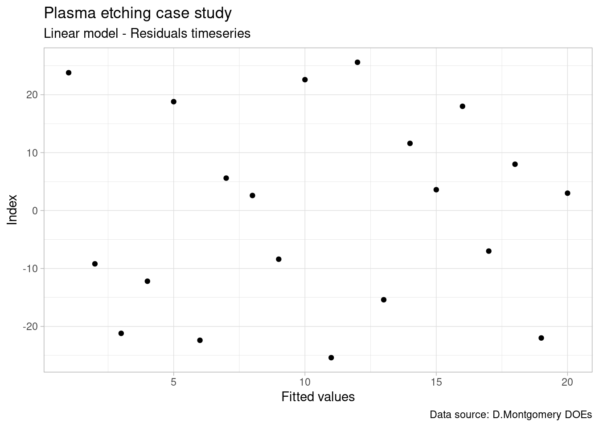
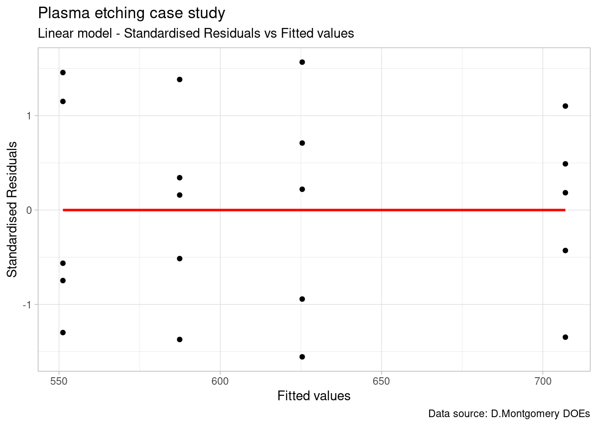

## One factor multiple levels

### Linear regression

We will present here a first example of the utilisation of linear regression techniques and establish a linear model. These models are going to be used extensively in the upcoming cases.

**Plasma etching example**

**Data loading**


```r
library(tidyverse)
library(janitor)
library(stats)
library(knitr)
filter <- dplyr::filter
select <- dplyr::select
```


```r
# Direct copy of the example from the book:
plasma <- read_csv("../industRial/data-raw/3-1_plasma_etching.csv") %>%
  clean_names()

plasma_narrow <- plasma %>%
  pivot_longer(
    cols = starts_with("x"),
    names_to = "observation",
    values_to = "etch_rate"
  )
```


```r
head(plasma_narrow) %>% 
  kable(align = "c", 
        caption = "plasma etching experiment data", 
        booktabs = T)
```


Table: (\#tab:tab-plasma_narrow)plasma etching experiment data

| power | observation | etch_rate |
|:-----:|:-----------:|:---------:|
|  160  |     x1      |    575    |
|  160  |     x2      |    542    |
|  160  |     x3      |    530    |
|  160  |     x4      |    539    |
|  160  |     x5      |    570    |
|  180  |     x1      |    565    |

**Raw data plot**
 

```r
ggplot(plasma_narrow, aes(x = power, y = etch_rate)) +
  geom_point() +
  theme_light() +
  theme(legend.position = "none") +
  labs(title = "Plasma case study",
       subtitle = "Raw data plot",
       x = "Power",
       y = "Etch rate")
```


#### Linear model function {#linearModel}

Here we're constructing a linear model of the raw data and not a model of the Anova, thus *power* has to be as integer and not as a factor, unlike in the Anova model.


```r
library(stats)
```


```r
plasma_lm <- lm(etch_rate ~ power, data = plasma_narrow)
summary(plasma_lm)
```

```

Call:
lm(formula = etch_rate ~ power, data = plasma_narrow)

Residuals:
   Min     1Q Median     3Q    Max 
-43.02 -12.32  -1.21  16.71  33.06 

Coefficients:
            Estimate Std. Error t value Pr(>|t|)    
(Intercept) 137.6200    41.2108   3.339  0.00365 ** 
power         2.5270     0.2154  11.731 7.26e-10 ***
---
Signif. codes:  0 '***' 0.001 '**' 0.01 '*' 0.05 '.' 0.1 ' ' 1

Residual standard error: 21.54 on 18 degrees of freedom
Multiple R-squared:  0.8843,	Adjusted R-squared:  0.8779 
F-statistic: 137.6 on 1 and 18 DF,  p-value: 7.263e-10
```

#### Linear model plot


```r
ggplot(plasma_narrow, aes(x = power, y = etch_rate)) +
  geom_point() +
  geom_smooth(method = "lm") +
  theme_light() +
  theme(legend.position = "none") +
  labs(title = "Plasma case study",
       subtitle = "Raw data plot",
       x = "Power",
       y = "Etch rate")
```


#### Linear model fixed effects

Reminder of fixed effects definition:

Fixed or Random Factor? The statistical model, Equation 3.2, describes two different situations with respect to the treatment effects. First, the a treatments could have been specifically chosen by the experimenter. In this situation, we wish to test hypotheses about the treatment means, and our conclusions will apply only to the factor levels considered in the analysis. The conclusions cannot be extended to similar treatments that were not explicitly considered. We may also wish to estimate the model parameters ($, .i, !2). This is called the fixed effects model. Alternatively, the treatments could be a random sample from a larger population of treatments. In this situation, we should like to be able to extend the conclusions (which are based on the sample of treatments) to all treatments in the population,


```r
plasma_narrow_factor <- plasma_narrow %>%
  mutate(power = as_factor(power))
plasma_lm_factor <- lm(etch_rate ~ power, data = plasma_narrow_factor)
summary(plasma_lm_factor)
```

```

Call:
lm(formula = etch_rate ~ power, data = plasma_narrow_factor)

Residuals:
   Min     1Q Median     3Q    Max 
 -25.4  -13.0    2.8   13.2   25.6 

Coefficients:
            Estimate Std. Error t value Pr(>|t|)    
(Intercept)  551.200      8.169  67.471  < 2e-16 ***
power180      36.200     11.553   3.133  0.00642 ** 
power200      74.200     11.553   6.422 8.44e-06 ***
power220     155.800     11.553  13.485 3.73e-10 ***
---
Signif. codes:  0 '***' 0.001 '**' 0.01 '*' 0.05 '.' 0.1 ' ' 1

Residual standard error: 18.27 on 16 degrees of freedom
Multiple R-squared:  0.9261,	Adjusted R-squared:  0.9122 
F-statistic:  66.8 on 3 and 16 DF,  p-value: 2.883e-09
```

### Model check & residuals

In order to assess the model performance we're going to look into the residuals. R provides direct ploting functions with the base and stats packages but in this first example we're going to break down the analysis and further customise the plots. We are also going to make usage of some additional statistical tests to confirm our observations from the plots. In subsequent chapters we'll have a more selective approach on a needed basis.

We start by loading the package broom which will help us retrieving the data from the lm object into a data frame.


```r
library(broom)
```

Now we build and show below an extract of the "augmented" dataframe 


```r
plasma_aug <- augment(plasma_lm_factor) %>%
  mutate(index = row_number())
plasma_aug %>%
  head() %>%
  kable(align = "c")
```


| etch_rate | power | .fitted | .resid | .hat |  .sigma  |  .cooksd  | .std.resid | index |
|:---------:|:-----:|:-------:|:------:|:----:|:--------:|:---------:|:----------:|:-----:|
|    575    |  160  |  551.2  |  23.8  | 0.2  | 17.57109 | 0.1326135 | 1.4566455  |   1   |
|    542    |  160  |  551.2  |  -9.2  | 0.2  | 18.67869 | 0.0198157 | -0.5630730 |   2   |
|    530    |  160  |  551.2  | -21.2  | 0.2  | 17.84638 | 0.1052218 | -1.2975161 |   3   |
|    539    |  160  |  551.2  | -12.2  | 0.2  | 18.53492 | 0.0348460 | -0.7466838 |   4   |
|    570    |  160  |  551.2  |  18.8  | 0.2  | 18.06913 | 0.0827465 | 1.1506275  |   5   |
|    565    |  180  |  587.4  | -22.4  | 0.2  | 17.72381 | 0.1174708 | -1.3709604 |   6   |

We can see we've obtained detailed model parameters such us fitted values and residuals for each DOE run.

#### Time sequence plot

For this plot we need to ensure that the order of plotting in the x axis corresponds exactly to the original data collection order. This plot allows us to assess for strange patterns such as a  tendency to have runs of positive of negative results which indicates that the independency assumption does not hold. If patterns emerge then there may be correlation in the residuals.


```r
plasma_aug %>%
  ggplot(aes(x = index, y = .resid)) +
  geom_point() +
  theme_light() +
  labs(
    title = "Plasma etching case study",
    subtitle = "Linear model - Residuals timeseries",
    y = "Index",
    x = "Fitted values",
    caption = "Data source: D.Montgomery DOEs"
  )
```



Nothing strange emerges from the current plot and the design shows as well randomised.

#### Autocorrelation test {#residualsCorrelation}

It is always good to keep in mind that all visual observations can be complemented with a statistical test. In this case we're going to use the durbinWatson test from the car package (Companion to Applied Regression).


```r
library(car)
```


```r
durbinWatsonTest(plasma_lm_factor)
```

```
 lag Autocorrelation D-W Statistic p-value
   1      -0.5343347      2.960893   0.098
 Alternative hypothesis: rho != 0
```

Although the output shows Autocorrelation of -0.53 we have to consider that the p value is greated than 0.05 thus there is not enough significance to say that there is autocorrelation. 

#### Residuals vs fit plot

If the model is correct and the assumptions hold, the residuals should be structureless. In particular they should be unrelated to any other variable including the predicted response.


```r
plasma_aug %>%
  ggplot(aes(x = .fitted, y = .resid)) +
  geom_point() +
  theme_light() +
  geom_smooth(method = "loess", se = FALSE, color = "red") +
  labs(
    title = "Plasma etching case study",
    subtitle = "Linear model - Residuals vs Fitted values",
    y = "Residuals",
    x = "Fitted values",
    caption = "Data source: D.Montgomery DOEs"
  )
```


In this plot we see no variance anomalies such as a higher variance for a certain factor level or other types of skweness.

#### Equality of variance test {#barlettTest}

In the plasma etch experiment, the normality assumption is not in question, so we can apply Bartlett’s test to the etch rate data (Bartlett’s test is very sensitive to the normality assumption). Consequently, when the validity of this assumption is doubtful, Bartlett’s test should not be used and in this case use instead the Modified Levene test.


```r
bartlett.test(etch_rate ~ power, data = plasma_narrow_factor)
```

```

	Bartlett test of homogeneity of variances

data:  etch_rate by power
Bartlett's K-squared = 0.43349, df = 3, p-value = 0.9332
```

The P-value is P = 0.934, so we cannot reject the null hypothesis. There is no evidence to counter the claim that all five variances are the same. This is the same conclusion reached by analyzing the plot of residuals versus fitted values.

#### Normality plot

As the sample size is relatively small we're going to use a qq plot instead of an histogram to assess the normality of the residuals.


```r
plasma_aug %>%
  ggplot(aes(sample = .resid)) +
  geom_qq() +
  geom_qq_line() +
  # coord_flip() +
  theme_light() +
  labs(
    title = "Plasma etching case study",
    subtitle = "Linear model - qq plot",
    y = "Residuals",
    x = "Fitted values",
    caption = "Data source: D.Montgomery DOEs"
  )
```


The plot suggests normal distribution. We see that the error distribution is aproximately normal. In the fixed effects model we give more importance to the center of the values and here we consider acceptable that the extremes of the data tend to bend away from the straight line.
The verification can be completed by a test. For populations < 50 use the shapiro-wilk normality test.

#### Shapiro test {#shapiroTest}


```r
shapiro.test(plasma_aug$.resid)
```

```

	Shapiro-Wilk normality test

data:  plasma_aug$.resid
W = 0.93752, p-value = 0.2152
```

p > 0.05 indicates that the residuals do not differ significantly from a normally distributed population.

#### Std residuals vs fit plot

This specific Standardized residuals graph also help detecting outliers in the residuals (any residual > 3 standard deviations is a potential outlier).


```r
plasma_aug %>% 
  ggplot(aes(x = .fitted, y = .std.resid)) +
  geom_point() +
  theme_light() +
  geom_smooth(method = "loess", se = FALSE, color = "red") +
  labs(title = "Plasma etching case study",
       subtitle = "Linear model - Standardised Residuals vs Fitted values",
       y = "Standardised Residuals",
       x = "Fitted values",
       caption = "Data source: D.Montgomery DOEs")
```



The plot shows no outliers to consider in this DOE.

#### Outlier test {#outlierTest}

In a case where we were doubtfull we could go further and make a statistical test to assess if a certain value was an outlier. A usefull test is available in the car package.


```r
outlierTest(plasma_lm_factor)
```

```
No Studentized residuals with Bonferroni p < 0.05
Largest |rstudent|:
   rstudent unadjusted p-value Bonferroni p
12 1.648813            0.11997           NA
```

In this case, the Bonferroni adjusted p value comes as NA confirming that there is no outlier in the data.   

#### Cooks distance plot


```r
plasma_aug %>% 
  ggplot(aes(x = .cooksd, y = .std.resid)) +
  geom_point() +
  geom_vline(xintercept = 0.5, color = "red") +
  theme_light() +
  # geom_smooth(method = "glm", se = FALSE, color = "red") +
  labs(title = "Plasma etching case study",
       subtitle = "Pod L volume linear model - Residuals vs Leverage",
       y = "Standardised Residuals",
       x = "Cooks distance",
       caption = "Data source: D.Montgomery DOEs")
```


#### R squared 

R² the coefficient of determination

The R square can be extracted from the linear model that has been used to build the Anova model.


```r
summary(plasma_lm_factor)$r.squared
```

```
[1] 0.9260598
```

Thus, in the plasma etching experiment, the factor “power” explains about 88% percent of the variability in etch rate.

Anova fixed effects assumes that:
- errors are normally distributed and are independent

As the number of residuals is too small we're not checking the normality via the histogram but rather with a a Q-Q plot.

### Prediction {#predict}

Here we're using the model with power as an integer:


```r
power_new <- data.frame(power = c(170, 190))
predict(plasma_lm, newdata = power_new)
```

```
     1      2 
567.21 617.75 
```
