--- 
title: "indust<b style='color:#38598CFF'>R</b>ial data science"
subtitle: Case studies in product development and manufacturing
author: "João Ramalho"
date: "2021-06-03"
# output: pdf_document
site: bookdown::bookdown_site
output:
  bookdown::gitbook:
    includes:
      in_header: includeme.html
    css: css/industRialds.css
    fontsettings:
      theme: white
      family: sans
      size: 1
documentclass: book
bibliography:
- book.bib
- packages.bib
biblio-style: apalike
link-citations: yes
editor_options:
  chunk_output_type: console
nocite: |
  @Broc2016, @Cano2012, @Cano2015, @Munro2015, @Scrucca2004, @Bass2007
description: ''
github-repo: "J-Ramalho/industRialds"
cover-image: "img/cover3.png"
---


# (PART) INTRODUCTION {-}

# Welcome {-}

<a href="">
  
</a> 

This is the online version of industRial data science, a book with tools and techniques for data analysis in Product Development and Manufacturing. It is organized around Case Studies in a "cookbook" approach, making it easier to directly adopt the tools. The examples come from varied manufacturing industries, mostly where repetitive production in massive quantities is involved, including: pharmaceuticals, food, electronics, watch making and automotive.

Product Development and Manufacturing are very important activities in society because bringing innovative products to the market has an immense potential to improve the quality of life of everyone. 

Additionally Data Science brings new powerful approaches to the engineering and manufacturing of consumer goods, helping minimizing environmental impact, improving quality and keeping costs under control.

**How to use this book**

We assume the reader is familiar with product development and manufacturing quality methodologies such as dmaic and six sigma and the related statistical concepts. We also assume the reader is already a user of the R programming language. The Case Studies then bring all the areas together in a practical way.

This book is better used as a reference book by using the navigation bar on the left to go a specific industrial domain. To reproduce the examples all the case studies data sets, example functions and the textbook original files can be downloaded as a package called `{industRial}`. For guidelines on how to use them refer to the sections [Datasets](#datasets) and [Functions](#functions)

Complementing the text, a series of tutorials can be accessed either online or locally to practice dynamically key statistical concepts. For the online option no specific software installation is required. A list of web links and detailed instructions on local installation can be seen in the section [Tutorials](#tutorials).

In the appendix we provide a detailed [Index](#contents) and a [Glossary](#glossary) and we refer to several good quality books on both Data Science and Product Development that have served to provide the required theoretical background. These cover key disciplines such as six sigma, statistics and computer programming. This book aims complementing them and showcase how to benefit from recent software in this area. A full list can be found in [References](#references).

**Content overview**

The case studies are organized according the a logical product development flow. The text starts with case studies in the domain of Design for Six Sigma. These are some practical tools in that help prioritizing problems and get focus on how to tackle them. The next group of case studies covers the domain of Measurement System Analysis, an initial important step when developing a product or manufacturing process. Here is discussed how to analyze the response of a measurement device in terms of its bias and its uncertainty. The next large group of case studies is the Design of Experiments. This corresponds to the core of the R&D activities and provides approaches to minimize the quantity of trials and time to reach to a sufficient knowledge of how the product or system works. Also on how to obtain the right balance on its features and properties to get the desired output. A final group of case studies presents ways to get the manufacturing process in control according to what was defined in the product development phase. These are the well known Statistical Process Control and Capability studies.

**Acknowledgements**

I would like to express my gratitude to the instructors and colleagues who have spent time sharing their knowledge, answering my questions and giving me inputs: Enrico Chavez, Iegor Rudnytskyi, Giulia Ruggeri, Harry Handerson and Bobby Stuijfzand from the EPFL ADSCV team; Jean-Vincent Le Bé, Jasmine Petry, Yvan Bouza, James Clulow and Akos Spiegel from the Nestlé STC team; Frank Paris from DOQS; Théophile Emmanouilidis and Sélim Ach from Thoth.

To report any issue or make suggestions please open an issue on the book repository:
[industRialds/issues](https://github.com/J-Ramalho/industRial/issues)

**About the authors**

<b style="color:#104e8b">João Ramalho</b> is a Senior Industrial Data Scientist with more than 20 years of experience in the manufacturing industry. He's been in varied positions in R&D, Operations and IT at Philip Morris, Rolex and Nestlé. He holds a Master in Mechanical Engineering from the IST of Lisbon, a PMP certification from the Project Management Institute and a Data Science certification from DataCamp. He's currently specializing in Data Visualization at the Swiss technical university EPFL. See full profile at [j-ramalho.github.io](https://j-ramalho.github.io/)


<!--chapter:end:index.Rmd-->


# Toolbox

## R and RStudio

Many tools exist to do Data Analysis and Statistics with different degrees of power and difficulty such as:

-   Spreadsheets: Excel, Libreoffice, Numbers
-   Proprietary software: Minitab, Mathlab
-   Programming languages: Visual Basic, R, Python, Julia
-   Databases: sqlite, postgre, mysql, mongodb

Choosing the right set of tools for Data Science is often not a very scientific task. Mostly is a matter of what is available and what our colleagues, customers or suppliers use. As with everything it is important to remain open to evaluate new tools and approaches and even to be able to combine them.

In this book we've chosen to provide all examples in R which is a free software environment for statistical computing and graphics. Besides taste and personal preference R brings a significant number of specific advantages in the field of Industrial Data Science:

R allows for reproducible research

This because the algorithms and functions defined to make the calculations can be inspected and all results can be fully reproduced and audited. This is known as reproducible research and is a critical aspect in all areas where a proof is needed such as in equipment validation and product quality reporting.

R functions and tools can be audited and improved 

Being an open source language, all R libraries and packages added to the basic environment can be audited, adapted and improved. This is very important because when we enter into details every industry has a slight different way of doing things, different naming conventions, different coeficients and so on.

R is extensible

R is compatible with most other software on the market and is an excellent "glue" tool allowing for example for data loading from excel files, producing reports in pdf and even building complete dashboards in the form of web pages.

Large documentation is available on installing and learning R, starting with the official sites [R-project](https://www.r-project.org/) and [RStudio](https://www.rstudio.com/).

## Packages

All industry specific tools applied throughout this book are available in the form of packages of the programming language R. As with all open source code, they're all available for download with freedom to modification and at no cost.

The amount of packages available is extremely large and growing very fast. When selecting new packages it is recommended to check the latest package update. Packages that have had no improvements since more than a couple of years should be questioned. The field evolves rapidly and compatibility and other issues can become painful. Two ways of obtaining statistics on package history are [metacran](https://www.r-pkg.org/) and [RStudio package manager](https://packagemanager.rstudio.com/).

Additionally an original package named `{industRial}` has been developed as a companion package for this book. 

### Installation {#installation}

The companion package to this book can downloaded from github with the following command:

    devtools::install_github("J-Ramalho/industRial")

The list below identifies which are the remaining packages required to run all the coded of the book examples. Note that it is not required to download them all at once.

The column *Download* precises if a package is downloaded automatically when the `{industRial}` package is downloaded (imports) or if it needs be downloaded manually by the reader (suggests). In technical terms this differentiation corresponds to the DESCRIPTION file and allows for a progressive installation of the required software.


|Download |Package    |Domain           |Version |Depends                                       |
|:--------|:----------|:----------------|:-------|:---------------------------------------------|
|imports  |viridis    |colors           |0.6.1   |R (>= 2.10), viridisLite (>= 0.4.0)           |
|imports  |readr      |data loading     |1.4.0   |R (>= 3.1)                                    |
|imports  |dplyr      |data wrangling   |1.0.6   |R (>= 3.3.0)                                  |
|imports  |forcats    |data wrangling   |0.5.1   |R (>= 3.2)                                    |
|imports  |janitor    |data wrangling   |2.1.0   |R (>= 3.1.2)                                  |
|imports  |magrittr   |data wrangling   |2.0.1   |NA                                            |
|imports  |tibble     |data wrangling   |3.1.2   |R (>= 3.1.0)                                  |
|imports  |tidyr      |data wrangling   |1.1.3   |R (>= 3.1)                                    |
|imports  |purrr      |data wrangling   |0.3.4   |R (>= 3.2)                                    |
|imports  |glue       |data wrangling   |1.4.2   |R (>= 3.2)                                    |
|imports  |stringr    |data wrangling   |1.4.0   |R (>= 3.1)                                    |
|imports  |patchwork  |plotting         |1.1.1   |NA                                            |
|imports  |ggplot2    |plotting         |3.3.3   |R (>= 3.2)                                    |
|imports  |scales     |plotting         |1.1.1   |R (>= 3.2)                                    |
|imports  |ggtext     |plotting         |0.1.1   |R (>= 3.5)                                    |
|imports  |broom      |statistics       |0.7.6   |R (>= 3.1)                                    |
|imports  |stats      |statistics       |4.0.5   |NA                                            |
|imports  |skimr      |statistics       |2.1.3   |R (>= 3.1.2)                                  |
|suggests |qicharts2  |industrial stats |0.7.1   |R (>= 3.0.0)                                  |
|suggests |qcc        |industrial stats |2.7     |R (>= 3.0)                                    |
|suggests |SixSigma   |industrial stats |0.9-52  |R (>= 2.14.0)                                 |
|suggests |DoE.base   |industrial stats |1.1-6   |R (>= 2.10), grid, conf.design                |
|suggests |rsm        |industrial stats |2.10.2  |NA                                            |
|suggests |agricolae  |industrial stats |1.3-3   |R (>= 2.10)                                   |
|suggests |ggraph     |networks         |2.0.5   |R (>= 2.10), ggplot2 (>= 3.0.0)               |
|suggests |tidygraph  |networks         |1.2.0   |NA                                            |
|suggests |igraph     |networks         |1.2.6   |methods                                       |
|suggests |ggforce    |networks         |0.3.3   |ggplot2 (>= 3.0.0), R (>= 3.3.0)              |
|suggests |bookdown   |publishing       |0.22    |NA                                            |
|suggests |knitr      |publishing       |1.33    |R (>= 3.2.3)                                  |
|suggests |kableextra |publishing       |NA      |NA                                            |
|suggests |gt         |publishing       |0.3.0   |R (>= 3.2.0)                                  |
|suggests |car        |statistics       |3.0-10  |R (>= 3.5.0), carData (>= 3.0-0)              |
|suggests |RcmdrMisc  |statistics       |2.7-1   |R (>= 3.5.0), utils, car (>= 3.0-0), sandwich |

In the book text we don't see the loading instructions for the installed packages over and over again everytime an example is given to avoid repetition (e.g. running `library(dplyr)` before each code chunk). Be sure to load at minimum the packages below before trying any example:

    ds_pkgs <- c("tidyverse", "scales", "janitor", "knitr", "stats", "industRial",
      "viridis", "broom", "patchwork")
    purrr::map(ds_pkgs, library, character.only = TRUE)

Beware of the common issue of *function masking*. This happens more often in R when compared to python. As we tend to load all the sets of functions from each package we end up with conflicting function names. In the scope of this text it is mostly the function filter() from `{dplyr}` which conflicts with the function with the same name from `{stats}`. We tackle this with the simple technique of adding `filter <- dplyr::filter` in the beginning of our script to precise which function we want to give priority and we pre-append the package name to all calls of the other function such as `stats::filter`. For more sophisticated ways to handle this issue we suggest the package `{import}`.

### Highlights

We're highlighting now some specific packages that are used in the book and that bring powerful features in analysis of data from R&D and Operations. Wherever they are required in the book we loaded them explicitly in the text to help tracking where the specific functions come from.

#### six sigma

`{SixSigma}` is a complete and robust R package. It provides many well tested functions in the area of quality and process improvement. We're presenting a full example with the gage r&R function in our MSA Case Study. As many other industrial packages, the `{SixSigma}` package is from before the `{tidyverse}` era and its plots have been not been developed with `{ggplot2}`. This makes integration in newer approaches harder. The data output is still nevertheless fully exploitable and very useful. The package is part of an excellent book with the same name published by @Cano2012.

#### qcc

The Quality Control Charts package, `{qcc}` is another very complete and solid package. It offers a very large range of statistical process control charts and capability analysis. Several examples of the control charts are available in its vignette: [qcc vignette](https://luca-scr.github.io/qcc/articles/qcc.html) that we develop further in our SPC Case Studies.

#### qicharts2 {#qicharts2}

We recommend `{qichart2}` specifically for the good pareto plots. The package also provides statistical process control charts which are based on `{ggplot2}` and can serve as an easier alternative to the `{qcc}` package. As many niche packages we need to be aware that the number of contributors is small meaning that it cannot be as thoroughly tested as community packages.

#### DoE.base

This package is one of the most complete and vast packages in Design of Experiments. `{DoE.base}` is a first of a large suite of packages on the topic, it has vast functionality and is very well documented. We do some exploration of the automatic generation of designs in the DOE case studies. Full documentation available under: [DoE.base](http://prof.beuth-hochschule.de/groemping/software/doe/?L=1&print=1)


#### agricolae

Agricolae is a long tested package in the domain of design of experiments. It has been developed for the domain of Agricultural Research but can be used elsewhere. We make a small use, specifically to obtain the function fisher LSD but believe the package has a wealth of functions and methodologies to be explored.

#### rsm

The Response Surface Methods `{rsm}` is the best option in our view to produce 3D plots from linear models. It has specific features to use directly the models removing all the work to produce the data and feed generic 3D plotting functions. The package is larger than this and contains many support functions in the domain of design of experiments.

#### car

The `{car}` package which stands for Companion for Applied Regression is also used in many occasions as it contains many useful functions to assess the performance of linear models and anova. This package is combined with a complete book by @Fox2019.

#### RcmdrMisc

This package by the same author of the `{car}` provides additional miscellaneous functions for statistical analysis. Although it is part of a point and click interface for R we value it for its functions and plots in the domain of linear regression.

#### broom

The mission of `{broom}` is to *Convert statistical objects into tidy tibbles*. This is quite usefull when we want to reuse the output of the statistical analysis such as the R-squared in data pipelines with `{tidyverse}` packages. It becomes specially handy to obtain printing quality outputs in `{Rmarkdown}` documents with tables rendered with `{kable}` and in `{shiny}` apps. Several examples are present throughtout our book and mostly in the tutorials.

#### skimr {#skimr}

This package comes from [ropensci](https://ropensci.org/) a strong and open community supported by large global organizations such as the NASA. `{skimr}` is an interesting and powerful alternative to the base `summary()` function. Two main features make it a strong candidate for regular utilization: the first is its tight integrated with `{tidyverse}` and `{knitr}` making it possible to integrate it in pipelines, filtering and so on and in Rmarkdown chunks with specific printing arguments; the second is its extensive customization capabilities allowing to add and remove indicators, data types and presentation formats and agregration levels.

#### stats

Many functions from the packages discussed before are built on the large and extremely well tested `{stats}` package. This package is installed directly with R and consolidates software code that has been improving and tested for decades. As an example the source code of the [lm](https://svn.r-project.org/R/trunk/src/library/stats/R/lm.R) function has close to 1000 lines. The complete package has more than 400 functions that can be listed with `library(help = "stats")` or `ls("package:stats")` 

## Datasets {#datasets}

All datasets presented throughout the book are fully anonymized. Once the package is correctly installed it can be loaded in the R session as usual with the library() function.

    devtools::install_github("J-Ramalho/industRial")
    library(industRial)

The primary goal of `{industRial}` is to make easily available all the data sets from all case studies. We can easily look for a data set by typing `industRial::` and tab. The complete list can also be obtained with the snippet below: 


```r
data(package = "industRial") %>%
  pluck("results") %>%
  as_tibble() %>%
  select(Item, Title) %>%
  kable()
```


|Item               |Title                                                                                     |
|:------------------|:-----------------------------------------------------------------------------------------|
|battery_charging   |Charging time of a lithium-ion battery.                                                   |
|dial_control       |Collection of visual defects on watch dial production.                                    |
|ebike_hardening    |Cycles to failure of ebikes frames after temperature treatment.                           |
|ebike_hardening2   |Cycles to failure of ebikes frames after temperature treatment.                           |
|juice_drymatter    |Dry matter content of different juices obtained with two different measurement devices.   |
|perfume_experiment |Correlation matrix of the input variables of an experiment design in perfume formulation. |
|pet_delivery       |Tensile strength values on PET raw material for the clothing industry.                    |
|pet_doe            |A factorial design for the improvement of PET film tensile strength.                      |
|solarcell_fill     |Yearly outputs and fills factor of solarcells of different types.                         |
|solarcell_output   |Yearly outputs of solarcells of different types.                                          |
|syringe_diameter   |Production measurements of the inner diameter of syringes barrels.                        |
|tablet_thickness   |Thickness measurements of pharmaceutical tablets                                          |
|tablet_weight      |Weight measurements of pharmaceutical tablets                                             |

Once the package is loaded the data objects become immediately available in memory and can directly be used in the examples presented or for further exploration. Lets confirm this invoking the first data set:


```r
dial_control %>%
  head() %>%
  kable()
```


|Operator |Date       |Defect  |Location |id    |
|:--------|:----------|:-------|:--------|:-----|
|Jane     |2018.01.31 |Indent  |3h       |D2354 |
|Jane     |2018.02.02 |Indent  |3h       |D2355 |
|Jane     |2018.02.02 |Indent  |4h       |D2356 |
|Peter    |2018.02.02 |Indent  |10h      |D2357 |
|Jane     |2018.02.03 |Scratch |3h       |D2358 |
|Jane     |2018.02.03 |Indent  |3h       |D2359 |

The dateset can be used and manipulated like any other dataset created in the session or loaded otherwise. For example it can be filtered and assigned to a new variable name:


```r
dial_peter <- dial_control %>%
  filter(Operator == "Peter") 
dial_peter %>%
  head(2) %>%
  kable()
```


|Operator |Date       |Defect  |Location |id    |
|:--------|:----------|:-------|:--------|:-----|
|Peter    |2018.02.02 |Indent  |10h      |D2357 |
|Peter    |2018.02.03 |Scratch |4h       |D2360 |

## Functions {#functions}

Besides the data sets the `{industRial}` package also contains toy functions to plot Statistical Process Control (SPC) charts. The objective here is to showcase how to build such functions and their scope of application is limited to the book case studies. For complete and robust SPC functions we recommend using the `{QCC}` package also described below.

Additionally the package contains theme functions to print and customize the aesthetics of spc charts and other charts. These themes are built on top of the `{ggplot2}` by H.Wickham and `{cowplot}` package by Claus O.Wilke. The main objective is to give the reader a starting point for customization of charts in this domain.

A functions can conveniently be accessed on the console with `industRial::` and then tab. The complete list of themes and functions can be seen with:


```r
lsf.str("package:industRial") %>%
  unclass() %>%
  as_tibble() %>%
  kable()
```


|value               |
|:-------------------|
|chart_Cpk           |
|chart_I             |
|chart_IMR           |
|expand_formula      |
|off_spec            |
|process_Cpk         |
|process_stats       |
|process_stats_table |
|ss.rr.plots         |
|theme_industRial    |
|theme_qcc           |

For each function a help page is available and can be obtained the same way as any other R data sets, themes and functions with `?<object>` (e.g. ?chart_xbar)

To go even deeper and get access to all the code, the original book Rmd files are also bundled in the package and can be seen in the book folder. A way to get the exact folder path is:


```r
paste0(.libPaths()[1], "/industRial/book")
```

```
[1] "/home/joao/R/x86_64-pc-linux-gnu-library/4.0/industRial/book"
```

# Tutorials {#tutorials}

A set of practical exercises on key concepts presented throughout this book is available either on the web or locally, instructions follow.

<br>

## On the web

the tutorials in the list below are published on the shinyapp.io server and can be freely accessed with the links below:

+------------------------------------------------------------------+--------------------------------------------------------------------------------------------------------------------------------------------------------------------------------------------------------------------------------------------------------------------------------------+
| Topic/Link                                                       | Content                                                                                                                                                                                                                                                                              |
+==================================================================+======================================================================================================================================================================================================================================================================================+
| [Pareto chart](https://j-ramalho.shinyapps.io/pareto/)           | This tutorial builds on the *The dial polishing workshop* case study from the Design for Six Sigma chapter, train building pareto charts using the `{qichart2}` package and explore how playing with different variables gives new insights into apparently simple data collections. |
+------------------------------------------------------------------+--------------------------------------------------------------------------------------------------------------------------------------------------------------------------------------------------------------------------------------------------------------------------------------+
| [DOE Anova](https://j-ramalho.shinyapps.io/anova/)               | This tutorial explores how the p value is calculated by playing with a dynamic anova chart. This exercise is based on the *The e-bike frame hardening process* of the DOE Interactions chapter.                                                                                      |
+------------------------------------------------------------------+--------------------------------------------------------------------------------------------------------------------------------------------------------------------------------------------------------------------------------------------------------------------------------------+
| [Response Surface](https://j-ramalho.shinyapps.io/surface/)      | This tutorial tests 3D visualization skills by playing with 3D response surface plots and the related interaction plots using the battery_charging dataset and the `{rsm}` package.                                                                                                  |
+------------------------------------------------------------------+--------------------------------------------------------------------------------------------------------------------------------------------------------------------------------------------------------------------------------------------------------------------------------------+
| [Process Capability](https://j-ramalho.shinyapps.io/capability/) | In this tutorial we can play with the process centering variability and see how this is translated in the process indicators "percentage out of spec" and Cpk.                                                                                                                       |
+------------------------------------------------------------------+--------------------------------------------------------------------------------------------------------------------------------------------------------------------------------------------------------------------------------------------------------------------------------------+

<br><br>

## Locally

The same set of tutorials can also be run locally which can be convenient as they load faster. This also allows for further exploration as the original tutorial code becomes available. For downloading instructions refer to the packages (#installation) session.

Next load the packages:

    library(industRial)
    library(learnr)

and list the tutorials with:


```r
learnr::available_tutorials(package = "industRial")
```

```
Available tutorials:
* industRial
  - anova      : "industRial practice"
  - capability : "industRial practice"
  - pareto     : "industRial practice"
  - surface    : "industRial practice" 
```

choose a tutorial and run it as follows:

    learnr::run_tutorial(package = "industRial", "anova")

The original files are available in the package tutorials folder. Their names correspond to the tutorial names listed before so there is a simple way to open the desired file, e.g.:

    rstudioapi::navigateToFile(
      paste0(.libPaths()[1], "/industRial/tutorials/anova/anova.Rmd")
      )

<!--chapter:end:2_toolbox.Rmd-->


# (PART) CASE STUDIES {-}

# Design for Six Sigma

Quality tools have been grouped under varied names and methodologies being Six Sigma one of the most well known and comprehensives ones. The domain is vast as seen in the many tools collected and described in the Six Sigma book by @Munro2015. For this section we've selected a few cases that strongly support Measurement System Analysis, Design of Experiments and Statistical Process Control. Beside supporting the remaining sections, they also pretend to showcase how R can be used also for other purposes than data wrangling and visualization in the domain of industrial data science, typically to obtain easily reproducible diagrams. 

We start with a case on a dial workshop in the watch making industrial where the pareto chart comes handy. We then move to a dental prosthesis laboratory to see how a simple fishbone diagram can help pinpoint special causes of the measurement variation of an optical device and we finish we two different approaches on how to optimize experiment execution by assess the correlation between the outputs in order to minimize the parameters to measure.

## Pareto analysis

<div class="marginnote">
<b class="highlight">Case study: dial polishing workshop</b>

Watch dials are received from the stamping process and polished before being sent to the final assembly. As part of the autonomous quality control performed by the polishing operators a count of the defects observed on the dials each day is logged in a spreadsheet. 


</div>

The pareto chart has always proven an effective way of defining priorities and keeping workload under control. It is known for helping focusing on the few important elements that account for most problems. It builds on the well known insight that a few reasons explain or allow to control most of the outcome. This applies particularly well in the technological and industrial context.

Often in workshop setups the priorities of day are set by the informal discussions between team members. It is important to be sensitive to the last problem observed or the latest request from management but it is also important to look at data, particularly over a period of time. When looking at simple things as counts and frequencies we sometimes get surprised of how different our perception is from the reality shown by the data collected.

Collecting data can be done in many different forms and there's no right or wrong. It can be noted on a board, log book, spreadsheet or in a dedicated software. 

In a <b class="highlight">dial polishing workshop</b> of a watchmaking manufacture, the assembly operators have been collecting dial defects in a spreadsheet. Logging a defect doesn't mean the dial is directly scrapped. Putting away parts has strong impact on the cost of the operation and has to be done on clear criteria. Sometimes the parts can be rework with minor effort. The datalog corresponds to the status of the dials as they arrive from the stamping and before entering the polishing operation. Their dataset with the name `dial_control` shows each dial unique number and the general and defect information noted by the operators.

### Collecting defects

<div class="marginnote">
All datasets are available by loading the book companion package with `library(industRial)`. Full instructions in the [datasets](#datasets) session.
</div>


```r
head(dial_control) %>% 
  kable(align = "c", 
        caption = "dial control data", 
        booktabs = T)
```


Table: (\#tab:tbl-dial)dial control data

| Operator |    Date    | Defect  | Location |  id   |
|:--------:|:----------:|:-------:|:--------:|:-----:|
|   Jane   | 2018.01.31 | Indent  |    3h    | D2354 |
|   Jane   | 2018.02.02 | Indent  |    3h    | D2355 |
|   Jane   | 2018.02.02 | Indent  |    4h    | D2356 |
|  Peter   | 2018.02.02 | Indent  |   10h    | D2357 |
|   Jane   | 2018.02.03 | Scratch |    3h    | D2358 |
|   Jane   | 2018.02.03 | Indent  |    3h    | D2359 |

We can see that the count includes both the deffect type and the location (the hour in the dial) and that it is traced to the day and operator.

The team leader promotes a culture of fact based assessment of the quality measurements. Every week the team looks back and observes the weekly counts. When the quantity of data get bigger trends to start becoming apparent. The team can discuss potential actions and prepare reporting to the supplier of the parts (the stamping workshop). It also helps calibrating between operators and agreeing on acceptance criteria and what is and what is not a defect. 

Recently there have been lots of talk about scratched dials and there's a big focus on how to get rid of them. For their weekly review Christophe has prepared a pareto chart in R.

### Pareto chart {#paretochart}

<div class="marginnote">
See [{qicharts2}](#qicharts2) for more details on this R package
</div>


```r
library(qicharts2)
```


```r
d_type <- dial_control %>% pull(Defect) %>% as.character()
d_type_p <- paretochart(d_type, 
                           title = "Watch dial Defects",
                           subtitle = "Pareto chart", 
                           ylab = "Percentage of deffects",
                           xlab = "Deffect type",
                           caption = "Source: dial polishing workshop")
d_type_p + 
  theme_industRial()
```


As often happens we can see that the first two defects account for more than 80% of the problems. Scratching levels are in fact high but they realize indentation is even higher. Is it clear what indentation is? Have we been noting sometimes indentation for scratches? Where to draw the line? and are the causes of these two defects the same?

The decides to go deeper in the analysis and Peter says that a potential cause is the fixing tool that holds the dial on the right. To check Peter's hypothesis Jane prepares another plot by location for the next week review.


```r
d_location <- dial_control %>% pull(Location) %>% as.character()
d_location_p <- paretochart(d_location, 
                           title = "Watch dial deffects",
                           subtitle = "Pareto chart", 
                           ylab = "Percentage of deffects",
                           xlab = "Deffect location (hour)",
                           caption = "Source: Dial workshop")
d_location_p +
  theme_industRial()
```

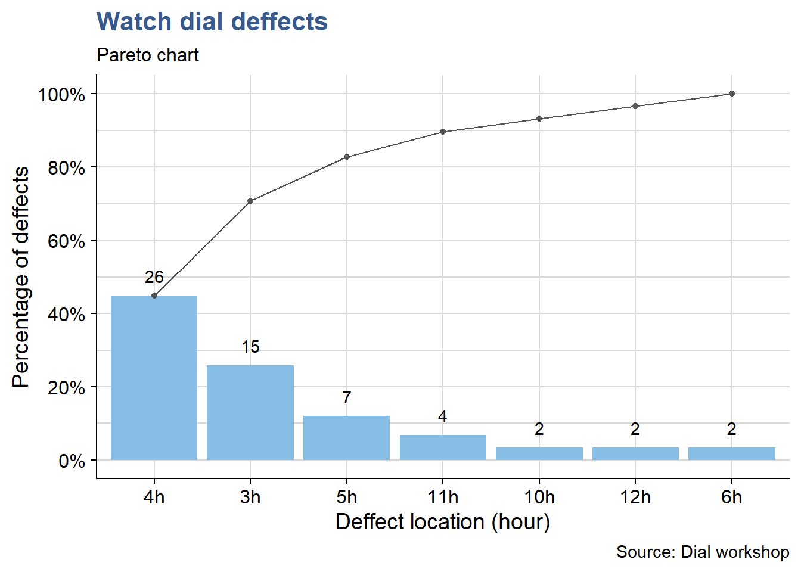

Effectively there are many defects at 3h corresponding to the position on the right of the dial (and even more at 4h). Peter's assumption may be right, the team decides to gather in the first polishing workbench and share openly how each of them fixes the dial to try to understand if there is a specific procedure or applied force that creates the defect. 

This example shows how data collecting can be simple and effective. if no one in the team is using R yet, a simple pareto chart could be done more simply with a spreadsheet. What R brings is the possibility to quickly scale up: handling very large and constantly changing files for example and also the possibility to directly and simply produce pdf reports or dynamic web applications to collect and visualize the data.

To practice and go further in the exploration of pareto charts checkout the tutorials section.

## Root cause analysis

<div class="marginnote">
<b class="highlight">Case study: dental prosthesis laboratory</b>

An optical measurement device has just been installed in a large Dental Prosthesis Manufacturing Laboratory. It is precise but expensive device based on laser technology which has been installed in a dedicated stabilized workbench. 


</div>

Usually called Fishbone or Ishikawa diagrams this simple tool has proven to be extremely practical and helpful in structuring team discussions. 

With it we can easily identify and list the expected influencing factors in various contexts such as the preparation of an experiment design. Selection and grouping input parameters can be useful in defining for example the right mix of ingredients in a new product, in selecting manufacturing parameters in an industrial production line or in the definition of a draft operating procedure for a measurement device. In each of these situations it helps seeing the big picture and not fall into the trap of relying only in the data and findings obtained by statistical analysis.

In this case study we're exploring the creation of Ishikawa diagrams with the `{qcc}` package. @Cano2012 recommends the utilization of R even for such simple diagrams with clear arguments on reproducibility and ease of update. If R and programming is already part of the working culture and there's someone in the team this makes perfect sense.

The lab manager of a <b class="highlight">dental prosthesis laboratory</b> has acquired a optical device for the precise measurement of the dental impressions that serve as models for the production of the crowns and bridges.

The lab has been having complains and several parts have been returned from the dentists and had to be partially or totally reworked. Besides the potential troubles to patients and the already incurred financial losses there is a reputation loss of which the lab manager is very concerned with. Regardless of all this the acquisition decision has taken more than a year.

After installation and in spite all the precautions it has been reported and now demonstrated with some specific trials that the measurements have a high variation which is preventing putting it in operation. Until now the laboratory team has always had full confidence in the equipment supplier and the Lab Manager has even seen the same equipment operating in another laboratory from the group.

The supplier has been called on site to check the equipment and having seen no reason for the variability proposes to work with the lab team on identifying the potential causes for the high uncertainty in their measurements. They decided to consider a larger scope than just the equipment and take the full measurement method as described in the laboratory operating procedure. They organize a brainstorm, list different reasons related with they're work and group them.

### Brainstorming


```r
operators <- c("Supplier", "Lab Technician", "Lab Manager")
materials <- c("Silicon", "Alginate", "Polyethers")
machines <- c("Brightness", "Fixture", "Dimensional algorithm")
methods <- c("Fixture", "Holding time", "Resolution")
measurements <- c("Recording method", "Rounding", "Log")
groups <- c("Operator", "Material", "Machine", "Method", "Measurement")
effect <- "Too high uncertainty"
```

One of the team members is using R and he has generating all previous reports on the topic with R markdown. He simply adds to the last report a call to the `{qcc}` package and quickly obtains a simple diagram that allows for a quick visualization of these influencing factors.

### Ishikawa digram {#ishikawa}


```r
library(qcc)
```


```r
cause.and.effect(
  title = "Potential causes for optical measurement variation",
  cause = list(
    Operator = operators,
    Material = materials,
    Machine = machines,
    Method = methods,
    Measurement = measurements
  ),
  effect = effect
)
```


The listed factors can now be addressed either one by one or in combined experiments to evaluate their impact on the measurement method. The lab team has decided to assess the method robustness to the brightness and to the dimensional algorithm and will prepare an experiment design with several combinations of these parameters to evaluate them. Using the diagram they can easily keep track of what has been listed, tested and can be eliminated as root cause.

## Correlations

<div class="marginnote">

<b class="highlight">Case study: perfume distillation experiment</b>

A Project Manager in perfume formulation needs to understand in detail the impact of the perfume manufacturing line parameters variation (e.g. temperature, pressure and others) in typical perfume sensorial characteristics such as the floral notes.


</div>

A correlation matrix is a way to discover relationships between groups of items. Such matrix can also be used to select which output measurement should be done in priority in a design of experiments (DOE). In exploratory phases when the experiments are repeated several time with slightly different configurations, secondary outputs that are strongly correlated to main outputs can be eliminated 

In an industrial setup the cost of experimenting is often very high. With this approach engineers and scientists can keep the test quantities in control and avoiding measurements until final stages of implementation. We explore in this case study two different techniques, one with a tile plot and another more advanced with a network plot.

A DOE consists in a series of trials where several inputs are combined together and important outputs are measured (further details can be seen in the DOE chapter). Commonly DOE analysis results linking inputs to outputs are presented with effects plots and interaction plots but before getting it is important to check the correlation between the outputs. Often there groups of outputs move together even if there is no cause and effect relationship between them. We can see this correlation in a tile plot.

A team of experts of a manufacturer of fragrances has listed 23 different output variables of interest for an exploratory <b class="highlight">perfume distillation experiment</b>. Facing such extensive list the Project Manager decided to put the team together a second time to try to set priorities. The approach was to guess the results of the experiment which allowed to go deeper in the technology and to construct an experiment plan in a meaningful way. The experts inputs have been captured in a a two entry table named `perfume_experiement`.

### Matrix {#matrix}


```r
perfume_experiment[1:6, 1:7]%>%
  kable(
    align = "c",
    caption = "perfume DoE correlation matrix of the outputs",
    booktabs = T
  ) 
```


Table: (\#tab:tbl-perfume)perfume DoE correlation matrix of the outputs

| yy | pw | w  | pm | pe | f | it |
|:--:|:--:|:--:|:--:|:--:|:-:|:--:|
| pw | 0  | 10 | 3  | 3  | 2 | 2  |
| w  | 0  | 0  | 3  | 3  | 2 | 2  |
| pm | 0  | 0  | 0  | 6  | 6 | 0  |
| pe | 0  | 0  | 0  | 0  | 6 | 0  |
| f  | 0  | 0  | 0  | 0  | 0 | 7  |
| it | 0  | 0  | 0  | 0  | 0 | 0  |

In the matrix the experiment output variables are named with coded names made of two letters. They represent the production Line Parameters (e.g. t = temperature, o = opening, pw = power) and the Perfume Attributes (f = flower). We can see in the table what the experts have noted the expected correlation strengths in an unusual way from 1 to 10, with 10 being the highest. In order to prepare a visual representation with a tile plot from `{ggplot2}` the data is transformed to long format. An additional trick is to convert the values at zero to NA so that they get directly transparent on the plot.

<div class="marginnote">
Values at zero in the dataset are converted to type NA_real_ to obtain a transparent background in the the tileplot. 
</div>


```r
perfume_long <- perfume_experiment %>%
  pivot_longer(
    cols = -yy,
    values_to = "correlation",
    names_to = "xx"
  ) %>%
  mutate(correlation = if_else(
    correlation == 0, NA_real_, correlation)) %>%
  mutate(correlation = as_factor(correlation))
```

### Tileplot {#tileplot}


```r
perfume_long %>%
  ggplot(aes(x = xx, y = yy, fill = correlation)) +
  scale_fill_viridis_d(direction = -1, name = "Correlation\nStrength") +
  geom_tile() + 
  labs(
    title = "The Perfume destilation experiment",
    subtitle = "Output variables correlation plot ",
    x = "",
    y = "",
    caption = "Anonymised data"
  ) +
  theme_industRial()
```

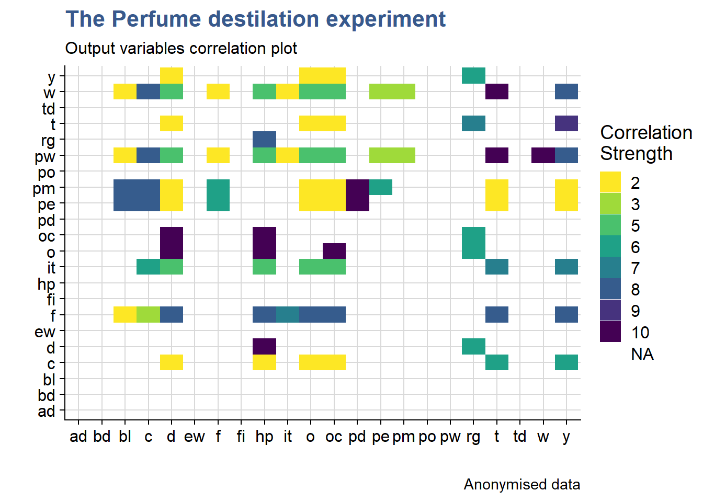

The plot shows that many parameters are expected to move together. Looking in detail the flow aroma moves together with other sensory attributes such as hp, o and oc. After this first DoE the real correlations will be established and the team expects to be able to avoid a significant part of the measurements that have a correlation higher than 50% from the second DoE onward.

## Clustering

In this second analysis of the <b class="highlight">perfume distillation experiment</b> we present a more advanced but more powerful approach using network plots. It explores an automatic way to clustering the variables and a specific way to present such clusters.

Technically we're going to build a weighed non directional network(tbl_graph) object. Several steps of conversion are required for this approach first with functions from various packages from the networks domain.


```r
library(igraph)
library(tidygraph)
library(ggraph)
```

The first step consists in converting the "Perfume" tibble to a matrix format:

<div class="marginnote">
The perfume_experiment is originaly coded as a tibble object. 
</div>


```r
perfume_matrix <- perfume_experiment %>%
  column_to_rownames("yy") %>%
  as.matrix()
```

Then using the `{igraph}` package we convert the matrix into a graph object:


```r
perfume_graph <- graph_from_adjacency_matrix(
  perfume_matrix, mode = "undirected", weighted = TRUE
  )
```

to finally convert it into a tibble graph with `{tidygraph}` package:


```r
perfum_tbl_graph <- as_tbl_graph(perfume_graph, add.rownames = "nodes_names")
```

As mentioned the experts have provided the correlation strength in the unusual scale from 1 to 10 which was easier for them during discussion. Here we're here converting it back to the 0 to 1 which is more common in the statistics community. For simplicity, negative correlations were not considered just the strength, enabling the network to be unidirectional.


```r
perfum_tbl_graph <- perfum_tbl_graph %>%
  activate(edges) %>%
  mutate(weight = weight/10)
perfum_tbl_graph
```

```
# A tbl_graph: 22 nodes and 85 edges
#
# An undirected simple graph with 7 components
#
# Edge Data: 85 x 3 (active)
   from    to weight
  <int> <int>  <dbl>
1     1     2    1  
2     1     3    0.3
3     1     4    0.3
4     1     5    0.2
5     1     6    0.2
6     1     8    0.8
# … with 79 more rows
#
# Node Data: 22 x 1
  name 
  <chr>
1 pw   
2 w    
3 pm   
# … with 19 more rows
```

In the previous chunk output we see a preview of the tibble graph object with the first few nodes and edges. Now we create a vector with various igraph layouts to allow for easier selection when making the plots:


```r
igraph_layouts <- c('star', 'circle', 'gem', 'dh', 'graphopt', 'grid', 'mds', 
                    'randomly', 'fr', 'kk', 'drl', 'lgl')
```

and do a first network plot to check data upload:


```r
perfum_tbl_graph %>% 
  ggraph::ggraph(layout = "igraph", algorithm = igraph_layouts[7]) +
  geom_edge_link(aes(edge_alpha = weight)) +
  geom_node_label(aes(label = name), repel = TRUE) +
  # theme_graph() +
  labs(title = "DOE Perfume Formulation - Inputs",
       subtitle = "Most important expected correlations")
```


Data loading is now confirmed to have been done correctly and we can now move into the clustering analysis. We use different clusters algorithms to generate the groups.

### Clustering algorithms


```r
perfum_tbl_graph <- perfum_tbl_graph %>%
  activate(nodes) %>%
  mutate(group_components = group_components(),
          group_edge_betweenness = group_edge_betweenness(),
          group_fast_greedy = group_fast_greedy(),
          group_infomap = group_infomap(),
          group_label_prop = group_label_prop(),
          group_leading_eigen = group_leading_eigen(),
          group_louvain = group_louvain(),
          group_walktrap = group_walktrap()
         )
```

There's extensive research behind of each of these algorithms and detailed information can be obtained starting simply with the R help system. For example for one selected here type `?group_louvain` or `?cluster_louvain` on the console. Digging deeper it is possible to find the author names and the papers explaining how and when to use them.

To produce the final plot some trial and error is needed to select the algorithm that gives the best clustering results. Now for the final step we also need to load some specific support packages for advanced plotting.


```r
library(ggforce)
library(ggtext)
```

### Network plot {#network_plot}


```r
perfum_tg_2 <- perfum_tbl_graph %>% 
  activate(edges) %>% 
  mutate(weight2 = if_else(weight >= 0.8, 1, if_else(weight >= 0.5, 0.5, 0.1)))

my_palette <- c(viridis(12)[3], viridis(12)[9], 
                "gray40", "gray40", "gray40", "gray40", 
                "gray40", "gray40", "gray40", "gray40")

set.seed(48)

perfum_tg_2 %>% 
  activate(nodes) %>% 
  mutate(group = group_louvain) %>% 
  filter(group %in% c(1,2)) %>% 
  ggraph(layout = "igraph", algorithm = igraph_layouts[7]) +
   geom_mark_hull(mapping = aes(x, y, 
                               group = as_factor(group), 
                               fill = as_factor(group)),
               concavity = 0.5,
               expand = unit(4, 'mm'),
               alpha = 0.25,
               colour = 'white',
               show.legend = FALSE) + 
  geom_edge_link(aes(edge_alpha = weight2, edge_width = weight2)) + 
  geom_node_point(size = 3) +
  geom_node_label(aes(label = name), repel = TRUE) +
  scale_edge_width(range = c(0.2, 1), name = "Correlation strength") +
  scale_edge_alpha(range = c(0.05, 0.2), name = "Correlation strength") + 
  scale_fill_manual(values = my_palette) + 
  # theme_graph() +
  labs(
    title = str_c("<span style='color:#433E85FF'>Line Parameters</span>", 
    " and ", "<span style='color:#51C56AFF'>Perfume Attributes</span>"),
    subtitle = "Clustering the outputs of Perfume Formulation DOE01",
    caption = "Clustering by multi-level modularity optimisation (louvain)") +
  theme(plot.title = element_markdown(family = "Helvetica",
                                      size = 14, 
                                      face = "bold")) 
```


<br>

We can see that the algorithm is grouping elements that have a strong correlation. Most stronger correlations are mostly presented within elements of each cluster. This is expected as certain perfume sensorial attributes are strongly correlated and the same for certain Line Parameters.e The code presented can now easily be reused once the DOE is executed to compare with the real correlations measured. Once knowledge is built and confirmed on which outputs are strongly correlated a selection of the key parameters can be done. This strongly simplifies the experiments by reducing the number of outputs to measure and reduces the cost and lead time of new formulations.


<!--chapter:end:3_sixsigma.Rmd-->


# Measurement System Analysis {#MSA}

Analyzing and validating measurement methods and tools is the base for ensuring the quality of manufacturing products. For most commercial products it is not simply about satisfying consumer expectations but has regulatory and legal implications. Using measurement tools in industrial setups for high volume production goes naturally beyond buying and installing an equipment. It requires clear operating procedures, trained operators and tested devices for the specific range applications and products. 

There are many different normalizing bodies in the metrology domain with different approaches and terminology. The cases in this section follow a simplified step by step approach aiming at giving an overview of how data treatment can be done with R.

The first case treats the calibration of a recently acquired measurement device by comparing it to a reference device. It provides statistical analysis of the bias of the method compared with the reference for the full measurement range. The following case deals with the estimation of the method precision, namely the measurement repeatability and reproducibility under regular utilization conditions. It provides examples on acceptance criteria typical in industrial context. The final case study presents calculation of the method uncertainty, a more comprehensive indicator taking into account the calculations done in the previous cases.

## Calibration

<div class="marginnote">

<b class="highlight">Case study: juice production plant</b>

The Quality Assurance Head has acquired a fast dry matter content measurement device from the supplier DRX. The rational for the acquisition has been the important reduction of the control time. Before it enters operation its performance is being assessed and validated.


</div>

A first step after a measurement equipment acquisition is the assessment of the response over the entire measurement range. In particular it is important to verify its linearity and variability and determine the average bias throughout the measurement range. 

In a <b class="highlight">juice production plant</b> the dry matter content for the top seller is around 13% dry matter content. Typical specifications are the Premium fresh apple juice with 12.4 % and the Austrian beetroot juice with 13.2%. Some other specialties may have a higher content up such as the Organic carrot that has 16.3%. After consulting with the Manufacturing Team Leader, the Quality Assurance Head selects checking the equipment in the range of 10 to 20% dry matter content. For the calibration assessment samples are produced at target values set at round numbers (10%, 15% and so on). This data is captured in the `juice_drymatter` dataset of which we're checki


```r
juice_drymatter %>%
  head(5) %>%
  kable(
    align = "c",
    caption = "juice dry matter data"
        )
```


Table: (\#tab:code-juicesummary)juice dry matter data

| product  | drymatter_TGT | speed | particle_size | part | drymatter_DRX | drymatter_REF |
|:--------:|:-------------:|:-----:|:-------------:|:----:|:-------------:|:-------------:|
|  apple   |      10       |  20   |      250      |  1   |     9.80      |     10.05     |
|  apple   |      10       |  20   |      250      |  2   |     9.82      |     10.05     |
|  apple   |      10       |  20   |      250      |  3   |     9.82      |     10.05     |
| beetroot |      10       |  20   |      250      |  1   |     9.79      |     10.03     |
| beetroot |      10       |  20   |      250      |  2   |     9.75      |     10.03     |

We see in this raw dataset that it contains the same samples dry matter content measured twice. First with the with the new equipment (DRX) and then with the reference equipment (Ref). The reference equipment is considered as such because it has been validated and accepted by the head quarters quality department. The difference between the two devices for each measurement is calculated below and allocated to a new variable with the name bias.


```r
juice_drymatter <- juice_drymatter %>%
  mutate(bias = drymatter_DRX - drymatter_REF, part = as_factor(part))
```

A first look at the bias with the `skim()` function from `{skimr}` gives already an indication that the bias is not constant along the measurement range.

<div class="marginnote">
See [{skimr}](#skimr) for more details on this R package, an alternative to base::summary()
</div>


```r
library(skimr)
```


```r
skim(juice_drymatter$bias) %>%
  yank("numeric")
```


**Variable type: numeric**

|skim_variable | n_missing| complete_rate| mean|   sd|    p0|  p25|   p50|   p75|  p100|hist  |
|:-------------|---------:|-------------:|----:|----:|-----:|----:|-----:|-----:|-----:|:-----|
|data          |         0|             1| -0.3| 0.14| -0.63| -0.4| -0.29| -0.19| -0.07|▂▅▆▇▇ |

Such results are not encouraging because a non regular bias along the range may require specific correction for different product which may be not practical and prone to error. Often this requires to dig into detail to understand the causes of the bias and determine if they are related with the physical phenomena and if there are clear controllable causes. Ultimately this could result is narrowing the measurement range and validating a specific device and method for a specific product specification target. For the Quality Assurance Manager it is too early to draw conclusions and he establishes a more detailed plot with `{ggplot2}` to better visualize the data.

### Bias plot {#bias_plot}


```r
juice_drymatter %>%
  ggplot(aes(x = drymatter_REF, y = bias)) +
  geom_point() +
  geom_smooth(method = "lm", se = T, ) +
  coord_cartesian(
    xlim = c(9,21),
    ylim = c(-.75,0), expand = TRUE) +
  theme_industRial() +
  labs(title = "Dry matter method validation",
       subtitle = "Gage Linearity",
       caption = "Dataset: juice_drymatter233A, Operator: S.Jonathan)")
```

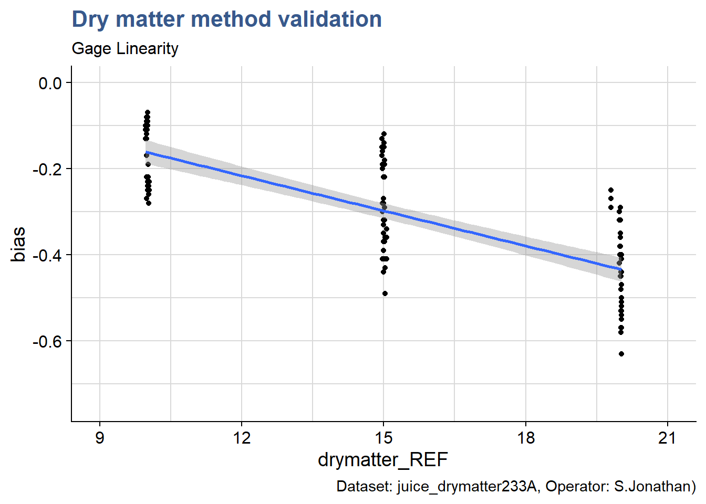

This type of plot is usually called *bias plot* and provides a view of how the difference between the measurements obtained with the new device and the reference device compare allong the measuremen range. In the plot generated an additional regression line has been introduced with `geom_smooth` from `{ggplot2}`. There are several ways to assess the linearity. In this case we're going to remain at a visual check only leaving to the Design of Experiments case study a more thourough verification.

The linear model appears as well adapted in this case. The first check is the observation that regression line passes close to the averages of each level of the dry matter factor. Nevertheless the slope is rather steep showing a clear increase of the bias (in the negative direction) with the increase in dry matter content.

### Bias report {#bias_report}

Using well known `{dplyr}` function the plot is complemented with statistics of the bias for each level of dry matter target: mean, median, standard deviation. A good practice that took some time to adopt but now is well anchored is to always present the sample size which speaks for the relevance of the statistical indicators.


```r
juice_drymatter_bias <- juice_drymatter %>%
  group_by(drymatter_TGT) %>%
  summarise(bias_mean = mean(bias, na.rm = TRUE), 
            bias_median = median(bias, na.rm = TRUE),
            bias_sd = sd(bias, na.rm = TRUE), 
            bias_n = n())
juice_drymatter_bias %>%
  kable(align = "c", digits = 2)
```


| drymatter_TGT | bias_mean | bias_median | bias_sd | bias_n |
|:-------------:|:---------:|:-----------:|:-------:|:------:|
|      10       |   -0.17   |    -0.15    |  0.07   |   36   |
|      15       |   -0.29   |    -0.31    |  0.10   |   36   |
|      20       |   -0.44   |    -0.44    |  0.10   |   36   |

Mean and median bias are very close which indicates that the data is equally distributed around the mean The standard deviation is also very similar from level to level indicating that the measurement variability is not depending on the range of measurement. A decision now needs to be taken on which systematic offset to apply depending on the operational context. As mentioned most commercial products on the production line where the device is used have a target specification around 13% therefore the Quality Assurance Head decides together with Manufacturing Team Leader to put in the operating procedure of the device a unique offset of 0.3 g. This value is assigned to a new variable called `juice_cal_u` that will be needed later to calculate the measurement uncertainty. 


```r
u_cal <- as_vector(juice_drymatter_bias[2,4])
names(u_cal) <- NULL # we're removing the original name to avoid confusion later.
```


## Precision

<div class="marginnote">

<b class="highlight">Case study: tablet compaction process</b>

Modern pharmaceutical tablet presses reach output volumes of up to 1,700,000 tablets per hour. These huge volumes require frequent in-process quality control for the tablet weight, thickness and hardness.


</div>

Pharmaceutical production setups combine extreme high volumes with stringent quality demands. In this context many manufacturing plants have inline automatic measurement devices providing automatic data collection to a central database but it is not uncommon to see hand held devices and manual log of measurements in spreadsheets. In an age of machine learning and sophisticated predictive tools this may seem awkward but it is common to see coexisting old and new approaches on the shop floor. A recurring check of measurement devices is the famous gage r&R. r&R stands for reproducibility and Reproductibility which combined give the instrument precision, according to the ISO 5725. In any case automatic or manual the way to assess the measuremen device should follow the same approach.

In our case we're looking into a pharmaceutical company where a <b class="highlight">tablet compaction process</b> the quality measurement system requires the Production Operator to sample tablets on a regular basis and log the thickness in a spreadsheet on the line. Measurements are done with a micrometer build and acquired specifically for this purpose that has a fixture developed to fit the shape of the tablet. 

Besides thickness, the quality measurement system requires the operator to collect quite an large variety of parameters including room conditions too. Elaborating on this a Quality Engineer has prepared a specific file for the gage r&R that also included the replicate number. As it is common practice he asked the measurements to be done by several operators. This data has been loaded into R and is available in the dataset `tablet_thickness` and an extract is presented here in raw:


```r
tablet_thickness %>%
  head(3) %>%
  kable(
    align = "c",
    caption = "tablet thickness gage r&R data"
  )
```


Table: (\#tab:tbl-tabletthickness)tablet thickness gage r&R data

|  Position  | Size | Tablet | Replicate |  Day  | Date [DD.MM.YYYY] | Operator | Thickness [micron] | Temperature [°C] | Relative Humidity [%] | Luminescence [lux] |
|:----------:|:----:|:------:|:---------:|:-----:|:-----------------:|:--------:|:------------------:|:----------------:|:---------------------:|:------------------:|
| Position 1 |  L   |  L001  |     1     | Day 1 |    18/11/2020     |  Paulo   |       1802.5       |       22.3       |         32.7          |       568.6        |
| Position 1 |  L   |  L001  |     2     | Day 1 |    18/11/2020     |  Paulo   |       1802.8       |       22.3       |         32.8          |       580.4        |
| Position 1 |  L   |  L001  |     3     | Day 1 |    18/11/2020     |  Paulo   |       1804.0       |       22.3       |         32.8          |       580.5        |

It is an excellent practice to look at raw data because it gives an immediate perception of general aspects such as the number of variables, their levels and their datatypes. Although this is irreplaceable it is possible to go further and `skim()` provides an excellent complement and summary. Below we see that the test requested by the Quality Engineer has required 675 measurements on 11 different variables by 3 different operators. We can see room conditions are stable, rather normally distributed and having small standard deviations and we can even see that thickness appears with 3 groups which seems related with the 3 sizes noted in the Size column.


```r
skim(tablet_thickness) 
```

The initial idea of the Quality Engineer was to establish a separate gage r&R by tablet size. There is sometimes debate if in the study several different specification should be combined or not. In the last quality weekly meeting this was reason for lively discussions with various logical arguments from the Production Leader and the Engineering Manager. They ended up accepting the proposal of a separate gage per size on the logic that it is important to compare the measurement method variability not only with the process variability but also with the specification itself.

Data in excel files to have most of the time human readable formats and the files being open they usually end up with long variable names. Unlike the classical `read.csv()` function from the base R the `read_csv()` function from `{readr}` is not converting character variables to factors. This is a good behavior in our view because it allows for better control and awareness of what is happening. In this case the Quality Engineer is acquainted to the `{tidyverse}` and is now making the conversion specifically on the desired variables size, tablet and operator. He also makes the filtering for the size L for which he will do the first r&R study.


```r
tablet_thickness <- tablet_thickness %>%
  clean_names() %>%
  mutate(across(c(size, tablet, operator), as_factor))

tablet_L <- tablet_thickness %>%
  filter(size == "L")
```

Now that the dataset is clean and ready he moves forward with the `ss.rr()` function from the `{SixSigma}` package.

### Gage r&R {#gageRnR}


```r
library(SixSigma)
```


```r
# dimensions for chunk output when included: fig.dim=c(8, 10)
tablet_L_rr <- ss.rr(
  data = tablet_L, 
  var = thickness_micron, 
  part = tablet, 
  appr = operator, 
  alphaLim = 1,
  errorTerm = "repeatability",
  main = "Micrometer FTR600\nr&R for tablet thickness",
  sub = "Tablet L",
  lsl = 1775,
  usl = 1825
)
```

The `ss.rr` function takes the filtered `tablet_L` dataset and `var`, `part` and the arguments `appr` to precise what is the measurement variable, the part and the operator in this order. Then to be noted that the `alphaLim` argument is set to 1 in this first assessment. This is to keep all the model terms including non significant one. In future analysis this can be set to 0.05 the usual significance threshold and those non significant terms are omitted. Another detail important to ensure is to select the repeatability as the `errorTerm` otherwise we get different results than those obtained with base anova and other software aligned with the @AIAG2010 guidelines such as Minitab. Finally the function also allows to input the limits he also provides in the arguments the current upper and lower limit of the specification, in this case of 1'800 $\mu m$ +/- 25 $\mu m$ for tablet L. 

The output of this function is a list with several elements inside and an automatically generated report. 


```r
names(tablet_L_rr)
```

```
[1] "anovaTable" "anovaRed"   "varComp"    "studyVar"   "ncat"      
```

We're now looking more in detail in some of them.

### Gage acceptance {#gage_acceptance}

Measurement system acceptance can be done based on varied criteria and is often done in progressive stages. In Research and Development contexts it is common that the measurement method is developed simultaneously with the end product. There are stages where the teams are conceiving the full industrial setup and there may be an overlap between product sub-assembly, assembly machine and measurement device. These different components of the production or assembly line may not reach maturity all at the same time. In such cases the Quality Assurance may give an approval for the measurement device based on tests done on products that cannot yet be commercialized. This means that the final conditions of usage are not fully tested. In other cases the measurement method is complex but time presses and the teams test the quality of the parts by other means such as the failure rates of the assemblies where the parts go. For all these reasons it is important to clarify at all times the assumptions used in the assessment of the  measurement method. 

#### Variance components

A common way to quickly judge if an equipment variability is high is to look at its variance. In our case the Quality Engineer can look at the variance components of the gage r&R study by calling them from the `ss.rr` list.


```r
tablet_L_rr$varComp %>%
  kable(digits = 1)
```


|                | VarComp| %Contrib|
|:---------------|-------:|--------:|
|Total Gage R&R  |     1.6|     14.8|
|Repeatability   |     1.6|     14.2|
|Reproducibility |     0.1|      0.6|
|operator        |     0.1|      0.6|
|tablet:operator |     0.0|      0.0|
|Part-To-Part    |     9.5|     85.2|
|Total Variation |    11.1|    100.0|

Looking at the column %Contrib he sees that the total gage R&R is too high when comparing with the established guidelines for gage acceptance:

* Less than 1%: the measurement system is acceptable
* Between 1% and 9%: the measurement system is acceptable depending on the application,    
the cost of the measurement device, cost of repair, or other factors
* Greater than 9%: the measurement system is not acceptable and should be improved.

Another direct information from this assessment is that this variability comes from the repeatability mostly and not from the operator or from the interaction. This is very useful as a clue to start identifying where the variability comes from and how to try to improve it.

Although quick and providing a first impression, variance is not a very intuitive statistic as is not expressed in the measurement units. A much more common and speaking approach is to look into the standard deviation and compare it with the process variation but also with the specification itself.

#### Standard deviation components

The standard deviation values from the study can be pulled from the list with the same approach as before.


```r
tablet_L_rr$studyVar %>%
  kable(digits = 1)
```


|                | StdDev| StudyVar| %StudyVar| %Tolerance|
|:---------------|------:|--------:|---------:|----------:|
|Total Gage R&R  |    1.3|      7.7|      38.5|       15.4|
|Repeatability   |    1.3|      7.5|      37.6|       15.1|
|Reproducibility |    0.3|      1.6|       7.9|        3.1|
|operator        |    0.3|      1.6|       7.9|        3.1|
|tablet:operator |    0.0|      0.0|       0.0|        0.0|
|Part-To-Part    |    3.1|     18.4|      92.3|       36.9|
|Total Variation |    3.3|     20.0|     100.0|       40.0|

The study variation table is has several columns. The StdDev column contains the square root of each individual variance. The StudyVar column has each StdDev multiplied by 6 which corresponds to the max variability for each component. Then each StudyVar is divided by the Total Variation and expressed in percentage in the %StudyVar column. The last column %Tolerance contains the division of the StudyVar by the specification interval (+/- 25 $\mu m$ in this case) expressed in percentage.

The Quality Engineer is now is a position to progress is assessment. According to the guidelines followed in the company the measurement method variation needs to be less than 10% of the process variation to be considered directly accepted. This is expressed here in the column %StudyVar and is 38.46% which is much above this limit. The guidelines state:

* Less than 10%: the measurement system is acceptable
* Between 10% and 30%: the measurement system is acceptable depending on the application,   
the cost of the measurement device, cost of repair, or other factors
* Greater that 30%: the measurement system is not acceptable and should be improved.

As he already knew, the variability is mostly coming from the repeatability. With this approach he can also compare with the product specification tolerance which is 15.37%. The part to part variation corresponds to the bulk of the variability and this is what is expected.

Although the Quality Assurance department is not fully validating a measurement method with these figures there seems to be potential to improve the situation. At this moment we can consider that the micrometer allows to sort good parts from bad because the variability is lower than 30% of specification tolerance but it cannot be used to drive production as the variation is higher than 30% of the production process variation. 

### Gage plots

Besides the Variance the Standard Deviation components the `ss.rr` function generates a full report. We're going to look into at each of the plots by generating them with the custom function `ss.rr.plots`. The details of the function itself are presented afterwards.


```r
tablet_L_rr_plots <- ss.rr.plots(
  data = tablet_L, 
  var = thickness_micron, 
  part = tablet, 
  appr = operator, 
  alphaLim = 1,
  errorTerm = "repeatability",
  main = "Micrometer FTR600\nr&R for tablet thickness",
  sub = "Tablet L",
  lsl = 1775,
  usl = 1825
)
```


```r
plot(tablet_L_rr_plots$plot1)
```


This first bar plot presents in a graphical way the gage results in percentage and we can quickly grasp if we're on target by looking at the pink bars and comparing them with the dashed bars. We can see that the G.R&R is above 30% and thus is not acceptable from a Study Variation criteria. In green we see that compared with the specification we're above 10% but below 30% so acceptable but requiring improvement. We're now looking into the measurements themselves:


```r
plot(tablet_L_rr_plots$plot6)
```


```r
plot(tablet_L_rr_plots$plot5)
```


The previous two plots show the measurements for each operator. The first is the Ranges plot showing the differences between the min and max measurement for each part and the second plot is the means plot showing the mean thickness for each part by operator. These help showing that there is a consistency between operators and help as a diagnosis tool to identify if there would be strange patterns appearing where one of the operators would be for instance systematically measuring very high values. The next two plots show average values by part with all operators combined:


```r
plot(tablet_L_rr_plots$plot2)
```

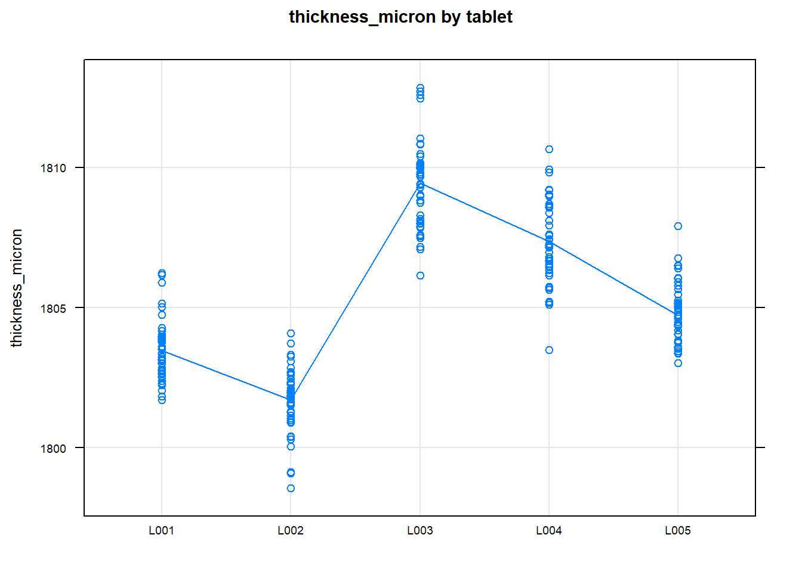

```r
plot(tablet_L_rr_plots$plot3)
```


We quickly see the measurements tend to be simetrically distributed around their means and that the means between the different operators are very similar. This confirms the low reproducibility what has been seen in the Variance Components. 


```r
plot(tablet_L_rr_plots$plot4)
```


This final plot is the so called interaction plot and if there were diverting and strongly crossed lines would indicate that different operators measure the parts in different ways. Again here this confirms the low value obtained for the interaction in the Variance Components table.

<div class="marginnote">

Tablet thickness measurements obtained with a gage r&R study done on a pharmaceutical tablet compaction process. Red dashed lines corresponds to the thickness specification limits.


</div>

When the gage report was shared with the Production Leader and the Engineering Manager they raised concerns regarding which is how big is our process variability and how much is the process centered. These are valid points as we often go back and forth between measurement validation, product development and process control. Measurement validation makes us look into details on the measured values and question their validity. Taking conscience that the production specification is not adapted, too large or too narrow. Often we realise that production is systematically slightly off centered. Depending on the diagnostic a new gage r&R plan and sampling may need to be prepared and the process or the specification adjusted. Such topics will be further discussed in the Design of Experiments and in the Statistical Process Control subjects.

### Negative variance

We've started the gage assessment by setting the `errorTerm` to 1. This made that factors that were non significant remained visible, in our case this happened with the tablet:operator interaction. Although the `ss.rr` function is always showing zero for non significant factors it may happen that in reality the calculated value is negative.

We refer to page 557 @Montgomery2012 to get guidance on how to adresses this case:

*note that the P-value for the interaction term [...] is very large, take this as evidence that it really is zero and that there is no interaction effect, and then fit a reduced model of the form that does not include the interaction term. This is a relatively easy approach and one that often works nearly as well as more sophisticated methods.*

This approach is the one implemented in `{SixSigma}`. When we leave the argument `alphaLim` empty the non significant terms are be suppressed from the model, the Anova is recalculated and the remaining tables updated accordingly. We can control this behavior by playing with different values. Usually we consider a p value of 0.05 but we recommend to start with higher values such as 0.1 or 0.2 to avoid suppressing too quickly the factor which would result in a transfer of their variability into the repeatability. Below we run again the `ss.rr` function with a limit at 0.05 and get the entire data and plot output in one single step. In our case adjusting the p value has had a very limited impact in the total gage r&R which has changed only from 38.46% to 38.38%.


```r
tablet_L_rr2 <- ss.rr(
  data = tablet_L, 
  var = thickness_micron, 
  part = tablet, 
  appr = operator, 
  alphaLim = 0.05,
  errorTerm = "repeatability",
  main = "Micrometer FTR600\nr&R for tablet thickness",
  sub = "Tablet L",
  lsl = 1775,
  usl = 1825
)
```

```
Complete model (with interaction):

                 Df Sum Sq Mean Sq F value Pr(>F)
tablet            4   1707     427  271.46 <2e-16
operator          2     13       7    4.18  0.017
tablet:operator   8     11       1    0.89  0.524
Repeatability   210    330       2               
Total           224   2062                       

alpha for removing interaction: 0.05 


Reduced model (without interaction):

               Df Sum Sq Mean Sq F value Pr(>F)
tablet          4   1707     427  272.53 <2e-16
operator        2     13       7    4.19  0.016
Repeatability 218    341       2               
Total         224   2062                       

Gage R&R

                    VarComp %Contrib
Total Gage R&R     1.632605    14.73
  Repeatability    1.565919    14.13
  Reproducibility  0.066685     0.60
    operator       0.066685     0.60
Part-To-Part       9.448857    85.27
Total Variation   11.081462   100.00

                    VarComp  StdDev StudyVar %StudyVar %Tolerance
Total Gage R&R     1.632605 1.27773   7.6664     38.38      15.33
  Repeatability    1.565919 1.25137   7.5082     37.59      15.02
  Reproducibility  0.066685 0.25823   1.5494      7.76       3.10
    operator       0.066685 0.25823   1.5494      7.76       3.10
Part-To-Part       9.448857 3.07390  18.4434     92.34      36.89
Total Variation   11.081462 3.32888  19.9733    100.00      39.95

Number of Distinct Categories = 3 
```


Further developments on the gage r&R in the excellent book from Springer by the `{SixSigma}` package author @Cano2012.

### Custom functions

The original report generated by the `ss.rr`function has the inconvenient of being generated as a single plot. Another inconvenient is that there is no option in the function to suppress it in case we just want to look at the data output. To present the individual plots presented in this unit the original function code has had to be modified. This possibility to reuse and modify the code from other authors is one of the great benefits of R. This is possible because are is distributed under a license from the Free Software Foundation. Licenses are long are difficult to read but by simply typing ` RShowDoc("GPL-3")` we can already read in the first few lines *you can change the software or use pieces of it in new free programs*. The `{SixSigma}` package itself is also under the same license:


```r
SixSigmaDescription <- utils::packageDescription("SixSigma") 
SixSigmaDescription$License
```

```
[1] "GPL (>= 2)"
```

This being all cleared out the `ss.rr` function code can the be obtained in RStudio by selecting the package environment in the environment pane and looking for the function. A more direct approach is by simply typing `ss.rr` on the console. The full code is then revealed and can be copied and modified. For the `{industRial}` package we've copied the code in a new function which we called `ss.rr.plots` that generates as output a list of plots. Each plot can now be plotted individually.

## Uncertainty {#uncertainty}

In the Pharmaceutical company described in this case study, the final formal Measurement System Analysis reports are issued with a statement on uncertainty. This is a way to combine this various intermediate assessments described before and to communicate the result in a format that can be interpreted by the persons who read measurement results such as Product Development scientists and the R&D management. Different companies adopt more or less sophisticated norms which provide a detailed way of calculating the combined uncertainty that comes from the different assessments performed. In this case study we're presenting a simple summation in quadrature equivalento to the one described by @Bell2001 page 14:

$$
u=\sqrt{u_{man.}^2 + u_{cal.}^2 + u_{repeat.}^2+ u_{reprod.}^2}
$$

This formula consists in taking the square root of the sum of the squares of the standard deviations obtained in the different tests. 

The first term is coming from the micrometer manufacturer which mentions in the equipment guide an accuracy of 0.001 mm which corresponds to 1 $\mu$. We assign this in R to the u_man variable:


```r
u_man <- 1
u_man
```

```
[1] 1
```

The calibration uncertainty has been established before in the calibration study :


```r
u_cal
```

```
[1] 0.10244
```

The repeatability and reproducibility uncertainties correspond to the standard deviations calculated in the r&R study. In our case we can even obtain them directly from the Variance Components table generated by the `ss.rr` function of the {SixSigma} package that has bee discussed in details the Gage acceptance unit. We are going to name $u_{repeat}^2$ as u_repeat $u_{reprod}^2$ as u_reprod getting:


```r
u_repeat <- tablet_L_rr$studyVar[2,1]
u_repeat
```

```
[1] 1.2538
```

```r
u_reprod <- tablet_L_rr$studyVar[3,1]
u_reprod
```

```
[1] 0.26241
```

Now putting it all together in the uncertainty formula we have:


```r
u <- sqrt(u_man^2 + u_cal^2 + u_repeat^2 + u_reprod^2)
u
```

```
[1] 1.6283
```

Finally what is usually reported is the expanded uncertainty corresponding to 2 standard deviations. To be recalled that $\pm$ 2 std corresponds to 95% of the values when a repetitive measurement is made. In this case we have $U = 2*u$:


```r
U <- 2 * u
U
```

```
[1] 3.2567
```

For a specific measurement of say 1'800 $\mu m$ we then say: the tablet thickness is 1'800 $\mu m$ $\pm$ 3.3 $\mu m$, at the 95 percent confidence level. Written in short is:

**1'800 $\mu m$ $\pm$ 3.3 $\mu m$, at a level of confidence of 95%**

Knowing that the specification is [1'775; 1'825] $\mu$m we have a specification range of 50. The expanded uncertainty corresponds to 13.03 %. This is another way of looking into the ratio between method variation and specification. The `{SixSigma}` package gave a similar result of 15.37%. To be noted that the calculation in by the package corresponds to 3 standard deviations and does not comprise the supplier calibration.

<!--chapter:end:4_msa.Rmd-->


# Design of Experiments {#DOE}

Companies manufacturing goods in industrial quantities have a permanent need to improve the features of their products. This is visible in any such industry be it car parts, watches, electronic components for cell phones, chocolates, clothing, medical devices, medicine, ... the list could go on forever. As consumers we expect flawless quality at affordable price and we want to remain free to choose another brand if our confidence has been damaged due to a defective product. Adding to this fortunately the last decades have seen an increasing pressure to develop sustainable products that are responsibly sourced, meet stringent regulations and can last for many years and be properly disposable. Another constraint that can be observed in Research and Development is the growing awareness of the public on ethical issues. There is an increasing expectation that trials generate minimal waste and are done in a way respectful of test subjects human and animal.

Experiment design provides ways to meet these important requirements by making us think upfront on what is required and how to best approach a test. Integrated in a complete solid design for quality approach it can provide deep insights on the principles of a system and support decision making based on data. A well prepared test plan minimizes trial and error and reduces the number of prototypes, measurements and time required. 

There are many well tested approaches, the domain is very large and our textbook can only cover a subset of the many types of DoEs used in the industry. For all these cases statistical notions are key to have a minimal preparation of the test and a valid interpretation of the results. Some statistical concepts every engineer, technician or scientist has to understand go around sampling, sample size, probability, correlation and variability. It is important to be clear about the vocabulary and the mathematics that are behind the constantly used statistics such as the mean, median, variance, standard deviation and so on. We provide a glossary and good bibliography that can be both a good starting point or a refresher. In particular the text and the case studies follow what we consider to be the most important book in this the domain, the *Design and Analysis of Experiments* by @Montgomery2012.

## Direct comparisons

<div class="marginnote">

<b class="highlight">Case study: winter sports clothing</b>

All winter sports clothing are virtually made with a mix of natural fibers and synthetic polymers. Upgrading to recyclable polymers while keeping performance requires extensive testing of raw material characteristics such as the tensile strength.


</div>

We start by exploring simple tests that compare results obtained in two samples. These cases happen all the time as everyone needs one moment or another to compare things. It can be the result of a test before and after an improvement, it can be two different materials applied in the same assembly or still different results obtained by different teams at different moments. 

In this case, a materials engineer working in the <b class="highlight">winter sports clothing industry</b> is working with a polymer company to develop a textile raw material based on PET for which the mean tensile strength has to be greater than 69.0 MPa. A first delivery of samples arrives, the materials laboratory measures 28 samples and reports that the test result is not meeting the contract specification. The materials engineer is informed and get hold of the raw data, in the lab system she can see the measurement summary:


```r
summary(pet_delivery$A)
```

```
   Min. 1st Qu.  Median    Mean 3rd Qu.    Max. 
   64.5    68.2    68.8    68.7    69.4    72.0 
```

The mean is in fact slightly lower that the specified contract value of 69 and the materials engineer could think to confirm the rejection the batch right away. She decides nevertheless to observe how do the measurements vary. She plots the raw data on an histogram which is a very common plot showing counts for selected intervals.

### Histogram {#histogram}


```r
pet_spec <- 69
pet_mean <- mean(pet_delivery$A)

pet_delivery %>% 
  ggplot(aes(x = A)) +
  geom_histogram(color = viridis(12)[4], fill = "grey90") +
  scale_x_continuous(n.breaks = 10) +
  geom_vline(xintercept = pet_mean, color = "darkblue", linetype = 2, size = 1) +
  geom_vline(xintercept = pet_spec, color = "darkred", linetype = 2, 
             show.legend = TRUE) +
  labs(title = "PET raw material delivery",
       subtitle = "Histogram of resistance measurements",
       y = "Count",
       x = "Tensile strength [MPa]", 
       caption = "Specification min in red, Batch mean in blue¨")
```


She also observes a certain variability in the batch with many samples with measurements below specification getting close to 64 MPa. She remembers that in this case a t-test could help assessing if the mean that was obtained can be really be considered statistically different from the target value.

### t-test one sample {#t.test}


```r
t.test(x = pet_delivery$A, mu = pet_spec)
```

```

	One Sample t-test

data:  pet_delivery$A
t = -1.08, df = 27, p-value = 0.29
alternative hypothesis: true mean is not equal to 69
95 percent confidence interval:
 68.157 69.263
sample estimates:
mean of x 
    68.71 
```

The basic assumption of the test is that the mean and the reference value are identical and the alternative hypothesis is that their different. The confidence interval selected is 95% as it is common practice in the laboratory. The test result tells us that for a population average of 69, the probability of obtaining a sample with a value as extreme as 68.71 is 29% (p = 0.29). This probability value higher than the limit of 5% that she usually uses to reject the null hypothesis. In fact she cannot conclude that the sample comes from a population with a mean different than 69.

She's not sure what to do of this result and decides asking help to a colleague statistician from R&D: has she applied the right? is the specification correctly defined or should it refer to the minimum sample value? Her colleague confirms that to compare means this is a good approach and as the standard deviation of the production is not available it is reasonable to use the standard deviation from the sample. This is an important detail that was not introduced explicitely as an argument in the R function. As we they are still in the initial steps of the new development they agree that it is a good idea to accept the batch. For the next deliveries the statistic recommends to try to improve the tensile strength average and reduce the variability. For the next delivery she also recommends to agree on a minimum sample size of 30 parts and to redo the t.test but for regular production the team should consider implementing a proper AQL protocol.

Improving recyclability while keeping current performance is no easy task. Often novel materials are expensive as their commercial volumes are small and suppliers claim a premium on their own R&D efforts. Consumers of clothing are getting more and more sensitive to waste and to recycling but they don't always choose products with a higher price to compensate.

Following the not fully successful experience with the first delivery of  recyclable PET our materials engineer considers a new chemical composition that potentially increases the levels of strength. When the second delivery arrives she establishes a simple plot with the raw data to have a first grasp of the expected improvement.


```r
pet_delivery_long <- pet_delivery %>%
  pivot_longer(
    cols = everything(), names_to = "sample", values_to = "tensile_strength"
  )

pet_delivery_long %>% 
  ggplot(aes(x = sample, y = tensile_strength)) +
  geom_jitter(width = 0.1, size = 0.8) +
  theme(legend.position = "none") +
  labs(title = "PET clothing case study",
       subtitle = "Raw data plot",
       x = "Sample",
       y = "Tensile strength [MPa]")
```

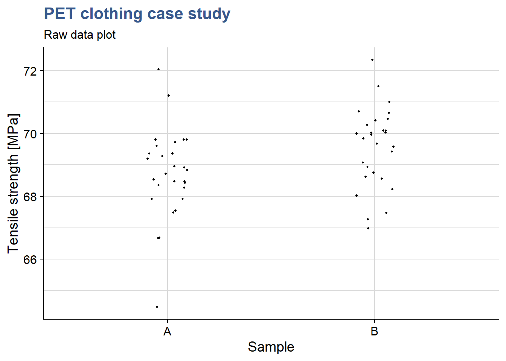

Choosing `geom_jitter()` instead of simply `geom_point()` avoids overlapping of the dots but has to used with caution as sometimes for precise reading can lead to mistakes. Dot plots also lack information sample statistics and a way to better understanding the bond distributions is to go for a box plot. This type of plot is somehow like the histogram seen before but more compact when several groups are required to be plotted.


```r
pet_delivery_long %>% 
  ggplot(aes(x = sample, y = tensile_strength, fill = sample)) +
  geom_boxplot(width = 0.3) +
  geom_jitter(width = 0.1, size = 0.8) +
  scale_fill_viridis_d(begin = 0.5, end = 0.9) +
  scale_y_continuous(n.breaks = 10) +
  theme(legend.position = "none") +
  labs(title = "PET clothing case study",
       subtitle = "Box plot",
       x = "Sample",
       y = "Tensile strength [MPa]")
```

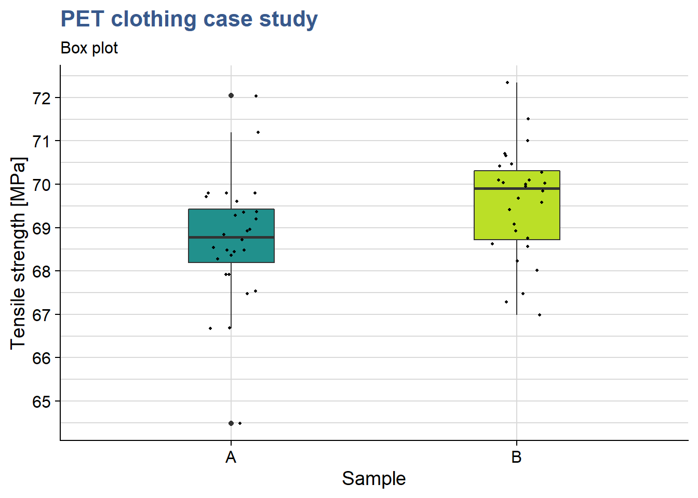

In this case she has simply added another layer to the previous plot getting both the dots and the boxes. Now she can see the median and the quantiles. The new sample has clearly higher values and she would like to confirm if the new formulation has a significant effect. While before she was comparing the sample mean with the specification, here she wants to compare the means of the two samples. A direct calculation of this difference gives:


```r
PET_meandiff <- mean(pet_delivery$A) - mean(pet_delivery$B)
PET_meandiff
```

```
[1] -0.86286
```

To use the t.test it is important to have samples obtained independently and randomly, to check the normality of their distributions and the equality of their variances.

To do these checks our materials engineer is using the `geom_qq()` function from the `{ggplot}` package and gets directly the normality plots for both samples in the same plot:

### Normality plot {#geom_qq}


```r
pet_delivery_long %>%
  ggplot(aes(sample = tensile_strength, color = sample)) +
  geom_qq() +
  geom_qq_line() +
  coord_flip() +
  scale_color_viridis_d(begin = 0.1, end = 0.7) +
  labs(title = "PET clothing case study",
       subtitle = "Q-Q plot",
       x = "Residuals",
       y = "Tensile strength [MPa]")
```


We observe that for both formulation the data is adhering to the straight line thus we consider that it follows a normal distribution. We also see that both lines in the qq plot  have equivalent slopes indicating that the assumption of variances is a reasonable one. Visual observations are often better supported by tests such as the variance test.

### F-test {#var.test}


```r
var.test(tensile_strength ~ sample, pet_delivery_long)
```

```

	F test to compare two variances

data:  tensile_strength by sample
F = 1.28, num df = 27, denom df = 27, p-value = 0.53
alternative hypothesis: true ratio of variances is not equal to 1
95 percent confidence interval:
 0.59026 2.75635
sample estimates:
ratio of variances 
            1.2755 
```

The `var.test()` from the `{stats}` package us a simple and direct way to compare variances. The F-test is accurate only for normally distributed data. Any small deviation from normality can cause the F-test to be inaccurate, even with large samples. However, if the data conform well to the normal distribution, then the F-test is usually more powerful than Levene's test. The test null hypothesis is that the variances are equal. Since the p value is much greater than 0.05 we cannot reject the null hypotheses meaning that we can consider them equal.

### Levene test {#levene.test}


```r
library(car)
leveneTest(tensile_strength ~ sample, data = pet_delivery_long)
```

```
Levene's Test for Homogeneity of Variance (center = median)
      Df F value Pr(>F)
group  1    0.01   0.91
      54               
```

We had considered the samples to be normaly distributed but we can be more conservative and use the `leveneTest()` function from the `{car}` package. In this case we get a p > 0.05 thus again we see that there is homogeneity of the variances (they do not differ significantly). Further elaborations on the variance can be found under @minitab_variances.

The clothing sports materials engineer has now a view on the samples distribution and homogeity of variances and can apply t.test to compare the sample means. She takes care to specify the `var.equal` argument as TRUE (by default it is FALSE).

### t-test two samples


```r
t.test(
  tensile_strength ~ sample, 
  data = pet_delivery_long, var.equal = TRUE
  )
```

```

	Two Sample t-test

data:  tensile_strength by sample
t = -2.4, df = 54, p-value = 0.02
alternative hypothesis: true difference in means is not equal to 0
95 percent confidence interval:
 -1.58500 -0.14072
sample estimates:
mean in group A mean in group B 
         68.710          69.573 
```

She sees that p < 0.05 and confirms the means differ significantly. The test output has also provided a confidence interval for the difference between the means at 95% probability and the mean difference calculated directly of -0.86286 falls inside this interval (to be noted that zero is obviously not included in this interval). Things look promising in the new recyclable PET formulation.

<!--chapter:end:5_comparisons.Rmd-->


## Statistical modeling

<div class="marginnote">

<b class="highlight">Case study: e-bike frame hardening</b>

Demand for electrical bicycles grows steadily and a global manufacturer is looking into improving the quality of his bicycle frames. A test program around different treatment temperatures is established to find the conditions that optimize the fatigue resistance.


</div>

A way to go beyond the statistical description of samples and direct comparison between different tests it is to establish a model. Models help us simplify the reality and draw general conclusions. The case studies in this unit introduce linear models and their applications. They also serve as the backbone for statistical inference and forecasting. These are two important techniques because they provide mathematical evidence of such general conclusions in a context where the test quantities are strongly limited as for example in lifecycle testing of expensive mechanical parts.

Bicycle frames are submitted to many different efforts, namely bending, compression and vibration. Obviously no one expects a bike frame to break in regular usage and it is hard to commercialy claim resistance to failure as a big thing. Nevertheless on the long term a manufacturer reputation is made on performance features such as the number of cycles of effort that the frame resists. An e-bike manufacturing company is looking to increase the duration of its frames by improving the  <b class="highlight">e-bike frame hardening</b> process.

A test has been run with 5 groups of 30 bike frames submitted to 4 different treatment temperature levels and the data collected in the R tibble `ebike_hardening` presented below:


```r
head(ebike_hardening) %>%
  kable(align = "c")
```


| temperature |   g1   |   g2   |   g3   |   g4   |   g5   |
|:-----------:|:------:|:------:|:------:|:------:|:------:|
|     160     | 575000 | 542000 | 530000 | 539000 | 570000 |
|     180     | 565000 | 593000 | 590000 | 579000 | 610000 |
|     200     | 600000 | 651000 | 610000 | 637000 | 629000 |
|     220     | 725000 | 700000 | 715000 | 685000 | 710000 |

This type of two way entry is friendly for data collection but for manipulation with the `{tidyverse}` package functions it is often better to transform it in a long format.


```r
ebike_narrow <- ebike_hardening %>%
  pivot_longer(
    cols = starts_with("g"),
    names_to = "observation",
    values_to = "cycles"
  ) %>%
  group_by(temperature) %>%
  mutate(cycles_mean = mean(cycles)) %>%
  ungroup()

slice_head(.data = ebike_narrow, n = 5) %>% 
  kable(align = "c", 
        caption = "e-bike hardening experiment data")
```


Table: (\#tab:fig-ebikenarrow)e-bike hardening experiment data

| temperature | observation | cycles | cycles_mean |
|:-----------:|:-----------:|:------:|:-----------:|
|     160     |     g1      | 575000 |   551200    |
|     160     |     g2      | 542000 |   551200    |
|     160     |     g3      | 530000 |   551200    |
|     160     |     g4      | 539000 |   551200    |
|     160     |     g5      | 570000 |   551200    |

The engineering team is looking forward to see the first results which have been prepared by the laboratory supervisor. He has prepared a series of plots and data models and sent out an draft report. The first plot is a simple dot plot having the raw data and in red the group means.  


```r
ggplot(data = ebike_narrow) +
  geom_point(aes(x = temperature, y = cycles)) +
  geom_point(aes(x = temperature, y = cycles_mean), color = "red") +
  scale_y_continuous(n.breaks = 10, labels = label_number(big.mark = "'")) +
  theme(legend.position = "none") +
  labs(title = "e-bike frame hardening process",
       subtitle = "Raw data plot",
       x = "Furnace Temperature [°C]",
       y = "Cycles to failure [n]")
```


Clearly the highest the furnace temperature the higher the number of cycles to failure. This is absolutely expected as higher temperatures, up to a certain level, allow to release mechanical tensions and make the material less prone to fracture. The team knows that other factors are at play such as the treatment duration, the pre-heating temperature and many others related with the welding of the frame parts, but has deliberately decided to look only into the temperature due to time constraints related with a new bike launch.

It is good to complement the raw data plot with a regression line corresponding to this linear model as done in the next chunk with the function `geom_smooth()`:


```r
ggplot(ebike_narrow) +
  geom_point(aes(x = temperature, y = cycles)) +
  geom_smooth(aes(x = temperature, y = cycles), method = "lm") +
  geom_point(aes(x = temperature, y = cycles_mean), color = "red") +
  scale_y_continuous(n.breaks = 10, labels = label_number(big.mark = "'")) +
  theme(legend.position = "none") +
  labs(title = "e-bike frame hardening process",
       subtitle = "Raw data plot",
       x = "Furnace Temperature [°C]",
       y = "Cycles to failure [n]")
```


This visualization shows how a linear regression line adjusts to the data and we can see it is not passing exactly at the means of each treatment level. In the next steps we go into the functions underneath that are used to calculate the regression line.

### Linear models {#lm}


```r
ebike_lm <- lm(cycles ~ temperature, data = ebike_narrow)
summary(ebike_lm)
```

```

Call:
lm(formula = cycles ~ temperature, data = ebike_narrow)

Residuals:
   Min     1Q Median     3Q    Max 
-43020 -12325  -1210  16710  33060 

Coefficients:
            Estimate Std. Error t value Pr(>|t|)    
(Intercept)   137620      41211    3.34   0.0036 ** 
temperature     2527        215   11.73  7.3e-10 ***
---
Signif. codes:  0 '***' 0.001 '**' 0.01 '*' 0.05 '.' 0.1 ' ' 1

Residual standard error: 21500 on 18 degrees of freedom
Multiple R-squared:  0.884,	Adjusted R-squared:  0.878 
F-statistic:  138 on 1 and 18 DF,  p-value: 7.26e-10
```

This previoous code chunk from the lab supervisor draft report is a linear model built with the variable `temperature` as a numeric vector. The R `summary()` function produces a specific output for linear models and a dedicated help explaining each output value can be accessed with `?summary.lm`. Knowing that R uses specific "methods" to provide the summaries for many functions is useful to find their help pages and a way to list them is `apropos("summary)`. In this case we see a high R-squared suggesting a very good fit and that the temperature is significant by looking at the 3 *significance stars* next to its p-value. 

### Contrasts {#contr.treatment}


```r
ebike_factor <- ebike_narrow %>%
  mutate(temperature = as_factor(temperature))

contrasts(ebike_factor$temperature) <- contr.treatment

attributes(ebike_factor$temperature)
```

```
$levels
[1] "160" "180" "200" "220"

$class
[1] "factor"

$contrasts
    2 3 4
160 0 0 0
180 1 0 0
200 0 1 0
220 0 0 1
```

The engineering team has selected to specify and control the temperature variable at specific levels in what is called a fixed effects model, limiting the conclusions to the levels tested. The lab supervisor updates his dataset by converting the temperature variable to a factor and explicitly establishes the factor `contrasts` with the `contrasts()` function. He selects `cont.treatment`. Looking into the attributes of the factor we see the matrix of contrasts. In many cases it is possible to skip this step as contr.treament is default setting for the contrasts. This can be confirmed with `getOption("contrasts")`. He can now establish a new linear model using the modified dataset.


```r
ebike_lm_factor <- lm(
  cycles ~ temperature, 
  data = ebike_factor
  )
summary(ebike_lm_factor)
```

```

Call:
lm(formula = cycles ~ temperature, data = ebike_factor)

Residuals:
   Min     1Q Median     3Q    Max 
-25400 -13000   2800  13200  25600 

Coefficients:
             Estimate Std. Error t value Pr(>|t|)    
(Intercept)    551200       8170   67.47  < 2e-16 ***
temperature2    36200      11553    3.13   0.0064 ** 
temperature3    74200      11553    6.42  8.4e-06 ***
temperature4   155800      11553   13.49  3.7e-10 ***
---
Signif. codes:  0 '***' 0.001 '**' 0.01 '*' 0.05 '.' 0.1 ' ' 1

Residual standard error: 18300 on 16 degrees of freedom
Multiple R-squared:  0.926,	Adjusted R-squared:  0.912 
F-statistic: 66.8 on 3 and 16 DF,  p-value: 2.88e-09
```

We see that from the first model to the second the R-squared has improved and that the model coefficients are slightly different. In R the model coefficients depend on the variable variable data type and on the contrasts setting. To obtain equivalent results with the different type coding it is necessary to carefully set the model *contrasts*. These differences are due to the calculation of different linear regression equations with different coefficients. It is important to be attemptive before using whatever output the system is giving us. We can see the coefficients and use them to calculate the output with a matrix multiplication  as follows:


```r
ebike_lm$coefficients 
```

```
(Intercept) temperature 
     137620        2527 
```

```r
ebike_lm$coefficients %*% c(1, 180)
```

```
       [,1]
[1,] 592480
```

this shows that to calculate the output for an input of 180 we have 137'620 + 180 x 2'527 = 592'480. Making a zoom on the linear regression plot we see this passes slightly above the mean for the 180°C treatment level:


```r
ggplot(ebike_narrow) +
  geom_point(aes(x = temperature, y = cycles)) +
  geom_smooth(aes(x = temperature, y = cycles), method = "lm") +
  geom_point(aes(x = temperature, y = cycles_mean), color = "red") +
  scale_y_continuous(n.breaks = 20, labels = label_number(big.mark = "'")) +
  coord_cartesian(xlim = c(160, 180), ylim = c(520000, 620000)) +
  geom_hline(yintercept = 592480) +
  theme(legend.position = "none") +
  labs(title = "e-bike frame hardening process",
       subtitle = "Raw data plot",
       x = "Furnace Temperature [°C]",
       y = "Cycles to failure [n]")
```


On the other hand, when the temperature is coded as a factor we have the following coefficients and output calculation:


```r
ebike_lm_factor$coefficients
```

```
 (Intercept) temperature2 temperature3 temperature4 
      551200        36200        74200       155800 
```

```r
ebike_lm_factor$coefficients %*% c(1, 1, 0, 0)
```

```
       [,1]
[1,] 587400
```

The output is slightly different: 551'200 + 1 x 36'200 = 587'400, corresponding exactly to the treatment mean for 180°C. More on this in the next section.

### Predict {#predict}

A model is useful for predictions. In a random effects model where conclusions can be applied to the all the population we can predict values at any value of the input variables. In that case reusing the model with temperature as a numeric vector we could have a prediction for various temperature values such as:


```r
ebike_new <- tibble(temperature = c(180, 200, 210))
predict(ebike_lm, newdata = ebike_new)
```

```
     1      2      3 
592480 643020 668290 
```

As mentionned in our case the team has selected a fixed effects model and in principle they sould only draw conclusions at the levels at which the input was tested. We can check with `predict()` too that the predictions correspond exactly to the averages we've calculated for each level:


```r
ebike_new <- data.frame(temperature = as_factor(c("180", "200")))
predict(ebike_lm_factor, newdata = ebike_new)
```

```
     1      2 
587400 625400 
```

We find again exactly the same values calculated using the matrix multiplication of the linear regression coefficients with the input vector we used before. The `predict()` function has other advantages such as providing confidence intervals and taking into account the correct contrast coding, which will be explored in later case studies.

The lab supervisor is now ready to assess the validity of the model. This is required before entering the main objective which is comparing the treatment means using an anova. To do this assessment the model he is going to do a residuals analysis. R provides direct plotting functions with the base and stats packages but he opted to break down the analysis and use custom the plots. He also uses some additional statistical tests to confirm our observations from the plots. He starts by loading the package broom which will help him retrieving the data from the lm object into a data frame.

### Model augment {#augment}


```r
library(broom)
```


```r
ebike_aug <- augment(ebike_lm_factor) %>%
  mutate(index = row_number())
ebike_aug %>%
  head() %>%
  kable(align = "c")
```


| cycles | temperature | .fitted | .resid | .hat | .sigma | .cooksd | .std.resid | index |
|:------:|:-----------:|:-------:|:------:|:----:|:------:|:-------:|:----------:|:-----:|
| 575000 |     160     | 551200  | 23800  | 0.2  | 17571  | 0.13261 |  1.45665   |   1   |
| 542000 |     160     | 551200  | -9200  | 0.2  | 18679  | 0.01982 |  -0.56307  |   2   |
| 530000 |     160     | 551200  | -21200 | 0.2  | 17846  | 0.10522 |  -1.29752  |   3   |
| 539000 |     160     | 551200  | -12200 | 0.2  | 18535  | 0.03485 |  -0.74668  |   4   |
| 570000 |     160     | 551200  | 18800  | 0.2  | 18069  | 0.08275 |  1.15063   |   5   |
| 565000 |     180     | 587400  | -22400 | 0.2  | 17724  | 0.11747 |  -1.37096  |   6   |

<div class="marginnote">

Residuals analysis plots obtained with base R plot() function. In this unit each plot is generated individually with custom functions and a direct approach with based R is used in the next units.


```r
par(mfrow = c(2,2))
plot(ebike_lm_factor)
```


</div>

A deep structural change has happened in R since the `{tidyverse}`. The original S and R creators had developed a language where matrices, vectors, lists and dataframes had equivalent importance. The output of a function was often a list with a specific *S3* class comprising other vectors and data.frames inside. This allowed to use in a transparent way generic functions such as `summary()` to produce tailor made outputs because a method was working underneath. We've just seen an example of this with the `lm()` summary in the beginning of this case. For the `plot()` function there are more than a hundred different automatic plots as seens with `apropos("plot")`. This is a very important difference as in the `{tidyverse}` we add layers to obtain the required plot. On the data side since `{tidyverse}` has been introduced we've seen an increasing importance of the dataframe, now replaced by the `tibble`. The `agument()` does exactly this, extracts the coefficients, residuals and other data from the model and stores it in a `tibble` format. This has the advantage of making it easier to integrate these functions with the other `{tidyverse}` functions and pipelines while still allowing to keep the methods approach. An interesting reading on this co-existance is available under [tideness-modeling](https://www.tmwr.org/base-r.html#tidiness-modeling)

### Timeseries plot {#residuals_timeseries}


```r
ebike_aug %>%
  ggplot(aes(x = index, y = .resid)) +
  geom_point(shape = 21, size = 2) +
  scale_y_continuous(n.breaks = 10, labels = label_number(big.mark = "'")) +
  labs(
    title = "e-bike frame hardening process",
    subtitle = "Linear model - Residuals timeseries",
    y = "Index",
    x = "Fitted vaues"
  )
```


Before drawing conclusions on the significance of the input variables it is important to assess the validity of the model. The anova assumptions are similar to the t.test assumptions discussed before. In fact the anova can be considered extension of the t.test to factors with more than 2 levels. These assumptions are the common ones commining from statistical inference principles and the central limit theorem: independent and random samples, normality of the distributions, equality of variances. These assumptions could be checked in each variable group but this would be very time consuming and not fully robust. A better way is to analyse the model residuals which are the deviations of each datapoint from the linear regression line. 

A first verification consists in confirming that the residuals have no patterns. This confirms that the sampling has been done randomly and there are none of the typical bias consisting in groups of values clustered from one operator the other or from one day to the other. This can be achieved with a residuals timeseries. If patterns emerge then there may be correlation in the residuals.

For this plot we need to ensure that the order of plotting in the x axis corresponds exactly to the original data collection order. In this case the lab supervisor confirms that no specific pattern emerges from the current plot and the design presents itself well randomised.

### Autocorrelation test {#autocorrelation}


```r
library(car)
durbinWatsonTest(ebike_lm_factor)
```

```
 lag Autocorrelation D-W Statistic p-value
   1        -0.53433        2.9609   0.096
 Alternative hypothesis: rho != 0
```

As already stated visual observations can most of the times be complemented with a statistical test. In this case we can apply the durbinWatson test from the `{car}` package (Car stands for Companion to Applied Regression) 

Although the output shows Autocorrelation of -0.53 we have to consider that the p value is slightly higher than 0.05 thus there is not enough significance to say that there is autocorrelation. The result is not a complete clear cut the lab supervisor remains alert for coming verifications.

### Normality plot


```r
ebike_aug %>%
  ggplot(aes(sample = .resid)) +
  geom_qq(shape = 21, size = 2) +
  geom_qq_line() +
  scale_y_continuous(n.breaks = 10, labels = label_number(big.mark = "'")) +
  labs(
    title = "e-bike frame hardening process",
    subtitle = "Linear model - qq plot",
    y = "Residuals",
    x = "Fitted values"
  )
```


A good next check is to verify that the residuals are normaly distributed. As the sample size is relatively small it is better to use a qq plot instead of an histogram to assess the normality of the residuals. As we see on the plot values adhere to the straight line indicating an aproximately normal distribution. In the fixed effects model we give more importance to the center of the values and here we consider acceptable that the extremes of the data tend to bend away from the straight line. This verification can be completed by a normality test. 

### Normality test {#shapiroTest}


```r
shapiro.test(ebike_aug$.resid)
```

```

	Shapiro-Wilk normality test

data:  ebike_aug$.resid
W = 0.938, p-value = 0.22
```

For populations < 50 use the shapiro-wilk normality test, Here p > 0.05 indicates that the residuals do not differ significantly from a normally distributed population.

### Residuals-Fit plot {#residuals_fit}


```r
ebike_aug %>%
  ggplot(aes(x = .fitted, y = .resid)) +
  geom_point(shape = 21, size = 2) +
  geom_smooth(method = stats::loess, se = FALSE, color = "red") +
  scale_y_continuous(n.breaks = 10, labels = label_number(big.mark = "'")) +
  labs(
    title = "e-bike frame hardening process",
    subtitle = "Linear model - Residuals vs Fitted values",
    y = "Residuals",
    x = "Fitted values"
  )
```


If the model is correct and the assumptions hold, the residuals should be structureless. In particular they should be unrelated to any other variable including the predicted response. A plot of the residuals against the fitted values should reveal such structures. In this plot we see no variance anomalies such as a higher variance for a certain factor level or other types of skweness.

### Standard Residuals-Fit plot {#std_residuals_fit}


```r
ebike_aug %>% 
  ggplot(aes(x = .fitted, y = abs(.std.resid))) +
  geom_point(shape = 21, size = 2) +
  geom_smooth(method = stats::loess, se = FALSE, color = "red") +
  labs(title = "e-bike frame hardening process",
       subtitle = "Linear model - Standardised Residuals vs Fitted values",
       y = "Standardised Residuals",
       x = "Fitted values")
```


This Standardized residuals plot helps detecting outliers in the residuals (any residual > 3 standard deviations is a potential outlier). The plot shows no outliers to consider in this DOE.

### Standard Residuals-Factor plot {#std_residuals_factors}


```r
ebike_aug %>% 
  ggplot(aes(x = as.numeric(temperature), y = .std.resid)) +
  geom_point(shape = 21, size = 2) +
  geom_smooth(method = stats::loess, se = FALSE, color = "red") +
  labs(title = "e-bike frame hardening process",
       subtitle = "Linear model - Standardised Residuals vs Factor levels",
       y = "Standardised Residuals",
       x = "Factor levels")
```

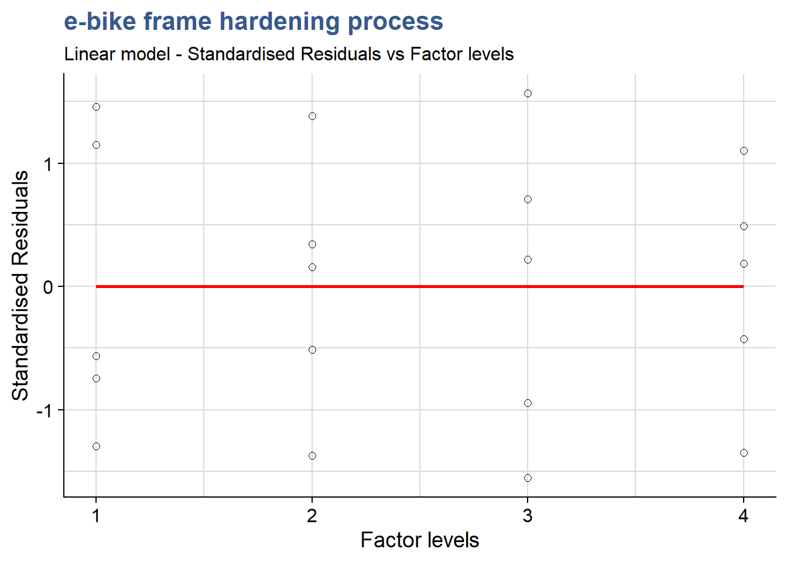

Besides being another support to detect outliers, this additional plot also helps seeing if the variance of the residuals is identical in this case between the factor levels.

### Homocedasticity {#homocedasticity}


```r
bartlett.test(cycles ~ temperature, data = ebike_factor)
```

```

	Bartlett test of homogeneity of variances

data:  cycles by temperature
Bartlett's K-squared = 0.433, df = 3, p-value = 0.93
```

A complement to the residuals-fit/residuals-factors plots is the equality of variances test. Tests for variance comparison have been introduced in the Direct Comparisons case studies but the `var.test()` cannot be used here. Here we have more than two levels for which the Bartlett test is most suited. The normal distribution of the residuals has already been confirmed. This test is sensitive to the normality assumption, consequently, when the validity of this assumption is doubtful, it should not be used and be replaced by the modified Levene test for example. Applying the test we obtain a p-value is P = 0.93 meaning we cannot reject the null hypothesis. In statistical terms, there is no evidence to counter the claim that all five variances are the same. This is the same conclusion reached by analyzing the plot of residuals versus fitted values.

### Outliers test {#outliers}


```r
outlierTest(ebike_lm_factor)
```

```
No Studentized residuals with Bonferroni p < 0.05
Largest |rstudent|:
   rstudent unadjusted p-value Bonferroni p
12   1.6488            0.11997           NA
```

In a case where we were doubtfull we could go further and make a statistical test to assess if a certain value was an outlier. Another usefull test is available in the  `{car}` package in this case to test outliers. We get a *Bonferroni* adjusted p value as NA confirming that there is no outlier in the data.   

### Cooks distance {#cooks}


```r
ebike_aug %>% 
  ggplot(aes(x = index, y = .cooksd)) +
  geom_col(color = viridis(12)[4], fill = "grey90") +
  geom_hline(yintercept = 1, color = "red") +
  labs(title = "e-bike frame hardening process",
       subtitle = "Residuals vs Leverage",
  x = "Observation",
  y = "Cooks distance")
```


Cooks distance is a complementary analysis to the residuals that can help identify specific data points that could have a strong influence in the model. Various cutoff points are suggested in the literature and we opted here for 1 following the short wikipedia article on the topic [cooks distance](https://en.wikipedia.org/wiki/Cook's_distance) 

### R-squared {#R-squared}


```r
summary(ebike_lm_factor)$r.squared
```

```
[1] 0.92606
```

A final input in the draft report of the ebike hardening linear model is the R-squared. When looking into the results the engineering team is suspicious. In this case 93% of the output is explained by input and a model with such a good fit should raise questions. Our lab supervisor is also not confortable the residuals analysis has not shown any evidence of something wrong with the model so he decides to quickly calculate it "by hand". He knows that the R-squared, or coefficient of determination is obtained from the ratio between the residuals variance and the output variable variance showing exactly the proportion between the two and he gets its straight away from R using the data already available:


```r
ebike_aug %>%
  summarise(cycles_var = var(cycles), residuals_var = var(.resid)) %>%
  mutate(Rsquared = 1 - residuals_var/cycles_var) %>% pull(Rsquared)
```

```
[1] 0.92606
```

Remembering the original linear regression plot from the beginning of the report he accepts this must not be so far away. It was clear that the temperature had a strong impact on the number of cycles and the variability for each level was small in the end. He accepts to leave as it is for now waiting for upcoming analysis of variance to see additional details.

<!--chapter:end:6_models.Rmd-->


## Effects significance

The commercial introduction of the new e-bike model is approaching soon and production is expected to start in a couple of months. The engineering team is getting impacient because the parameters for the frame thermal treatment are not yet defined. The engineering head call for a second meeting to review once more the DoE outputs. The lab supervisor reopens his Rmd report tries to go beyond the linear model discussed before. He created raw data plots with dots on individual data points but now he thinks it is important to have a view on the data distribution and some summary statistics. For that he prepares a box plot:


```r
ggplot(
  ebike_factor, 
  aes(x = temperature, y = cycles, fill = temperature)) +
  geom_boxplot() +
  scale_fill_viridis_d(option = "D", begin = 0.5) +
  scale_y_continuous(n.breaks = 10, labels = label_number(big.mark = "'")) +
  theme(legend.position = "none") +
  labs(title = "e-bike frame hardening process",
       subtitle = "Raw data plot",
       x = "Furnace Temperature [°C]",
       y = "Cycles to failure [n]")
```

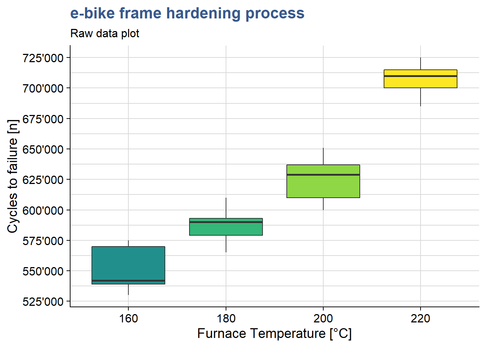

They have been doing so many experiments that sometimes it gets hard to remember which variables have been tested in which experiment. This plot reminds him that this test consisted simply on 1 input variable with severals levels - the temperature and one continuous dependent variable - the number of cycles to failure. The plots shows clearly that the distributes are quite appart from each other in spite of the slight overlap between the first three groups. The underlying question is: are the different levels of temperature explaining the different results in resistance to fatigue? to confirm that means of those groups are statistically different from each other he knows he can use the analysis of variance. The name is a bit misleading since he want to compare means...but this name is historical and comes from the way the approach has evolved. The anova as it is called is similar to the t-test but is extended. Using all pair wise t-tests would mean more effort and increase the type I error.

The anova main principle is that the the total variability in the data, as measured by the total corrected sum of squares, can be partitioned into a sum of squares of the differences between the treatment averages and the grand average plus a sum of squares of the differences of observations within treatments from the treatment average. The first time he read this explanation it seemed complex but he understood better on seeing a simple hand made example on the [kahn academy - anova](https://www.youtube.com/watch?v=EFdlFoHI_0I).

### Anova {#aov}


```r
ebike_aov_factor <- aov(ebike_lm_factor)
summary(ebike_aov_factor)
```

```
            Df   Sum Sq  Mean Sq F value  Pr(>F)    
temperature  3 6.69e+10 2.23e+10    66.8 2.9e-09 ***
Residuals   16 5.34e+09 3.34e+08                    
---
Signif. codes:  0 '***' 0.001 '**' 0.01 '*' 0.05 '.' 0.1 ' ' 1
```

In R the anova is built by passing the linear model object to the `anova()` or `aov()` functions. The output of the first is just the anova table, the output of the second function is a complete list with the full lm model inside.

The R anova output gives the Mean Square for the factor and for the residuals. In this case the between-treatment mean square is much larger than the within-treatment or residuals mean square. This suggests that it is unlikely that the treatment means are equal. The p is extremely small thus we have basis to reject the null hypothesis and conclude that the means are significantly different. 
In the mean while the lab supervisor has gathered data on a similar experiment done with frams in another material for that seems to be less sensitive the the treatment temperation. He uploads this data and assigns it to a dataset called `ebike_hardning2` and plots another box plot.


```r
ebike_narrow2 <- ebike_hardening2 %>%
  pivot_longer(
    cols = starts_with("g"),
    names_to = "observation",
    values_to = "cycles"
  ) %>%
  group_by(temperature) %>%
  mutate(cycles_mean = mean(cycles)) %>%
  ungroup()
ebike_factor2 <- ebike_narrow2
ebike_factor2$temperature <- as.factor(ebike_factor2$temperature)
```


```r
ggplot(ebike_factor2, 
       aes(x = temperature, y = cycles, fill = temperature)) +
  geom_boxplot() +
  scale_y_continuous(n.breaks = 10) +
  scale_fill_viridis_d(option = "A", begin = 0.5) +
  theme(legend.position = "none") +
  scale_y_continuous(n.breaks = 10, labels = label_number(big.mark = "'")) +
  labs(title = "e-bike frame hardening process",
       subtitle = "Boxplot of frame aging resistance",
       x = "Furnace Temperature [°C]",
       y = "Cycles to failure [n]")
```


Effectively within group variation is larger and groups overlap more. A new anova gives a p value of 0.34 supporting the assumption of no significant difference between the means of the treatment levels.


```r
ebike_lm_factor2 <- lm(cycles ~ temperature, data = ebike_factor2)
ebike_aov_factor2 <- aov(ebike_lm_factor2)
summary(ebike_aov_factor2)
```

```
            Df   Sum Sq  Mean Sq F value Pr(>F)
temperature  3 1.48e+09 4.92e+08     1.2   0.34
Residuals   16 6.55e+09 4.10e+08               
```

### Pairwise comparison {#tukey}


```r
ebike_tukey <- TukeyHSD(ebike_aov_factor, ordered = TRUE)
```


```r
head(ebike_tukey$temperature) %>% 
  kable(align = "c", 
        caption = "tukey test on e-bike frame hardening process", 
        booktabs = T)
```


Table: (\#tab:unnamed-chunk-9)tukey test on e-bike frame hardening process

|        |  diff  |   lwr    |  upr   |  p adj  |
|:-------|:------:|:--------:|:------:|:-------:|
|180-160 | 36200  |  3145.6  | 69254  | 0.02943 |
|200-160 | 74200  | 41145.6  | 107254 | 0.00005 |
|220-160 | 155800 | 122745.6 | 188854 | 0.00000 |
|200-180 | 38000  |  4945.6  | 71054  | 0.02160 |
|220-180 | 119600 | 86545.6  | 152654 | 0.00000 |
|220-200 | 81600  | 48545.6  | 114654 | 0.00001 |

Back to the main test the lab supervisor wants to see if all levels are significantly different from each other. As discusses the anova indicates that there is a difference in the treament means but it won't indicate which ones and doing individual t.tests has already been discarded. It is possible to get a direct one to one comparison of means with `TukeyHSD()` from `{stats}`. The test also provides a confidence interval for each difference. Most importantly it provides us with the p value to help us confirm the significance of the difference and conclude factor level by factor level which differences are significant. Additionally we can alo obtain the related plot with the confidence intervals 


```r
plot(ebike_tukey)
```


In the case of the frames thermal treatment all levels bring a specific impact on the lifecycle as we can see from the p values all below 0.05 and from the fact that no confidence interval crosses zero (there are no differences that could have a chance of being zero).

### Least significant difference {#fisherLSD}


```r
library(agricolae)
```


```r
ebike_LSD <- LSD.test(
  y = ebike_lm_factor,
  trt = "temperature"
)
```

A useful complement to Tukey's test is the calculation of Fisher's Least Significant differences. The Fisher procedure can be done in R with the `LSD.test()` from the `{agricolae}` package. The first important ouput is precisely the *least significant difference* which is the smallest the difference between means (of the the life cycles) that can be considered significant. This is indicated in the table below with the value LSD = 24'492.


```r
head(ebike_LSD$statistics) %>% 
  kable(align = "c", 
        caption = "Fisher LSD procedure on e-bike frame hardening: stats",
        booktabs = T)
```


Table: (\#tab:unnamed-chunk-13)Fisher LSD procedure on e-bike frame hardening: stats

|   |  MSerror  | Df |  Mean  |   CV   | t.value |  LSD  |
|:--|:---------:|:--:|:------:|:------:|:-------:|:-----:|
|   | 333700000 | 16 | 617750 | 2.9571 | 2.1199  | 24492 |

Furthermore it gives us a confidence intervals for each treatment level mean:


```r
head(ebike_LSD$means) %>% 
  select(-Q25, -Q50, -Q75) %>%
  kable(align = "c", 
        caption = "Fisher LSD procedure on e-bike frame hardening: means", 
        booktabs = T)
```


Table: (\#tab:unnamed-chunk-14)Fisher LSD procedure on e-bike frame hardening: means

|    | cycles |  std  | r |  LCL   |  UCL   |  Min   |  Max   |
|:---|:------:|:-----:|:-:|:------:|:------:|:------:|:------:|
|160 | 551200 | 20017 | 5 | 533882 | 568518 | 530000 | 575000 |
|180 | 587400 | 16742 | 5 | 570082 | 604718 | 565000 | 610000 |
|200 | 625400 | 20526 | 5 | 608082 | 642718 | 600000 | 651000 |
|220 | 707000 | 15248 | 5 | 689682 | 724318 | 685000 | 725000 |

We can see for example that for temperature 180 °C the lifecyle has an average of 587'400 (has he had calculated before) with a probability of 95% of being between 570'082 and and 604'718 cycles. Another useful outcome is the creation of groups of significance. 


```r
head(ebike_LSD$groups) %>% 
  kable(align = "c", 
        caption = "Fisher LSD procedure on e-bike frame hardening: groups", 
        booktabs = T)
```


Table: (\#tab:unnamed-chunk-15)Fisher LSD procedure on e-bike frame hardening: groups

|    | cycles | groups |
|:---|:------:|:------:|
|220 | 707000 |   a    |
|200 | 625400 |   b    |
|180 | 587400 |   c    |
|160 | 551200 |   d    |

In this case as all level means are statistically different they all show up in separate groups, each indicated by a specific letter. Finally we can use `plot()` which calls the method `plot.group()` from the same package. This allows us to provide as input the desired argument for the error bars.


```r
plot(
  ebike_LSD, 
  variation = "SE", 
  main = "e-bike hardening\nMeans comparison"
)
```


Strangly the package plot doesn't have the option to plot error bars with LSD and the lab supervisor decides to make a custom plot:


```r
ebike_factor %>%
  group_by(temperature) %>%
  summarise(cycles_mean = mean(cycles), 
            cycles_lsd = ebike_LSD$statistics$LSD) %>%
  ggplot(aes(x = temperature, y = cycles_mean, color = temperature)) +
  geom_point(size = 2) +
  geom_line() +
  geom_errorbar(aes(ymin = cycles_mean - cycles_lsd, 
                    ymax = cycles_mean + cycles_lsd),
                width = .1) +
  scale_y_continuous(n.breaks = 10, labels = label_number(big.mark = "'")) +
  scale_color_viridis_d(option = "C", begin = 0.1, end = 0.8) +
  annotate(geom = "text", x = Inf, y = -Inf, label = "Error bars are +/- 1xSD", 
    hjust = 1, vjust = -1, colour = "grey30", size = 3, 
    fontface = "italic") +
  labs(title = "e-bike frame hardening process",
       subtitle = "Boxplot of frame aging resistance",
       x = "Furnace Temperature [°C]",
       y = "Cycles to failure [n]")
```

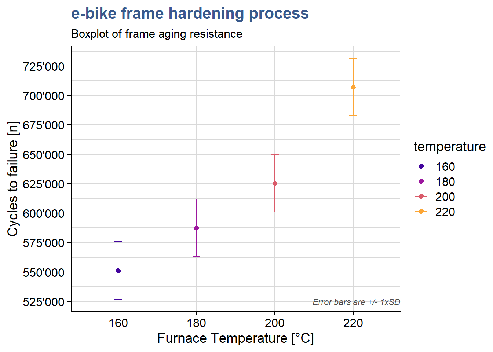

The plot shows some overlap between the levels of 160 and 180 and again between 180 and 200. When looking a the Tukey test outcome we see that the p value of these differences is close to 0.05. Presenting all these statistical findings to the team they end up agreeing that in order to really improve the resistance they should consider a jump from 160 to 200°C in the thermal treatment.

As often with statistical tools, there is debate on the best approach to use. We recommend to combine the Tukey test with the Fisher's LSD. The Tukey test giving a first indication of the levels that have an effect and calculating the means differences and the Fisher function to provide much more additional information on each level. To be considered in each situation the slight difference  between the significance level for difference between means and to decide if required to take the most conservative one.

To go further in the Anova F-test we recommend this interesting article from @minitab_anovaftest.

## Interactions

<div class="marginnote">

<b class="highlight">Case study: solarcell output test</b>


</div>

The countdown to leave fossil fuel has started as many companies have adopted firm timelines for 100% renewable energy sourcing. Solar energy is a great candidate but solar cell efficiency is a great challenge. Although it has been progressing steadily since more than four decades yields can still be considered low. A global manufacturing company of solar cells is looking to push the boundaries with a new generation of materials and grab another pie of the global market. 

### Model formulae {#formula}


```r
solarcell_formula <- formula(
  output ~ temperature * material
) 
```

In previous case studies input factors has been put directly in the arguments of the `lm()` function by using the inputs and outputs and relating them with the tilde ~ sign. The cases were simple with only one factor but in most DoEs we want to have many factors and decide which interactions to keep or drop. Here we're looking a bit more into detail in how to express this. When we pass an expression to the `formula()` function we generate an object of class formula and at that time some calculations are done in background to prepare the factors for the linear model calculation. Looking at the formula class and attributes we have:


```r
class(solarcell_formula)
```

```
[1] "formula"
```

```r
attributes(terms(solarcell_formula))$factors
```

```
            temperature material temperature:material
output                0        0                    0
temperature           1        0                    1
material              0        1                    1
```

We can see that the expression has been extended. Although we have only given as input the product of the factors we can see that an interaction term `temperature:material` has been generated. We also see the contrasts matrix associated. There is a specific syntax to specify the formula terms using `*`,`+` and other symbols. As always it is good to consult the function documentation with `?formula`.

In the solar cell manufacturing company mentioned before the R&D team is working a new research project with the objective of understanding the output in [kWh/yr equivalent] of a new solar cell material at different ambient temperatures. Their latest experiment is recorded in an R dataset with the name `solarcell_output`:


```r
solarcell_output %>%
  head(5) %>%
  kable(align = "c")
```


|  material   | run | T-10 | T20 | T50 |
|:-----------:|:---:|:----:|:---:|:---:|
|  thinfilm   |  1  | 130  | 34  | 20  |
|  thinfilm   |  2  |  74  | 80  | 82  |
|  thinfilm   |  3  | 155  | 40  | 70  |
|  thinfilm   |  4  | 180  | 75  | 58  |
| christaline |  1  | 150  | 136 | 25  |

As often this data comes in a wide format and the first step we're doing is to convert it into a long format and to convert the variables to factors.


```r
solarcell_factor <- solarcell_output %>% 
  pivot_longer(
    cols = c("T-10", "T20", "T50"),
    names_to = "temperature",
    values_to = "output"
  ) %>% mutate(across(c(material, temperature), as_factor))
```

The experiment has consisted in measuring the output at three different temperature levels on three different materials. The associated linear model can be obtained with:


```r
solarcell_factor_lm <- lm(
  formula = solarcell_formula, 
  data = solarcell_factor
  )
summary(solarcell_factor_lm)
```

```

Call:
lm(formula = solarcell_formula, data = solarcell_factor)

Residuals:
   Min     1Q Median     3Q    Max 
-60.75 -14.63   1.38  17.94  45.25 

Coefficients:
                                     Estimate Std. Error t value Pr(>|t|)    
(Intercept)                            134.75      12.99   10.37  6.5e-11 ***
temperatureT20                         -77.50      18.37   -4.22  0.00025 ***
temperatureT50                         -77.25      18.37   -4.20  0.00026 ***
materialchristaline                     21.00      18.37    1.14  0.26311    
materialmultijunction                    9.25      18.37    0.50  0.61875    
temperatureT20:materialchristaline      41.50      25.98    1.60  0.12189    
temperatureT50:materialchristaline     -29.00      25.98   -1.12  0.27424    
temperatureT20:materialmultijunction    79.25      25.98    3.05  0.00508 ** 
temperatureT50:materialmultijunction    18.75      25.98    0.72  0.47676    
---
Signif. codes:  0 '***' 0.001 '**' 0.01 '*' 0.05 '.' 0.1 ' ' 1

Residual standard error: 26 on 27 degrees of freedom
Multiple R-squared:  0.765,	Adjusted R-squared:  0.696 
F-statistic:   11 on 8 and 27 DF,  p-value: 9.43e-07
```

We're going to go more in details now to validate the model and understand the effects and interactions of the different factors.

### Residuals standard error {#RSE}


```r
pluck(summary(solarcell_factor_lm), "sigma")
```

```
[1] 25.985
```

Besides the R-squared discussed previously in the linear models unit there is another useful indicator of the quality of the fit which is the Residuals Standard Error RSE. It provides the magnitude of a typical residuals. This value is also given directly as output of the model summary and is 26 in this case. Like the R-squared is better when we know how it is calculated and once we're at ease with manipulating the model data either with `{stats}` or `{broom}` it is possible to with a few steps check see how this is done.


```r
sqrt(sum(solarcell_factor_lm$residuals ^ 2) / df.residual(solarcell_factor_lm))
```

```
[1] 25.985
```

The exact value is 25.985 confirming the value extracted from the summary with the `pluck()` function from `{purrr}`.

### Residuals summary {#plot.lm}


```r
par(mfrow = c(2,3))
plot(solarcell_factor_lm$residuals)
plot(solarcell_factor_lm, which = 2)
plot(solarcell_factor_lm, which = c(1, 3, 5))
plot(solarcell_factor_lm, which = 4)
```

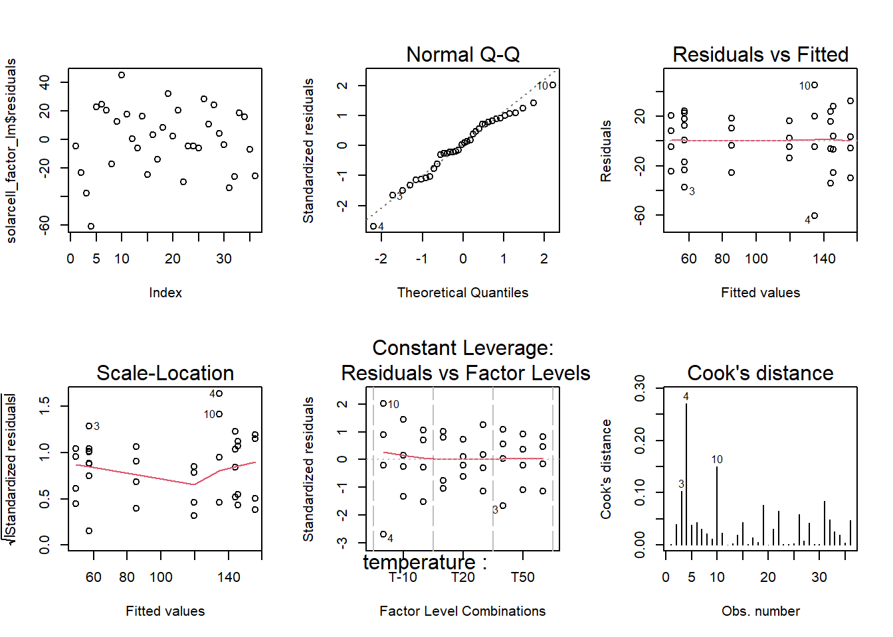

As the residuals analysis has been discussed in detail including custom made plots and statistical tests in the linear models unit, the assessment is done here in a summarized manner with a grouped output of all residuals plots. The qq plot presents good adherence to the center line indicating a normal distribution; the residuals versus fit presents a rather symmetrical distribution around zero indicating equality of variances at all levels and; the scale location plot though, shows a center line that is not horizontal which suggests the presence of outliers; in the Residuals versus fit we can effectively sense the Residuals Standard Error of 26.

### Interaction plot {#interaction.plot}


```r
interaction.plot(
  type = "b",
  col = viridis(12)[4],
  x.factor = solarcell_factor$temperature,
  trace.factor = solarcell_factor$material,
  fun = mean,
  response = solarcell_factor$output,
  trace.label = "Material",
  legend = TRUE,
  main = "Temperature-Material interaction plot",
  xlab = "temperature [°C]",
  ylab = "output [kWh/yr equivalent]"
)
```

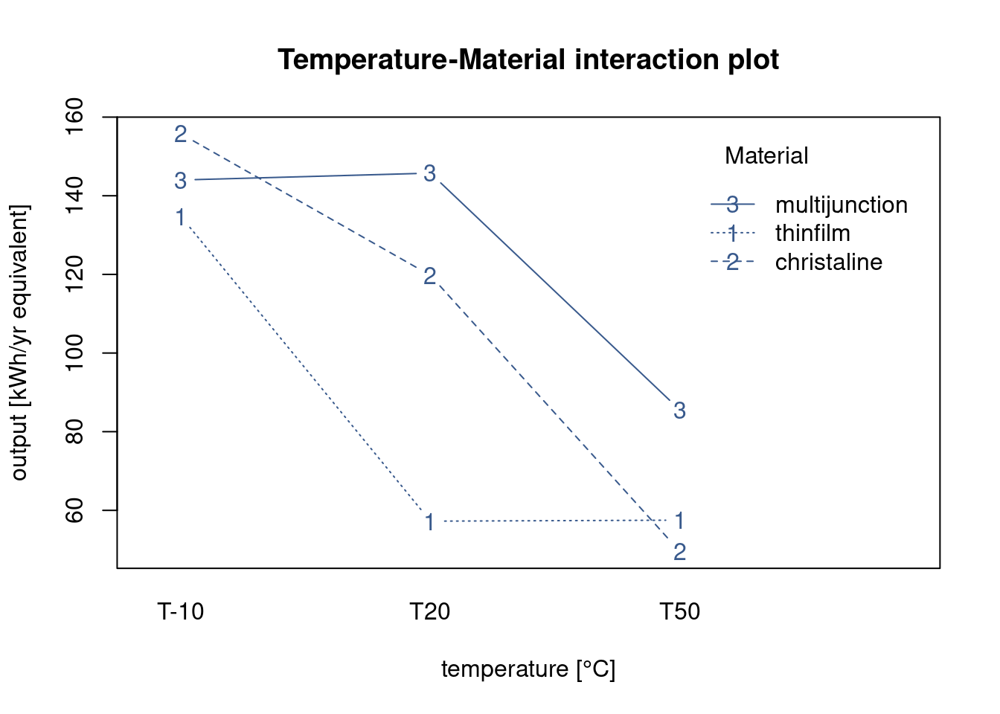

In order to understand the behavior of the solar cell materials in the different temperature conditions the R&D team is looking for a plot that presents both factors simultaneous. Many different approaches are possible in R and here the team has selected the most basic one, the `interactionplot()` from the `{stats}` package.

Although simple several findings can already be extracted from this plot. They get the indication of the mean value of the solar cell output for the different materials at each temperature level. Also we see immediately that batteries tend to last longer at lower temperatures and this for all material types. We also see that there is certainly an interaction between material and temperature as the lines cross each other.

### Anova with interactions {#anova}


```r
anova(solarcell_factor_lm)
```

```
Analysis of Variance Table

Response: output
                     Df Sum Sq Mean Sq F value  Pr(>F)    
temperature           2  39119   19559   28.97 1.9e-07 ***
material              2  10684    5342    7.91   0.002 ** 
temperature:material  4   9614    2403    3.56   0.019 *  
Residuals            27  18231     675                    
---
Signif. codes:  0 '***' 0.001 '**' 0.01 '*' 0.05 '.' 0.1 ' ' 1
```

Continuing the analysis started in the interaction plot the R&D team checks the anova output. Like in the lm summary output, the  stars in front of the p value of the different factors indicate that the effects are statistically different. Three stars for temperature corresponding to an extremely low p value indicating that the means of the output at the different levels of temperature are different. This confirms that temperature has an effect on output power. The material effect has a lower significance but is also clearly impacting cell power output. Finally it is confirmed that there is an interaction between temperature and material as the temperature:material term has a p value of 0.019 which is lower than the typical threshold of 0.05. Looking into the details interaction comes from the fact that increasing temperature from 10 to 20 decreases output for the thinfilm but is not yet impacting the output for multijunction film. For multijunction it is needed to increase even further the temperature to 50°C to see the decrease in the output. 

Before closing the first DOE analysis meeting the  R&D team discusses what would have been take-aways  if the interaction had not put in the model. As they use more and more R during their meetings and do the data analysis on the sport they simply create another model without the temperature:material term in the formula:


```r
solarcell_factor_lm_no_int <- lm(
  output ~ temperature + material, 
  data = solarcell_factor)
summary(solarcell_factor_lm_no_int)
```

```

Call:
lm(formula = output ~ temperature + material, data = solarcell_factor)

Residuals:
   Min     1Q Median     3Q    Max 
-54.39 -21.68   2.69  17.22  57.53 

Coefficients:
                      Estimate Std. Error t value Pr(>|t|)    
(Intercept)              122.5       11.2   10.97  3.4e-12 ***
temperatureT20           -37.2       12.2   -3.04   0.0047 ** 
temperatureT50           -80.7       12.2   -6.59  2.3e-07 ***
materialchristaline       25.2       12.2    2.06   0.0482 *  
materialmultijunction     41.9       12.2    3.43   0.0017 ** 
---
Signif. codes:  0 '***' 0.001 '**' 0.01 '*' 0.05 '.' 0.1 ' ' 1

Residual standard error: 30 on 31 degrees of freedom
Multiple R-squared:  0.641,	Adjusted R-squared:  0.595 
F-statistic: 13.9 on 4 and 31 DF,  p-value: 1.37e-06
```

Residual standard error is up from 26 to 30 which shows a poorer fit but R-square is only down from 76.5% to 64.1% which is still reasonably high. They apply the anova on this new model:


```r
anova(solarcell_factor_lm_no_int)
```

```
Analysis of Variance Table

Response: output
            Df Sum Sq Mean Sq F value  Pr(>F)    
temperature  2  39119   19559   21.78 1.2e-06 ***
material     2  10684    5342    5.95  0.0065 ** 
Residuals   31  27845     898                    
---
Signif. codes:  0 '***' 0.001 '**' 0.01 '*' 0.05 '.' 0.1 ' ' 1
```

The output still confirms the significance of the effects of the factors but the residuals analysis raises other concerns:


```r
par(mfrow = c(2,3))
plot(solarcell_factor_lm_no_int$residuals)
plot(solarcell_factor_lm_no_int, which = 2)
plot(solarcell_factor_lm_no_int, which = c(1, 3, 5))
plot(solarcell_factor_lm_no_int, which = 4)
```


They see in the Residuals vs Fitted a clear pattern with residuals moving from positive to negative and then again to positive along the fitted values axis which indicates that there is an interaction at play. Another concern comes from the Residuals versus Factor levels where at 10°C some residuals go beyond 2 standard deviations. The model with the interaction is clearly preferred in this case. 

## Covariance


```r
solarcell_fill %>% 
  head(5) %>%
  kable()
```


|material        | output| fillfactor|
|:---------------|------:|----------:|
|multijunction_A |    108|         20|
|multijunction_A |    123|         25|
|multijunction_A |    117|         24|
|multijunction_A |    126|         25|
|multijunction_A |    147|         32|

Solarcell experiments continue as the R&D project on new materials progresses. Any increase in the output, which is measured in [kWh/yr equivalent will bring a competitive advantage to the company. The previous meeting outcome made the R&D team select the multijunction material as the best candidate for the next round of tests. A new experiment has been designed but the team needs to go deeper in the understanding on how to improve the power output. Besides temperature and material there seems to be another variable at play: the fill factor. This seems to be a complex technical topic but all experts agree that this is influencing the behavior of the cell. The fill factor depends on the electrical circuit configuration and the output seems to be correlated with it. Until now the team has not been able to control the fill factor. The table just presented shows the value of fill factor collected for each cell tested together with the measured output.

A Data Scientist from the center recommends to use an analysis of covariance (ancova) which can be useful in situations where a continuous variable may be influencing the measured value. He calls this a covariate. In such specific case this approach provides better results than the analysis of variance (anova) allowing for a more accurate assessment of the effects of the categorical variable. In this case it can remove the effect of the fill factor in the output when we want to compare the different materials. It is nevetheless important to ensure the basic assumption that the continuous variable is independent from the factor to be analyses, in this case that the material is not influencing the fill factor. A good explanation and a similar case (without R) can be seen on page 655 of @Montgomery2012.


```r
solarcell_fill %>%
  ggplot(aes(x = fillfactor, y = output)) +
  geom_point() +
  geom_smooth(method = "lm", se = FALSE) +
  theme_industRial() +
  labs(
    title = "The solarcell output test",
    subtitle = "Output vs Fill Factor",
    x = "Fill factor [%]",
    y = "Output"
  )
```


### Correlation test {#cor.test}


```r
cor.test(
  solarcell_fill$output, solarcell_fill$fillfactor,
  method = "pearson"
  )
```

```

	Pearson's product-moment correlation

data:  solarcell_fill$output and solarcell_fill$fillfactor
t = 9.8, df = 13, p-value = 2.3e-07
alternative hypothesis: true correlation is not equal to 0
95 percent confidence interval:
 0.82100 0.97976
sample estimates:
    cor 
0.93854 
```

The next step is to confirm the correlation between the continuous input variable and the output and the `cor.test()` from the `{stats}` package is perfectly suited for this. The extremely high value of 93% confirms what was very visible in the scatterplot. Going further and using the approach from [@Broc2016] we're going to facet the scatterplots to assess if the coefficient of the linear regression is similar for all the levels of the fillfactor:


```r
solarcell_fill %>%
  ggplot(aes(x = fillfactor, y = output)) +
  geom_point() +
  geom_smooth(method = "lm", se = FALSE) +
  facet_wrap(vars(material)) +
  theme_industRial() +
  labs(
    title = "The solarcell output test",
    subtitle = "Output vs Fill Factor, by material type",
    x = "Fill factor [%]",
    y = "Output"
  )
```


The linear regression plots split by material show that from one material to the other the relationship between output and fillfactor is equivalent. Not only increasing fill factor increase output the degree to which this takes place is similar as we can see by the slopes of the plot. Care needs to be taken because the  number of points is very small. If required it is always possible to do individual correlation test and/or do a statistical test between slopes. Now things are ready to the ancova itself.

### Ancova {#ancova_aov}


```r
solarcell_ancova <- aov(
  formula = output ~ fillfactor + material, 
  data = solarcell_fill
  )
solarcell_aov <- aov(
  output ~ material, 
  data = solarcell_fill
  )
```

Although the team had been using R often the case of the ancova had not yet came up so it was up to the Data Scientist to do this analysis. In R the ancova can be done with the same function as the anova, the `aov()` function from `{stats}` but there's a specific way to establish the formula which he has obtained from [Datanovia - Ancova](https://www.datanovia.com/en/lessons/ancova-in-r/): the covariate is the first input and there must be interaction between the two inputs, thus the plus sign only. As with contrasts, any little mistake in the syntax may produce very different results so it requires great care and often confirmation of calculation with an existing well know case. 


```r
summary(solarcell_ancova)
```

```
            Df Sum Sq Mean Sq F value Pr(>F)    
fillfactor   1   2746    2746  119.93  3e-07 ***
material     2    120      60    2.61   0.12    
Residuals   11    252      23                   
---
Signif. codes:  0 '***' 0.001 '**' 0.01 '*' 0.05 '.' 0.1 ' ' 1
```

```r
summary(solarcell_aov)
```

```
            Df Sum Sq Mean Sq F value Pr(>F)  
material     2   1264     632    4.09  0.044 *
Residuals   12   1854     155                 
---
Signif. codes:  0 '***' 0.001 '**' 0.01 '*' 0.05 '.' 0.1 ' ' 1
```

The `aov()` summary output looks exactly the same for both analysis but the in the first output corresponding to the ancova the material mean square has been adjusted for regression and is smaller. It is also noticeable that the residuals are smaller in the ancova which confirm that the approach has helped reducing the error variability.

Finaly the most important observation is that the conclusions would have been just the opposite if the Data Scientist had not recommended the ancova. In fact in the anova would have shown that the material influences the output while when removing the influence of the fill factor the ancova ends up showing that there is no influence. This is visible in the p value which is above 0.05 in the ancova and below 0.05 in the anova.

As next steps the R&D team decides to tackle this fill factor issue and get it into control. Reducing fill factor variability within each material will certainly reduce the variability in the power output. I would also make upcoming experiments simpler and more easily comparable.


<!--chapter:end:7_effects.Rmd-->


## General designs

General factorial designs require teams to put together a wealth of knowledge of which some has been already applied in previous case studies or is refered in the bibliography and glossary. This comprises things like root cause analysis, linear models and analysis of variance naturally all coherently articulated in a well though project with clear objectives. The building blocks discussed so far relate to a limited number of input factors and levels and exclusively with a single output variable. Model validation and interactions have been presented as these are needed in all cases and once all these are mastered it becomes possible to consider situations with many variables, many outputs and higher level interactions. These arrangements become extremely powerful and allow to handle complex real life situations such as the design of a new system with dozens of features that relate with each other or the optimization of a manufacturing process where the amount of data generated is very large but the testing time and cost are very high. At this moment considerations of trial quantities optimization enter at play.

In our case studies a *run* represents a unique combination of the factors and a *replicate* an independent repetition of a run. This leads to the notion of *trials* corresponding to the multiplication of the number of runs by the number of replicates. For small designs it is possible to calculate the number of trials by simply multiplying the number of levels of each factor. With 1 factor with 3 levels and 2 factors with 4 levels we have $3 \times 4 \times 4 = 48$ which corresponds to the number of distinct combinations. For a higher number of factors and levels where this is not practical the total number of trials is given by $l^k$ where $l$ is the number of levels and $k$ the number of input factors. 

In this case for a design with 4 factors of 2 levels we have then $2^4 = 16$ runs and if each has 5 replicates there are $16 \times 5 = 80$ trials to be executed. If more factors with a different number of levels are added, the total number of trials is calculated by multiplying both groups: $l_{1}^{k_{1}}$  $\times$ $l_{2}^{k_{2}}$. Continuing the previous example, if 3 additional factors with 4 levels each were added, all with 5 replicates, the total number of trials would be expressed as follows: $2^{4} \times 4^{3} = 1024 \times 5 = 5120$ trials, which is a very high number in most industrial cases and would require optimization techniques which will be discussed further.


### Factorial design {#fac.design}

<div class="marginnote">

<b class="highlight">Case study: juice bottling plant</b>

In a juice producing plant a new fast dry matter content measurement device from the supplier DRX has been recently put in operation but the Quality Assurance Head has raised concerns on a bias with the reference method. The quality team established DoE to assess several potential causes such as the dry matter content and juice residue particle size.


</div>


```r
library(DoE.base)
```


```r
juice_doe <- fac.design(
  randomize = FALSE,
  factor.names = list(
    product = c("beetroot", "apple", "carrot"), 
    drymatter_target = c(10, 15, 20),
    part = c(1, 2, 3),
    speed = c(20, 25),
    particle_size = c(250, 300))
)
```

Although the Calibration essay discussed in the MSA unit has shown a bias during the acceptance phase the Factory Management has opted to put it in production. The reduction in measurement time is significant and Supply Chain is putting pressure to increase volumes in a context where on-line sales rocket sky high. The Quality Manager understands all this but he's concern of having some kind of kickback. Although he's not expecting any kind of consumer complain, dry matter levels are somehow loosely related with some sort claims and regulatory limits.

To dig deeper and understand how to minimize this bias he has asked one of his team members to come up with an experiment design. He would like something that combines all factors mentionned by the team as potential root causes for the bias. After a short brainstorming between the production and quality teams several potential causes for bias were: drymatter level, the speed of filling and the powder particle size. This lead to  a mid size experiment design with three products, three levels of drymatter, two line speed levels and two particle size levels.

When the number of factors and levels is limited it is possible to reccur to existing experiment designs and pre-filled *Yates tables*. In this case the quality analyst had been trying with R and found a package called `{DoE.base}` which generates such designs automatically with the function `fac.desig`. The output generated by this function is more than just a tibble, it belongs to a specific class called `design`and has other attributes just like an lm or aov S3 objects. The care given by the package authors becomes visible when using an R generic function such as `summary()` with such object and get as return a tailor made output, in this case showing the levels of the different factors of our design: 


```r
class(juice_doe)
```

```
[1] "design"     "data.frame"
```

```r
summary(juice_doe)
```

```
Call:
fac.design(randomize = FALSE, factor.names = list(product = c("beetroot", 
    "apple", "carrot"), drymatter_target = c(10, 15, 20), part = c(1, 
    2, 3), speed = c(20, 25), particle_size = c(250, 300)))

Experimental design of type  full factorial 
108  runs

Factor settings (scale ends):
   product drymatter_target part speed particle_size
1 beetroot               10    1    20           250
2    apple               15    2    25           300
3   carrot               20    3                    
```

In the summary() output we can see the plan factors with 3 products, 3 levels of dry matter target, 2 levels for speed and 2 levels for particle size. Using this the team has simple copied the experiment plan to an spreadsheet to collect the data:

```{}
juice_doe %>% 
  write_clip() 
```

and after a few days the file completed with the test results cames back ready for analysis


```r
juice_drymatter %>%
  head() %>%
  kable()
```


|product  | drymatter_TGT| speed| particle_size| part| drymatter_DRX| drymatter_REF|
|:--------|-------------:|-----:|-------------:|----:|-------------:|-------------:|
|apple    |            10|    20|           250|    1|          9.80|         10.05|
|apple    |            10|    20|           250|    2|          9.82|         10.05|
|apple    |            10|    20|           250|    3|          9.82|         10.05|
|beetroot |            10|    20|           250|    1|          9.79|         10.03|
|beetroot |            10|    20|           250|    2|          9.75|         10.03|
|beetroot |            10|    20|           250|    3|          9.77|         10.03|

and the only thing quality analyst had to add was an extra column to calculate the bias:


```r
juice_drymatter <- juice_drymatter %>%
  mutate(bias = drymatter_DRX - drymatter_REF)
```

### Main effects plots {#main_effects}

<div class="marginnote">

<div class="figure">

<p class="caption">(\#fig:unnamed-chunk-7)Main</p>
</div>

</div>


```r
drymatter_TGT_plot <- juice_drymatter %>%
  group_by(drymatter_TGT) %>%
  summarise(bias_m_drymatter = mean(bias)) %>%
  ggplot(aes(x = drymatter_TGT, y = bias_m_drymatter)) +
  geom_point() +
  geom_line() +
  coord_cartesian(
    xlim = c(9,21),
    ylim = c(-1,0), expand = TRUE) +
  labs(
    title = "Juice bottling problem",
    subtitle = "Main effects plots",
    x = "Drymatter TGT [%]",
    y = "Average bias [g]"
  )
```

As the number of factors and levels of a design increase, more thinking is required to obtain good visualisation of the data. Main effects plots consist usually of a scatterplot representing the experiment output as a function of one of the inputs. This first plot consists of the mean bias as a function of the dry matter for each of the 3 levels tested. As the DOE has 3 factors, three plots like this are required in total. The Quality Analyst builds the remaining two plots and then groups them all together in a single output with the package `{patchwork}`. This is made by simply putting `+` between the plots.


```r
particle_size_plot <- juice_drymatter %>%  
  group_by(particle_size) %>%
  summarise(particle_size_bias_mean = mean(bias)) %>%
  ggplot(aes(x = particle_size, y = particle_size_bias_mean)) +
  geom_point() +
  geom_line() +
  coord_cartesian(
    xlim = c(240,310), 
    ylim = c(-1,0), expand = TRUE) +
  labs(
    x = "Particle Size",
    y = "Average bias [g]"
  )

speed_plot <- juice_drymatter %>%  
  group_by(speed) %>%
  summarise(speed_bias_mean = mean(bias)) %>%
  ggplot(aes(x = speed, y = speed_bias_mean)) +
  geom_point() +
  geom_line() +
  coord_cartesian(
    xlim = c(19, 26),
    ylim = c(-1,0), expand = TRUE) +
  labs(
    x = "Speed",
    y = "Average bias [g]"
  )

drymatter_TGT_plot + particle_size_plot + speed_plot
```


Main effects plots give important insights in to the experiement outcomes and this even before any statistical analysis with a linear model and anova. From these three plots the Quality Analyst already takes the following observations for her report:

* bias increases in negative direction as dry matter content increases
* bias increases in positive direction as particle size increases
* bias is not influence by line speed

### Interaction plots (custom) {#interaction_plot}


```r
drymatter_TGT_particle_size_plot <- juice_drymatter %>%  
  mutate(particle_size = as_factor(particle_size)) %>%
  group_by(drymatter_TGT, particle_size) %>%
  summarise(drymatter_bias_mean = mean(bias), drymatter_bias_sd = sd(bias)) %>%
  ggplot(aes(x = drymatter_TGT, y = drymatter_bias_mean, color = particle_size, linetype = particle_size)) +
  geom_point(aes(group = particle_size), size = 2) +
  geom_line(aes(group = particle_size, linetype = particle_size)) +
  scale_linetype(guide=FALSE) +
  geom_errorbar(aes(
    ymin = drymatter_bias_mean - 2 * drymatter_bias_sd,
    ymax = drymatter_bias_mean + 2 * drymatter_bias_sd,
    width = .5
  )) +
  scale_color_viridis_d(option = "C", begin = 0.3, end = 0.7, name = "Particle size") +
  coord_cartesian(
    xlim = c(9,21),
    ylim = c(-1,0), expand = TRUE) +
  annotate(geom = "text", x = Inf, y = 0, label = "Error bars are +/- 2xSD", 
    hjust = 1, vjust = -1, colour = "grey30", size = 3, 
    fontface = "italic") +
  labs(
    title = "Juice bottling problem",
    subtitle = "Interaction plots",
    x = "Drymatter target",
    y = "Average bias deviation [g]"
  ) +
  theme(legend.justification=c(1,0), legend.position=c(1,0))
```

Now to look deeper and she's preparing interaction plots. She wants to understand if factors combine in unexpected ways at certain levels. In designs like these with 3 factors we have 3 possible interactions (A-B, A-C, B-C) corresponding the the possible combination between them. It is important to keep in mind that at least two replicates by run are needed to be able determine the sum of squares due to error, this if all possible interactions are to be included in the model. As the plan is a full factorial plan and there are more than 2 replicates, all factor combinations are resolved and can be assessed for their significance. The interaction plots show precisely such combinations, two at a time against the output. The first one Dry matter target - Particle Size being ready she moves to the next two: Dry matter target - Speed and Speed - Particle Size.


```r
drymatter_TGT_speed_plot <- juice_drymatter %>%  
  mutate(speed = as_factor(speed)) %>%
  group_by(drymatter_TGT, speed) %>%
  summarise(drymatter_bias_mean = mean(bias), drymatter_bias_sd = sd(bias)) %>%
  ggplot(aes(x = drymatter_TGT, y = drymatter_bias_mean, color = speed)) +
  geom_point(aes(group = speed), size = 2) +
  geom_line(aes(group = speed, linetype = speed)) +
  scale_linetype( guide=FALSE) +
  scale_color_viridis_d(option = "C", begin = 0.3, end = 0.7, name = "Speed") +
  geom_errorbar(aes(
    ymin = drymatter_bias_mean - 2 * drymatter_bias_sd,
    ymax = drymatter_bias_mean + 2 * drymatter_bias_sd,
    width = .5
  )) +
  coord_cartesian(
    xlim = c(9, 21),
    ylim = c(-1,0), expand = TRUE) +
  annotate(geom = "text", x = Inf, y = 0, label = "Error bars are +/- 2xSD", 
    hjust = 1, vjust = -1, colour = "grey30", size = 3, 
    fontface = "italic") +
  labs(
    x = "Dry matter target",
    y = "Average bias deviation [g]"
  ) +
  theme(legend.justification=c(1,0), legend.position=c(1,0))

speed_particle_size_plot <- juice_drymatter %>%  
  mutate(particle_size = as_factor(particle_size)) %>%
  group_by(speed, particle_size) %>%
  summarise(drymatter_bias_mean = mean(bias), drymatter_bias_sd = sd(bias)) %>%
  ggplot(aes(x = speed, y = drymatter_bias_mean, color = particle_size)) +
  geom_point(aes(group = particle_size), size = 2) +
  geom_line(aes(group = particle_size, linetype = particle_size)) +
  scale_linetype(guide=FALSE) +
  scale_color_viridis_d(option = "C", begin = 0.3, end = 0.7, name = "Particle size") +
  geom_errorbar(aes(
    ymin = drymatter_bias_mean - 2 * drymatter_bias_sd,
    ymax = drymatter_bias_mean + 2 * drymatter_bias_sd,
    width = .5
  )) +
  coord_cartesian(
    xlim = c(19, 26),
    ylim = c(-1,0), expand = TRUE) +
  annotate(geom = "text", x = Inf, y = 0, label = "Error bars are +/- 2xSD", 
    hjust = 1, vjust = -1, colour = "grey30", size = 3, 
    fontface = "italic") +
  labs(
    x = "Speed",
    y = "Average bias deviation [g]"
  ) +
  theme(legend.justification=c(1,0), legend.position=c(1,0))

drymatter_TGT_particle_size_plot + drymatter_TGT_speed_plot + speed_particle_size_plot
```


The approach here goes much beyond the interaction.plot function from the `{stats}` package introduced before and the code to obtain this plots is significantly longer. She has chosen to develop here the plots with `{ggplot2}` because she wanted to have direct access to all the minor details in the contruction of the plot such as the colors by line, a custom error bars calculation, very specific locations for the legends. She ends up concluding that there is no interaction between any of the different factors as all lines do not intercept, are mostly parallel and error bars cover each other.

### Formula expansion {#formula_expansion}


```r
f1 <- Y ~ A * B * C
f2 <- Y ~ A * B + C
```


```r
expand_formula(f1)
```

```
[1] "A"     "B"     "C"     "A:B"   "A:C"   "B:C"   "A:B:C"
```

```r
expand_formula(f2)
```

```
[1] "A"   "B"   "C"   "A:B"
```

The short code chunk before shows two formula expansion examples, the first one corresponding to our Juice DOE: in a design with factors coded A, B and C the sources of variation for the Anova table for three-factor fixed effects model are: A, B, C, AB, AC, BC, ABC. The second case corresponds to a situation where interactions with C would be discarded. Understanding these syntax details is very important because as more and more factors are added to models, the number of trials grows to unrealistic quantities. In such situations a preliminary work consisting in the selection of specific interactions enables the creation a fractional design. For now the juice doe is still small with 108 trials so she can move ahead assessing the effect significance of the different factors using the anova.

### Anova with 3rd level interactions {#anova_three}


```r
juice_drymatter_aov <- aov(
  bias ~ drymatter_TGT * speed * particle_size,
  data = juice_drymatter)
summary(juice_drymatter_aov)
```

```
                                   Df Sum Sq Mean Sq F value Pr(>F)    
drymatter_TGT                       1  1.315   1.315  486.06 <2e-16 ***
speed                               1  0.000   0.000    0.00   0.99    
particle_size                       1  0.624   0.624  230.70 <2e-16 ***
drymatter_TGT:speed                 1  0.001   0.001    0.27   0.60    
drymatter_TGT:particle_size         1  0.003   0.003    1.04   0.31    
speed:particle_size                 1  0.003   0.003    1.19   0.28    
drymatter_TGT:speed:particle_size   1  0.004   0.004    1.44   0.23    
Residuals                         100  0.271   0.003                   
---
Signif. codes:  0 '***' 0.001 '**' 0.01 '*' 0.05 '.' 0.1 ' ' 1
```

Here she simplified things by inputing the formula directly in the aov function without passing by the `formula()` or `lm()` functions. The previous observations done on the plots are fully confirmed and now supported with statistical evidence: `drymatter target` and `particle_size` significantly affect the bias (p < 0.05); `speed` has no effect; none of the interactions is significative. This first round of assessment was very clear and successful and she can make bold proposals to the Quality Manager now to look deeper into the links between drymatter target and particle size in that bias. Certainly passing by a discussion again with the product team and a final DOE with more levels to identify or select an optimal operating zone for the measurement method.

<!--chapter:end:8_generalDOEs.Rmd-->


## Two level designs

We may be armed with powerful tools to design and analyze experiments and even have strong knowledge in the topic we're studying but real life is full of constraints and a DOE is always the reflection of them. The calculation of the number of trials presented in the previous case shows a very quick explosion of the volume of work and material consumption. Another aspect is that as knowledge progresses and findings are accumulated on a topic certain variables which present little influence in the outputs start to be discarded. Data and models constructed in several preliminary DOEs can be consolidated under certain conditions. So the design of a new DOE should take into account the design of the previous DOE and this regarding not only the variables but even the levels themselves. With this in mind it is possible and common to start with very large screening experiments with for instance 10 inputs and 10 outputs and end up with a narrow optimization experiment with 2 factors with 4 levels to select a fine  operating window.

In these practical considerations, a way to make screening experiments realistic is to limit the number of levels of the factors, the minimum being 2 to have a complete factorial design .$2^{k}$  It provides the smallest number of runs with which k factors can be studied in a complete factorial design. Consequently, these designs are widely used in factor screening experiments.

The validity of the analysis depends on the following assumptions:

* the factors are fixed
* the designs are completely randomized
* the usual normality assumptions are satisfied
* the response is approximately linear over the range of the factor levels chosen

Analysis Procedure for a 2 k Design

1. Estimate factor effects
2. Form initial model (full model)
  a. If the design is replicated, fit the full model
  b. If there is no replication, form the model using a normal probability plot of the effects
3. Perform statistical testing (Anova)
4. Refine model (remove non significant effects)
5. Analyze residuals
6. Interpret results

DEF - Sparsity of effects principle: most systems are dominated by some of the main effects and low-order interactions, and most high-order interactions are negligible.

In this first Case Study dedicated to $2^k$ designs we're going to explore the contrasts settings in the linear model functions.

**The PET clothing improvement plan**

In this case study factors have only 2 levels. 

Below we start by preparing our dataset:


```r
library(DoE.base)
```


```r
pet_doe <- fac.design(
  randomize = FALSE,
  factor.names=list(A=c("-","+"), 
                    B=c("-","+"),
                    replicate = c("I", "II", "III"))
  )
```


```r
tensile_strength <- c(64.4,82.8,41.4,71.3,57.5,73.6,43.7,69.0,62.1,73.6,52.9,66.7)

pet_doe <- bind_cols(
  pet_doe,
  "tensile_strength" = tensile_strength,
)
```

### Coding levels {#coding_levels}

Factors as +/-

In this first model we're using a design where the inputs levels have been defined as plus and minus, sometimes also called high and low. The actual naming is not important, what is critical is to ensure that those input parameters are coded as factors. 


```r
pet_fct <- pet_doe %>%
  mutate(across(c(A,B), as_factor))
```

Another detail is to put the higher level as the reference otherwise we will get inverted signs in the lm output:


```r
pet_fct$A <- relevel(pet_fct$A, ref="+")
pet_fct$B <- relevel(pet_fct$B, ref="+")
```


and one final step is need which is the setup of the contrasts. As our design is ortogonal and we want the contrasts to add up to zero we have to indicate that on the factor so that the coefficients of the linear model are correctly calculated. The current definition of the contrasts is:


```r
contrasts(pet_fct$A)
```

```
  -
+ 0
- 1
```

So we change this with:


```r
contrasts(pet_fct$A) <- "contr.sum"
contrasts(pet_fct$B) <- "contr.sum"
contrasts(pet_fct$A)
```

```
  [,1]
+    1
-   -1
```

```r
contrasts(pet_fct$A)
```

```
  [,1]
+    1
-   -1
```

Now we can run our linear model:


```r
pet_ctr_lm <- lm(
  formula = tensile_strength ~ A * B, 
  data = pet_fct
  )
summary(pet_ctr_lm)
```

```

Call:
lm.default(formula = tensile_strength ~ A * B, data = pet_fct)

Residuals:
   Min     1Q Median     3Q    Max 
 -4.60  -3.07  -1.15   2.49   6.90 

Coefficients:
            Estimate Std. Error t value Pr(>|t|)    
(Intercept)    63.25       1.31   48.14  3.8e-11 ***
A1              9.58       1.31    7.29  8.4e-05 ***
B1             -5.75       1.31   -4.38   0.0024 ** 
A1:B1           1.92       1.31    1.46   0.1828    
---
Signif. codes:  0 '***' 0.001 '**' 0.01 '*' 0.05 '.' 0.1 ' ' 1

Residual standard error: 4.55 on 8 degrees of freedom
Multiple R-squared:  0.903,	Adjusted R-squared:  0.867 
F-statistic: 24.8 on 3 and 8 DF,  p-value: 0.000209
```

We can observe in the output that the p value of the effects is the same in the lm and in the the aov functions. This confirms that the contrasts have been correctly specified with contr.sum

Note that we've had to adjust the contrasts in the lm function with contr.sum which applies to cases where the sum of the contrasts is zero (the R default is contr.treatment which applies to cases where the levels are coded as 0 and 1).

and now going to apply a prediction:


```r
predict(pet_ctr_lm, newdata = list(A = "+", B = "+"))
```

```
 1 
69 
```

Factors as +/- 1

In this example we convert the levels to factors still using the +/-1 notation. This will also be helpfull to apply what are called the Yates tables.


```r
coded <- function(x) { ifelse(x == x[1], -1, 1) }
```

We again convert them to factors and put the upper level as the reference. Regarding the contrasts we show a simpler and more direct approach now by defining them directly in the lm() function.


```r
pet_fct <- pet_fct %>% mutate(cA = coded(A), cB = coded(B))
pet_fct2 <- pet_fct %>% mutate(across(c(cA, cB), as_factor))
pet_fct2$cA <- relevel(pet_fct2$cA, ref = "1")
pet_fct2$cB <- relevel(pet_fct2$cB, ref = "1")

pet_ctr2_lm <- lm(
  formula = tensile_strength ~ cA * cB, 
  data = pet_fct2,
  contrasts = list(cA = "contr.sum", cB = "contr.sum")
  )
summary(pet_ctr2_lm)
```

```

Call:
lm.default(formula = tensile_strength ~ cA * cB, data = pet_fct2, 
    contrasts = list(cA = "contr.sum", cB = "contr.sum"))

Residuals:
   Min     1Q Median     3Q    Max 
 -4.60  -3.07  -1.15   2.49   6.90 

Coefficients:
            Estimate Std. Error t value Pr(>|t|)    
(Intercept)    63.25       1.31   48.14  3.8e-11 ***
cA1             9.58       1.31    7.29  8.4e-05 ***
cB1            -5.75       1.31   -4.38   0.0024 ** 
cA1:cB1         1.92       1.31    1.46   0.1828    
---
Signif. codes:  0 '***' 0.001 '**' 0.01 '*' 0.05 '.' 0.1 ' ' 1

Residual standard error: 4.55 on 8 degrees of freedom
Multiple R-squared:  0.903,	Adjusted R-squared:  0.867 
F-statistic: 24.8 on 3 and 8 DF,  p-value: 0.000209
```

Note that a coefficient in a regression equation is the change in the response when the corresponding variable changes by +1. Special attention to the + and - needs to be taken with the R output.

As A or B changes from its low level to its high level, the coded variable changes by 1 − (−1) = +2, so the change in the response is twice the regression coefficient.

So the effects and interaction(s) from their minumum to their maximum correspond to  twice the values in the “Estimate” column. These regression coefficients are often called effects and interactions, even though they differ from the definitions used in the designs themeselves.

Checking now with coded factors:


```r
predict(pet_ctr2_lm, newdata = list(cA = "1", cB = "1"))
```

```
 1 
69 
```

Factors as +/- 1 numeric

In this example we're going to code the levels with +1/-1 but we're going use the numeric coding:


```r
pet_num <- pet_fct %>% mutate(cA = coded(A), cB = coded(B))
pet_num_lm <- lm(
  formula = tensile_strength ~ cA * cB, 
  data = pet_num
  )
summary(pet_num_lm)
```

```

Call:
lm.default(formula = tensile_strength ~ cA * cB, data = pet_num)

Residuals:
   Min     1Q Median     3Q    Max 
 -4.60  -3.07  -1.15   2.49   6.90 

Coefficients:
            Estimate Std. Error t value Pr(>|t|)    
(Intercept)    63.25       1.31   48.14  3.8e-11 ***
cA              9.58       1.31    7.29  8.4e-05 ***
cB             -5.75       1.31   -4.38   0.0024 ** 
cA:cB           1.92       1.31    1.46   0.1828    
---
Signif. codes:  0 '***' 0.001 '**' 0.01 '*' 0.05 '.' 0.1 ' ' 1

Residual standard error: 4.55 on 8 degrees of freedom
Multiple R-squared:  0.903,	Adjusted R-squared:  0.867 
F-statistic: 24.8 on 3 and 8 DF,  p-value: 0.000209
```

In this case we did not define any contrasts. Looking into the lm We can see we've obtained exactly the same outputs.


```r
predict(pet_num_lm, newdata = list(cA = 1, cB = 1))
```

```
 1 
69 
```

As the inputs are coded as numeric this behaves just like the first simple linear model we've seen in the Case Study on One Factor with Multiple levels. In particular when we feed the predictions function with numeric values.

This is very intuitive as it corresponds to the original units of the experiments (also called natural or engineering units). On the other hand coding the design variables provides another advange: generally, the engineering units are not directly comparable while coded variables are very effective for determining the relative size of factor effects.

We can see that these three ways of coding the variable levels lead to equivalent results both in lm and prediction. Our preference goes to use numeric values as it is more intuitive and allows for easier prediction between the fixed levels. 

And now in order to better understand the coding of factors in this unit, we're going to establish a simple regression plot of our data:


```r
pet_num %>% 
  unclass() %>% 
  as_tibble() %>%
  mutate(cA = coded(A), cB = coded(B)) %>%
  pivot_longer(
    cols = c("cA", "cB"),
    names_to = "variable",
    values_to = "level") %>% 
  ggplot() +
  geom_point(aes(x = level, y = tensile_strength)) +
  geom_smooth(aes(x = level, y = tensile_strength), 
              method = "lm", se = FALSE, fullrange = TRUE) +
  facet_wrap(vars(variable))
```


Note that we had to extract the data from the S3 doe object, which we've done with using unclass() and then as_tibble()

The intercept passes at 27.5 as seen on the lm summary. We're going now to put the B factor at its maximum and replot:


```r
pet_num %>% 
  unclass() %>%
  as_tibble() %>%
  mutate(cA = coded(A), cB = coded(B)) %>%
  filter(cB == 1) %>%
  pivot_longer(
    cols = c("cA", "cB"),
    names_to = "variable",
    values_to = "level") %>% 
  ggplot() +
  geom_point(aes(x = level, y = tensile_strength)) +
  geom_smooth(aes(x = level, y = tensile_strength), 
              method = "lm", se = FALSE, fullrange = TRUE) +
  coord_cartesian(xlim = c(-2, 2)) +
  scale_y_continuous(n.breaks = 10) +
  facet_wrap(vars(variable))
```

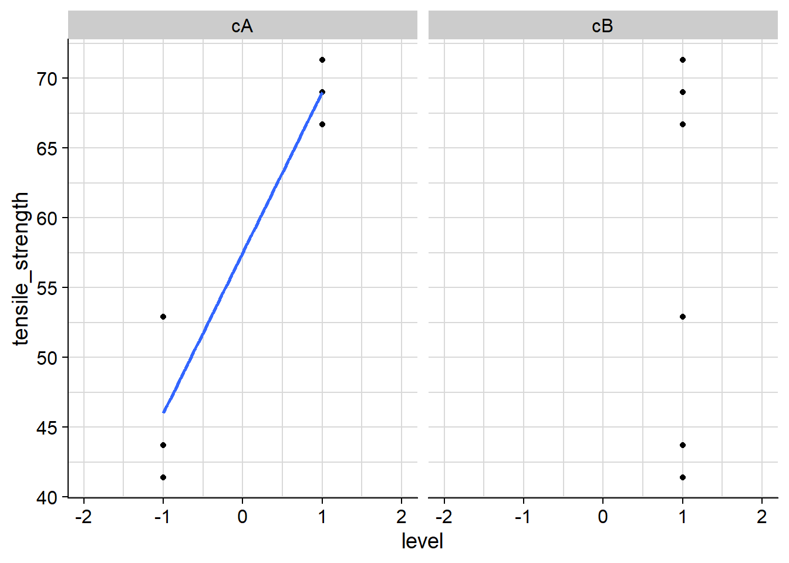

As seen on the plot the output of our prediction is 69 corresponding the high level of A when B is at 1. To be precise we need to multiply all the coefficients by the levels of the factors as : 63.250 + 9.583x(+1) - 5.750x(+1) + 1.917

### Interaction plots with SE {#plotMeans}

Here we're making a step further in the representation of interaction plots, we're adding error bars to the means. There are many ways to do this and we're providing a simple approach with the function plotMeans from the package RcmdrMisc.


```r
library(RcmdrMisc)
```

We select standard error as argument for the error.bars argument.


```r
par(mfrow = c(1,1), bty = "l")
plotMeans(response = pet_fct$tensile_strength,
          factor2 = pet_fct$A,
          factor1 = pet_fct$B,
          error.bars = "se",
          xlab = "A - Reactant",
          legend.lab = "B - Catalist\n(error bars +/-se)",
          ylab = "Tensile Strenght",
          col = viridis::viridis(12)[4],
          legend.pos = "bottomright",
          main = "The PET clothing improvement plan")
```


3 factors 2 levels

**The lithium-ion battery charging time test**

A - temperature 
B - previous cycles (within warranty)
C - voltage
response - charging time [h]


```r
battery_charging %>%
  head() %>%
  kable()
```


|  A|  B|  C|  D| Replicate| charging_time|
|--:|--:|--:|--:|---------:|-------------:|
| -1| -1| -1| -1|         1|          5.50|
|  1| -1| -1| -1|         1|          6.69|
| -1|  1| -1| -1|         1|          6.33|
|  1|  1| -1| -1|         1|          6.42|
| -1| -1|  1| -1|         1|         10.37|
|  1| -1|  1| -1|         1|          7.49|


```r
battery_lm <- lm(
  formula = charging_time ~ A * B * C, 
  data = battery_charging
  )
summary(battery_lm)
```

```

Call:
lm.default(formula = charging_time ~ A * B * C, data = battery_charging)

Residuals:
   Min     1Q Median     3Q    Max 
-2.095 -1.002 -0.529  0.929  2.982 

Coefficients:
            Estimate Std. Error t value Pr(>|t|)    
(Intercept)   7.4116     0.2654   27.92  < 2e-16 ***
A             0.3147     0.2654    1.19  0.24737    
B             0.0684     0.2654    0.26  0.79872    
C             1.0403     0.2654    3.92  0.00065 ***
A:B          -0.0872     0.2654   -0.33  0.74539    
A:C          -0.8091     0.2654   -3.05  0.00553 ** 
B:C           0.0259     0.2654    0.10  0.92296    
A:B:C         0.0328     0.2654    0.12  0.90264    
---
Signif. codes:  0 '***' 0.001 '**' 0.01 '*' 0.05 '.' 0.1 ' ' 1

Residual standard error: 1.5 on 24 degrees of freedom
Multiple R-squared:  0.522,	Adjusted R-squared:  0.383 
F-statistic: 3.75 on 7 and 24 DF,  p-value: 0.00696
```


```r
battery_aov <- aov(battery_lm)
summary(battery_aov)
```

```
            Df Sum Sq Mean Sq F value  Pr(>F)    
A            1    3.2     3.2    1.41 0.24737    
B            1    0.1     0.1    0.07 0.79872    
C            1   34.6    34.6   15.36 0.00065 ***
A:B          1    0.2     0.2    0.11 0.74539    
A:C          1   20.9    20.9    9.29 0.00553 ** 
B:C          1    0.0     0.0    0.01 0.92296    
A:B:C        1    0.0     0.0    0.02 0.90264    
Residuals   24   54.1     2.3                    
---
Signif. codes:  0 '***' 0.001 '**' 0.01 '*' 0.05 '.' 0.1 ' ' 1
```

The main effects of Gap and Power are highly significant (both have very small P-values). The AC interaction is also highly significant; thus, there is a strong interaction between Gap and Power.

### Adjusted R-squared {#adj_Rsquare}

The ordinary R^2 is 0.9661 and it measures the proportion of total variability explained by the model. A potential problem with this statistic is that it always increases as factors are added to the model, even if these factors are not significant. The adjusted R^2 is obtained by dividing the Sums of Squares by the degrees of freedom, and is adjusted for the size of the model, that is the number of factors.


```r
battery_reduced_lm <- lm(
  formula = charging_time ~ A + C + A:C, 
  data = battery_charging
  )
summary(battery_reduced_lm)
```

```

Call:
lm.default(formula = charging_time ~ A + C + A:C, data = battery_charging)

Residuals:
   Min     1Q Median     3Q    Max 
-2.146 -0.995 -0.458  0.865  2.905 

Coefficients:
            Estimate Std. Error t value Pr(>|t|)    
(Intercept)    7.412      0.247   30.04  < 2e-16 ***
A              0.315      0.247    1.28  0.21266    
C              1.040      0.247    4.22  0.00023 ***
A:C           -0.809      0.247   -3.28  0.00279 ** 
---
Signif. codes:  0 '***' 0.001 '**' 0.01 '*' 0.05 '.' 0.1 ' ' 1

Residual standard error: 1.4 on 28 degrees of freedom
Multiple R-squared:  0.519,	Adjusted R-squared:  0.467 
F-statistic: 10.1 on 3 and 28 DF,  p-value: 0.000116
```

Besides the base summary() function, R squared and adjusted R squared can also be easily retrieved with the glance function from the {broom} package. We're extracting them here for the complete and for reduced model:


```r
glance(battery_lm)[1:2] %>%
  bind_rows(glance(battery_reduced_lm)[1:2], 
            .id = "model")
```

```
# A tibble: 2 x 3
  model r.squared adj.r.squared
  <chr>     <dbl>         <dbl>
1 1         0.522         0.383
2 2         0.519         0.467
```

Adjusted R² has improved. Removing the nonsignificant terms from the full model has produced a final model that is likely to function more effectively as a predictor of new data.

### Coding inputs {#coding_inputs}

Now that we have model often we will want to predict the response at a certainly specific level between the coded factor levels of $\pm$ 1.

To do that we need to convert that specific the natural value into a coded value. Lets calculate the coded value for the factor A (gap) of which the natural value is nA = 0.9, between the natural levels of nA = 0.8 and nA = 1.2. We choose to do this for a fixed level of C of 1, corresponding to its maximum of 325W.


```r
natural2coded <- function(xA, lA, hA) {(xA - (lA + hA) / 2) / ((hA -  lA) / 2)}
```


```r
# Converting natural value xA into coded value cA:
lA <- 0.8
hA <- 1.2
xA <- 0.9

cA <- natural2coded(xA, lA, hA)
cA
```

```
[1] -0.5
```

To be noted that the opposite conversion looks like:


```r
coded2natural <- function(cA, lA, hA) {cA * ((hA - lA) / 2) + ((lA + hA)/2)} 
```


```r
# Converting back the coded value cA into its natural value xA
lA <- 0.8
hA <- 1.2
cA <- -0.5

nA <- coded2natural(cA, lA, hA)
nA
```

```
[1] 0.9
```

### Coded prediction {#coded_prediction}

And now we can feed our linear model and make predictions:


```r
battery_new <- tibble(A = cA, C = 1)
pA <- predict(battery_reduced_lm, battery_new)
pA
```

```
     1 
8.6991 
```

We can visualize this outcome as follows:


```r
battery_charging %>%
  filter(C == 1) %>%
  ggplot() +
  geom_point(aes(x = A, y = charging_time, color = as_factor(C))) +
  geom_smooth(aes(x = A, y = charging_time), method = "lm") +
  geom_point(aes(x = cA, y = pA)) +
  scale_y_continuous(n.breaks = 10) + 
  scale_color_discrete(guide = FALSE) +
  theme(plot.title = ggtext::element_markdown()) +
  labs(
    title = "3^k factorial design",
    subtitle = "Prediction with reduced model")
```

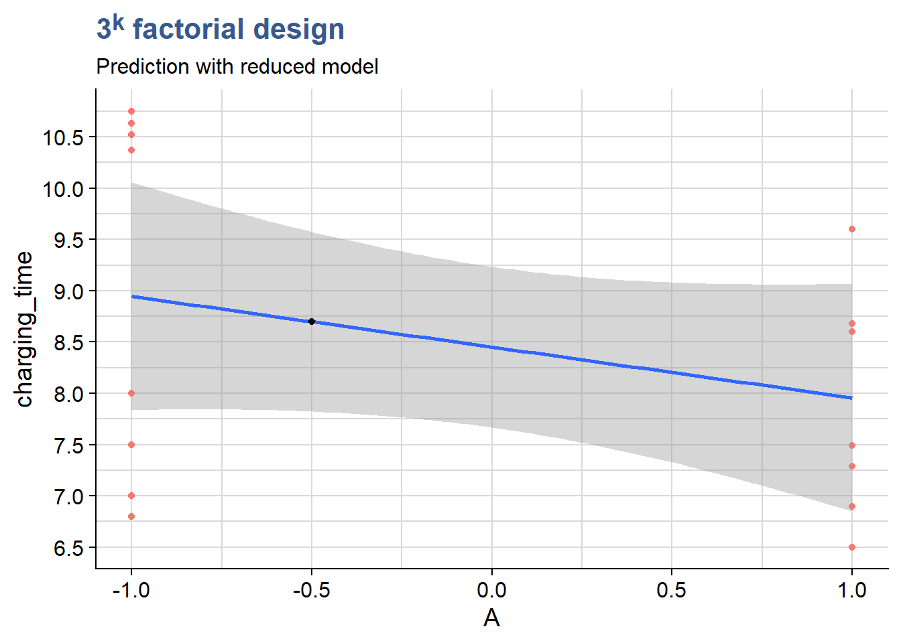

We are introducing here response surface plots which is yet another way to visualize the experiment outputs as a function of the inputs. We're doing this with the persp() function from the {rsm} package which provides an extremely fast rendering, easy parametrization and a readable output. To be noted that this function is an extension of the base R persp() consisting from the R point of view in an S3 method for the lm class. This allows to simply provide directly the lm object to the function to obtain the response surface.

### Perspective plot {#persp}


```r
library(rsm)
```


```r
persp(
  battery_reduced_lm, 
  A ~ C, 
  bounds = list(A = c(-1,1), C = c(-1,1)),
  col = viridis(12)[8],
  theta = -40, phi = 20, r = 5,
  zlab = "Charging Time",
  main = "Lithium-ion battery\ncharging time test"
)
```


Due to the interaction between factors A and C the surface is slightly bent. This is exactly what we observe in the interactions plots of which the one below corresponds to slicing the surface at the min and the max of Power:


```r
interaction.plot(x.factor = battery_charging$C, 
                 trace.factor = battery_charging$A,
                 fun = mean,
                 response = battery_charging$charging_time,
                 legend = TRUE,
                 xlab = "C",
                 trace.label = "A",
                 lwd = 2,
                 col = c(viridis(12)[10], col = viridis(12)[6]),
                 ylab = "Charging Time",
                 main = "Lithium-ion battery\ncharging time test")
```


Just like in the surface plot we can see here in the interaction plot that the response of yield on gap is different depending on the level of power. When power is high it decreases and when power is low it increases. As a reminder this is what is called an interaction between these two factors.

## Single replicate designs

**The lithium-ion battery charging time test (cont.)**

m factors 2 levels 

Possible approaches:
- graphical methods–normal and half-normal probability plots; no formal tests;
- assume some high-order interactions are zero, and fit a model that excludes them; degrees of freedom go into error, so testing is possible (not recommended)

<div class="marginnote">


</div>


```r
battery_charging %>%
  filter((Replicate == 1)) %>%
  head()
```

```
# A tibble: 6 x 6
      A     B     C     D Replicate charging_time
  <dbl> <dbl> <dbl> <dbl>     <dbl>         <dbl>
1    -1    -1    -1    -1         1          5.5 
2     1    -1    -1    -1         1          6.69
3    -1     1    -1    -1         1          6.33
4     1     1    -1    -1         1          6.42
5    -1    -1     1    -1         1         10.4 
6     1    -1     1    -1         1          7.49
```


```r
battery_lm3 <- lm(
  formula = charging_time ~ A * B * C * D, 
  data = battery_charging %>% filter(Replicate == 1))
summary(battery_lm3)
```

```

Call:
lm.default(formula = charging_time ~ A * B * C * D, data = battery_charging %>% 
    filter(Replicate == 1))

Residuals:
ALL 16 residuals are 0: no residual degrees of freedom!

Coefficients:
            Estimate Std. Error t value Pr(>|t|)
(Intercept)   7.7606         NA      NA       NA
A            -0.5081         NA      NA       NA
B             0.0369         NA      NA       NA
C             1.5306         NA      NA       NA
D             0.1556         NA      NA       NA
A:B          -0.1244         NA      NA       NA
A:C          -0.7681         NA      NA       NA
B:C          -0.0106         NA      NA       NA
A:D           0.1244         NA      NA       NA
B:D          -0.0556         NA      NA       NA
C:D           0.1606         NA      NA       NA
A:B:C         0.0281         NA      NA       NA
A:B:D         0.0856         NA      NA       NA
A:C:D         0.1844         NA      NA       NA
B:C:D         0.0369         NA      NA       NA
A:B:C:D      -0.0369         NA      NA       NA

Residual standard error: NaN on 0 degrees of freedom
Multiple R-squared:     1,	Adjusted R-squared:   NaN 
F-statistic:  NaN on 15 and 0 DF,  p-value: NA
```

We can see that being a single replicate design no statistics have been calculated for the effects in the model. A recommended approach in this case is to look into the normal probability plot of the model effects. 

Here we are going to prepare this plot with the function qqPlot() from the {car} package:

### Effects normal plot {#qqPlot}


```r
library(car)
```


```r
battery_eff3 <- battery_lm3$coefficients[2:16]
battery_eff_names2 <- names((battery_lm3$coefficients)[2:16])
main_effects_plot <- qqPlot(
  battery_eff3, envelope = 0.70, 
  id = list(
    method = "y", n = 5, cex = 1, col = carPalette()[1], location = "lr"), 
    grid = FALSE,
  col = "black",
  col.lines = "black",
  main = "Chemical vessel - Normal plot of effects 2"
  )
```


In plot we can see that the effects that have the highest influence on the output are the effects A, C and D and their interactions. We can still confirm these observations with a calculation of the percentage contribution of each effect as follows:

### Effects contribution table {#effects_contribution}


```r
battery_lm_tidy3 <- battery_lm3 %>%
  tidy() %>%
  filter(term != "(Intercept)") %>%
  mutate(
    effect_estimate = -2 * estimate,
    effect_estimate_sum = sum(effect_estimate), 
    effect_contribution_perc = abs((effect_estimate/effect_estimate_sum)*100) %>%
      round(2)
  )
battery_lm_tidy3 %>%
  select(term, effect_estimate, effect_contribution_perc) %>%
  arrange(desc(effect_contribution_perc)) %>%
  head(8) %>%
  kable()
```


|term  | effect_estimate| effect_contribution_perc|
|:-----|---------------:|------------------------:|
|C     |        -3.06125|                   182.35|
|A:C   |         1.53625|                    91.51|
|A     |         1.01625|                    60.54|
|A:C:D |        -0.36875|                    21.97|
|C:D   |        -0.32125|                    19.14|
|D     |        -0.31125|                    18.54|
|A:B   |         0.24875|                    14.82|
|A:D   |        -0.24875|                    14.82|

Reduced model

Following the previous analysis we are removing the factor B from the model and keeping only the 2nd order interactions assuming the system also respects the sparcity of effects principle.


```r
battery_red_lm3 <- lm(
  formula = charging_time ~ A + C + A:C, 
  data = battery_charging)
summary(battery_red_lm3)
```

```

Call:
lm.default(formula = charging_time ~ A + C + A:C, data = battery_charging)

Residuals:
   Min     1Q Median     3Q    Max 
-2.146 -0.995 -0.458  0.865  2.905 

Coefficients:
            Estimate Std. Error t value Pr(>|t|)    
(Intercept)    7.412      0.247   30.04  < 2e-16 ***
A              0.315      0.247    1.28  0.21266    
C              1.040      0.247    4.22  0.00023 ***
A:C           -0.809      0.247   -3.28  0.00279 ** 
---
Signif. codes:  0 '***' 0.001 '**' 0.01 '*' 0.05 '.' 0.1 ' ' 1

Residual standard error: 1.4 on 28 degrees of freedom
Multiple R-squared:  0.519,	Adjusted R-squared:  0.467 
F-statistic: 10.1 on 3 and 28 DF,  p-value: 0.000116
```

We can now see that we've regained degrees of freedom and obtained a sort of hidden replication allowing to calculate statistics and error terms on the model.

Residuals analysis

Checking the residuals we see the significant effect of the remaining interactions. The residuals are not completely normal but the in the standardized residuals the deviations are contained within 1.2 sd.


```r
par(mfrow = c(2,2))
plot(battery_red_lm3)
```


We can now establish the main effects and interaction plots and conclude on the optimal settings to maximize the output: A and D should be on the max and C on the min.


<!--chapter:end:9_twolevelDOEs.Rmd-->


# Statistical Process Control {#SPC}

Keeping the variability of an industrial process under control is one of the most important objectives in manufacturing. Based on expert knowledge or on detailed functional analysis the product and process parameters that are critical to quality are identified and selected for close follow-up. The most common and effective way for such follow-up is the Statistical Process Control which is done by using control charts.

**The syringe injection molding process**

<div class="marginnote">


</div>

## xbar-R charts

There are many types of control charts and in this case study we're demonstrating the xbar and R charts. These two charts are often used together and are suited to the control the mean and the variability of a continuous variable.

Bamako Lightening is a company that manufactures lamps. The weight of each lamp is critical to the quality of the product. The Production Operator monitors the production process using xbar and R-charts. Samples are taken of six lamps every hour and their means and ranges plotted on control charts. Data is available representing samples taken a period of 25 hours of production.

Looking at the first five lines to confirm and assess the quality of our data for further processing. 


```r
head(syringe_diameter) %>%
    kable()
```


|Hour  | Sample1| Sample2| Sample3| Sample4| Sample5| Sample6|
|:-----|-------:|-------:|-------:|-------:|-------:|-------:|
|Hour1 |  5.3314|  5.3399|  5.3244|  5.3363|  5.3228|  5.3181|
|Hour2 |  5.3240|  5.3214|  5.3142|  5.3237|  5.3420|  5.3392|
|Hour3 |  5.3263|  5.3404|  5.3136|  5.3565|  5.3387|  5.3570|
|Hour4 |  5.3553|  5.3600|  5.3171|  5.3319|  5.3446|  5.3474|
|Hour5 |  5.3379|  5.3264|  5.3150|  5.3134|  5.3375|  5.3407|
|Hour6 |  5.3432|  5.3352|  5.3238|  5.3463|  5.3340|  5.3205|

We see that in this table each line corresponds to a sampling hour and each column corresponds to a sample number. 

We're now going to pass this data to the control chart plotting function qcc(). As this function takes a dataset of observations so we're removing the Hour column with the select function from tidyverse:


```r
syringe_clean <- syringe_diameter %>% 
  select(-Hour) %>%
  mutate(across(starts_with("S"), round, 2))
```

Now we load the qcc package that has the required quality control tools:

<b>Calibration run</b>

In order to establish a control chart it is recommended to run a "calibration run". The calibration run is used to calculate the control limits before entering "regular production". Using the first 10 samples we call the qcc() function to make the required calculations.

### Mean chart {#xbar_chart}


```r
library(qcc)
```


```r
syringe_xbar <- qcc(
  syringe_clean[1:10, ], 
  type = "xbar", 
  title = "Lamp weight \n xbar chart", 
  xlab = "Sample group",
  plot = FALSE
  )
```

Before we step ahead and simply plot the SPC chart and interpret the results lets look a bit in detail in the calculations done to established the Control Chart. To do this we're going to go in the details of what we've obtained in the previous chunk. 

A first step is to read the begining of the qcc() help file typing ?qcc in the console. It says "Create an object of class 'qcc' to perform statistical process control' (in R technical terms function is a helper that generates an S3 R object). 

The key point here is that this means we can inspect the calculations separately from the plot itself. We can start by confirming the class and the type of the qcc object:


```r
class(syringe_xbar)
```

```
[1] "qcc"
```

```r
typeof(syringe_xbar)
```

```
[1] "list"
```

It is confirmed it is an object of class qcc with the R type list. Looking into the structure of the list:


```r
str(syringe_xbar)
```

```
List of 11
 $ call      : language qcc(data = syringe_clean[1:10, ], type = "xbar", plot = FALSE, title = "Lamp weight \n xbar chart",      xlab = "Sample group")
 $ type      : chr "xbar"
 $ data.name : chr "syringe_clean[1:10, ]"
 $ data      : num [1:10, 1:6] 5.33 5.32 5.33 5.36 5.34 5.34 5.3 5.32 5.34 5.36 ...
  ..- attr(*, "dimnames")=List of 2
  .. ..$ Group  : chr [1:10] "1" "2" "3" "4" ...
  .. ..$ Samples: chr [1:6] "Sample1" "Sample2" "Sample3" "Sample4" ...
 $ statistics: Named num [1:10] 5.33 5.33 5.34 5.34 5.33 ...
  ..- attr(*, "names")= chr [1:10] "1" "2" "3" "4" ...
 $ sizes     : int [1:10] 6 6 6 6 6 6 6 6 6 6
 $ center    : num 5.33
 $ std.dev   : num 0.0142
 $ nsigmas   : num 3
 $ limits    : num [1, 1:2] 5.32 5.35
  ..- attr(*, "dimnames")=List of 2
  .. ..$ : chr ""
  .. ..$ : chr [1:2] "LCL" "UCL"
 $ violations:List of 2
  ..$ beyond.limits : int(0) 
  ..$ violating.runs: num(0) 
 - attr(*, "class")= chr "qcc"
```

The output is not easy to read but we present it here just to show that inside the list there are several tables with the statistical analysis required for our plot. If we want like to see for instance the standard deviation we can extract it separately:


```r
syringe_xbar$std.dev
```

```
[1] 0.014207
```

And if we want like to see a summary of all the data stored in the object we could apply the summary method:


```r
summary(syringe_xbar)
```

```

Call:
qcc(data = syringe_clean[1:10, ], type = "xbar", plot = FALSE,     title = "Lamp weight \n xbar chart", xlab = "Sample group")

xbar chart for syringe_clean[1:10, ] 

Summary of group statistics:
   Min. 1st Qu.  Median    Mean 3rd Qu.    Max. 
 5.3250  5.3283  5.3333  5.3333  5.3375  5.3433 

Group sample size:  6
Number of groups:  10
Center of group statistics:  5.3333
Standard deviation:  0.014207 

Control limits:
    LCL    UCL
 5.3159 5.3507
```

We are now ready to finally we can see this all together in a plot:


```r
plot(syringe_xbar)
```

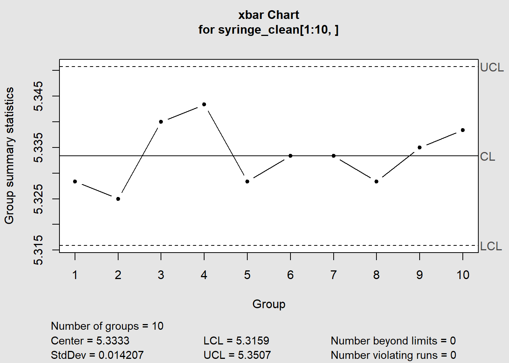

### Range chart {#Rchart}

Using the same 10 first samples we also obtain the corresponding R chart:


```r
syringe_R <- qcc(
  syringe_clean[1:10, ], 
  type = "R", 
  title = "Lamp weight \n R chart",
  xlab = "Sample group"
  )
```


<b>Regular production</b>

Now that the calibration data has been plotted we can consider that the control limits are defined. They can become fixed and reused in new plots for the future production runs. Samples from those future runs can then be assessed against this limits and the control chart rules can be verified (in this example the shewhart rules are used). We now add the remaining data points to our chart by specifying which lines we're refering too in our dataframe in the 'newdata' argument:


```r
syringe_xbar <- qcc(
  data = syringe_clean[1:10, ],
  newdata = syringe_clean[11:25,],
  type = "xbar", 
  title = "Lamp weight \n xbar chart", 
  xlab = "Sample group"
  )
```


We can see that the data point corresponding to the average of the measurements of the samplegroup 17 is plotted in red because it is outside of the control limits.

Now we plot the R chart to assess the variability:


```r
syringe_R <- qcc(
  data = syringe_clean[1:10, ],
  newdata = syringe_clean[11:25,], 
  type = "R", 
  title = "Lamp weight \n R chart",
  xlab = "Sample group"
  )
```


In this case all the points are within the previously defined control limits.

<b>Warnings and specification limits</b>

More tight controls can be put in place by clearly identifying warning limits in a narrower range than the control limits. These measures need to be accompaigned by clear decision criteria and proper training to avoid the typical problem of overeacting and destabilizing the process by introducing unintented special causes of variation.

### Control limits {#limits.xbar}

We add warning limits in the plot with as follows:


```r
warn.limits <- limits.xbar(
  syringe_xbar$center, 
  syringe_xbar$std.dev, 
  syringe_xbar$sizes, 
  2
  )
plot(
  syringe_xbar, 
  restore.par = FALSE,
  title = "Lamp weight \n xbar chart",
  xlab = "Sample group")
abline(h = warn.limits, lty = 3, col = "chocolate")
```

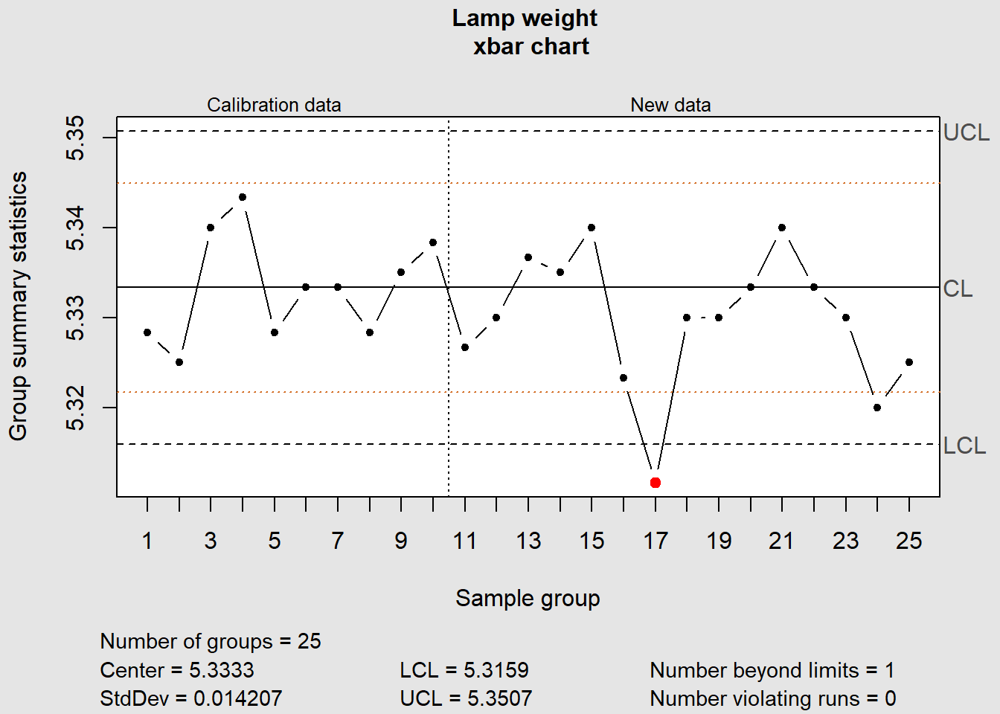

A manufacturing process under control has a variation that is lower than the product specifications and ideally it is centered. Therefore it is usually good practice to follow the control chart rules refering to the process control limits. 

In some cases nevertheless there may be desired or interesting to add the specification limits. This can be done as follows, first we establish the specifications:


```r
spec_max <- 5.6
spec_min <- 5.3
spec_tgt <- (spec_max - spec_min) / 2 + spec_min
specs <- c(spec_min, spec_tgt, spec_max)
```

and replot the control chart with visible specification limits and targets:


```r
plot(
  syringe_xbar,
  restore.par = FALSE,
  title = "Lamp weight \n xbar chart",
  xlab = "Sample group",
  ylim = c(specs[1], specs[3])
  )
abline(h = specs, lty = 3, col = "red")
```

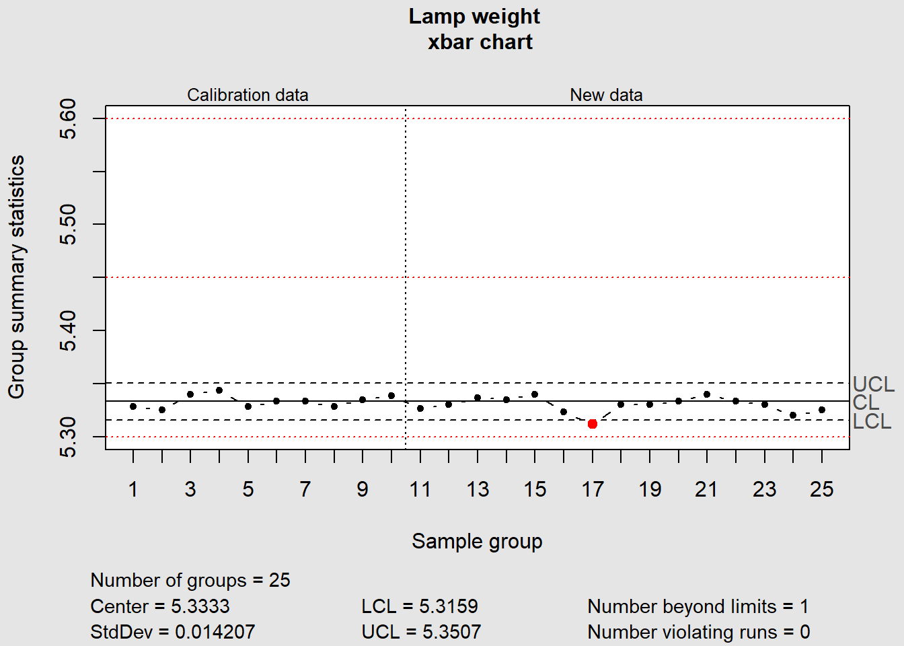

In the previous example we see a situation that happens in practice and that requires action: the data plotted is still within the min max specification limits for this relativelly small number of data points. Furthermore the variation is overall well contained within the process limits. Nevertheless we see it is extremelly off centered when compared with the product specification. A process capability study should help determining the causes for this offcentering and help correcting it.

Adapted from @Bass2007

In this chapter we're going to go more in depth in the study of the manufacturing process variability. We're going to make a comparison between the product specifications and the process variability. We're looking for opportunities to tigthen the product specifications. 
Tightening a product specification without increasing the cost of a manufacturing cost can be a source of competitive advantage.

## Cpk charts

### Off specification {#off_spec}


```r
syringe_long <- syringe_diameter %>%
  pivot_longer(cols = starts_with("Sample"),
               names_to = "sample",
               values_to = "value")
```

**variables**


```r
syringe_mean = syringe_long %>% pull(value) %>% mean()
syringe_sd = syringe_long %>% pull(value) %>% sd()
syringe_n <- length(syringe_long)
theor_n = 1000000
```

**calculation: probability of being between the limits**


```r
off_spec <- function(UCL, LCL, mean, sd) {
  round(100 - ((stats::pnorm(UCL, mean, sd) - stats::pnorm(LCL, mean, sd))*100), 2)
}
```


```r
syringe_off_spec <- off_spec(spec_max, spec_min, syringe_mean, syringe_sd)
```


```r
syringe_theor <- rnorm(n = theor_n, mean = syringe_mean, sd = syringe_sd) %>% 
  as_tibble()
```


```r
plot_subtitle <- paste(
  "Spec: [", spec_min, ";", spec_max, 
  "], Proportion off-spec = ",
  signif(syringe_off_spec, digits = 2), "%"
  )
```

Note that we deliberately twick the plot colors to make it look like the plots from minitab and from the qcc package. We provide this theme in the book companion package `industRial` with the name theme_qcc. 


```r
syringe_long %>%
  ggplot(aes(x = value, y = ..density..)) +
  geom_histogram(
    bins = 30,
    fill = "white",
    color = "grey20") +
  geom_density(data = syringe_theor, linetype = 2) +
  geom_vline(xintercept = {spec_min}, color = "red", linetype = 3) +
  geom_vline(xintercept = {spec_max}, color = "red", linetype = 3) +
  geom_vline(xintercept = {spec_tgt}, color = "red", linetype = 2) +
  scale_x_continuous(n.breaks = 10) +
  theme_qcc() +
  labs(
    title = "Out of specification (Expected)", 
    subtitle = {plot_subtitle})
```


By looking at the histogram of the Bamako lightning dataset we confirm the extreme offcentering of the production. We also see that although there are no measurements beyond the lower specification limit (LSL) it is very likely this will happen soon.

We can also calculate the Cpk

### Process Capability {#process_Cpk}


```r
process_Cpk <- function(UCL, LCL, mean, sd) {
  pmin(
    (abs(mean - abs(LCL)) / (3 * sd)),
    (abs((abs(UCL) - mean)) / (3 * sd))
   )
}
```


```r
process_Cpk(spec_max, spec_min, syringe_mean, syringe_sd)
```

```
[1] 0.71587
```

And convert the percentage out of spec in parts per million. We're not considering the 1.5 shift that sometimes is presented in the literature but rather making a simple direct conversion of the proportion out of spec found before:


```r
formatC(((syringe_off_spec) * 10000), format = "d", big.mark = "'")
```

```
[1] "15'900"
```

The expected population below the LSL is 1,3% which is very high for industry standards. In fact this corresponds to 15'900 parts per million (ppm) whereas a common target would be 1 ppm. Naturally these figures are indicative and they depend of the context criteria such as severity of the problem, cost, difficulty to eliminate the problem and so on. 

We can now establish a simple table using the functions created before, to present the expected percentage that falls within certain limits. To make it useful as a reference table we're putting this limits from $\pm$ 1 to $\pm$ 6 standard deviations

### Sigma conversion table {#sigma_table}


```r
sigma_limits <- tibble(
  sigma_plus = c(1, 2, 3, 4, 5, 6),
  sigma_minus = -sigma_plus,
  mean = 0,
  sd = 1
)

sigma_limits %>%
  mutate(
    off_spec_perc = off_spec(sigma_plus, sigma_minus, mean, sd),
    in_spec_perc = 100 - off_spec_perc,
    Cpk = process_Cpk(sigma_plus, sigma_minus, mean, sd),
    ppm_defects = formatC(
      off_spec(sigma_plus, sigma_minus, mean, sd) * 10000,
      format = "d",
      big.mark = "'")) %>%
  select(sigma_minus, sigma_plus, off_spec_perc, in_spec_perc, Cpk, ppm_defects) %>%
  kable(align = "c", digits = 3)
```


| sigma_minus | sigma_plus | off_spec_perc | in_spec_perc |  Cpk  | ppm_defects |
|:-----------:|:----------:|:-------------:|:------------:|:-----:|:-----------:|
|     -1      |     1      |     31.73     |    68.27     | 0.333 |   317'300   |
|     -2      |     2      |     4.55      |    95.45     | 0.667 |   45'500    |
|     -3      |     3      |     0.27      |    99.73     | 1.000 |    2'700    |
|     -4      |     4      |     0.01      |    99.99     | 1.333 |     100     |
|     -5      |     5      |     0.00      |    100.00    | 1.667 |      0      |
|     -6      |     6      |     0.00      |    100.00    | 2.000 |      0      |

### Capability chart {#process.capability}


```r
syringe_cpk <- process.capability(
  syringe_xbar,
  breaks = 10,
  spec.limits = c(spec_min, spec_max),
  target = spec_tgt,
  digits = 2,
  print = FALSE,
  std.dev = syringe_sd
)
```


A fine tuning of the forecast of the number of expected parts out of specification can be done with the parameter std.dev. The input value will be used in the probability distribution function. Different approaches can be considered: calculating the sandard deviation within each subgroup or the standard deviation of the entire population and also correcting the standard deviation dividing by n or by n - 1. In this example we re-use the standard deviation calculated on the entire set of datapoints as the group is small but for a case with more data it would be interesting to used the subgroups that tend to give smaller standard deviations.

## I-MR charts

In this final chapter we're exploring the development of custom functions for summary statistics and timeseries plotting. All these functions are available on the book companion package `{industRial}` for exploration and further development. They don't pretend to be used as such for real life applications. For that we recommend the functions from the package `{QCC}` presented before. The objective here is to show a workflow and demonstrate some possibilities that the `{tidyverse}` offers to make completely customized functions.

To encourage this exploration we're not presenting here the complete code for each function but propose to check it with the R functionality for function code exploration. We see often the recommendation to read R source code and we can only support it as an excellent way to develop our skilset.

Lets start with the simple function that calculates the percentage of parts out of specification given the specification limits, the process mean and standard deviation. This function was presented in the previous case study and since it is loaded in memory we can read its content with the R function body():


```r
body(off_spec)
```

```
{
    round(100 - ((stats::pnorm(UCL, mean, sd) - stats::pnorm(LCL, 
        mean, sd)) * 100), 2)
}
```

we can see that it uses simple functions from the package {`stats}`. We can also explicitly request to see the arguments it takes with formals():


```r
dput(formals(off_spec))
```

```
as.pairlist(alist(UCL = , LCL = , mean = , sd = ))
```

and for a complete review we can open the function help page with:

```{}
?off_spec
```

Lets give some data and use the function:


```r
off_spec(0.981, 0.819, 0.943, 0.019)
```

```
[1] 2.28
```

we get 2.28% parts out of spec. We'll see this calculation in action in a moment.

### Process statistics {#process_stats}

**The tablet weight control procedure**


```r
tablet_weight <- tablet_weight %>%
    janitor::clean_names(case = "snake")
```

We're now going to use the function process stats to calculate several statistical data for this dataset. As mentionned we encourage the reader to explore the code with body(process_stats) and dput(formals(process_stats)) as there is a wealth of details in how to calculate process control limits, moving ranges and the like.


```r
weight_statistics_data <- process_stats(tablet_weight, 10)
```

this being done we can now convert this data into an easy readable format for reporting of for a future integration in a shiny app for example. We're exploring the package `{gt}` that has a specific very neat look rather different from the `{kable}` package used in most of the book. 


```r
process_stats_table(weight_statistics_data)
```

```{=html}
<div id="lcryfvhjnb" style="overflow-x:auto;overflow-y:auto;width:auto;height:auto;">
<style>html {
  font-family: -apple-system, BlinkMacSystemFont, 'Segoe UI', Roboto, Oxygen, Ubuntu, Cantarell, 'Helvetica Neue', 'Fira Sans', 'Droid Sans', Arial, sans-serif;
}

#lcryfvhjnb .gt_table {
  display: table;
  border-collapse: collapse;
  margin-left: auto;
  margin-right: auto;
  color: #333333;
  font-size: 16px;
  font-weight: normal;
  font-style: normal;
  background-color: #FFFFFF;
  width: auto;
  border-top-style: solid;
  border-top-width: 2px;
  border-top-color: #A8A8A8;
  border-right-style: none;
  border-right-width: 2px;
  border-right-color: #D3D3D3;
  border-bottom-style: solid;
  border-bottom-width: 2px;
  border-bottom-color: #A8A8A8;
  border-left-style: none;
  border-left-width: 2px;
  border-left-color: #D3D3D3;
}

#lcryfvhjnb .gt_heading {
  background-color: #FFFFFF;
  text-align: center;
  border-bottom-color: #FFFFFF;
  border-left-style: none;
  border-left-width: 1px;
  border-left-color: #D3D3D3;
  border-right-style: none;
  border-right-width: 1px;
  border-right-color: #D3D3D3;
}

#lcryfvhjnb .gt_title {
  color: #333333;
  font-size: 125%;
  font-weight: initial;
  padding-top: 4px;
  padding-bottom: 4px;
  border-bottom-color: #FFFFFF;
  border-bottom-width: 0;
}

#lcryfvhjnb .gt_subtitle {
  color: #333333;
  font-size: 85%;
  font-weight: initial;
  padding-top: 0;
  padding-bottom: 4px;
  border-top-color: #FFFFFF;
  border-top-width: 0;
}

#lcryfvhjnb .gt_bottom_border {
  border-bottom-style: solid;
  border-bottom-width: 2px;
  border-bottom-color: #D3D3D3;
}

#lcryfvhjnb .gt_col_headings {
  border-top-style: solid;
  border-top-width: 2px;
  border-top-color: #D3D3D3;
  border-bottom-style: solid;
  border-bottom-width: 2px;
  border-bottom-color: #D3D3D3;
  border-left-style: none;
  border-left-width: 1px;
  border-left-color: #D3D3D3;
  border-right-style: none;
  border-right-width: 1px;
  border-right-color: #D3D3D3;
}

#lcryfvhjnb .gt_col_heading {
  color: #333333;
  background-color: #FFFFFF;
  font-size: 100%;
  font-weight: normal;
  text-transform: inherit;
  border-left-style: none;
  border-left-width: 1px;
  border-left-color: #D3D3D3;
  border-right-style: none;
  border-right-width: 1px;
  border-right-color: #D3D3D3;
  vertical-align: bottom;
  padding-top: 5px;
  padding-bottom: 6px;
  padding-left: 5px;
  padding-right: 5px;
  overflow-x: hidden;
}

#lcryfvhjnb .gt_column_spanner_outer {
  color: #333333;
  background-color: #FFFFFF;
  font-size: 100%;
  font-weight: normal;
  text-transform: inherit;
  padding-top: 0;
  padding-bottom: 0;
  padding-left: 4px;
  padding-right: 4px;
}

#lcryfvhjnb .gt_column_spanner_outer:first-child {
  padding-left: 0;
}

#lcryfvhjnb .gt_column_spanner_outer:last-child {
  padding-right: 0;
}

#lcryfvhjnb .gt_column_spanner {
  border-bottom-style: solid;
  border-bottom-width: 2px;
  border-bottom-color: #D3D3D3;
  vertical-align: bottom;
  padding-top: 5px;
  padding-bottom: 6px;
  overflow-x: hidden;
  display: inline-block;
  width: 100%;
}

#lcryfvhjnb .gt_group_heading {
  padding: 8px;
  color: #333333;
  background-color: #FFFFFF;
  font-size: 100%;
  font-weight: initial;
  text-transform: inherit;
  border-top-style: solid;
  border-top-width: 2px;
  border-top-color: #D3D3D3;
  border-bottom-style: solid;
  border-bottom-width: 2px;
  border-bottom-color: #D3D3D3;
  border-left-style: none;
  border-left-width: 1px;
  border-left-color: #D3D3D3;
  border-right-style: none;
  border-right-width: 1px;
  border-right-color: #D3D3D3;
  vertical-align: middle;
}

#lcryfvhjnb .gt_empty_group_heading {
  padding: 0.5px;
  color: #333333;
  background-color: #FFFFFF;
  font-size: 100%;
  font-weight: initial;
  border-top-style: solid;
  border-top-width: 2px;
  border-top-color: #D3D3D3;
  border-bottom-style: solid;
  border-bottom-width: 2px;
  border-bottom-color: #D3D3D3;
  vertical-align: middle;
}

#lcryfvhjnb .gt_from_md > :first-child {
  margin-top: 0;
}

#lcryfvhjnb .gt_from_md > :last-child {
  margin-bottom: 0;
}

#lcryfvhjnb .gt_row {
  padding-top: 8px;
  padding-bottom: 8px;
  padding-left: 5px;
  padding-right: 5px;
  margin: 10px;
  border-top-style: solid;
  border-top-width: 1px;
  border-top-color: #D3D3D3;
  border-left-style: none;
  border-left-width: 1px;
  border-left-color: #D3D3D3;
  border-right-style: none;
  border-right-width: 1px;
  border-right-color: #D3D3D3;
  vertical-align: middle;
  overflow-x: hidden;
}

#lcryfvhjnb .gt_stub {
  color: #333333;
  background-color: #FFFFFF;
  font-size: 100%;
  font-weight: initial;
  text-transform: inherit;
  border-right-style: solid;
  border-right-width: 2px;
  border-right-color: #D3D3D3;
  padding-left: 12px;
}

#lcryfvhjnb .gt_summary_row {
  color: #333333;
  background-color: #FFFFFF;
  text-transform: inherit;
  padding-top: 8px;
  padding-bottom: 8px;
  padding-left: 5px;
  padding-right: 5px;
}

#lcryfvhjnb .gt_first_summary_row {
  padding-top: 8px;
  padding-bottom: 8px;
  padding-left: 5px;
  padding-right: 5px;
  border-top-style: solid;
  border-top-width: 2px;
  border-top-color: #D3D3D3;
}

#lcryfvhjnb .gt_grand_summary_row {
  color: #333333;
  background-color: #FFFFFF;
  text-transform: inherit;
  padding-top: 8px;
  padding-bottom: 8px;
  padding-left: 5px;
  padding-right: 5px;
}

#lcryfvhjnb .gt_first_grand_summary_row {
  padding-top: 8px;
  padding-bottom: 8px;
  padding-left: 5px;
  padding-right: 5px;
  border-top-style: double;
  border-top-width: 6px;
  border-top-color: #D3D3D3;
}

#lcryfvhjnb .gt_striped {
  background-color: rgba(128, 128, 128, 0.05);
}

#lcryfvhjnb .gt_table_body {
  border-top-style: solid;
  border-top-width: 2px;
  border-top-color: #D3D3D3;
  border-bottom-style: solid;
  border-bottom-width: 2px;
  border-bottom-color: #D3D3D3;
}

#lcryfvhjnb .gt_footnotes {
  color: #333333;
  background-color: #FFFFFF;
  border-bottom-style: none;
  border-bottom-width: 2px;
  border-bottom-color: #D3D3D3;
  border-left-style: none;
  border-left-width: 2px;
  border-left-color: #D3D3D3;
  border-right-style: none;
  border-right-width: 2px;
  border-right-color: #D3D3D3;
}

#lcryfvhjnb .gt_footnote {
  margin: 0px;
  font-size: 90%;
  padding: 4px;
}

#lcryfvhjnb .gt_sourcenotes {
  color: #333333;
  background-color: #FFFFFF;
  border-bottom-style: none;
  border-bottom-width: 2px;
  border-bottom-color: #D3D3D3;
  border-left-style: none;
  border-left-width: 2px;
  border-left-color: #D3D3D3;
  border-right-style: none;
  border-right-width: 2px;
  border-right-color: #D3D3D3;
}

#lcryfvhjnb .gt_sourcenote {
  font-size: 90%;
  padding: 4px;
}

#lcryfvhjnb .gt_left {
  text-align: left;
}

#lcryfvhjnb .gt_center {
  text-align: center;
}

#lcryfvhjnb .gt_right {
  text-align: right;
  font-variant-numeric: tabular-nums;
}

#lcryfvhjnb .gt_font_normal {
  font-weight: normal;
}

#lcryfvhjnb .gt_font_bold {
  font-weight: bold;
}

#lcryfvhjnb .gt_font_italic {
  font-style: italic;
}

#lcryfvhjnb .gt_super {
  font-size: 65%;
}

#lcryfvhjnb .gt_footnote_marks {
  font-style: italic;
  font-weight: normal;
  font-size: 65%;
}
</style>
<table class="gt_table">
  <thead class="gt_header">
    <tr>
      <th colspan="3" class="gt_heading gt_title gt_font_normal gt_bottom_border" style>Process Summary Statistics</th>
    </tr>
    
  </thead>
  <thead class="gt_col_headings">
    <tr>
      <th class="gt_col_heading gt_columns_bottom_border gt_left" rowspan="1" colspan="1">Variable</th>
      <th class="gt_col_heading gt_columns_bottom_border gt_right" rowspan="1" colspan="1">Value</th>
      <th class="gt_col_heading gt_columns_bottom_border gt_left" rowspan="1" colspan="1">Unit</th>
    </tr>
  </thead>
  <tbody class="gt_table_body">
    <tr><td class="gt_row gt_left">Weight mean</td>
<td class="gt_row gt_right">0.94000</td>
<td class="gt_row gt_left">g</td></tr>
    <tr><td class="gt_row gt_left">Spec target</td>
<td class="gt_row gt_right">0.90000</td>
<td class="gt_row gt_left">g</td></tr>
    <tr><td class="gt_row gt_left">Spec min</td>
<td class="gt_row gt_right">0.81000</td>
<td class="gt_row gt_left">g</td></tr>
    <tr><td class="gt_row gt_left">Spec max</td>
<td class="gt_row gt_right">0.99000</td>
<td class="gt_row gt_left">g</td></tr>
    <tr><td class="gt_row gt_left" style="font-weight: bold;">Out of spec</td>
<td class="gt_row gt_right" style="font-weight: bold;">0.71000</td>
<td class="gt_row gt_left" style="font-weight: bold;">%</td></tr>
    <tr><td class="gt_row gt_left" style="font-weight: bold;">Cpk</td>
<td class="gt_row gt_right" style="font-weight: bold;">0.81785</td>
<td class="gt_row gt_left" style="font-weight: bold;"></td></tr>
    <tr><td class="gt_row gt_left">Sample size</td>
<td class="gt_row gt_right">137</td>
<td class="gt_row gt_left">parts</td></tr>
  </tbody>
  
  
</table>
</div>
```

### Individual chart {#chart_I}

The data set being available we're feeding it into the chart_I() function:


```r
chart_I(weight_statistics_data)
```


### Moving range chart {#chart_IMR}

The companion of the I chart is the MR chart, where MR stands for moving range. This chart can be called with:


```r
chart_IMR(weight_statistics_data)
```

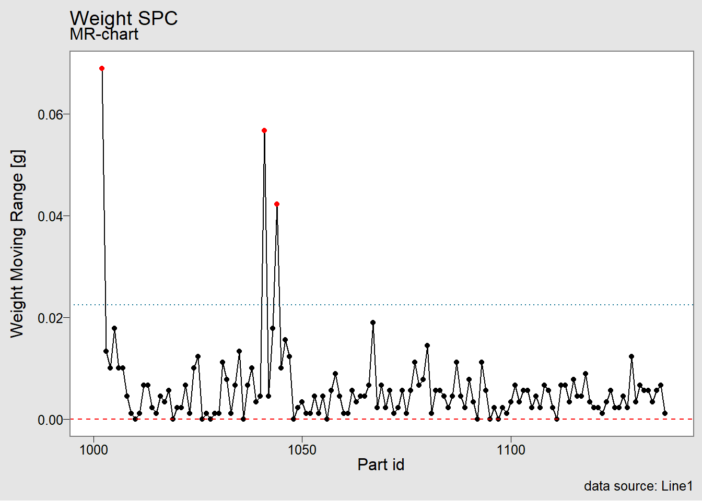

### Capability chart (custom) {#chart_Cpk}

And a final chart for this session the capability chart:


```r
chart_Cpk(weight_statistics_data)
```

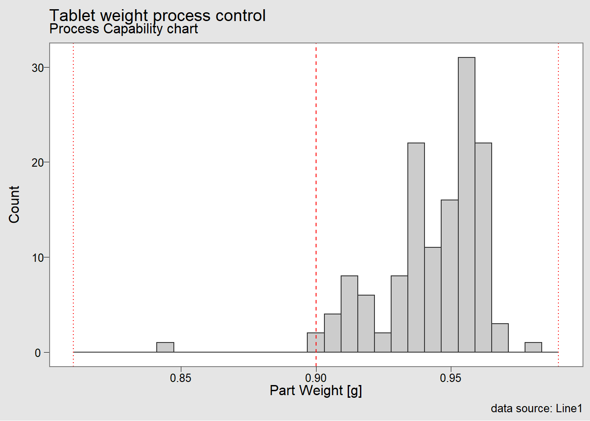


<!--chapter:end:10_spc.Rmd-->


# (PART) APPENDIX {-}

# Index {#contents}


<table>
 <thead>
  <tr>
   <th style="text-align:left;"> Subject </th>
   <th style="text-align:left;"> Unit </th>
   <th style="text-align:left;"> Functions </th>
   <th style="text-align:left;"> Datasets </th>
  </tr>
 </thead>
<tbody>
  <tr>
   <td style="text-align:left;background-color: white !important;font-weight: bold;color: #104e8b !important;background-color: #e6e6e6 !important;"> DFSS </td>
   <td style="text-align:left;background-color: white !important;font-weight: bold;color: #104e8b !important;background-color: #e6e6e6 !important;">  </td>
   <td style="text-align:left;background-color: white !important;font-weight: bold;color: #104e8b !important;background-color: #e6e6e6 !important;">  </td>
   <td style="text-align:left;background-color: white !important;font-weight: bold;color: #104e8b !important;background-color: #e6e6e6 !important;">  </td>
  </tr>
  <tr>
   <td style="text-align:left;background-color: white !important;"> Pareto analysis </td>
   <td style="text-align:left;background-color: white !important;"> [Pareto chart](#paretochart) </td>
   <td style="text-align:left;background-color: white !important;"> `qicharts2::paretochart` </td>
   <td style="text-align:left;background-color: white !important;"> dial_control </td>
  </tr>
  <tr>
   <td style="text-align:left;background-color: white !important;"> Root cause analysis </td>
   <td style="text-align:left;background-color: white !important;"> [ishikawa diagram](#ishkawa) </td>
   <td style="text-align:left;background-color: white !important;"> `qcc::cause.and.effect` </td>
   <td style="text-align:left;background-color: white !important;">  </td>
  </tr>
  <tr>
   <td style="text-align:left;background-color: white !important;"> Correlations </td>
   <td style="text-align:left;background-color: white !important;"> [Matrix](#matrix) </td>
   <td style="text-align:left;background-color: white !important;">  </td>
   <td style="text-align:left;background-color: white !important;"> perfume_experiment </td>
  </tr>
  <tr>
   <td style="text-align:left;background-color: white !important;">  </td>
   <td style="text-align:left;background-color: white !important;"> [Tileplot](#tileplot) </td>
   <td style="text-align:left;background-color: white !important;"> `ggplot2::geom_tile` </td>
   <td style="text-align:left;background-color: white !important;">  </td>
  </tr>
  <tr>
   <td style="text-align:left;background-color: white !important;"> Clustering </td>
   <td style="text-align:left;background-color: white !important;"> [Network plot](#network_plot) </td>
   <td style="text-align:left;background-color: white !important;"> `ggraph::ggraph` </td>
   <td style="text-align:left;background-color: white !important;"> perfume_experiment </td>
  </tr>
  <tr>
   <td style="text-align:left;background-color: white !important;font-weight: bold;color: #104e8b !important;background-color: #e6e6e6 !important;"> MSA </td>
   <td style="text-align:left;background-color: white !important;font-weight: bold;color: #104e8b !important;background-color: #e6e6e6 !important;">  </td>
   <td style="text-align:left;background-color: white !important;font-weight: bold;color: #104e8b !important;background-color: #e6e6e6 !important;">  </td>
   <td style="text-align:left;background-color: white !important;font-weight: bold;color: #104e8b !important;background-color: #e6e6e6 !important;">  </td>
  </tr>
  <tr>
   <td style="text-align:left;background-color: white !important;"> Calibration </td>
   <td style="text-align:left;background-color: white !important;"> [Bias plot](#bias_plot) </td>
   <td style="text-align:left;background-color: white !important;"> `ggplot2::geom_smooth` </td>
   <td style="text-align:left;background-color: white !important;"> juice_drymatter </td>
  </tr>
  <tr>
   <td style="text-align:left;background-color: white !important;">  </td>
   <td style="text-align:left;background-color: white !important;"> [Bias report](#bias_report) </td>
   <td style="text-align:left;background-color: white !important;">  </td>
   <td style="text-align:left;background-color: white !important;">  </td>
  </tr>
  <tr>
   <td style="text-align:left;background-color: white !important;"> Precision </td>
   <td style="text-align:left;background-color: white !important;"> [Gage r&amp;R](#gageRnR) </td>
   <td style="text-align:left;background-color: white !important;"> `SixSigma::ss.rr` </td>
   <td style="text-align:left;background-color: white !important;"> tablet_thickness </td>
  </tr>
  <tr>
   <td style="text-align:left;background-color: white !important;">  </td>
   <td style="text-align:left;background-color: white !important;"> [Gage acceptance](#gage_acceptance) </td>
   <td style="text-align:left;background-color: white !important;">  </td>
   <td style="text-align:left;background-color: white !important;">  </td>
  </tr>
  <tr>
   <td style="text-align:left;background-color: white !important;"> Uncertainty </td>
   <td style="text-align:left;background-color: white !important;"> [Uncertainty](#uncertainty) </td>
   <td style="text-align:left;background-color: white !important;">  </td>
   <td style="text-align:left;background-color: white !important;"> tablet_thickness </td>
  </tr>
  <tr>
   <td style="text-align:left;background-color: white !important;font-weight: bold;color: #104e8b !important;background-color: #e6e6e6 !important;"> DOE </td>
   <td style="text-align:left;background-color: white !important;font-weight: bold;color: #104e8b !important;background-color: #e6e6e6 !important;">  </td>
   <td style="text-align:left;background-color: white !important;font-weight: bold;color: #104e8b !important;background-color: #e6e6e6 !important;">  </td>
   <td style="text-align:left;background-color: white !important;font-weight: bold;color: #104e8b !important;background-color: #e6e6e6 !important;">  </td>
  </tr>
  <tr>
   <td style="text-align:left;background-color: white !important;"> Direct comparisons </td>
   <td style="text-align:left;background-color: white !important;"> [Histogram](#histogram) </td>
   <td style="text-align:left;background-color: white !important;"> `ggplot2::geom_histogram` </td>
   <td style="text-align:left;background-color: white !important;"> pet_delivery </td>
  </tr>
  <tr>
   <td style="text-align:left;background-color: white !important;">  </td>
   <td style="text-align:left;background-color: white !important;"> [t-test one sample](#t.test) </td>
   <td style="text-align:left;background-color: white !important;"> `stats::t.test` </td>
   <td style="text-align:left;background-color: white !important;">  </td>
  </tr>
  <tr>
   <td style="text-align:left;background-color: white !important;">  </td>
   <td style="text-align:left;background-color: white !important;"> [Normality plot](#geom_qq) </td>
   <td style="text-align:left;background-color: white !important;"> `ggplot2::geom_qq` </td>
   <td style="text-align:left;background-color: white !important;">  </td>
  </tr>
  <tr>
   <td style="text-align:left;background-color: white !important;">  </td>
   <td style="text-align:left;background-color: white !important;"> [F test](#var.test) </td>
   <td style="text-align:left;background-color: white !important;"> `stats::var.test` </td>
   <td style="text-align:left;background-color: white !important;">  </td>
  </tr>
  <tr>
   <td style="text-align:left;background-color: white !important;">  </td>
   <td style="text-align:left;background-color: white !important;"> [Levene test](#levene.test) </td>
   <td style="text-align:left;background-color: white !important;"> `car::leveneTest` </td>
   <td style="text-align:left;background-color: white !important;">  </td>
  </tr>
  <tr>
   <td style="text-align:left;background-color: white !important;"> Statistical modeling </td>
   <td style="text-align:left;background-color: white !important;"> [Linear models](#lm) </td>
   <td style="text-align:left;background-color: white !important;"> `stats::lm` </td>
   <td style="text-align:left;background-color: white !important;"> ebike_hardening </td>
  </tr>
  <tr>
   <td style="text-align:left;background-color: white !important;">  </td>
   <td style="text-align:left;background-color: white !important;"> [Contrasts treatment](#contr.treatment) </td>
   <td style="text-align:left;background-color: white !important;"> `stats::contrasts` </td>
   <td style="text-align:left;background-color: white !important;">  </td>
  </tr>
  <tr>
   <td style="text-align:left;background-color: white !important;">  </td>
   <td style="text-align:left;background-color: white !important;"> [Predict](#predict) </td>
   <td style="text-align:left;background-color: white !important;"> `stats::predict` </td>
   <td style="text-align:left;background-color: white !important;">  </td>
  </tr>
  <tr>
   <td style="text-align:left;background-color: white !important;">  </td>
   <td style="text-align:left;background-color: white !important;"> [Model augment](#augment) </td>
   <td style="text-align:left;background-color: white !important;"> `broom::augment` </td>
   <td style="text-align:left;background-color: white !important;">  </td>
  </tr>
  <tr>
   <td style="text-align:left;background-color: white !important;">  </td>
   <td style="text-align:left;background-color: white !important;"> [Timeseries plot](#residuals_timeseries) </td>
   <td style="text-align:left;background-color: white !important;">  </td>
   <td style="text-align:left;background-color: white !important;">  </td>
  </tr>
  <tr>
   <td style="text-align:left;background-color: white !important;">  </td>
   <td style="text-align:left;background-color: white !important;"> [Autocorrelation test](#autocorrelation) </td>
   <td style="text-align:left;background-color: white !important;"> `car::durbinWatsonTest` </td>
   <td style="text-align:left;background-color: white !important;">  </td>
  </tr>
  <tr>
   <td style="text-align:left;background-color: white !important;">  </td>
   <td style="text-align:left;background-color: white !important;"> [Normality test](#shapiroTest) </td>
   <td style="text-align:left;background-color: white !important;"> `stats::shapiro.test` </td>
   <td style="text-align:left;background-color: white !important;">  </td>
  </tr>
  <tr>
   <td style="text-align:left;background-color: white !important;">  </td>
   <td style="text-align:left;background-color: white !important;"> [Residuals-Fit plot](#residuals_fit) </td>
   <td style="text-align:left;background-color: white !important;">  </td>
   <td style="text-align:left;background-color: white !important;">  </td>
  </tr>
  <tr>
   <td style="text-align:left;background-color: white !important;">  </td>
   <td style="text-align:left;background-color: white !important;"> [Homocedasticity](#homocedasticity) </td>
   <td style="text-align:left;background-color: white !important;"> `stats::bartlett.test` </td>
   <td style="text-align:left;background-color: white !important;">  </td>
  </tr>
  <tr>
   <td style="text-align:left;background-color: white !important;">  </td>
   <td style="text-align:left;background-color: white !important;"> [Standard Residuals-Fit plot](#std_residuals_fit) </td>
   <td style="text-align:left;background-color: white !important;">  </td>
   <td style="text-align:left;background-color: white !important;">  </td>
  </tr>
  <tr>
   <td style="text-align:left;background-color: white !important;">  </td>
   <td style="text-align:left;background-color: white !important;"> [Outliers test](#outliers) </td>
   <td style="text-align:left;background-color: white !important;"> `car::outlierTest` </td>
   <td style="text-align:left;background-color: white !important;">  </td>
  </tr>
  <tr>
   <td style="text-align:left;background-color: white !important;">  </td>
   <td style="text-align:left;background-color: white !important;"> [Cooks distance](#cooks) </td>
   <td style="text-align:left;background-color: white !important;">  </td>
   <td style="text-align:left;background-color: white !important;">  </td>
  </tr>
  <tr>
   <td style="text-align:left;background-color: white !important;">  </td>
   <td style="text-align:left;background-color: white !important;"> [Coeficient of determination](#R-squared) </td>
   <td style="text-align:left;background-color: white !important;"> `base::summary()$r.squared` </td>
   <td style="text-align:left;background-color: white !important;">  </td>
  </tr>
  <tr>
   <td style="text-align:left;background-color: white !important;"> Effects significance </td>
   <td style="text-align:left;background-color: white !important;"> [Anova](#aov) </td>
   <td style="text-align:left;background-color: white !important;"> `stats::aov` </td>
   <td style="text-align:left;background-color: white !important;">  </td>
  </tr>
  <tr>
   <td style="text-align:left;background-color: white !important;">  </td>
   <td style="text-align:left;background-color: white !important;"> [Pairwise comparison](#tukey) </td>
   <td style="text-align:left;background-color: white !important;"> `stats::TukeyHSD` </td>
   <td style="text-align:left;background-color: white !important;">  </td>
  </tr>
  <tr>
   <td style="text-align:left;background-color: white !important;">  </td>
   <td style="text-align:left;background-color: white !important;"> [Least significant difference](#fisherLSD) </td>
   <td style="text-align:left;background-color: white !important;"> `agricolae::LSD.test` </td>
   <td style="text-align:left;background-color: white !important;">  </td>
  </tr>
  <tr>
   <td style="text-align:left;background-color: white !important;"> Interactions </td>
   <td style="text-align:left;background-color: white !important;"> [Model formulae](#formula) </td>
   <td style="text-align:left;background-color: white !important;"> `stats::formula` </td>
   <td style="text-align:left;background-color: white !important;"> solarcell_output </td>
  </tr>
  <tr>
   <td style="text-align:left;background-color: white !important;">  </td>
   <td style="text-align:left;background-color: white !important;"> [Interaction plot](#interaction.plot) </td>
   <td style="text-align:left;background-color: white !important;"> `stats:interaction.plot` </td>
   <td style="text-align:left;background-color: white !important;">  </td>
  </tr>
  <tr>
   <td style="text-align:left;background-color: white !important;">  </td>
   <td style="text-align:left;background-color: white !important;"> [Residual standard error](#RSE) </td>
   <td style="text-align:left;background-color: white !important;">  </td>
   <td style="text-align:left;background-color: white !important;">  </td>
  </tr>
  <tr>
   <td style="text-align:left;background-color: white !important;">  </td>
   <td style="text-align:left;background-color: white !important;"> [Residuals summary](#plot.lm) </td>
   <td style="text-align:left;background-color: white !important;"> `stats::plot.lm` </td>
   <td style="text-align:left;background-color: white !important;">  </td>
  </tr>
  <tr>
   <td style="text-align:left;background-color: white !important;">  </td>
   <td style="text-align:left;background-color: white !important;"> [Anova with interactions](#anova) </td>
   <td style="text-align:left;background-color: white !important;"> `stats::anova` </td>
   <td style="text-align:left;background-color: white !important;">  </td>
  </tr>
  <tr>
   <td style="text-align:left;background-color: white !important;"> Covariance </td>
   <td style="text-align:left;background-color: white !important;"> [Correlation test](#cor.test) </td>
   <td style="text-align:left;background-color: white !important;"> `stats::cor.test` </td>
   <td style="text-align:left;background-color: white !important;"> solarcell_fill </td>
  </tr>
  <tr>
   <td style="text-align:left;background-color: white !important;">  </td>
   <td style="text-align:left;background-color: white !important;"> [Analysis of covariance](#ancova_aov) </td>
   <td style="text-align:left;background-color: white !important;"> `stats::aov` </td>
   <td style="text-align:left;background-color: white !important;">  </td>
  </tr>
  <tr>
   <td style="text-align:left;background-color: white !important;"> General designs </td>
   <td style="text-align:left;background-color: white !important;"> [Factorial design](#fac.design) </td>
   <td style="text-align:left;background-color: white !important;"> `DoE.base::fac.design` </td>
   <td style="text-align:left;background-color: white !important;"> juice_drymatter </td>
  </tr>
  <tr>
   <td style="text-align:left;background-color: white !important;">  </td>
   <td style="text-align:left;background-color: white !important;"> [Main effects plots](#main_effects) </td>
   <td style="text-align:left;background-color: white !important;">  </td>
   <td style="text-align:left;background-color: white !important;">  </td>
  </tr>
  <tr>
   <td style="text-align:left;background-color: white !important;">  </td>
   <td style="text-align:left;background-color: white !important;"> [Interactions plots (custom)](#interaction_plot) </td>
   <td style="text-align:left;background-color: white !important;"> `ggplot2::geom_errorbar` </td>
   <td style="text-align:left;background-color: white !important;">  </td>
  </tr>
  <tr>
   <td style="text-align:left;background-color: white !important;">  </td>
   <td style="text-align:left;background-color: white !important;"> [Formula expansion](#formula_expansion) </td>
   <td style="text-align:left;background-color: white !important;"> `industRial::formula_expansion` </td>
   <td style="text-align:left;background-color: white !important;">  </td>
  </tr>
  <tr>
   <td style="text-align:left;background-color: white !important;">  </td>
   <td style="text-align:left;background-color: white !important;"> [Anova 3rd level interactions](#anova_three) </td>
   <td style="text-align:left;background-color: white !important;">  </td>
   <td style="text-align:left;background-color: white !important;">  </td>
  </tr>
  <tr>
   <td style="text-align:left;background-color: white !important;"> Two level designs </td>
   <td style="text-align:left;background-color: white !important;"> [Coding levels](#coding_levels) </td>
   <td style="text-align:left;background-color: white !important;"> `stats::relevel` </td>
   <td style="text-align:left;background-color: white !important;"> pet_doe </td>
  </tr>
  <tr>
   <td style="text-align:left;background-color: white !important;">  </td>
   <td style="text-align:left;background-color: white !important;"> [Interaction plots with SE](#plotMeans) </td>
   <td style="text-align:left;background-color: white !important;"> `RcmdrMisc::plotMeans` </td>
   <td style="text-align:left;background-color: white !important;">  </td>
  </tr>
  <tr>
   <td style="text-align:left;background-color: white !important;">  </td>
   <td style="text-align:left;background-color: white !important;"> [Adjusted R-square](#adj_Rsquare) </td>
   <td style="text-align:left;background-color: white !important;"> `broom::glance` </td>
   <td style="text-align:left;background-color: white !important;"> battery_charging </td>
  </tr>
  <tr>
   <td style="text-align:left;background-color: white !important;">  </td>
   <td style="text-align:left;background-color: white !important;"> [Coding inputs](#coding_inputs) </td>
   <td style="text-align:left;background-color: white !important;">  </td>
   <td style="text-align:left;background-color: white !important;">  </td>
  </tr>
  <tr>
   <td style="text-align:left;background-color: white !important;">  </td>
   <td style="text-align:left;background-color: white !important;"> [Coding prediction](#coded_prediction) </td>
   <td style="text-align:left;background-color: white !important;">  </td>
   <td style="text-align:left;background-color: white !important;">  </td>
  </tr>
  <tr>
   <td style="text-align:left;background-color: white !important;">  </td>
   <td style="text-align:left;background-color: white !important;"> [Perspective plot](#persp) </td>
   <td style="text-align:left;background-color: white !important;"> `graphics::persp` </td>
   <td style="text-align:left;background-color: white !important;">  </td>
  </tr>
  <tr>
   <td style="text-align:left;background-color: white !important;"> Single replicate designs </td>
   <td style="text-align:left;background-color: white !important;"> [Effects normal plot](#qqPlot) </td>
   <td style="text-align:left;background-color: white !important;"> `car::qqPlot` </td>
   <td style="text-align:left;background-color: white !important;">  </td>
  </tr>
  <tr>
   <td style="text-align:left;background-color: white !important;">  </td>
   <td style="text-align:left;background-color: white !important;"> [Effects contribution table](#effects_contribution) </td>
   <td style="text-align:left;background-color: white !important;"> `broom::tidy` </td>
   <td style="text-align:left;background-color: white !important;">  </td>
  </tr>
  <tr>
   <td style="text-align:left;background-color: white !important;font-weight: bold;color: #104e8b !important;background-color: #e6e6e6 !important;"> SPC </td>
   <td style="text-align:left;background-color: white !important;font-weight: bold;color: #104e8b !important;background-color: #e6e6e6 !important;">  </td>
   <td style="text-align:left;background-color: white !important;font-weight: bold;color: #104e8b !important;background-color: #e6e6e6 !important;">  </td>
   <td style="text-align:left;background-color: white !important;font-weight: bold;color: #104e8b !important;background-color: #e6e6e6 !important;">  </td>
  </tr>
  <tr>
   <td style="text-align:left;background-color: white !important;"> Xbar-R charts </td>
   <td style="text-align:left;background-color: white !important;"> [Mean chart](#xbar_chart) </td>
   <td style="text-align:left;background-color: white !important;"> `qcc::qcc` </td>
   <td style="text-align:left;background-color: white !important;"> syringe_diameter </td>
  </tr>
  <tr>
   <td style="text-align:left;background-color: white !important;">  </td>
   <td style="text-align:left;background-color: white !important;"> [Range chart](#Rchart) </td>
   <td style="text-align:left;background-color: white !important;"> `qcc::qcc` </td>
   <td style="text-align:left;background-color: white !important;">  </td>
  </tr>
  <tr>
   <td style="text-align:left;background-color: white !important;">  </td>
   <td style="text-align:left;background-color: white !important;"> [Control limits](#limits.xbar) </td>
   <td style="text-align:left;background-color: white !important;"> `qcc::limits.xbar` </td>
   <td style="text-align:left;background-color: white !important;">  </td>
  </tr>
  <tr>
   <td style="text-align:left;background-color: white !important;"> Cpk charts </td>
   <td style="text-align:left;background-color: white !important;"> [Off specification](#off_spec) </td>
   <td style="text-align:left;background-color: white !important;"> `industRial::off_spec` </td>
   <td style="text-align:left;background-color: white !important;"> syringe_diameter </td>
  </tr>
  <tr>
   <td style="text-align:left;background-color: white !important;">  </td>
   <td style="text-align:left;background-color: white !important;"> [Process capability](#process_Cpk) </td>
   <td style="text-align:left;background-color: white !important;"> `industRial::process_Cpk` </td>
   <td style="text-align:left;background-color: white !important;">  </td>
  </tr>
  <tr>
   <td style="text-align:left;background-color: white !important;">  </td>
   <td style="text-align:left;background-color: white !important;"> [Sigma conversion table](#sigma_table) </td>
   <td style="text-align:left;background-color: white !important;">  </td>
   <td style="text-align:left;background-color: white !important;">  </td>
  </tr>
  <tr>
   <td style="text-align:left;background-color: white !important;">  </td>
   <td style="text-align:left;background-color: white !important;"> [Capability chart](#process.capability) </td>
   <td style="text-align:left;background-color: white !important;"> `qcc::process.capability` </td>
   <td style="text-align:left;background-color: white !important;">  </td>
  </tr>
  <tr>
   <td style="text-align:left;background-color: white !important;"> I-MR charts </td>
   <td style="text-align:left;background-color: white !important;"> [Process statistics](#process_stats) </td>
   <td style="text-align:left;background-color: white !important;">  </td>
   <td style="text-align:left;background-color: white !important;"> tablet_weight </td>
  </tr>
  <tr>
   <td style="text-align:left;background-color: white !important;">  </td>
   <td style="text-align:left;background-color: white !important;"> [Individual chart](#chart_I) </td>
   <td style="text-align:left;background-color: white !important;"> `industRial::chart_I` </td>
   <td style="text-align:left;background-color: white !important;">  </td>
  </tr>
  <tr>
   <td style="text-align:left;background-color: white !important;">  </td>
   <td style="text-align:left;background-color: white !important;"> [Moving range chart](#chart_IMR) </td>
   <td style="text-align:left;background-color: white !important;"> `industRial::chart_IMR` </td>
   <td style="text-align:left;background-color: white !important;">  </td>
  </tr>
  <tr>
   <td style="text-align:left;">  </td>
   <td style="text-align:left;"> [Capability chart (custom)](#chart_Cpk) </td>
   <td style="text-align:left;"> `industRial::chart_Cpk` </td>
   <td style="text-align:left;">  </td>
  </tr>
</tbody>
</table>


<!--chapter:end:11_contents.Rmd-->


# Glossary {#glossary}

## Statistics

Statistic concepts are picked up and applied throught the Cases Studies on a needed basis. To get a better understanding of how they fit together we are reminding below some definitions coming from @Yakir2011. For a deep and comprehensive course on statistics we recommend the free online [kahn academy](https://www.khanacademy.org/math/statistics-probability) courses.

### Notation conventions

The arithmetic mean of a series of values x1, x2, ..., xn is often denoted by placing an "overbar" over the symbol, e.g. $\bar{x}$ , pronounced "x bar".

Some commonly used symbols for sample statistics are: sample mean $\bar{x}$, sample standard deviation s.

Some commonly used symbols for population parameters: population mean μ, population standard deviation σ.

Random variables are usually written in upper case roman letters: $X, Y$, etc.

Particular realizations of a random variable are written in corresponding lower case letters. For example, x1, x2, …, xn could be a sample corresponding to the random variable $X$. A cumulative probability is formally written P($X$≤x) to differentiate the random variable from its realization.

Greek letters (e.g. θ, β) are commonly used to denote unknown parameters (population parameters).

Placing a hat, or caret, over a true parameter denotes an estimator of it, e.g., $\hat{θ}$ is an estimator for θ.

### Descriptive statistics

**Statistic:** A numerical characteristic of the data. A statistic estimates the
corresponding population parameter.  

**Population:** The collection, or set, of all individuals, objects, or measurements whose properties are being studied.

**Sample:** A portion of the population understudy. A sample is representative
if it characterizes the population being studied.

**Frequency:** The number of times a value occurs in the data.

**Relative Frequency:** The ratio between the frequency and the size of data. $f / n$

**Median:** A number that separates ordered data into halves.

**Mean:** A number that measures the central tendency. A common name for
mean is ‘average.’ 

**Sample size:** $n$

**Sample mean:** $\bar{x} = \frac{1}{n}\sum_{i=1}^{n}x_i = \sum_{x}(x\times f_x / n)$

**Population size:** $N$

**Population mean:** $\bar{\mu} = \frac{\sum_{i=1}^{N}x_i}{N}$

**Variance:** Mean of the squared deviations from the mean. 

**Sample variance:** $s^{2} = \frac{1}{n-1}\sum_{i=1}^{n}(x_i-\bar{x})^2 = \frac{n}{n-1}\sum_{x}((x-\bar{x})^2\times(f_x/n))$

**Standard Deviation**: A number that is equal to the square root of the variance and measures how far data values are from their mean.

**Sample standard deviation:** $\sqrt[]{s^{2}}$

### Probability

**Random Variable:** The probabilistic model for the value of a measurement,
before the measurement is taken (e.g. Binomial, Poisson, Uniform, Exponential, Normal). It is denoted with latin capitals $X, Y$ and $Z$

**Expectation:** The central value for a random variable. The expectation of the
random variable X is marked by E($X$).

**Variance:** The (squared) spread of a random variable. The variance of the
random variable X is marked by Var($X$).

**Normal Random Variable:** A bell-shaped distribution that is frequently used
to model a measurement. The distribution is marked with Normal($\mu,\sigma^2$).

**Standard Normal Distribution:** The Normal(0,1). The distribution of stan-
dardized Normal measurement.

**Percentile:** Given a percent p · 100% (or a probability p), the value x is the
percentile of a random variable X if it satisfies the equation P$(X ≤ x) = p$.

**Sampling distribution**

**Random Sample:** The probabilistic model for the values of a measurements
in the sample, before the measurement is taken.

**Sampling Distribution:** The distribution of a random sample.

**Sampling Distribution of a Statistic:** A statistic is a function of the data;
i.e. a formula applied to the data. The statistic becomes a random variable
when the formula is applied to a random sample. The distribution of this
random variable, which is inherited from the distribution of the sample,
is its sampling distribution.

**Sampling Distribution of the Sample Average:** The distribution of the sample average, considered as a random variable.

**The Law of Large Numbers:** A mathematical result regarding the sampling
distribution of the sample average. States that the distribution of the av-
erage of measurements is highly concentrated in the vicinity of the expec-
tation of a measurement when the sample size is large.

**The Central Limit Theorem:** A mathematical result regarding the sampling
distribution of the sample average. States that the distribution of the average is approximately Normal when the sample size is large.

<div class="marginnote">
(note: the central limit theorem is a key notion for understanding industrial measurement and its consequences will be applied in most case studies)
</div>

**Expectation of the sample average:** the expectation of the sample mean is
equal to the theoretical expectation of its components E$(\bar{X})$ = E($X$)

**Variance of the sample average:** the variance of the sample average
is equal to the variance of each of the components, divided by the sample size Var($X$) = Var$(X)/n$

### Statistical Inference

**Statistical Inference:** Methods for gaining insight regarding the population
parameters from the observed data.

**Point Estimation:** An attempt to obtain the best guess of the value of a
population parameter. An estimator is a statistic that produces such a
guess. The estimate is the observed value of the estimator.

**Confidence Interval:** An interval that is most likely to contain the population
parameter. The confidence level of the interval is the sampling probability
that the confidence interval contains the parameter value.

**Hypothesis Testing:** A method for determining between two hypothesis, with
one of the two being the currently accepted hypothesis. A determination is
based on the value of the test statistic. The probability of falsely rejecting
the currently accepted hypothesis is the significance level of the test.

**Comparing Samples:** Samples emerge from different populations or under
different experimental conditions. Statistical inference may be used to
compare the distributions of the samples to each other.

**Regression:** Relates different variables that are measured on the same sample.
Regression models are used to describe the effect of one of the variables
on the distribution of the other one. The former is called the explanatory
variable and the later is called the response.

**Bias:** The difference between the expectation of the estimator and the value
of the parameter. An estimator is unbiased if the bias is equal to zero.
Otherwise, it is biased.

**Mean Square Error (MSE):** A measure of the concentration of the distribu-
tion of the estimator about the value of the parameter. The mean square
error of an estimator is equal to the sum of the variance and the square of
the bias. If the estimator is unbiased then the mean square error is equal
to the variance.

**Confidence Level:** The sampling probability that random confidence intervals
contain the parameter value. The confidence level of an observed interval
indicates that it was constructed using a formula that produces, when
applied to random samples, such random intervals.

**Null Hypothesis **($H0$): A sub-collection that emerges in response to the sit-
uation when the phenomena is absent. The established scientific theory
that is being challenged. The hypothesis which is worse to erroneously
reject.

**Alternative Hypothesis **($H1$): A sub-collection that emerges in response to
the presence of the investigated phenomena. The new scientific theory
that challenges the currently established theory.

**Test Statistic:** A statistic that summarizes the data in the sample in order to
decide between the two alternative.

**Rejection Region:** A set of values that the test statistic may obtain. If the
observed value of the test statistic belongs to the rejection region then the
null hypothesis is rejected. Otherwise, the null hypothesis is not rejected.

**Type I Error:** The null hypothesis is correct but it is rejected by the test.

**Type II Error:** The alternative hypothesis holds but the null hypothesis is not
rejected by the test.

**Significance Level:** The probability of a Type I error. The probability, com-
puted under the null hypothesis, of rejecting the null hypothesis. The
test is constructed to have a given significance level. A commonly used
significance level is 5%.

**Statistical Power:** The probability, computed under the alternative hypoth-
esis, of rejecting the null hypothesis. The statistical power is equal to 1
minus the probability of a Type II error.

$p$**-value:** A form of a test statistic. It is associated with a specific test statistic
and a structure of the rejection region. The p-value is equal to the signif-
icance level of the test in which the observed value of the statistic serves
as the threshold.

### Linear models

**R-squared:** is the proportion of the variance in the dependent variable that is predictable from the independent variable(s). R-squared gives an indication of the quality of the model and can be calculated with the formula $R^2 = 1 - \frac{VAR(res)}{VAR(y)}$. In a linear least squares regression with an intercept term and a single explanator, this is also equal to the squared Pearson correlation coefficient of the dependent variable y and explanatory variable x. Is also called Coefficient of determination.

**Residuals standard error:** an unbiased estimator of the magnitude of a typical residual. Can be calculated with the formula $RSE = \sqrt{\frac{\sum{residuals^2}}{Df}}$ where Df is the number of Degrees of freedom. Sometimes is also called Root Mean Squared Error.


## DFSS

One way of summarising the Six Sigma framework is presented below in a step by step approach with definitions. Each steps consists of an analyis of the product development and production process that progressively refines the final product specifications.

For a more detailed description we recommend reviewing the comprehensive Six Sigma certification reference book by @Munro2015.

### Voice of Customer

**1. Product brief**
List of the product features expected by the customer (internal or external), including qualitative indication of the acceptance limits.

**2. Functional analysis**
Translation of the product attributes into lower level functions including interactions between product components and requirements induced by each component on the others.

**3. Failure modes and effects analysis (FMEA)**
List of critical product features with failure causes, effects, detection and action plans, rated and sorted by criticality.

**4. Product specifications and parts drawings**
Implementation of the product components into unique formulations and drawings including detailed values and tolerances of it characteristics (physical, chemical or electric or others).

### Voice of Process

**1. Process mapping**  
A visual diagram of the production process with inputs and outputs for each step.

**2. Process FMEA**
List of critical production process steps with failure causes, effects, detection and action plans, rated and sorted by criticality.

**3. Quality Control plan**
List of control points including measurement method, sample size, frequency and acceptance criteria. When needed, critical control points are handled by Statistical Process Control (SPC)

**4. Measurement system analysis**
A thorough assessment of a measurement process, and typically includes a specially designed experiment that seeks to identify the components of variation in that measurement process. 

**5. Process capability analysis**
Comparison of the variability of a production process with its engineered specifications.

## MSA

It is a fact that different communities utilize different methodologies and terminologies on the domain of measurement uncertainty. Unfortunately these differences are still too often overlapping, see @Muelaner2015 for detailed comparison.

In our text we opt for the industry terminology, in particular to the norm [ISO 5725](https://www.iso.org/obp/ui/#iso:std:11833:en), the practical application guides from @AIAG2010 and some articles on @minitab_gagernR which itself is based on the AIAG guidelines.

Variance components assess the amount of variation contributed by each source of measurement error, plus the contribution of part-to-part variability. The sum of the individual variance components equals the total variation.

**total gage r&R:** the sum of the repeatability and the reproducibility variance components.

**part:** The variation that comes from the parts, with 5 levels in this case.

**operator:** The variation that comes from the operators, with 3 levels in this case.

**replicants, n:** number of replications corresponding to the number of times each part is measured by each operator.

**repeatability (or error, or residuals):** The variation that is not explained by part, operator, or the operator and part interaction. It represents how much variability is caused by the measurement device (the same operator measures the same part many times, using the same gage). The repeatability can be measured directly from the Anova table from the residual mean squares.

**reproducibility:** how much variation is caused by the differences between operators (different operators measure the same part many times, using the same gage).

**operators:** the operators part of the reproducibility is the operators variation minus the interaction divided by the number of different parts times the replicants (zero if negative).

**parts:operators:** The variation that comes from the operator and part interaction. An interaction exists when an operator measures different parts differently. The interaction part of of the reproducibility is the interaction minus the repeatability divided by the number of replicants (zero if negative).

**part-to-part:** the variability due to different parts. Ideally, very little should be due to repeatability and reproducibility. Differences between parts should account for most of the variability (when the %Contribution from part-to-part variation is high, the measurement system can reliably distinguish between parts).

The sum of the individual variance components equals the total variation.

**Accuracy/Uncertainty:** Combination of precision and trueness. In the ISO 5725 both terms are equivalent.

**Precision:** Combination of repeatability and reproducibility

**Trueness:** difference between the mean of many measurements and the reference value. In ISO 5725 the term bias has been replaced by trueness.


## DOE

Below key definitions from @Montgomery2012, complemented with Wikipedia article details on the same topics.

**Randomization:** both the allocation of the experimental material and the order in which the individual runs of the experiment are to be performed are randomly determined.

**Run:** unique combination of the input factors.

**Replicate:** independent repeat of a run.

**Trials:** total quantity of tests in a DOE corresponding to the multiplication of the runs by the replicates.

**Experiment:** series of runs.

**Factorial design:** in each complete trial or replicate of the experiment all possible combinations of the levels of the factors are investigated.

**Crossed factors:** factors arranged in a factorial design.

**Coded variable:** the $\pm$ 1 coding for the low and high levels of the factors. Coded variables are very effective for determining the relative size of factor effects. In almost all situations, the coded unit analysis is preferable.

**Contrast:** a linear combination of parameters in the form $\tau=\sum_{i=1}^{a}c_i\mu_i$ where the contrast constants $c_1,c_2, ..., c_a$ sum to zero; that is, $\sum_{i=1}^{a}c_i=0$. 

**Orthogonal contrasts:** two contrasts with coefficients ${c_i}$ and ${d_i}$ are orthogonal if $\sum_{i=1}^{a}c_id_i = 0$. In a balanced one-way analysis of variance, using orthogonal contrasts has the advantage of completely partitioning the treatment sum of squares into non-overlapping additive components that represent the variation due to each contrast. Contrasts then allow for the comparison between the different means.

**Sparsity of effects principle:** states that most systems are dominated by some of the main effects and low-order interactions, and most high-order interactions are negligible.

## SPC

**Process capability:** is the ability of a manufacturing process to produce an output within the product specification limits.

**[Process Capability Index](https://en.wikipedia.org/wiki/Process_capability_index):** a statistical measure of the process capability. Different indexes have been defined: Cp, Cpk, Cpm, Cpkm.


<!--chapter:end:12_glossary.Rmd-->


# References {#references}

A good mastership of the vast domain of Industrial Data Science can take several years and can only be obtained by a strong combination of theory and practice. As mentionned in the introduction chapter, our book is focused on the practice and in this bibliography we find some the necessary supporting theory. 

The list below collects websites, books and articles referenced throughout this book. It is a curated set of some of the most relevant works available today in Six Sigma, Statistics, Data Science and programming with R.


<div id="refs"></div>

# Imprint

Many packages are available for editing documentation, from notes to blogs up to complete websites. In this book we've opted to use the R package `{Bookdown}` from Yihui Xie further customized with a layout developed by [Matthew J. C. Crump](https://community.rstudio.com/t/bookdown-contest-submission-gitbook-style-tufte-style-for-web-book/11666). 

An important aspect to ensure reproducibility of the examples along the time and between users is to have the same programming setup. We're showing below our setup at the time of rendering the book. 


```r
devtools::session_info()[[1]]
```

```
##  setting  value                       
##  version  R version 4.0.5 (2021-03-31)
##  os       Ubuntu 20.04.2 LTS          
##  system   x86_64, linux-gnu           
##  ui       X11                         
##  language (EN)                        
##  collate  en_US.UTF-8                 
##  ctype    en_US.UTF-8                 
##  tz       Europe/Zurich               
##  date     2021-06-03
```

**Disclaimer**

This book presents a variety of software tools and recommended approaches for industrial data analysis. It is incumbent upon the user to execute judgment in their use. The author does not provide any guarantee, expressed or implied, with regard to the general or specific applicability of the software, the range of errors that may be associated with it, or the appropriateness of using them in any subsequent calculation, design, or decision process. The author accepts no responsibility for damages, if any, suffered by any reader or user of this handbook as a result of decisions made or actions taken on information contained therein.

**Licence**

This book and its companion package are made available under a GPLv3 licence granting end users the freedom to run, study, share, and modify the software.


<!--chapter:end:13_references.Rmd-->

