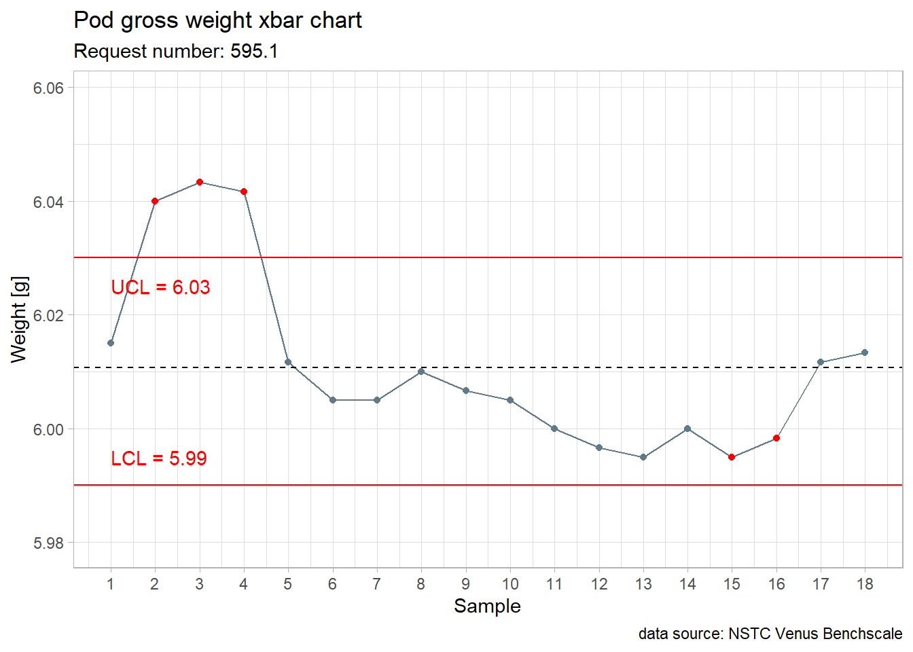
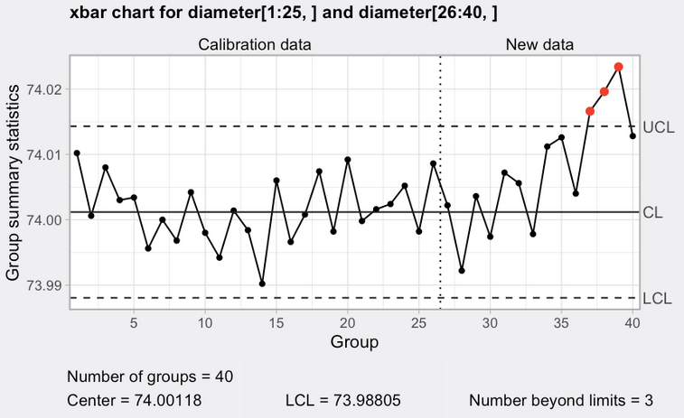

--- 
title: "EPFL Extension School Capstone Proposal"
subtitle: "A book on indust<b style='color:#38598CFF'>R</b>ial data science"
author: "João Ramalho"
date: "`r Sys.Date()`"
output:
  html_document:
    toc: true
    toc_depth: 4
    toc_float: true
bibliography:
- book.bib
biblio-style: apalike
link-citations: yes
nocite: |
  @Broc2016, @Montgomery2012, @Cano2012, @Cano2015, @Munro2015,
  @Bell2001, @Scrucca2004, @Bass2007, @Yakir2011, @Sleeper2005, 
  @Kennet2014, @Lawson2021, @Wilkinson2005
# description: ''
---

```{r setup, echo= FALSE, warning=FALSE, message=FALSE}
knitr::opts_chunk$set(
	echo = TRUE,
	message = FALSE,
	warning = FALSE,
	out.width = "80%",
	comment = NA
)
library(tidyverse)
library(readxl)
library(knitr)
filter <- dplyr::filter
select <- dplyr::select
```

# Project

This document describes my proposal for the Capstone Project of the Applied Data Science Communication and Visualization (ADSCV) program that I'm following at the EPFL Extension School: a book on Industrial Data Science.

I would appreciate any comments and feedback and look forward to discussing any modifications and improvements that would make it fully inline with the School guidelines and a valuable resource for the future.

# 1) The problem

## a) Data Science maturity

<a href="">
  
</a> 

Eight! years have passed since the Harvard Business Review claimed [Data Scientist the sexiests job of the century](https://hbr.org/2012/10/data-scientist-the-sexiest-job-of-the-21st-century) but in my R&D center at Nestlé there is still only 1 person with such title. Gladly there are half a dozen doing R and Python without the title but most Engineers and Scientist only use excel and some Minitab. 

Excel and Minitab are great tools and I also use them myself very often but Data Science with R such as what is put in place at the ADSCV opens a completely new world of possibilities that I wished to see adopted in my professional environment:

* Reproducible research

All source data and calculations can be inspected at all times and all results can be fully reproduced and audited. This is key in my job as often we're dealing with consumers and even with legal aspects when selling products and machines.

* Historical data and Predictive analytics

By promoting the creation of standard and making much easier binding and archiving different data sources it becomes possible to retrieve new findings from previous data sets reducing the cost and time related with experimentation and trials.

Design of experiments and modeling techniques reach a completely new level when powered by R or Python, not to mention opening the door to AI approaches.

* Customization of User interfaces

Rmarkdown, Shiny but also Jupyter notebooks and other tools we already have available in my workplace enable the industrialization of data pipelines. When more Engineers and Product Developers learn to use these there will be a strong acceleration of the process of getting insights from the continuous flow of data from all sorts of devices and databases.

## b) Motivation

The bibliographic search I've done on the domain of Industrial Data Science (see [Bibliography]) shows an important gap: there are many books on R and many books on Industrial Statistics but there are no recent reference books combining manufacturing industry hands-on experience with recent approaches in R, namely with the `{tidyverse}` portfolio of packages and syntax.

Therefore I believe that making good quality training material available will improve reproducible research and communication of laboratory test results by the Project Managers in my R&D center. 

It will also allow me to consolidate my knowledge and have a portfolio of examples on data analysis that can support complex technical problems in my daily work. My work current work as Data Scientist is mostly based on analysis of data coming in excel and csv files from laboratory tests and providing new and deep insights in the form of Rmarkdown reports. 
Ultimately a book will increase interest in the Data Science potential and bring more requests for support and for training.

Another reason for this choice is that at present I consider having mastered Shiny at level corresponding to my needs and at my company (Nestlé) I've already delivered three shiny Apps applying the ADSCV learnings. One of these Apps called *Risk Management platform* has now scaled up to considerable size and it is being used today by more several persons on a regular basis. 

This way focusing on Bookdown for the Capstone will allow me to get a similar level on one of the most important Data Science tools for reproducible research.

I've selected Bookdown among the many different alternatives following a lengthy period of experimentation throughout the ADSCV course. I wanted to have a possibility to combine many individual pages (Rmardown files) all with the same aesthetic attributes. Being a reference "Cookbook" type of materials it was also critical was the possibility to have always visible on the screen the table of contents. I have considered rmarkdown, blogdown and even jupyter notebooks but bookdown has proven to provide the best integrated solution with a simple rendering approach and a unique yaml configuration file. Also it allows for unique css file and furthermore it can be compiled directly as simple hmtl and published on the web (in my case I plan github pages). This allows for a very fast access to readers. I had considered writing everything with {learnr} but the access time is much slower so I ended up choosing to have a part in bookdown and the companion exercises in {learnr} published in shiny.io.

Accompanying the book I propose to prepare several accompanying dynamic exercises. The target is to use {learnr} to generate dynamic web pages based on the integration of Shiny in Rmarkdown. Furthermore these will include boxes for practicing code without having to install RStudio, quizzes and Shiny Apps to showcase the book datasets. 

In the scope of this Capstone project, the objective is to have these dynamic web pages available for the first few chapters to showcase the principle of embedding shiny apps with reactive content in an Rmarkdown document. Furthermore this showcases my ability to develop a complete and coherent data science product from the brief to the implementation phase, including deployment and maintenance on a live server.

Certainly after the course and Capstone, I expect there will be interest at my workplace to adopt this as standard training materials and expect to continue to further develop for all remaining book chapters.

## c) Book

I envisage a solid and comprehensive book covering key aspects of industrial data science in a logic flow. I would also like to make the book an easy reference book extremely easy to navigate where we can come back and look for the desired "recipe". For this I consider adding clear table of contents and functions index. Below the envisaged layout:

* Setup
    + Welcome  
    *Introduction to the book including motivations, scope, how to use the book and acknowledgements.*
* R Toolbox
    + R programming  
    *Comparison of R with other solutions and rationale for using R.*
    + R datasets  
    *General instructions for companion package installation and dataset loading.*
    + R packages  
    *Overview and recommendation of industry specific packages. Additional functional to be implemented to collect automatically at the time of rendering from the R bookdown, the number of the version installed in my session.*
    + R session info  
    *Details to allow reproducibility of the examples.*
* Content
    *Table of contents including datasets list and R functions index with direct links for easy access.*
* Case studies
    + Design for Six Sigma
    *Case studies around tools for Product Development and Engineering such as Pareto Charts, Ishikawa diagrams and Correlation Matrix. Each case study is self contained with its own dataset, description, specific plots and R code for modeling or other statistical analysis.*
        + Case study 1
        + Case study 2
        + ...
    + Gage r&R
    *Case studies around statistical validation of laboratory measurement devices such as the typical gage reproducibility and repeatability, linearity and uncertainty. All examples are accompanied by images of the devices on the side and the narrative describes a typical real life situation in a laboratory of a factory.*
        + Case study n
        + ...
    + Design of Experiments
    *Case studies presented in a progressive manner from the basic 1 factor 2 levels and the corresponding t tests and variance tests up to fractional designs with many factors and outputs presented with response surfaces. Full analysis of linear models including residuals, statistical significance of effects and forecasting methods.*
    + Statistical Process Control
    *Case studies on manufacturing process control including timeseries and related process key performance indicators such as percentage of goods out of specification, process capability index and process statistics. These tools are often available on the shop floor of manufacturing plants but in proprietary software. The book helps readers implement them on their environment and customize them with the power and flexibility of R.*
    + Glossary
    *Non R related glossary for SixSigma, Statistics and Gage r&R.*
    + References
    *Bibliography including web articles.*
    
Each Case Study chapter shall have from 2 to 8 case studies on the different approaches for the topic.

## d) Exercises platform

As mentioned this part of the project is planned to be implemented using the {learnr} package. This packages provides numerous functions to develop dynamic online content and bring a totally new and dynamic interaction with the reader that cannot be obtained with a static document. This combination of static fast access by published Bookdown generated html with dynamic content in shiny apps brings a complete experience to the readers and is not often yet seen.

The Rmd files used for this interactive part of my project are planned to be bundled in the new package. This should provide more advanced readers a way to explore deeper the shiny apps code and potentially adopt it for their own applications.

Below I'm presenting an example on how this is planned to be implemented.

first in the yaml we need to add the following parameters:

`output: learnr::tutorial`  
`runtime: shiny_prerendered`

then code chunks are inserted separately for ui and server parts of the shiny app and each chunk has specific parameters:

`{r echo=FALSE, message=FALSE, warning=FALSE}` for the ui chunk, example below:

```{r eval = FALSE}
library(tidyverse)
library(qicharts2)

fluidPage(
  titlePanel("Dial control pareto charts"),
  sidebarLayout(
    sidebarPanel(
      selectInput(
        inputId = "variable",
        label = "Select variable",
        choices = c("Operator", "Date", "Defect", "Location"),
        selected = "Defect",
        multiple = FALSE
      )
    ),
    mainPanel(
      plotOutput("pareto")
    )
  )
)
```

and `{r context="server"}` for the server chunk, another example below:

```{r context="server", eval = FALSE}
library(tidyverse)
library(qicharts2)
library(industRial)
output$pareto <- renderPlot({
  d_type <-
    dial_control %>% pull(.data[[input$variable]]) %>% as.character()
  paretochart(
    d_type,
    title = "Watch Dial polishing",
    subtitle = "Pareto chart",
    ylab = "Percentage of deffects",
    xlab = "Selected variable",
    caption = "Source: Dial Production Team"
  )
})
```


A prototype for the first chapter showcasing these concepts is available in my shinyapps.io server: [industRialPractice](https://thoth.shinyapps.io/industRialPractice/)

# 2) The data

## a) Overview

I foresee to prepare all data sets specifically for the book, either by full anonymisation of professional data sets I've come across in my work or by anonymisation of data sets found in the literature. By anonymisation I don't mean a simple randomization of data but also by manipulating it to obtain the specific insights I would like to give as example in the book case studies. 

Being a book of case studies I expect that there will many different data sets (around 10). The data sets are expected to be very different and unrelated among them. As their primary objective is to support the case studies they are not necessarily expected to be large in length but the shall have  varied types including numeric, text, factors, dates (types will be mostly implicit on loading and coded in the cases studies for the readers to see).

As an full example I'm detailing here n the typical R documentation format the new pharmaceutical tablet thickness dataset I'm planning to prepare:

```
tablet_thickness {industRial}

**Pharmaceutical Tablet Thickness*

**Description**

This dataset contains physical measurements of pharmaceutical tablets (pills) including measurement room conditions. The data and the insights it provides are typical of an industrial context with high production throughput and stringent dimensional requirements.

**Usage**

tablet_thickness

**Format**

A tibble with 675 observations of 11 variables (varied types). 

 [, 1] Position     Position of the part on the device  
 [, 2] Size         Part measured size (mm)  
 [, 3] Tablet       Part number  
 [, 4] Replicate    Measurement replicate  
 [, 5] Day          Measurement day (1,2,3,...)  
 [, 6] Date         Measurement date (POSIXct)  
 [, 7] Operator     Operator name (ficticious)  
 [, 8] Thickness    Tablet thickness (um)  
 [, 9] Temperature  Room temperature (°C)  
[, 10] RH           Room Relative Humidity (%)  
[, 11] Luminescence Room brightness (lux)

**Note**
Variable names are long and not clean and Categorical variables are not coded as factors because name cleansing and type conversions are expected to be part of the industRial DS book readers examples and exercises.

**Source**
Based on a real although anomyized **gage r&R** (gage reproducibility and repeatability) study performed in 2020 on a physical measurement of parts coming out of a high throughput industrial equipment.

**Examples**
industRial::tablet_thickness %>% 
  janitor::clean_names() %>%
  filter(size == "L") %>%
  ggplot2::ggplot(aes(x = tablet, y = thickness_micron)) +
  ggplot2::geom_point()
```


## b) Data handling

The proposed approach for the data handling is to include it in a dedicated companion R package that will be made available with the book. This should make it easier for book readers to get the data by simply downloading the R package from my github and access the data by calling the data sets. This is the standard R approach with most R packages and users should be fully at ease with it. Detailed instructions should in any case be provided.

While doing the program chapters C04S03U01 Packages and C04S08 Golem I have already prototyped this approach and made a prototype with two test data sets, which can be downloaded with:

```
devtools::install_github("J-Ramalho/industRial")
```

The book data will then be obtained with an approach like:

```{r}
library(industRial)
head(dial_control) %>% 
  kable(align = "c", 
        caption = "Dial control data", 
        booktabs = T)
```

# 3) Exploratory data analysis

## a) Preliminary EDA

The Extension School ADSCV has been a very comprehensive program taking approximately one year and has allowed me to successfully transition in a full time data scientist. It has given me the tools handle complex data cases and express insights, recommendations and solutions in an extremely powerful and varied way.

I intend to make extensive use of the techniques learned in Courses 1 and 2: tidying, wrangling, factors, importing, time formats and time series, networks and others.

A specific part on object oriented programming is also foreseen to deal with the qcc package data (class, typeof) and the method dispatching obtained then with plot and similar functions on such objects.

Although the book does not intend to be a showcase of tidyverse I construct the examples in a way that the data comes raw and there will be the typical cleansing, reshaping and type conversion required for proper visualization.

```{r}
library(qicharts2)
d_type <- dial_control %>% pull(Defect) %>% as.character()
d_type_p <- paretochart(d_type, 
                           title = "Watch Dial polishing",
                           subtitle = "Pareto chart", 
                           ylab = "Percentage of deffects",
                           xlab = "Deffect type",
                           caption = "Source: Dial Production Team")
d_type_p +
  theme_industRial()
```

```{r}
library(tidyverse)
perfume_experiment %>%
  pivot_longer(
    cols = -yy,
    values_to = "correlation",
    names_to = "xx"
  ) %>%
  filter(correlation >= 7) %>%
  mutate(correlation = as_factor(correlation)) %>%
  ggplot(aes(x = xx, y = yy, fill = correlation)) +
  scale_fill_viridis_d(direction = -1, name = "Correlation\nStrength") +
  geom_tile() + 
  labs(
    title = "The Perfume destilation experiment",
    subtitle = "Input variables correlation plot ",
    x = "",
    y = "",
    caption = "Data variables anonymized"
  ) +
  theme_industRial()
```

## b) How does the EDA inform your project plan?

The examples will demonstrate R data summary capabilities with summary() and skimr() with outputs in varied formats with and without kable, gt and DT, as suited to each step of the case studies. The data will have sense in itself too and show realistic (even if anonymized) situations, from which we can draw insights and conclusions.

## c) What further EDA do you plan for project?

Industrial statistics is a field where data analysis goes beyond grouping and summarizing. 
Besides the communication characteristics of the book it is important that its content is rigorous, useful and powerful for the readers. I plan to make use of R statistical analysis capabilities exploring and showcasing descriptive statistics and statistical inference functions such as t.test, lm, anova, predict and others both from the {stats} package and from other packages like {car}.

```{r}
data <- tibble(
  A = c("-", "+", "-", "+"),
  B = c("-", "-", "+", "+"),
  I = c(28, 36, 18, 31),
  II = c(25, 32, 19, 30),
  III = c(27, 32, 23, 29)
) %>%   gather(replicate, yield, I, II, III)
coded <- function(x) { ifelse(x == x[1], -1, 1) }
data <- data %>%
  mutate(nA = coded(A), nB = coded(B))
lm_num <- lm(yield ~ nA + nB, data = data)
```

Typical explanations in the book will be like: *The plot below gives a visual representation of the model we can obtain by establishing a regression on this data:*

```{r}
data %>%
  pivot_longer(
    cols = c("nA", "nB"),
    names_to = "variable",
    values_to = "level") %>%
ggplot() +
  geom_point(aes(x = level, y = yield)) +
  geom_smooth(aes(x = level, y = yield), 
              method = "lm", se = FALSE, fullrange = TRUE) +
  coord_cartesian(xlim = c(-5, 5)) +
  facet_wrap(vars(variable)) +
  labs(
    title = "Chemical process full factorial design",
    subtitle = "Linear regression for process parameters A and B"
  ) +
  theme_industRial()
```

*But we can go further by defining a linear model with the R function lm():*

```{r}
summary(lm_num)
```

*and now that the coefficients of the model are established we can use it to predict new values with:*

```{r}
predict(lm_num, newdata = list(nA = -1, nB = 0), interval = "confidence")
```

 


# 4) Data Visualisation

## a) What is the format of the product that you are going to develop

The key proposed project outputs are the following:

* A new online book 
    + accessible with a dedicated web adress from my github pages
    + richly referenced including R functions index, toc and bibliography
* A new R package 
    + downloadable by readers from github as book companion package
    + comprising data and key functions from the book examples
* A companion website developed with learn r and published in shiny.io
    + embedded shiny apps to further exemplify interactively the book content
    + coding exercises and quizzes to encourage practicing and knowledge testing 

## b) What data visualisations and tables do you plan to use?

The ADSCV course has a balance of programming, data wrangling, human visual perception, reporting and creation of dynamic dashboards and throughout the course I have managed to apply many of these learnings directly in my work.

Being a case study book there is opportunity to apply many different visualizations but instead of just making a repertoire of plots I'm looking more into exploring the *grammar of graphics* approach. This approach based on the book with the same name from @Wilkinson2005 contains the principles for the {ggplot2} package. I therefore intend to add specific layers on the plots on a case by case to make the Industrial Case Studies clear (e.g. a specific text or a dot shape or other). As I have listed close to 20 case studies I could provide in the book I imagine it may go up to 40 plots.

Besides these generic tools and approaches I also intend to specifically reuse more niche tools such as tile plotting, networks and time series as they also suit well case studies related with my daily work of which I'm giving below two examples:

**Networks**

Re-utilization of networks code from the Harry Potter and Karate cases in the selection of the important coffee recipe parameters in a Design of Experiments

```{r echo=FALSE, fig.align='center', fig.cap="Example of networks application", out.width="60%"}
knitr::include_graphics("img/coffee_networks.png")
```

**Time series**

I would like to dig deeper in the topic of time series of the ADSCV Course 2, Project 2 "Gruyère Cheese factory": 

```{r echo=FALSE, fig.align='center', fig.cap="Example of timeseries application", out.width="60%"}

```

and further develop the plots using the qcc package which is fully tested and provides extensive functionality on industrial time series. An example below from the package vignette:

```{r echo=FALSE, fig.align='center', fig.cap="Example of qcc application", out.width="60%"}

```


## c) Look and feel

The book shall have a coherent look and feel from beginning to end. A combination of several unique visual codes are to be adopted:

* page organisation in the style of [Edward Tufte](https://www.edwardtufte.com/), with images and comments put as side notes
* a tailor made specific theme for ggplots
* a fixed choice of colors with a unique set of color blind friendly palette: all colors in the book will come from viridis::viridis(12) besides the basic black, grey and white^.

I expect with this to provide a finished, polished and coherent look and feel to the reader. The aspect of a unique, new and cared layout that will be easily recognized only reopening the site and distinct from the many low quality textbooks we see on the web.

On the Project 4 on Volcanoes of the ADSCV Course 2 I've started developing my own themes and I've prepared now a theme for the book building on the [{cowplot}](https://wilkelab.org/cowplot/articles/introduction.html) package from Claus o'Wilke.

## d) Rmarkdown configuration

To achieve the desired look and feel and control all the finer details of the book layout, text and plot aesthetics, I intend to make extensive usage of the Rmarkdown, YAML, r setup and knitr features learned throughout the ADSCV program, namely:

* rendering in html
* utilization of R code in the YAML header (notably the Sys.Date function)
* dynamic table of contents, unfolding deeper levels on click
* using an external css files for fine tuning page aesthetics, including headers, toc and links
* references to publications, books and packages, that send to the bibliography session at the end of the report
* message and warning false as knitr function arguments to avoid undesired outputs
* figure size and centering as defaults
* use as appropriate the different ways of adding images: ``; ``; `knitr::include_graphics()`; `htmltools::img()`; `magick::image_read()`
* adding floating code with calculations and variables with floating code
* beautifying tables with kable, kable extra, DT and gt packages
* Mathematical and statistical formulas in LaTeX format
* focusing on the output and on the story telling by showing for example the table heads with head() to make readers aware of the data structure


In this brief I'm already applying some of the approaches described above.

## d) Packages

Being a Capstone project the book shall showcases learnings from the entire the course and additional learnings from my explorations in the Industrial Data Science field. Below a list of the packages that are expected to be most used:

```{r}
rpackages <- read_excel("data/rpackages.xlsx") %>%
  filter(Used == "y") %>%
  select(Package, Area) %>%
  arrange(Area)
rpackages %>%
  kable()
```

To be noted that the examples in the book will not be prepared to showcase my own knowledge but rather to help the readers to understand and adopt these techniques in their daily work.

As I expect the book to further evolve after the closing of the ADSCV I'm planning to include in the book a clear list of all packages and package versions used at the time of building the book plus the R configuration environment. This should help readers debugging their machines in case they're facing difficulties in reproducing some specific example. And as often recommended in other books it also helps my future me.

# Features summary

The list below summarizes of all features described in detail in this brief:

* advanced Rmarkdown functionality including bookdown
* highly customized look and feel with dedicated ggplot themes and custom css files
* creation of a new dedicated R package including data sets
* exploration of R techniques outside the ADSCV course scope (mostly in statistics, functional programming and object oriented programming)

> final expected size of the project: >10 datasets, >20 plots, >30 packages used

# Non original content

I expect to be able to create most cases from my own (rather long) experience in the industry. Nevertheless I am in possession of a long bibliography on industrial applications of statistics and intend build also on these examples. In any case I plan at all times to provide clear references and clearly highlight when content is transcript or adapted from somewhere else and this both for text and code.

# Out of scope

### Specific Rmarkdown features:

the following Rmarkdown features that are less suited to the book objectives and have in any case been already explored in other course projects:
    + toggling show and hiding code (the book is on code so no point in hiding)
    + applying a pre-packaged bootstrap theme and a highlight theme available from Rmarkdown (not specific enough)
* naming the chunks for easier and quicker debugging (extra care is needed in order not to reuse names)
* introduction of a new taylor made theme as a externally sourced function with specific attributes for this report (I'd rather keep the book white so no backgrounds and the rest to be handled with css)

### Golem

In my project 4 App I've used golem to develop a production grade shiny app that brings the ideas initiated in the time series project to an industrial level with the app gathering data an R Azure server linked to a coffee capsule industrial manufacturing equipment producing thousands of csv files.

### Cartography

As with Shiny I consider having sufficiently explored the Cartography topic. I've made a full assessment of the vast cartography package landscape which helped me electing the tidyverse as my preferred choice to print maps in my Azores Islands Volcanoes project: 

```{r echo=FALSE, fig.align='center', fig.cap="Example of cartography application", out.width="60%"}
knitr::include_graphics("img/azores_cartography.png")
```

Therefore in the book I don't foresee reusing maps.

### Natural Language Processing

In my Risk Management App mentioned before, I have applied some simple NLP concepts from the ADSCV Courses 1 and 2. Separately I'm  working on NLP with the UNIL and with a Nestlé Task Force which allows me to continue to explore this area. I consider this side explorations on NLP and I prefer to also leave this topic out of the Industrial Data Science book that shall have a sharp focus on industrial statistics.

# Bibliography {#Bib}