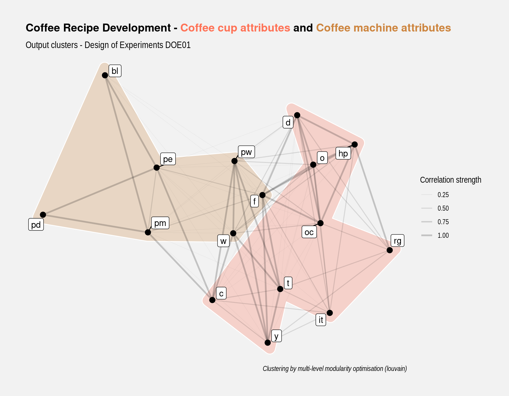

--- 
title: "EPFL Extension School Capstone Project Brief"
subtitle: "A book on indust<b style='color:#4775d1'>R</b>ial data science"
author: "João Ramalho"
date: "`r Sys.Date()`"
output:
  html_document:
    toc: true
    toc_depth: 2
    toc_float: true
# description: ''
---

```{r setup, echo= FALSE, warning=FALSE, message=FALSE}
knitr::opts_chunk$set(
	echo = TRUE,
	message = FALSE,
	warning = FALSE,
	out.width = "80%"
)
library(tidyverse)
library(readxl)
library(knitr)
```


# Document objective

This document describes the Capstone Project brief of Applied Data Science Communication and Visualisation (ADSCV) program followed at the EPFL Extension School.

# Learnings so far

The Extension School ADSCV is a very comprehensive program that will take approximately one year and has allowed me to successfully transition in a full time data scientist. It has given me the tools handle complex data cases and express insights, recommendations and solutions in an extremely powerfull and varied way.

The course balances programming, data wrangling, human visual perception, reporting and creation of dynamic dashboards. Throughtout the cours I have succeeded to continuously apply these different learnings directly in my current work and also with fun to my personal life. Below a recap of key cases:

**Networks**

Re-utilisation of networks code from the Harry Potter and Karate cases in the selection of the important coffee recipe parameters in a Design of Experiments

```{r echo=FALSE, fig.align='center', fig.cap="Example of networks application", out.width="60%"}

```

**Timeseries**

Re-utilisation of the timeseries code from the Gruyère Cheese factory in the implementation of a small non modular shiny app to follow-up the coffee capsule weight in a laboratory test

```{r echo=FALSE, fig.align='center', fig.cap="Example of timeseries application", out.width="60%"}
knitr::include_graphics("img/coffee_timeseries.png")
```

**Cartography**

I've made a full assessment of the vast cartography package landscape and ended selecting the tidyverse landscape to print maps in my Azores Islands Volcanoes project: 

```{r echo=FALSE, fig.align='center', fig.cap="Example of cartography application", out.width="60%"}
knitr::include_graphics("img/azores_cartography.png")
```

**Natural Language Processing**

In my Risk Management App that has currently about 5 recurring users, besides applying many varied concepts from Courses 1 and 2 I have introduced of some of the NLP techniques from the Alice in Wonderland example, bringing new ways to think of risk management.

**Golem**

In my project 4 App I've used golem to develop a production grade shiny app that brings the ideas initiated in the timeseries project to an industrial level with the app gathering data an R Azure server linked to a coffee capsule industrial manufacturing equipment producing thousands of csv files.

# Proposed Scope

Taking into account that I've delivered at my company three shiny Apps, two of them now used daily, the proposed focus for this final work would be the preparation of training materials in Data Science for my Nestlé colleagues.

Making a training material available would help the communication with Engineers and other professionals in R&D. It would also allow me to communicate and explain my daily work as Data Scientist which is mostly made out of collecting data that comes in excel and csv files from laboratory tests and return insights in the form of Rmarkdown reports. Ultimately it would generate interest in Data Science and bring more adepts to the field.

This book that I would like to call <i>Indust<b style='color:#4775d1'>R</b>ial Data Science</i> has the ambition to be a reference book in the field. My extensive bibliography research on this domain shows that there are many R books and many books on industrial statistics but there is no recent reference book combining field experience with recent R approaches namely with tidyverse.

# Project deliverables

The key proposed project outputs are the following:

* A new online book 
    + accessible with a dedicated web adress from github pages
    + strongly referenced including R functions index, toc and bibliography
    + capitalising on the ADSCV techniques described in the learnings section
* A new R package 
    + downloadable by readers from github as book companion package
    + comprising data and key functions from the book examples
    + capitalising on the learnings from package development and golem chapters

# Book Table of Contents

* Setup
    + Welcome
    + Foundations
* Case studies
    + 6S - Six Sigma
    + DOE - Design of Experiments
    + MSA - Measurement System Analysis
    + SPC - Statistical Process Control
* Toolbox
    + R functions index
    + R packages
    + R datasets
    + References
    
Each Case Study chapter shall have from 2 to 8 case studies on the different approaches for the topic. Example for Measurement System Analysis we can have cases on Robustness, Linearity and so on.

# Packages in the book

Being a Capstone project the book shall showcases learnings from the entire the course and additional learnings from my explorations in the Industrial Data Science field. Below a list of the packages expected to be most used:

```{r echo=FALSE}
rpackages <- read_excel("../data-raw/rpackages.xlsx") %>%
  filter(Used == "y") %>%
  select(Package, Area) %>%
  arrange(Area)
rpackages %>%
  kable()
```

To be noted that the examples in the book are not prepared to showcase my own knowledge but rather to help the readers to understand and adopt the techniques in their daily work.

# Bookdown features

**YAML configuration:**

* rendering in html, my favorite format
* using code in the YAML header (notably the Sys.Date function)
* dynamic table of contents, unfolding deeper levels on click

* using an external css file for fine tuning page aesthetics, including headers, toc and links
* enabling referencing in the YAML in order to insert in the text appropriate references to publications, books and packages, that send to the bibliography session at the end of the report 

**r setup and knitr options:**

* message and warning false as knitr function arguments to avoid undesired outputs
* figure size and centering as defaults

**Rmarkdown features:**

* exploring some of the different ways of adding images: ; knitr::include_graphics(); htmltools::img(); magick::image_read()
* adding floating code with calculations and variables with \`r `<code>`\`
* beautifying tables with kable, kable extra, DT and gt packages
* focusing on the output and on the story telling by showing for example the table heads with head() to make readers aware of the data structure


# Out of scope

* shiny apps

* Rmarkdown features that are not appreciated and have been demonstrated in other course projects:
    + toggling show and hiding code
    + applying a pre-packaged bootstrap theme and a highlight theme available from Rmarkdown
* naming the chunks for easier and quicker debugging
* introduction of a new taylor made theme as a externally sourced function with specific attributes for this report
